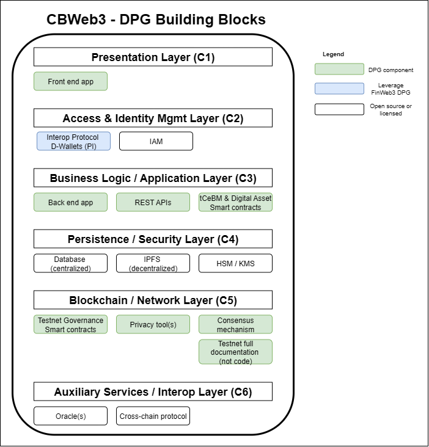

# Introduction

CBWeb3 is an IDB Lab project that seeks to enable a regional test-network (**Test Net**) for Latin America and the Caribbean that will allow for the issuance of **tCeBM (tokenized Central Bank Money)** and the tokenization of financial assets, with a focus on cross-regional interoperability between central banks and financial institutions. 

The **Test Net** will build upon the technological capabilities and infrastructure of **IDB Lab’s initiative [LACChain](https://lacchain.net)** and **[LACNet](https://lacnet.net)** — the Alliance for the Development of the Blockchain Ecosystem in Latin America and the Caribbean.

## CBWeb3 as a DPG

As CBWeb3’s architecture office, we are explicitly committing the project to become a **Digital Public Good (DPG)**. 

Our roadmap aligns with the **DPGA criteria**:  
- **Open-source** (Apache-2.0) by default  
- **Transparent governance**  
- **Privacy-by-design**  
- **Vendor neutrality** (no mandatory proprietary dependencies)  
- **Comprehensive documentation**  
- Use of **open standards** to enable interoperability across the region  

We are building an **open DPG Working Group (DPG WG)** to:  
- Steward design decisions  
- Accept community RFCs/PRs  
- Publish materials so any competent team can deploy, operate, and extend the system.  

CBWeb3 targets measurable contributions to the **SDGs** (notably **8, 9, 10, and 17**) through inclusive, cross-border financial experimentation.

Once the defined milestones are met, we will:  
1. Complete the **DPGA self-assessment**  
2. Apply for official **DPG registration**  
3. Keep all artifacts **public and reusable** so the ecosystem can benefit beyond this project

Our vision of the blocks that should constitute the DPG is the following:

*The diagram illustrates the CBWeb3 Digital Public Good (DPG) architecture, organized into six conceptual layers:*

1. **Presentation Layer (C1):** Front-end application for user interaction.  
2. **Access & Identity Management Layer (C2):** Interoperability protocol for digital wallets (PI) and identity management (IAM).  
3. **Business Logic / Application Layer (C3):** Back-end application, REST APIs, and smart contracts for tCeBM and digital assets.  
4. **Persistence / Security Layer (C4):** Centralized databases, decentralized storage via IPFS, and cryptographic key management (HSM/KMS).  
5. **Blockchain / Network Layer (C5):** Governance smart contracts, privacy tools, consensus mechanism, and full Testnet documentation.  
6. **Auxiliary Services / Interop Layer (C6):** Oracles and cross-chain protocols for interoperability.  

*Legend:* Green elements represent DPG components, blue elements leverage FinWeb3 DPG, and white elements are open-source or licensed.

## Open Governance

CBWeb3 follows an **open governance** model to ensure transparency, inclusiveness, and accountability in all decision-making processes. Strategic and technical decisions are discussed openly within the **DPG Working Group (DPG WG)**, where stakeholders, contributors, and community members can submit proposals, review Requests for Comments (RFCs), and participate in consensus-based resolutions. Meeting minutes, governance policies, and roadmaps are published publicly to ensure traceability and community trust. The governance approach is aligned with open best practices and benefits from the expertise and regional coordination of institutions such as **[CEMLA](https://www.cemla.org)** and **[FLAR](https://www.flar.net)**, fostering collaboration across Latin America and the Caribbean.
