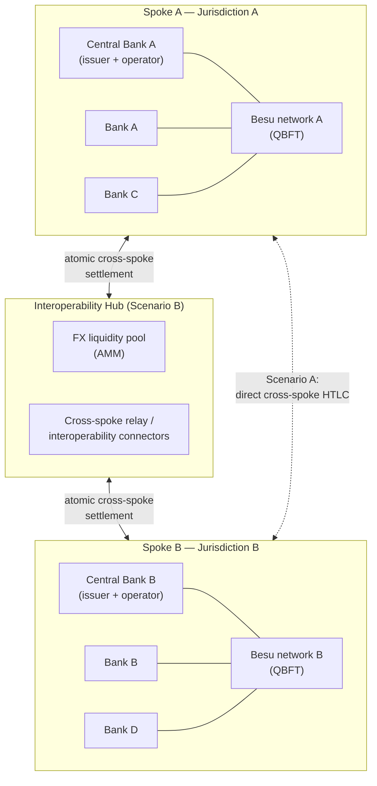
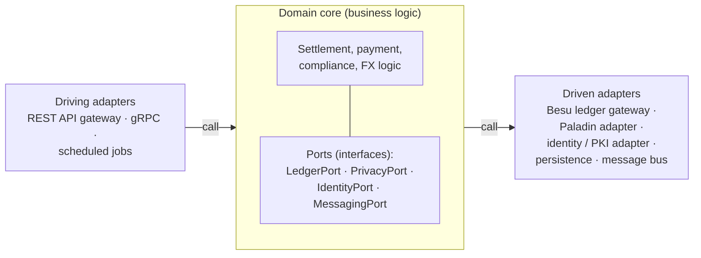
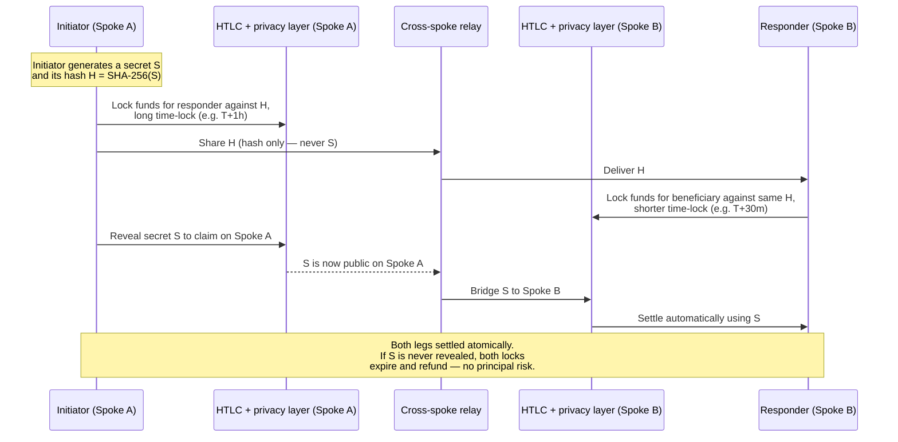
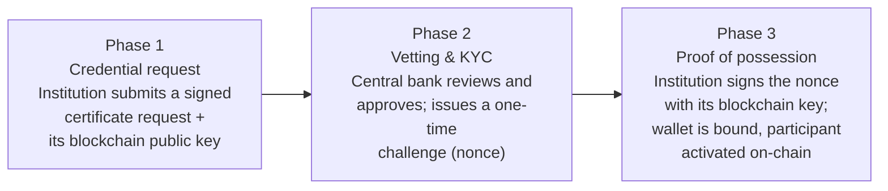
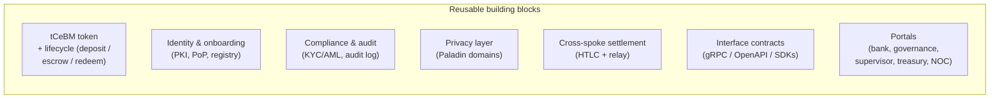

# CBWeb3 Technical Blueprint

## A Digital Public Good Reference Architecture for Interoperable Wholesale tCeBM and Tokenized-Asset Networks in Latin America and the Caribbean

*How we designed the foundation, what we solved, and how participating institutions can build on it without starting from zero.*

---

| | |
|---|---|
| **Document** | CBWeb3 Technical Blueprint |
| **Status** | Draft v0.1 — for review |
| **Date** | 2026-05-24 |
| **Maintained by** | CBWeb3 Working Group, under LF Decentralized Trust (LFDT) |
| **License** | Apache-2.0 (code) / CC BY 4.0 (documentation) — **[TO CONFIRM: documentation license]** |
| **Repository** | `github.com/LF-Decentralized-Trust-labs/cbweb3` |
| **Promoted by** | IDB Lab, LACChain / LACNet, in collaboration with CEMLA, FLAR and participating central banks |
| **Primary audience** | Architects and engineering teams of the participating institutions; central bank decision-makers; the LFDT and Digital Public Goods community |

> **About this draft.** This is a working draft generated from the project's technical blueprint outline and the current state of the `cbweb3` and `cbweb3-platform` repositories. Where a fact depends on documents that were not available when this draft was assembled — notably the *Governance*, *Privacy* and *Interoperability* research papers and the project Terms of Reference — the text carries a visible **[TO CONFIRM: …]** marker. Every such marker is also collected in **Annex K** so they can be resolved in one pass.

---

## How to Read This Blueprint

This document is a **decision-oriented technical blueprint**, not a chronological project report. It is organized so that different readers can enter at the level they need:

- **Decision-makers** should read Part I (Sections 1–6) and the Conclusions (Section 18). These explain why interoperable wholesale tokenized central bank money (tCeBM) matters for the region, what CBWeb3 set out to solve, and why the main deliverable is a blueprint.
- **Architects** should focus on Part II (Sections 7–12), which presents the reference architecture, the rationale for a hexagonal design, the interoperability and privacy models, and the identity and governance models.
- **Implementation teams** at the participating institutions should focus on Part III (Sections 13–17), especially Section 13 (*Blueprint for the 12 Participating Banks*) and Section 14 (*Toolbox*), which translate the architecture into concrete adoption paths.
- **Reviewers, contributors and auditors** should use the Annexes (Section 19), which collect the glossary, decision records, matrices and conformance assets.

Throughout the document we write in the first person plural — *we designed*, *we decided*, *we recommend* — because this blueprint records the collective decisions of the working group and is meant to be continued by the institutions that adopt it.

---

## Table of Contents

**Part I — Strategic Framing**

1. [Executive Summary](#1-executive-summary)
2. [Regional Context and Problem Statement](#2-regional-context-and-problem-statement)
3. [What We Set Out to Solve](#3-what-we-set-out-to-solve)
4. [Design Principles](#4-design-principles)
5. [Lessons from Existing Knowledge Products and Global tCeBM Initiatives](#5-lessons-from-existing-knowledge-products-and-global-tcebm-initiatives)
6. [Why We Framed the Main Deliverable as a Blueprint](#6-why-we-framed-the-main-deliverable-as-a-blueprint)

**Part II — Reference Architecture**

7. [Reference Architecture Overview](#7-reference-architecture-overview)
8. [Why We Chose a Hexagonal Architecture](#8-why-we-chose-a-hexagonal-architecture)
9. [Interoperability Model and Settlement Architecture](#9-interoperability-model-and-settlement-architecture)
10. [Privacy Architecture and Why Paladin Matters](#10-privacy-architecture-and-why-paladin-matters)
11. [Identity, Trust, and Compliance Model](#11-identity-trust-and-compliance-model)
12. [Governance Model](#12-governance-model)

**Part III — Adoption, Ecosystem and Roadmap**

13. [Blueprint for the 12 Participating Banks](#13-blueprint-for-the-12-participating-banks)
14. [Toolbox and Community Extension Model](#14-toolbox-and-community-extension-model)
15. [Alignment with the DPG Model and LFDT](#15-alignment-with-the-dpg-model-and-lfdt)
16. [Security, Resilience, and Production Readiness](#16-security-resilience-and-production-readiness)
17. [Roadmap from Current Phase to Future Implementation](#17-roadmap-from-current-phase-to-future-implementation)
18. [Conclusions](#18-conclusions)
19. [Annexes](#19-annexes)

---

# Part I — Strategic Framing

## 1. Executive Summary

Latin America and the Caribbean operate some of the most fragmented financial infrastructure in the world. Domestic real-time payment systems have advanced rapidly, but cross-border settlement between the region's central banks and financial institutions still depends on correspondent banking chains that are slow, expensive, opaque in their pricing, and increasingly thinned out by de-risking. CBWeb3 was created to address the layer underneath that problem: the settlement and interoperability infrastructure itself.

CBWeb3 is an IDB Lab initiative, built on the technological capabilities of LACChain and operated through LACNet, that enables a regional test network for the issuance of **tokenized central bank money (tCeBM)** and the tokenization of financial assets, with cross-regional interoperability between central banks and financial institutions as a first-class design goal rather than an afterthought. It capitalizes on Korean public, private and academic experience — including the Bank of Korea, the Korea Exchange, the KAIST Network Security and Privacy Lab, and Sungkyunkwan University — and is developed in collaboration with the Center for Latin American Monetary Studies (CEMLA), the Latin American Reserve Fund (FLAR) and participating central banks.

We set out to answer a specific question: **how can institutions with different mandates, different legal regimes and very different levels of digital readiness settle wholesale transactions with one another — atomically, privately and under their own supervision — without surrendering sovereignty over their domestic infrastructure?** Our answer is a modular hub-and-spoke architecture in which each jurisdiction runs its own ledger, privacy is treated as an architectural layer rather than a feature, and interoperability is achieved through replaceable components instead of a single mandatory platform.

What CBWeb3 delivers is **more than a pilot or a prototype**. The project produced a working reference implementation — two independent permissioned blockchain networks ("spokes"), privacy-preserving token transfers, cross-network atomic settlement, an identity and compliance stack, and a roadmap toward a foreign-exchange liquidity hub. But the working code is not, by itself, the contribution we want to leave behind. The contribution is a **reusable technical and governance foundation**: a structured, documented and conformance-tested basis that institutions can adopt, adapt, validate and extend.

That is why the primary knowledge product is a **blueprint and not only a technical report**. A report mainly documents what happened. A blueprint enables what happens next. We have written this document so that the engineering team of a participating institution can read it, understand the decisions and their rationale, identify what they can reuse directly, and begin building — without re-deriving the architecture, re-litigating the trade-offs, or starting from zero.

This framing matters for the **twelve participating banks** and for the broader regional ecosystem in three concrete ways. First, the blueprint lowers the cost of entry: an institution adopts a baseline, not a research problem. Second, it preserves optionality: because the architecture is modular and vendor-neutral, an institution can replace components — a ledger, a privacy mechanism, an interoperability connector — as its needs evolve. Third, it makes the work durable: by being developed as a **Digital Public Good** aligned with **LF Decentralized Trust (LFDT)**, the project is openly licensed, transparently governed and co-owned by the community, which is what allows it to outlive any single implementation phase or vendor relationship.

In short: we set out to make regional wholesale settlement interoperable, private and sovereign-respecting; we built a working reference implementation to prove the approach; and we are leaving behind a blueprint — and a supporting Toolbox — so that the institutions of Latin America and the Caribbean can continue this work together, on open and shared foundations.

---

## 2. Regional Context and Problem Statement

### 2.1 The structural problem

The financial infrastructure of Latin America and the Caribbean is, in structural terms, a collection of well-built islands. Within most jurisdictions, domestic payment systems — including a new generation of instant payment platforms — work well. Between jurisdictions, the picture is different. Cross-border wholesale settlement still flows through correspondent banking arrangements that were not designed for speed, transparency or programmability. The consequences are familiar to every institution in the region: settlement that takes days rather than seconds, costs that are high and difficult to predict, limited visibility into where a payment is in its lifecycle, trapped liquidity in nostro and vostro accounts, and a steady contraction of correspondent relationships as global banks withdraw from markets they consider too small or too costly to serve.

These are not primarily technology problems at the level of any single institution. They are **coordination problems at the level of the region**. No central bank can solve cross-border settlement on its own, because the value of an interoperable network is created precisely at the points where two jurisdictions meet. This is the structural problem CBWeb3 addresses: the absence of a shared, neutral, interoperable settlement layer that the region's institutions can build on together.

### 2.2 Why cross-border interoperability is a priority from the beginning

Many digital currency initiatives begin domestically and treat cross-border interoperability as a later phase. We deliberately took the opposite stance. Interoperability is the source of the value, so it must be a design constraint from the first decision, not a feature retrofitted after a domestic platform has already hardened its assumptions.

Retrofitting interoperability is expensive and often impossible. A ledger, a privacy model or an identity scheme chosen purely for domestic convenience tends to encode assumptions — about message formats, about who can see what, about how trust is established — that become obstacles the moment a second jurisdiction is involved. By designing for interoperability from the start, we keep those assumptions explicit and negotiable, and we ensure that every component is evaluated against the question that actually matters: *will this still work when a counterparty in another jurisdiction, running different software under a different regulator, needs to settle against it?*

### 2.3 Why we focused on wholesale use cases first

We scoped the first phase around **wholesale** tCeBM — settlement between central banks and financial institutions — rather than retail use cases. This was a considered decision, not a limitation.

Wholesale activity involves a bounded set of known, regulated, identifiable institutions. That makes the trust model tractable: participants can be vetted, credentialed and held accountable in ways that are far harder in an open retail setting. Wholesale also concentrates the clearest near-term value — cross-border settlement, payment-versus-payment and delivery-versus-payment — where atomic settlement removes principal risk that today is managed through time, collateral and intermediaries. And wholesale carries a smaller consumer-protection and financial-inclusion surface in the first phase, which lets the project resolve the hard infrastructure questions — interoperability, privacy, atomicity, governance — before layering on the additional obligations that retail use would introduce. The architecture does not foreclose retail or broader tokenized-asset use; it sequences the work so that the foundation is sound first.

### 2.4 Why a purely domestic design is insufficient

A design optimized for a single jurisdiction can look complete and still be a dead end for the region. If each central bank builds an excellent domestic tokenized-money platform on its own technology choices, the region ends up with twelve more islands — more modern than before, but no more connected. The long-term goal is not a platform deployed identically everywhere; it is a set of institutions that can **interoperate** while each retains control of its own infrastructure.

That distinction shapes everything in this blueprint. We are not asking institutions to converge on one system. We are defining the interfaces, the settlement semantics, the privacy guarantees and the governance rules that let *different* systems settle with one another safely.

### 2.5 An approach that coexists with different realities

Finally, the region's institutions differ enormously in digital readiness, regulatory posture, internal capacity and risk appetite. An approach that demanded uniformity would exclude exactly the institutions that most need shared infrastructure. The blueprint is therefore built to **coexist with heterogeneity**: it defines a minimum adoption baseline that a less mature institution can meet, and a set of optional, incremental capabilities that a more mature institution can take on at its own pace. Sovereignty and flexibility are not concessions in this design; they are requirements.

> **The problem in one sentence.** The region needs a way for sovereign, heterogeneous institutions to settle wholesale tokenized money and assets across borders — atomically, privately, and under their own supervision — and no such interoperable, openly governed foundation exists today. CBWeb3 was created to build it.

---

## 3. What We Set Out to Solve

This section defines the concrete solution space of the project. CBWeb3 is not an open-ended experiment with blockchain technology. It targets a specific, bounded set of technical and operational challenges that must be solved for interoperable wholesale tCeBM and tokenized assets to be viable. We describe each below, then state explicitly what was in scope for this phase and what we intentionally deferred.

### 3.1 Capabilities we prioritized

**Cross-border settlement for wholesale tCeBM.** The core capability is the ability for an institution holding tokenized central bank money in one jurisdiction to settle a wholesale obligation with an institution in another jurisdiction, with finality, without routing the value through a chain of correspondent intermediaries. This is the capability from which the rest of the project's value derives.

**Atomic PvP and DvP settlement.** Cross-border settlement creates principal risk: the risk that one party delivers and the other does not. We prioritized **payment-versus-payment (PvP)** for currency exchange and **delivery-versus-payment (DvP)** for tokenized assets, so that the two legs of a transaction either both complete or both fail. In the reference implementation this is realized through a dual-layer Hash Time-Locked Contract (HTLC) mechanism that achieves atomic settlement across two independent ledgers without requiring a shared one.

**Privacy-preserving compliance.** Wholesale transactions are commercially sensitive. Counterparties, amounts and positions cannot be exposed to unrelated participants simply because they share infrastructure. At the same time, supervisors must retain the visibility their mandates require. We treated the reconciliation of these two requirements — confidentiality toward peers, transparency toward regulators — as a primary problem to solve, not a setting to configure later.

**Multi-participant governance.** A network shared by sovereign institutions cannot be governed like a single firm's system. We treated governance — who may join, who may issue, how rules and software change, how incidents and disputes are handled — as part of the architecture itself, with on-chain enforcement where appropriate and clear institutional process where not.

**Integration with existing systems.** The blueprint must connect to the world as it is. Institutions run real-time gross settlement systems, core banking systems and messaging infrastructure that will not be replaced. We prioritized an architecture that can integrate with these systems through well-defined adapters and standard message formats, rather than assuming a greenfield.

**Open and reusable implementation assets.** Finally, we treated the *reusability* of what we built as a capability in its own right. Interface contracts, reference mocks, test vectors, conformance assets and deployment tooling were scoped as deliverables — collected in the Toolbox (Section 14) — because a blueprint that cannot be acted on is not a blueprint.

### 3.2 Use cases that shaped the architecture

Two interoperability scenarios drove the design and keep it concrete:

- **Scenario A — Enhanced Correspondent Banking.** Two institutions in different jurisdictions settle a cross-border obligation through cross-spoke atomic swaps. An initiator bank locks funds on its own spoke; a responder bank locks corresponding funds on the other spoke against the same cryptographic condition; a relay bridges the secret so that settlement is atomic across both ledgers, with no shared ledger and no principal risk. This scenario is implemented end-to-end in the reference platform.
- **Scenario B — International Hub with FX Liquidity Pool.** A dedicated international hub network operates an automated-market-maker (AMM) liquidity pool for foreign exchange. Spokes settle cross-currency transactions through the hub, which provides continuous pricing and pooled liquidity. The settlement contracts for this scenario exist in the reference platform; full hub deployment, orchestration and end-to-end flows are deferred to a later phase. **[TO CONFIRM against research paper: Interoperability_Analysis_for_CBWeb3.pdf — the relative priority and target phase of Scenario B.]**

These two scenarios are deliberately complementary. Scenario A proves that atomic cross-border settlement is possible *without* central infrastructure; Scenario B explores what becomes possible *with* a shared liquidity hub. Together they let the blueprint speak honestly about a spectrum of interoperability topologies rather than advocating a single one.

### 3.3 Problems we aimed to solve, by domain

| Domain | Problem we aimed to solve |
|---|---|
| Interoperability | Achieve atomic settlement across independent, sovereign ledgers without mandating a single shared ledger. |
| Privacy | Keep wholesale transaction data confidential toward unrelated participants while preserving supervisory visibility. |
| Compliance | Embed identity, KYC/AML and auditability into the settlement flow so compliance is structural, not bolted on. |
| Governance | Coordinate participants, issuance, software upgrades and incident handling across sovereign institutions. |
| Scalability | Lay foundations that can grow from a test network to production-grade volumes and additional participants. |

### 3.4 In scope for this phase — and what we deferred

**In scope for the current phase.** The reference implementation of Scenario A (enhanced correspondent banking) end-to-end; tokenized central bank money issuance and lifecycle (deposit, tokenization/escrow, redemption); privacy-preserving transfers; the cross-spoke atomic settlement mechanism; the identity, onboarding and compliance stack; the governance primitives; and the documentation and Toolbox assets that make the work reusable.

**Intentionally deferred to later phases.** Full deployment and orchestration of the Scenario B FX hub; production-grade hardening (Section 16); broad scaling and performance optimization beyond test-network conditions; retail use cases and the additional consumer-protection obligations they carry; and integration with live external systems such as production RTGS or international messaging networks, which are designed for but not connected in this phase.

We state this scope explicitly because honesty about maturity is part of what makes a blueprint trustworthy. The value of this phase is that it establishes the foundation and validates the approach; it does not claim to deliver a production system.

---

## 4. Design Principles

The decisions in this blueprint are not ad hoc. They follow from a small set of principles that we adopted early and applied consistently. We state them here, briefly, because every subsequent chapter should be read as an application of these principles — and because future contributors should be able to test their own proposals against them.

**1. We design for interoperability from the start.** Interoperability is a design constraint, not a later phase. Every component is evaluated against whether it still works when a counterparty in another jurisdiction, running different software under a different regulator, must settle against it. We prefer explicit, negotiable interfaces over implicit, convenient assumptions.

**2. We preserve sovereignty while enabling coordination.** Each jurisdiction retains control of its own ledger, its own issuance, its own participants and its own supervision. The architecture coordinates sovereign systems; it does not subordinate them to a single operator. Where coordination is unavoidable — shared rules, shared liquidity — we make the locus of control explicit and governed.

**3. We treat privacy as a core architectural requirement.** Confidentiality of wholesale transactions is not a configuration option layered on at the end. It is an architectural layer (Section 10), designed so that participants see only what concerns them and supervisors see what their mandate requires.

**4. We favor modularity over lock-in.** Components are replaceable. The ledger, the privacy mechanism, the interoperability connector, the identity provider — each sits behind an interface so that it can be substituted without rewriting business logic. This is the principle that the hexagonal architecture (Section 8) exists to enforce.

**5. We align with open standards wherever possible.** Where a credible open standard exists — for token semantics, for financial messaging, for identity, for cryptography — we adopt it rather than inventing a proprietary equivalent. Open standards are what make interoperability and reuse achievable beyond the original participants.

**6. We build for future evolution, not only current constraints.** We design for what the network will need as it grows — more participants, more currencies, additional interoperability topologies, production-grade load — rather than encoding the limits of the test phase into the architecture.

**7. We create assets that others can reuse and extend.** The project's output is meant to be built upon. Interfaces, reference implementations, test vectors and conformance assets are first-class deliverables, so that adoption means extending a foundation rather than re-deriving one.

These principles occasionally pull against one another — sovereignty against coordination, evolution against present simplicity, openness against speed. Where they do, this blueprint makes the trade-off explicit rather than hiding it. That is the discipline a blueprint requires.

---

## 5. Lessons from Existing Knowledge Products and Global tCeBM Initiatives

This section is not a literature review. It is a decision-support chapter. A substantial body of public experimentation with wholesale tokenized central bank money already exists, and we would be wasting the region's time if we re-derived its lessons. For each pattern below, we state what the international landscape taught us and how that lesson shaped CBWeb3.

> **[TO CONFIRM against research paper: Interoperability_Analysis_for_CBWeb3.pdf and the project Terms of Reference.]** The synthesis below draws on widely published wholesale tokenized-money and tokenized-settlement initiatives. The project's own research papers should be used to confirm which initiatives were treated as primary references and to add any region-specific findings.

### 5.1 Shared-ledger and common-platform models

A first family of designs places all participants on a single shared or common ledger — a multi-issuer shared platform on which several central banks issue, or a "unified ledger" hosting tokenized money and assets together. The appeal is technical simplicity: when everyone is on one ledger, atomic settlement is close to free, because there is only one system to make consistent.

**What we learned.** The hard problems of a shared ledger are not technical; they are about governance and sovereignty. A single ledger forces a single operating model, a single upgrade cadence, and a single locus of control — and sovereign institutions are, reasonably, slow to accept that. Shared-platform experiments have repeatedly found that access policy, governance and the question of *who runs the platform* are more contentious than the cryptography.

**How it shaped CBWeb3.** We did not adopt a single mandatory shared ledger as the foundation. We kept the option of shared infrastructure available — the Scenario B hub is exactly that, for the bounded purpose of FX liquidity — but we refused to make the whole network depend on one ledger that every institution must submit to.

### 5.2 Hub-and-spoke and interlinking models

A second family connects independent systems. Each jurisdiction keeps its own ledger (a "spoke"), and cross-border settlement is achieved by interlinking those systems — through a hub, a bridge, a relay, or a synchronization operator that coordinates the legs of a transaction.

**What we learned.** Interlinking preserves sovereignty: each institution keeps its own ledger, its own rules and its own supervision. The cost is coordination complexity — atomicity across two systems is harder than atomicity within one — but that complexity is manageable with well-understood mechanisms (hash- and time-locks, two-phase coordination, synchronization). This family of designs scales in governance terms precisely because it does not require institutions to converge on one platform.

**How it shaped CBWeb3.** This is the family we chose. CBWeb3 is a **hub-and-spoke** architecture: each central bank operates its own permissioned ledger, and cross-spoke settlement is achieved through replaceable interoperability components rather than a shared ledger. Scenario A's cross-spoke atomic swap is a direct application of this lesson.

### 5.3 Bilateral and hybrid models

A third family links systems pair by pair, with a dedicated arrangement for each corridor.

**What we learned.** Bilateral links can be the fastest way to prove a single corridor, but they do not scale: *n* institutions wanting to settle with one another imply on the order of *n²* arrangements, each separately built, governed and maintained. Hybrid approaches — bilateral where corridors are few, hub-mediated where they are many — are pragmatic, but only if the underlying settlement semantics are the same in both cases.

**How it shaped CBWeb3.** We did not design CBWeb3 around bilateral corridors. We designed a common settlement semantics (atomic PvP/DvP) and a common interoperability interface, so that whether two institutions settle directly (Scenario A) or through a hub (Scenario B), they are using the same primitives. The topology can vary; the semantics do not.

### 5.4 Privacy approaches and their trade-offs

Public experimentation has explored a spectrum of privacy techniques: relying on permissioning alone; using notary or notarized-token models where a trusted party validates transfers; and using cryptographic techniques — commitments and zero-knowledge proofs — that hide transaction data even from infrastructure operators.

**What we learned.** Permissioning is not privacy. Restricting *who* can join a network does nothing to stop the institutions that are already on it from seeing one another's transactions. Wholesale use demands genuine confidentiality. But total opacity is also wrong, because supervisors must retain visibility. The workable answer is **selective disclosure**: cryptographic confidentiality toward peers, combined with a controlled, verifiable disclosure path toward regulators.

**How it shaped CBWeb3.** We made privacy an architectural layer (Section 10) and adopted a privacy framework — Hyperledger Paladin — that offers a graded set of privacy domains: a notarized model where the issuing central bank retains visibility, a zero-knowledge model where even the issuer does not see amounts directly, and a privacy-preserving market-maker model for FX. Supervisors verify compliance through zero-knowledge audit, without decryption.

### 5.5 Governance models and their operating implications

Across initiatives, a consistent finding is that the governance model determines whether a network is adopted, more than the technology does.

**What we learned.** Governance questions — admission, issuance authority, upgrade authority, incident and dispute handling, liability — are the questions that decide whether sovereign institutions will actually join. They cannot be deferred to "operations." They must be designed alongside the architecture, with a clear separation between what is enforced technically (on-chain) and what is decided institutionally.

**How it shaped CBWeb3.** We treated governance as part of the architecture (Section 12). The reference implementation enforces participant roles and critical controls on-chain through an identity registry and a circuit breaker, while institutional governance — the working group, its decision process, the open-source contribution process — is documented and openly run under LFDT.

### 5.6 Practical lessons for regional implementation

Beyond the architectural families, three practical lessons recur across the global landscape and we have tried to honor them:

- **Standardize the interfaces, not the implementations.** The initiatives that produced reusable value standardized message formats, APIs and settlement semantics — and let participants implement them differently. We follow this in the Toolbox and in the interface-first design of the architecture.
- **Be honest about maturity.** Experiments that overstated readiness damaged trust. We mark the boundary between what is implemented, what is designed, and what is deferred, explicitly and repeatedly.
- **Design the off-ramp to the real world early.** Tokenized settlement only matters if it connects to existing RTGS, core banking and messaging systems. We designed those integration points (Section 3.1, Section 9) even though this phase does not connect to live external systems.

The summary table below distills the chapter:

| Pattern / source of lessons | Key lesson | CBWeb3 decision |
|---|---|---|
| Shared-ledger / common platform | Governance and sovereignty are harder than the technology | No single mandatory shared ledger; shared infrastructure only for bounded purposes |
| Hub-and-spoke / interlinking | Preserves sovereignty; coordination complexity is manageable | Adopted as the core architecture |
| Bilateral / hybrid | Does not scale; only safe with common semantics | Common settlement semantics across all topologies |
| Privacy approaches | Permissioning ≠ privacy; need selective disclosure | Privacy as a layer; graded Paladin domains; ZK-audit for supervisors |
| Governance models | Governance decides adoption | Governance designed as part of the architecture; open LFDT process |

---

## 6. Why We Framed the Main Deliverable as a Blueprint

A project of this kind could have produced a conventional final technical report: a retrospective account of what was built, how it was tested, and what was learned. We deliberately chose a different primary deliverable — a **blueprint** — and it is worth stating plainly why, because the choice shapes how this entire document is written and how it should be used.

### 6.1 A report documents the past; a blueprint enables the future

A technical report is, by its nature, oriented backward. Its job is to be an accurate record. That is valuable, but it is not what the participating institutions need most. They do not need to be told what happened on the project; they need to be equipped to continue it. A report answers *what did we do?* A blueprint answers *what should you do next, and on what foundation?*

This blueprint is therefore organized around decisions and their rationale, around reusable components and adoption paths — not around a chronology. When we explain, for example, why we chose a hexagonal architecture (Section 8) or why privacy is an architectural layer (Section 10), the point is not to record a historical choice. The point is to give a future implementer enough understanding to apply the same reasoning to their own context, and to know when a different choice would be legitimate.

### 6.2 What we expect institutions to do with this document

We expect a participating institution to use this blueprint in four concrete ways: to **adopt** a baseline architecture without re-deriving it; to **adapt** that baseline to their own legal, technical and operational reality; to **validate** their implementation against the conformance assets in the Toolbox; and to **extend** the ecosystem by contributing components, corridors and improvements back to the community. A report supports none of these; a blueprint is built for all four.

### 6.3 Why this format supports continued development by the participating banks

The defining requirement we were given is that the twelve participating banks should be able to **continue development without starting from zero**. A report does not meet that requirement, because reading a report still leaves an institution at the start of its own design process. A blueprint meets it directly: it hands over the architecture, the interfaces, the decision records and the conformance criteria, so that an institution's work begins as *extension and integration* rather than *design and discovery*. Section 13 turns this into concrete adoption paths.

### 6.4 Why a blueprint aligns better with the DPG ambition

Finally, the blueprint format aligns with the project's ambition to be a **Digital Public Good**. A digital public good is defined by its reusability, its open governance and its capacity to be adopted and adapted by others. A retrospective report is not reusable in that sense — one cannot build on it. A blueprint, paired with openly licensed code and a Toolbox, is precisely the kind of artifact that the DPG model and the LFDT community are designed to sustain and that other regions could, in principle, adapt.

> **Our stated intent.** Our objective is not only to document what we built. It is to leave behind a structured, openly governed foundation that institutions can use, adapt, validate and extend — so that the next phase of regional wholesale settlement infrastructure starts from this blueprint rather than from a blank page.

# Part II — Reference Architecture

## 7. Reference Architecture Overview

This section gives the reader a clear mental model of the CBWeb3 architecture before the deeper chapters examine its mechanisms. We keep it deliberately orienting rather than exhaustive: the goal is that, after this section, a reader knows what the major pieces are, how they relate, and which part of the system each later chapter is talking about.

### 7.1 The shape of the system

CBWeb3 is a **hub-and-spoke** architecture. Each participating jurisdiction operates its own permissioned blockchain network — a **spoke** — and cross-border settlement is coordinated either directly between spokes (Scenario A) or through a shared **hub** network (Scenario B). No single ledger holds everyone's money; each spoke is sovereign.

The reference implementation models this with two spokes and a hub:

- **Spoke A** — a Hyperledger Besu network operated by a central bank, with two commercial banks as participants.
- **Spoke B** — an independent Hyperledger Besu network operated by a second central bank, with two further commercial banks.
- **Hub (interoperability network)** — a network that mediates cross-spoke FX in Scenario B and hosts shared interoperability components.

The reference implementation runs six institutional entities in total (two central banks and four commercial banks). The production program targets a larger set of **twelve participating banks**; the six-entity reference deployment is the conformance-tested model from which the larger network is built. **[TO CONFIRM: the institutional composition of the twelve-bank program — which central banks and which commercial banks, and how spokes map to jurisdictions.]**

### 7.2 The architectural layers

Within each spoke, the system is organized into layers. The same layered model applies to every participant; what differs is the role an institution plays (issuer, participant, supervisor). The layers, from the user inward, are:

| Layer | Purpose | Principal components |
|---|---|---|
| **Presentation** | Role-specific user interfaces | Bank portal, Governance portal, Supervisor portal, Treasury portal, Network Operations Center (NOC) portal |
| **API** | Single, authenticated entry point | REST API gateway (per entity), real-time event/WebSocket channel |
| **Application / microservices** | Business logic | Authentication, compliance, payment orchestration, policy, FX, observability |
| **Interoperability** | Cross-network coordination | HTLC relay, spoke bridge, settlement adapters, FX/AMM |
| **Privacy** | Confidential transactions | Paladin core and privacy domains (Section 10) |
| **Ledger** | Settlement and finality | Hyperledger Besu QBFT networks; tCeBM and supporting smart contracts |
| **Governance & operations** | Cross-cutting control | Identity registry, circuit breaker, system parameters, monitoring |

The DPG building-block view of the same system — used when assessing CBWeb3 against the Digital Public Goods standard — groups these into six components: a presentation layer, an access and identity management layer, a business-logic/application layer, a persistence/security layer, a blockchain/network layer, and an auxiliary-services/interoperability layer. The two views describe the same system from two angles; Annex E maps them onto each other.

### 7.3 Six architectural views

A reference architecture is easier to reason about when it is presented through several complementary views. We use six.

**Business architecture view.** This view describes the institutions, their roles and the value exchanged: central banks as issuers and operators of their spokes; commercial banks as participants holding and transferring tCeBM; supervisors with read and audit rights; and the obligations being settled (cross-border payments, currency exchange, asset delivery). It answers *who participates and why*.

**Functional architecture view.** This view describes the capabilities the system provides irrespective of how they are implemented: issuance and redemption of tCeBM, intra-spoke transfer, cross-spoke atomic settlement, FX, identity and onboarding, compliance and audit, governance and operations. It answers *what the system does*.

**Application architecture view.** This view describes the software services that realize those functions — the API gateway, the authentication, compliance and payment-orchestration services, the interoperability components — and how they communicate. It answers *what the software is*.

**Integration architecture view.** This view describes the boundaries: how the system connects to blockchain ledgers through the ledger layer, to privacy infrastructure through Paladin, to identity infrastructure through the identity provider, and — in future phases — to external RTGS, core banking and messaging systems. It answers *how the system connects to everything else*, and it is the view the hexagonal architecture (Section 8) most directly serves.

**Security and privacy view.** This view describes the trust boundaries, the cryptographic material, the privacy domains and the disclosure paths. It answers *who can see and do what*, and it is developed in Sections 10 and 11.

**Governance and operations view.** This view describes the on-chain controls (identity registry, circuit breaker, system parameters), the operational monitoring, and the institutional governance process. It answers *how the system is controlled and kept healthy*, and it is developed in Sections 12 and 16.

### 7.4 Domestic, cross-border and shared concerns

A useful way to read the architecture is to ask, of any component, which of three concerns it serves:

- **Domestic domain** — everything that happens inside a single spoke: issuance, intra-spoke transfer, domestic compliance and supervision. This is sovereign to the operating central bank.
- **Cross-border coordination** — the mechanisms that make two domestic domains settle atomically: the HTLC contracts, the relay, the settlement adapters, the message exchange.
- **Shared infrastructure** — components that, by deliberate decision, are operated in common: in this design, the Scenario B FX hub, and — at the level of the open-source project — the blueprint, the Toolbox and the conformance assets.

Keeping these three concerns distinct is what allows the architecture to preserve sovereignty (the domestic domain is never subordinated) while still enabling coordination (the cross-border and shared layers do the connecting). Every later chapter can be located in this map: Section 9 is about cross-border coordination, Section 10 spans domestic and cross-border, Section 12 spans all three.

---

## 8. Why We Chose a Hexagonal Architecture

The internal software of each CBWeb3 service follows a **hexagonal architecture** — also called ports-and-adapters. This is one of the most consequential decisions in the blueprint, and it is a strategic decision, not merely a software-engineering preference. This section explains the reasoning, because future implementers need to understand not just that we made this choice but why, so they can preserve it.

### 8.1 The problem hexagonal architecture solves

A wholesale settlement system has to talk to a great deal of infrastructure it does not control and cannot assume is permanent: a blockchain ledger, a privacy framework, an identity provider, a database, message queues, and — eventually — external RTGS and core banking systems. The naïve way to build such a system is to let business logic call that infrastructure directly. The result is a system whose core is entangled with the specific technologies of the moment. Changing the ledger, or the privacy framework, or the identity provider then means rewriting business logic — and in a multi-institution, multi-jurisdiction network with a multi-year horizon, those components *will* change.

Hexagonal architecture solves this by inverting the dependency. The business logic sits in the center and defines abstract **ports** — interfaces that express what it needs ("lock these funds", "verify this identity", "record this audit event") in its own terms. Concrete **adapters** implement those ports against specific technologies. The business logic depends only on the ports; it never imports the technology.

### 8.2 The key points this design lets us make

**We isolate business logic from external infrastructure.** The rules of wholesale settlement — what atomicity means, what a valid FX agreement is, what compliance requires — live in a core that has no knowledge of Besu, Paladin or any vendor product. Those rules can be read, reviewed, reasoned about and tested on their own.

**We make connectors and adapters replaceable.** Because every external dependency is reached through a port, an adapter can be swapped without touching the core. In the reference implementation, the ledger is reached through a **ledger gateway** and cross-network settlement through **settlement adapters** that implement a common interface; a settlement adapter for one network and a settlement adapter for another differ only in configuration behind the same interface. The same pattern allows a future participant to integrate a different ledger, or a different privacy mechanism, without forking the architecture.

**We make testing easier through mocks and contracts.** Ports are interfaces, so they can be implemented twice: once by a real adapter and once by a mock. This lets the business logic be tested deterministically, without standing up a blockchain, and it lets adapters be verified against a shared contract. These mocks and contract tests are not throwaway scaffolding — they are deliverables, shipped in the Toolbox (Section 14) so that adopting institutions can test their own adapters against the same contracts.

**We reduce rework when future changes are needed.** Over the life of this network, ledgers will be upgraded, privacy techniques will mature, identity standards will evolve, and external systems will need to be connected. With hexagonal architecture, each of those is an adapter-level change, bounded and testable, rather than a change that ripples through business logic.

**We support modular integration with different blockchains and enterprise systems.** The same property that makes the ledger replaceable makes the architecture able to integrate, in later phases, with production RTGS, core banking and messaging systems: each becomes a new driven adapter behind an existing or new port.

### 8.3 Why this is a strategic choice, not a preference

It would be a mistake to read this chapter as a team's taste in code structure. The hexagonal boundary is the technical expression of two of our design principles: *modularity over lock-in* (Principle 4) and *building for future evolution* (Principle 6). It is what makes **vendor neutrality** real rather than aspirational — a Digital Public Good cannot credibly claim platform independence if its business logic is welded to one vendor's ledger. And it is what protects the **investment** of each participating institution: an institution that builds on CBWeb3 is building on a core whose value is not destroyed when an underlying technology is replaced. For a multi-institution network expected to last well beyond its current technology choices, that protection is worth far more than the modest additional discipline the pattern requires.

---

## 9. Interoperability Model and Settlement Architecture

Interoperability is the reason CBWeb3 exists, so its settlement architecture deserves the most careful treatment. This section explains the model we designed, the alternatives we evaluated, how atomic settlement works, what the ledger does natively versus what the interoperability layer adds, and how the design stays open to future evolution.

### 9.1 Why we focused on wholesale tCeBM first

As established in Section 2.3, we scoped settlement around wholesale tokenized central bank money: a bounded set of regulated, identifiable institutions, the clearest near-term value, and a smaller obligation surface than retail. Everything in this section should be read with that scope in mind — the mechanisms are designed for institutional counterparties, not anonymous retail users.

### 9.2 The interoperability options we evaluated

We evaluated three topologies for connecting jurisdictions, the same families analyzed in Section 5:

- **Single shared ledger** — all participants on one ledger. Atomicity is trivial; sovereignty and governance are not. Rejected as the foundation.
- **Interlinked / hub-and-spoke** — independent ledgers connected by coordination mechanisms. Atomicity requires real work; sovereignty is preserved. **Adopted.**
- **Hybrid** — direct links where corridors are few, hub-mediated where they are many. Adopted as a *consequence* of the hub-and-spoke choice rather than a separate topology: Scenario A is the direct case, Scenario B the hub-mediated case, and both use the same settlement semantics.

The decision rule we applied was simple and is recorded as an architecture decision (Annex B): *we adopt the topology that preserves sovereignty, provided atomic settlement can be achieved with well-understood mechanisms.* Interlinking met that test.

### 9.3 Single-ledger versus hybrid versus interlinked — the trade-offs, made explicit

| Property | Single shared ledger | Interlinked / hub-and-spoke (CBWeb3) | Bilateral links |
|---|---|---|---|
| Atomic settlement | Native, trivial | Requires HTLC / coordination | Requires per-link mechanism |
| Sovereignty | Low — one operating model | High — each spoke sovereign | High, but fragmented |
| Governance difficulty | Very high — one locus of control | Moderate — shared rules, local control | Low per link, unmanageable in aggregate |
| Scalability in participants | Good technically, hard politically | Good — add a spoke | Poor — grows with the square of participants |
| Privacy isolation | Hard — shared state | Natural — separate ledgers | Natural |
| Failure blast radius | System-wide | Contained per spoke | Contained per link |

We show this table because a blueprint must let a future implementer re-examine the decision. If, in some future context, the governance objection to a shared ledger disappears, the table makes clear what would be gained and lost by revisiting the choice. We do not claim the interlinked model is universally superior; we claim it is the right choice *given the region's sovereignty constraints*.

### 9.4 How atomic PvP and DvP work in our model

The settlement problem across two sovereign ledgers is: how do we guarantee that two legs — a payment on Spoke A and a counter-payment on Spoke B, or a payment on one and an asset delivery on the other — either both complete or both fail, when no single system can see both ledgers atomically?

Our answer is a **dual-layer Hash Time-Locked Contract (HTLC)** with a relay. The mechanism, as implemented for Scenario A, works as follows:

Two properties make this safe. First, the **asymmetric time-locks**: the initiator's lock lasts longer than the responder's, so the responder is never left exposed after the initiator can no longer be claimed against. Second, **atomicity through the secret**: revealing the secret to claim one leg necessarily makes the secret available — through the relay — to settle the other. If the secret is never revealed, both locks expire and both sets of funds refund. There is no state in which one party is paid and the other is not.

This is what the reference implementation proves: **atomic cross-border settlement with no shared ledger and no principal risk.** The same pattern serves PvP (both legs are payments, in different currencies) and DvP (one leg is a payment, the other a tokenized-asset delivery); only the locked instruments differ.

The platform also models a structured **FX agreement** lifecycle for cross-currency trades — proposed, accepted or rejected, settled or cancelled — with explicit roles for the originator, the counterparty, the settlement agent, the custodian and the beneficiary. The FX agreement coordinates *what* is to be settled and between whom; the HTLC mechanism executes the settlement atomically.

### 9.5 What the ledger handles natively, and what interoperability adds

It is worth being precise about the division of labor:

- **The ledger (Besu, per spoke) handles natively**: finality of intra-spoke transactions through QBFT consensus; the tCeBM token contract and its issuance controls; the HTLC contract's on-chain state machine (`LOCKED → SETTLED / REFUNDED`); the on-chain identity registry.
- **The interoperability layer adds**: the cross-spoke relay that bridges the secret between ledgers; the settlement adapters that translate generic settlement commands into ledger-specific transactions; the message exchange that carries FX agreements and coordination data; and, in Scenario B, the hub and its FX liquidity pool.

Atomicity *within* a spoke is a property of the ledger. Atomicity *across* spokes is a property of the interoperability layer composed with the ledgers' native guarantees. Keeping this distinction clear is what lets a future implementer reason about where a given guarantee comes from.

### 9.6 Message exchange and synchronization

Cross-spoke settlement requires coordination data — FX agreement terms, hash-locks, settlement status — to move reliably between domains. The architecture carries this through the interoperability connectors rather than over the ledgers themselves, and it is designed so that this coordination data uses **open, standard financial messaging**. The integration of **ISO 20022** message semantics for payment instructions is a stated direction, so that CBWeb3 coordination can map cleanly onto the formats that RTGS and correspondent systems already use. **[TO CONFIRM against research paper: Interoperability_Analysis_for_CBWeb3.pdf — the precise role and phase of ISO 20022 adoption and of interoperability frameworks evaluated (for example general-purpose cross-chain messaging or interoperability protocols).]**

### 9.7 Future extensibility toward additional models

The design is intentionally **not** wedded to one interoperability topology. The settlement adapters and the common settlement semantics mean that new topologies can be added without changing business logic: a future synchronization-operator model, a richer hub, or a connection to a network outside the region would each be a new adapter and a new connector, settling with the same atomic PvP/DvP primitives. This is the interoperability model's most important property — it is a framework for evolution, not a fixed wiring diagram.

---

## 10. Privacy Architecture and Why Paladin Matters

Privacy is one of the two or three hardest problems in interoperable wholesale tCeBM, and the one most often underestimated. This section explains why, what wholesale use actually requires, the limits of simpler approaches, and why **Hyperledger Paladin** is a strategically important part of our answer.

### 10.1 Why privacy is not solved by permissioning alone

A common assumption is that a permissioned network is, by virtue of being permissioned, a private one. It is not. Permissioning controls *who is admitted to the network*. It does nothing about what those admitted participants can see of one another. On a plain permissioned ledger, every participant — and every operator of a node — can in principle observe every transaction: counterparties, amounts, timing, and the positions those transactions imply.

For wholesale settlement, that is unacceptable. The fact that Bank A settled a particular amount with Bank B at a particular time is commercially sensitive information. It reveals liquidity positions, trading relationships and strategy. A network on which competitors can read one another's wholesale flows will not be adopted, no matter how well permissioned it is. Privacy, for this use case, means confidentiality *among admitted participants* — and that is a cryptographic problem, not an access-control one.

### 10.2 What level of confidentiality wholesale use requires

Wholesale tCeBM has a demanding and slightly paradoxical privacy requirement. It needs, simultaneously:

- **Confidentiality toward unrelated participants** — a participant not party to a transaction should learn nothing about it, ideally not even that it occurred.
- **Appropriate visibility for parties to the transaction** — counterparties must see what they need to settle and reconcile.
- **Supervisory visibility under clear conditions** — the relevant central bank or supervisor must be able to obtain the assurance their mandate requires, ideally without forcing the wholesale data into the open.
- **Verifiability** — confidentiality must not come at the cost of being unable to prove that a transaction was valid (that funds were not created from nothing, that the sender had sufficient balance).

A privacy design that delivers only the first requirement (opacity) fails the supervisor. One that delivers only supervisory visibility (transparency) fails the participants. The architecture has to deliver all four at once. That is why we treated privacy as an architectural layer.

### 10.3 Why we chose a privacy-layer approach — and why Paladin

Rather than attempt to bolt confidentiality onto the token contract, we adopted a dedicated **privacy layer** that sits between the application/interoperability layers and the Besu ledgers. In the reference implementation this layer is **Hyperledger Paladin**.

Paladin matters for three strategic reasons. First, it is purpose-built for **programmable privacy on EVM** ledgers — it brings confidential token models to exactly the kind of permissioned Besu network CBWeb3 runs, rather than requiring a different ledger. Second, it offers a **graded set of privacy models** (described below) so that the architecture can match the privacy mechanism to the use case instead of imposing one level of privacy everywhere. Third — and this is decisive for a Digital Public Good — Paladin is itself an **open-source project under LF Decentralized Trust**, the same community CBWeb3 belongs to. Choosing Paladin keeps the privacy layer open, vendor-neutral and governed in the open, consistent with Principles 4 and 5.

### 10.4 The privacy domains and how they differ

Paladin organizes privacy into **domains**. CBWeb3 uses three, and the choice between them is an architectural decision per use case, not a user setting.

| Domain | What it hides | Who retains visibility | Primary CBWeb3 use |
|---|---|---|---|
| **Noto** (notarized tokens) | Amounts and balances from external observers | The issuing central bank, acting as notary, sees balances and endorses transfers | tCeBM where the issuing central bank requires a complete view |
| **Zeto** (zero-knowledge tokens) | Amounts and balances from everyone, including the issuer | No one sees amounts directly; validity is proven by zero-knowledge proof | High-confidentiality tCeBM transfers and the privacy-preserving cross-spoke settlement leg |
| **Private AMM** | FX pool reserves, swap amounts and liquidity-provider positions | Verifiable by zero-knowledge proof; reserves hidden by cryptographic commitments | The Scenario B FX liquidity pool |

The **Noto** model is the right choice when the issuing central bank's mandate requires it to see balances at all times — it keeps amounts confidential toward other participants and the public, while preserving the issuer's complete audit trail, at a lower computational cost than zero-knowledge proofs. The **Zeto** model is the right choice when even the issuer should not see individual amounts: balances are held as cryptographic commitments and every transfer carries a zero-knowledge proof that the transfer is valid — that the sender had sufficient funds, that no tokens were created from nothing, that amounts are within valid ranges — which verifiers check *without learning the amounts*. The **Private AMM** model extends the same idea to foreign exchange: pool reserves are hidden behind commitments, and the constant-product invariant that governs pricing is proven, on every swap, by a zero-knowledge proof rather than being read off a public ledger.

The reference implementation realizes the cross-spoke settlement leg with Zeto-based tokens, so that the dual-layer HTLC of Section 9 settles confidentially — the coordination of the swap is visible enough to be safe, but the amounts are not exposed.

### 10.5 Reconciling confidentiality with supervisory visibility

The point on which this architecture must not fail is the regulator. We reconcile confidentiality with supervision through **selective disclosure** and **zero-knowledge audit**, rather than by giving supervisors a master key.

A supervisor does not, in general, need to see raw amounts. A supervisor needs *assurance*: that a transaction complied with policy, that a participant's activity is within limits, that no prohibited counterparty was involved. Zero-knowledge audit delivers exactly that. The supervisor's tools can request a proof that a given compliance property holds for a transaction or a set of transactions, and verify that proof, **without the underlying amounts ever being decrypted**. Where a supervisor's mandate genuinely requires the underlying data, the Noto model already provides the issuing central bank with that view by construction, and any broader disclosure happens through a defined, logged, governed path — not through ambient visibility.

This is the resolution of the paradox in Section 10.2: participants get cryptographic confidentiality, and supervisors get verifiable assurance, and neither is achieved at the other's expense.

### 10.6 The key points this design lets us make

- We treat **privacy as an architectural layer**, not as a feature of the token contract — which is what lets the privacy model be chosen per use case and evolved over time.
- We support **selective disclosure and verifiable confidentiality** — confidentiality that can still be proven correct.
- We **avoid exposing unnecessary transaction data** to unrelated participants by default, rather than as an opt-in.
- We **enable supervisory access under clear, governed conditions** through zero-knowledge audit and the notary model.
- We position **Paladin** as a mechanism that strengthens privacy *without* breaking compliance or the project's scalability and openness goals.

> **Why this is strategically important.** Privacy is the requirement most likely to determine whether wholesale institutions adopt a shared settlement network at all. By solving it as an architectural layer with graded, open-source, verifiable mechanisms, CBWeb3 turns the hardest objection to shared infrastructure into a designed-in property. This is also why the privacy layer must remain replaceable behind a port (Section 8): privacy technology will advance, and the architecture must be able to advance with it.

---

## 11. Identity, Trust, and Compliance Model

In a multi-institution, cross-border environment, settlement is only as trustworthy as the identities behind it. This section describes how CBWeb3 establishes trust between institutions, how identity and authorization work, and how compliance is embedded in the architecture rather than attached to it.

### 11.1 The institutional trust model

CBWeb3 is a network of **known, vetted institutions**, and its trust model reflects that. Trust is not assumed from possession of a key; it is established through a credentialing process anchored by central banks. Each central bank operates as a **certificate authority** for the participants in its jurisdiction: it vets an institution, and the credential it issues is what makes that institution a recognized participant. Trust across spokes is then the composition of these jurisdictional trust anchors — Spoke B can rely on a Spoke A participant because that participant carries a credential chain back to a central bank trust anchor that Spoke B recognizes.

This is a deliberate design: it keeps the trust model **sovereign** (each central bank governs its own participants) while making it **interoperable** (the credential format and validation rules are common).

### 11.2 PKI-based identity architecture, and why PKI for this phase

For this phase we chose a **public-key infrastructure (PKI)** based on X.509 certificates as the identity foundation. Each institutional participant holds a certificate issued by its central bank's certificate authority, and a separate cryptographic key pair used to authorize blockchain transactions.

We chose PKI deliberately for this phase because it is **mature, well-understood, widely supported, and already familiar to financial institutions and their regulators**. A network trying to convince central banks to settle real value cannot afford an identity foundation that is itself experimental. PKI lets the project anchor trust in a technology that auditors and security teams already know how to evaluate. Section 11.6 explains how this can evolve.

The identity architecture binds three things to each participant: an **institutional certificate** (the X.509 credential proving the institution is a vetted participant), a **blockchain key** (the key that signs ledger transactions), and a **directory identity** (the account in the identity provider used for operator login and role assignment). The binding between the institutional certificate and the blockchain key is established cryptographically during onboarding, so that the institution that was vetted is provably the same institution that transacts.

### 11.3 Onboarding: a multi-phase, proof-of-possession process

Onboarding a participant is where identity is actually established, and we designed it as a structured, multi-phase process rather than a single administrative action:

The crucial step is **proof of possession**: before a participant is activated, it must prove it controls the blockchain key it claims, by signing a central-bank-issued challenge. This closes the gap between *being vetted* and *being able to transact* — it makes it impossible for an activated on-chain identity to be controlled by anyone other than the vetted institution. Operator login on top of this uses a **two-factor** scheme: a first-factor credential established at onboarding, combined with a cryptographic proof using the institution's certificate.

### 11.4 Authentication and authorization across actors

Day-to-day access is mediated by an **OIDC identity provider** that issues short-lived access tokens carrying enriched claims — the participant's roles, its institution, its jurisdiction, its wallet, its privacy group. Every request through the API gateway is validated against these claims, and authorization is **role-based**. The reference implementation defines roles for the distinct actors in the system — treasury operators, network-operations administrators, supervisors, governors and integration developers — and the on-chain **identity registry** enforces participant-level roles and status at the ledger itself. Authorization is therefore checked twice and at two layers: at the application boundary, and on-chain for actions that touch settlement and governance.

### 11.5 Compliance evidence and selective disclosure

Compliance in CBWeb3 is **structural**. The compliance service performs KYC/AML checks at onboarding and on an ongoing basis, queries the on-chain identity registry to confirm a counterparty's status before a transaction proceeds, and writes an **immutable audit log** of consequential actions — who did what, when, against whom, with what result and correlation identifier. Because identity status is on-chain, a transaction involving a frozen or revoked participant can be prevented at the ledger, not merely flagged after the fact.

Crucially, compliance and privacy are designed to coexist. As Section 10.5 described, supervisors obtain compliance assurance through **selective disclosure and zero-knowledge audit** — they verify that compliance properties hold without the confidential transaction data being exposed. Compliance evidence is therefore something the system can *produce on demand and prove*, rather than something that requires the network to be transparent by default.

### 11.6 Credential lifecycle, revocation, and future evolution

Credentials have a lifecycle: they are issued, they expire, they can be **rotated**, and they can be **revoked**. The model supports moving a participant through states — pending, active, frozen, revoked — and a status change propagates to the on-chain registry so that a revoked participant cannot transact. First-factor credentials can be rotated by the holder. Certificate expiry is tracked so that renewal is a managed event rather than an outage.

For **future evolution**, the architecture does not assume PKI is the permanent answer. The DPG assessment work has already identified decentralized identifiers and verifiable-credential standards, alongside OIDC, as candidate directions. Because identity is reached through a port (Section 8), a future move toward a decentralized-identity model would be an adapter-level evolution, not a re-architecture. **[TO CONFIRM against research paper: the Governance and/or Privacy analyses — the intended evolution path for identity beyond PKI, and any decisions already taken on decentralized identity.]**

---

## 12. Governance Model

Governance in CBWeb3 is **part of the architecture**, not an administrative layer attached to it. A network shared by sovereign institutions stands or falls on whether its participants trust how it is run — who may join, who may issue, how rules and software change, how incidents and disputes are handled. This section describes that model. It distinguishes governance that is **technical** (enforced by the system) from governance that is **institutional** (decided by people and process), because conflating the two is a common and costly mistake.

### 12.1 Two layers of governance

**Technical governance** is enforced on-chain and in the platform. It is not subject to interpretation: it is what the code does. **Institutional governance** is the human process — the working group, its decisions, the open-source contribution process — that decides what the technical governance *should be* and handles the matters code cannot. The two are connected: institutional governance authorizes changes; technical governance enforces them. The blueprint's position is that both must be explicit, and that it must always be clear which layer a given decision belongs to.

### 12.2 Technical governance

The reference implementation enforces several governance functions directly:

- **Participant governance** is enforced through the on-chain **identity registry**, which records who is a participant, in what role and with what status. Admission, role assignment and the freezing or revocation of a participant are registry operations, subject to role-based control.
- **Critical-control governance** is enforced through a **circuit breaker** — an authorized, logged ability to pause sensitive operations across the system in response to an incident — and through **system parameters** (such as transaction minimums and maximums, slippage tolerance and the settlement window) that are governed values rather than hard-coded constants.
- **Decision governance** is supported through the governance portal, which provides for proposal creation, multi-signature voting and an immutable record of decisions, so that consequential changes carry cryptographic evidence of the approval behind them.

The design intent is that the actions most capable of harm — issuance authority, participant revocation, parameter changes, emergency pause — are the actions most tightly governed and most thoroughly logged.

### 12.3 Institutional governance

The institutional layer is run **in the open, under LF Decentralized Trust (LFDT)**. CBWeb3 is developed by a working group with a defined Chair, and it operates under the **LF Decentralized Trust Code of Conduct**, which all participants accept. Changes to the open-source project are governed transparently: the repository uses an on-repository **voting mechanism** for changes, with configurable duration, pass thresholds and a defined set of binding voters, and results announced publicly. This is what makes the project's governance auditable by anyone, not only by its participants — a direct requirement of the Digital Public Good standard.

The working group is also where the **DPG-related decisions** are taken — the articulation of the project's contribution to the Sustainable Development Goals, the privacy policy, the open-standards inventory, the do-no-harm assessment — and where the boundary between technical and institutional governance is itself maintained.

### 12.4 Onboarding and participant roles

Governance begins at admission. The onboarding process of Section 11.3 is also a governance process: a central bank vets an institution, and only an approved, proof-of-possession-verified institution is registered on-chain. Roles — issuer, participant, supervisor, governor, operator, developer — are assigned at onboarding and enforced thereafter. The principle is that **the right to do something on the network is always traceable to a governed decision to grant it.**

### 12.5 Versioning and upgrades

A network of sovereign institutions cannot be upgraded the way a single firm's system is. The blueprint's position is that smart-contract and protocol changes must be **versioned, proposed, voted and scheduled**, never pushed unilaterally; that **interface compatibility** is a governed property — the protobuf and OpenAPI definitions are checked for breaking changes as part of the build, so that a change which would break a counterparty is caught before it ships; and that, because of the hexagonal architecture, an institution can often upgrade an adapter on its own schedule without coordination, while changes to shared settlement semantics require collective approval. Distinguishing "local change, local decision" from "shared change, collective decision" is one of the most important things the governance model does.

### 12.6 Dispute and incident handling

Two kinds of things go wrong: **incidents** (the system behaves unexpectedly) and **disputes** (participants disagree about an outcome). For incidents, the architecture provides the operational means — monitoring and the NOC view (Section 16), the circuit breaker, and the deterministic refund behavior of the HTLC mechanism, which guarantees that a failed cross-spoke settlement unwinds cleanly rather than leaving funds stranded. For disputes, the foundation is **evidence**: the immutable audit log, the on-chain settlement state machine and the cryptographic decision record together mean that the facts of what happened are not themselves in dispute, which is the precondition for resolving the disagreement. The institutional process for adjudicating disputes — escalation paths, timelines, decision authority — is a governance matter for the working group. **[TO CONFIRM against research paper: Governance_Analysis_for_CBWeb3.pdf — the formal dispute-resolution and incident-escalation procedures, and the liability model among participants.]**

### 12.7 Auditability and rule transparency

The thread running through this chapter is **transparency of the rules**. The rules of CBWeb3 are not folklore: participant status is on-chain and readable; consequential actions are in an immutable audit log; governance decisions carry cryptographic proof of approval; the open-source changes are voted in public; system parameters are explicit governed values. A participant — or a supervisor, or an auditor — can determine what the rules are and verify that they were followed. That property is what allows sovereign institutions to trust a network they do not individually control, and it is the reason governance is presented in this blueprint as architecture.

# Part III — Adoption, Ecosystem and Roadmap

## 13. Blueprint for the 12 Participating Banks

This is the chapter that turns the blueprint from a document into an instrument. Its purpose is operational: to show a participating institution how to **build on CBWeb3 rather than start from scratch**. It is written for implementation teams, and it should be read alongside the Toolbox (Section 14) and the annexes.

The defining requirement of the project is that the twelve participating banks be able to continue development without re-doing the foundational work. Sections 1–12 explain the foundation. This section explains how to stand on it.

### 13.1 What a participating institution can reuse directly

An adopting institution does not begin with a design problem. It begins with a substantial set of assets that already exist and are meant to be taken:

- **The reference architecture** of Sections 7–12 — the layered model, the hexagonal service design, the interoperability and privacy models — as the starting architecture, not a menu of suggestions.
- **The reference implementation** — the smart contracts (tCeBM token, HTLC, identity registry, the FX and bridge contracts), the backend services and the deployment tooling — as open-source code under Apache-2.0.
- **The interface contracts** — the protobuf/gRPC service definitions and the OpenAPI specifications — which define exactly how to integrate without reading the implementation.
- **The conformance and test assets** — reference mocks, test vectors and contract tests — which let an institution verify its own work against the same criteria the reference implementation meets.
- **The architecture decision records** (Annex B) — so that an institution understands not just *what* the design is but *why*, and therefore knows which parts are safe to change.

The intent is explicit: reuse is the default, re-derivation is the exception, and every exception should be a deliberate, recorded decision.

### 13.2 The minimum adoption baseline

Not every institution will adopt everything at once, and they should not have to. We define a **minimum adoption baseline** — the smallest set of capabilities an institution needs in order to be a functioning participant — separately from the optional capabilities it can add later.

| Capability | Baseline (required to participate) | Optional / incremental |
|---|---|---|
| Ledger node | Operate or have access to a spoke node | Operate a full validator set |
| Identity | Hold a central-bank-issued credential; complete proof-of-possession onboarding | Operate as a sub-CA for own sub-participants |
| tCeBM | Hold and transfer tCeBM within a spoke | Issue (central banks only) |
| Privacy | Transact in the privacy domain mandated for tCeBM | Use additional domains (e.g. Private AMM) |
| Settlement | Participate in cross-spoke atomic settlement as initiator or responder | Operate relay / interoperability infrastructure |
| Compliance | Integrate KYC/AML and audit logging | Operate a supervisor view |
| Interfaces | Consume the REST API; validate tokens | Build custom adapters and portals |

The baseline is deliberately modest. It is what lets a **less digitally mature institution participate** — the principle of coexistence with heterogeneity (Section 2.5) made concrete.

### 13.3 Reusable building blocks

It is useful to think of the system as a set of building blocks, each independently adoptable because each sits behind an interface:

An institution can adopt these incrementally — for example, stand up identity and the ledger node first, then tCeBM holding and transfer, then cross-spoke settlement, then the optional portals — because the hexagonal boundaries mean each block can be integrated without the others being finished.

### 13.4 Integration paths: connecting existing systems

Most institutions are not greenfield. The blueprint anticipates three integration patterns, all of which are adapter-level work (Section 8) rather than core changes:

- **Operator-facing integration** — an institution uses the provided portals as delivered, or builds its own front end against the REST API. Lowest effort; recommended for the first milestone.
- **System-facing integration** — an institution connects its own core banking or treasury systems to CBWeb3 through the API and SDKs, so that tCeBM operations are driven by existing internal systems.
- **Infrastructure-facing integration** — an institution writes a driven adapter to connect CBWeb3 to infrastructure the reference implementation does not include, such as a domestic RTGS, a messaging gateway, or an alternative ledger. This is the most advanced path and the one the hexagonal architecture most directly enables.

### 13.5 Validation and conformance expectations

Adoption is not complete when code runs; it is complete when it **conforms**. An institution's implementation is expected to pass the conformance assets in the Toolbox: the contract tests for each port it implements, the test vectors for token and settlement behavior, and an end-to-end cross-spoke settlement against a reference counterparty. Conformance is what allows two independently built institutions to settle with confidence — it is the practical substitute for everyone running identical code. Annex I indexes the conformance assets.

### 13.6 A stepwise adoption model

We recommend institutions sequence adoption rather than attempt it all at once:

| Stage | Focus | Outcome |
|---|---|---|
| **0 — Prepare** | Provision a spoke node; obtain credentials; complete onboarding | The institution is a recognized, registered participant |
| **1 — Hold & transfer** | tCeBM holding and intra-spoke transfer in the mandated privacy domain | Domestic tokenized operations work |
| **2 — Settle cross-border** | Cross-spoke atomic settlement (Scenario A) as initiator and responder | The institution can settle internationally with finality |
| **3 — Integrate systems** | Connect internal core/treasury systems via API and SDKs | CBWeb3 operations are driven from existing systems |
| **4 — Extend** | Build adapters, contribute components, optionally take on FX/hub roles | The institution extends the ecosystem |

### 13.7 What can be implemented now versus later

Honesty about maturity (Principle from Section 5.6) applies to adoption too. Stages 0–3 above rest on capabilities that are **implemented and conformance-tested** in the reference platform. Stage 4, and any reliance on the Scenario B FX hub, rests on capabilities that are **designed but not yet fully implemented** — an institution can plan for them, design toward them, and contribute to them, but should not assume them as delivered. The roadmap in Section 17 sets out the sequence in which the deferred capabilities are expected to mature.

> **The takeaway for an implementation team.** Your work begins at integration and extension, not at design. The architecture, the contracts, the reference code and the conformance criteria already exist. Read the decision records so you know what is safe to change, adopt the baseline, sequence the stages, and validate against the Toolbox at every step.

---

## 14. Toolbox and Community Extension Model

A blueprint that cannot be acted on is just a document. The **Toolbox** is what makes this blueprint actionable. It is the practical bridge between the architecture and its adoption, and between the project and the community that will extend it. It is not an optional extra — it is the mechanism by which CBWeb3 becomes a living Digital Public Good rather than a finished artifact.

### 14.1 What the Toolbox is, and what it is for

The Toolbox is the curated, openly licensed collection of assets that an institution or a contributor needs in order to *use* and *extend* CBWeb3 correctly. Where Sections 7–12 explain the architecture and Section 13 explains adoption, the Toolbox is the set of concrete artifacts those chapters refer to. Its strategic purpose is twofold: to **lower the cost and risk of adoption** for the twelve banks, and to **channel community contribution** so that the ecosystem grows without fragmenting.

### 14.2 What belongs in the Toolbox

| Asset class | What it contains | Why it matters |
|---|---|---|
| **Interface contracts** | gRPC/protobuf service definitions, OpenAPI specifications, the port interfaces of the hexagonal design | Lets institutions integrate against stable contracts, not against implementation detail |
| **Reference mocks** | Mock implementations of each port (ledger, privacy, identity, messaging) | Lets teams develop and test without standing up full infrastructure |
| **Test vectors & conformance assets** | Canonical inputs/outputs for token, HTLC and settlement behavior; contract tests | Lets independently built implementations prove they interoperate |
| **Tutorials & sandbox guidance** | Step-by-step guides, the local sandbox deployment, end-to-end demo scripts | Lets a new team reach a working cross-spoke settlement quickly |
| **SDKs** | Generated client libraries in multiple languages | Lets institutions integrate in the language their teams already use |
| **Deployment tooling** | The build and orchestration targets and infrastructure definitions | Lets an institution stand up a conformant environment reproducibly |

### 14.3 How the community can contribute without undermining interoperability

The central tension in any extensible shared system is that extension can fragment it. The Toolbox is designed to resolve that tension through **interface contracts and conformance**. The rule is simple: the community is free to contribute new *implementations* — new adapters, new portals, new corridors, new integrations — provided they conform to the established *interfaces*. Interfaces and shared settlement semantics change only through the governance process (Section 12.5); implementations behind those interfaces can flourish freely. This is the same lesson drawn from the global landscape in Section 5.6 — *standardize the interfaces, not the implementations* — applied to the project's own community model.

Contribution is governed by the open process described in Section 12.3: the open repository, the contribution guidelines, the on-repository voting mechanism and the Code of Conduct. A contributor knows, before they start, what interface their work must satisfy and what conformance assets it must pass.

### 14.4 Governance of extensions and the backlog

Not every good idea should enter the core. The Toolbox model distinguishes the **conformant core** (interfaces, settlement semantics, the reference implementation) from the **extension space** (everything built against the interfaces). The working group governs what enters the core; the extension space is open. A public **backlog** records the components, corridors, integrations and improvements the community has identified as valuable but not yet built — turning the project's known gaps into an invitation. Annex J summarizes the current backlog.

### 14.5 How this aligns with LFDT

Hosting the Toolbox and its governance under LF Decentralized Trust is what makes the community model credible. LFDT provides the neutral home, the open governance norms and the surrounding community of related projects — including Hyperledger Besu and Hyperledger Paladin, on which CBWeb3 directly depends. The Toolbox is, in effect, how CBWeb3 participates in that ecosystem as a contributor and not only a consumer: it is the surface through which the region's institutions and the wider community turn architecture into shared, reusable value.

> **Why the Toolbox is not optional.** Architecture tells institutions what to build. The Toolbox lets them build it, prove it works, and contribute back. Without it, the blueprint would inform adoption but not enable it — and the project would be a report after all. The Toolbox is where this blueprint becomes a Digital Public Good in practice.

---

## 15. Alignment with the DPG Model and LFDT

CBWeb3's ambition is to be recognized as a **Digital Public Good (DPG)** and to live within **LF Decentralized Trust (LFDT)**. This section explains why those two alignments matter — and why they matter for reasons that go well beyond licensing. Open licensing is necessary but not sufficient; what the DPG and LFDT framings really provide is **adoption, governance, sustainability and legitimacy**.

### 15.1 Why the DPG framing matters

A Digital Public Good, in the Digital Public Goods Alliance definition, is an open-source solution that meets a standard of nine criteria and contributes to sustainable development. Pursuing that status is not a badge exercise. It forces — and then certifies — a set of properties that are exactly what a shared regional infrastructure needs: relevance to the Sustainable Development Goals, an approved open license, clearly defined ownership and governance, platform independence, comprehensive documentation, open data extraction, privacy and legal compliance, adherence to open standards, and a do-no-harm design.

Read that list again as a procurement officer or a risk committee at a participating bank would. Each criterion answers a question an institution must ask before it builds on shared infrastructure: *Can we reuse it freely? Who owns it? Are we locked in? Is it documented well enough to run ourselves? Is it safe?* The DPG standard is, in effect, a third-party-validated answer to those questions. That is why the framing strengthens **trust and reuse**, and why this blueprint, the Apache-2.0 code and the Toolbox are structured to satisfy it. The detailed criterion-by-criterion assessment is maintained as a separate working document; Annex F summarizes its status.

### 15.2 How DPG alignment strengthens trust and reuse

The connection is direct. **Open licensing** (Apache-2.0) means an institution can adopt and adapt without negotiating rights. **Clearly defined ownership and governance** means an institution knows who stands behind the project and how decisions are made. **Platform independence** — guaranteed structurally by the hexagonal architecture of Section 8 — means an institution is not betting on a single vendor. **Comprehensive documentation** — this blueprint, the architecture documentation, the Toolbox — means an institution can operate the system itself. Each DPG criterion removes a specific reason an institution might hesitate. Together they convert "interesting project" into "infrastructure we can responsibly build on."

### 15.3 Why LFDT alignment matters

If the DPG standard certifies *what* the project is, LFDT alignment determines *how it is sustained*. LF Decentralized Trust provides a **neutral, vendor-independent home**, established **open-governance norms**, a recognized **Code of Conduct**, and a surrounding **community of interoperable projects**. CBWeb3 depends on two of those projects directly — Hyperledger Besu for the ledger and Hyperledger Paladin for privacy — so being inside the same community is not incidental; it keeps the project's foundations aligned with the projects it is built on.

LFDT alignment also gives the project **continuity beyond any single sponsor or phase**. A project owned by one institution lives and dies with that institution's priorities. A project hosted in a neutral foundation, openly governed, with its decisions and votes in public, can survive changes in sponsorship, leadership and funding. For infrastructure meant to last decades, that institutional durability is as important as any technical property.

### 15.4 The points this blueprint reinforces

- We emphasize **openness, reuse and vendor neutrality** — and we make them structural (open license, hexagonal architecture, open dependencies) rather than rhetorical.
- We show how **open governance supports trust** — public decisions, public votes, a public Code of Conduct, on-chain rule transparency.
- We explain how **community participation expands capacity** — the Toolbox and the extension model let the ecosystem grow beyond the original team.
- We reinforce that this combination **increases the probability of sustainable adoption** — because it removes the licensing, lock-in, governance and continuity risks that otherwise stop institutions from committing.

The honest summary is this: DPG and LFDT alignment is not about being open for its own sake. It is the project's strategy for **legitimacy and survival**. It is what gives a sovereign institution confidence that CBWeb3 is safe to depend on, and what gives the project the institutional home it needs to outlast its first phase.

---

## 16. Security, Resilience, and Production Readiness

This section describes how we approached security, resilience and operational readiness — and, just as importantly, where the current phase deliberately stops. A blueprint that overstated production readiness would betray the trust it is trying to build. We therefore separate **what we designed and implemented** from **what must be strengthened before production**.

### 16.1 Secure-by-design principles

Security in CBWeb3 is not a layer added at the end; several of the architecture's defining choices are security choices. Privacy as an architectural layer (Section 10) limits the blast radius of any data exposure. PKI-anchored identity with proof of possession (Section 11) ensures that only vetted institutions, provably in control of their keys, can transact. The hexagonal boundaries (Section 8) contain the trust surface of each external dependency. On-chain enforcement of participant status and critical controls (Section 12) means that the most dangerous actions are the most constrained. Each independent spoke is its own trust and failure boundary, so that a compromise in one jurisdiction does not propagate to another.

### 16.2 Key management and trust boundaries

The system's security rests on cryptographic keys: the central bank certificate authorities, the institutional certificates, the blockchain transaction keys, and the privacy-domain keys. The blueprint's position is that key management is a **first-order operational responsibility**, that the reference design accommodates hardware-backed key storage (HSM/KMS) for production use, and that the trust boundaries — which key authorizes what, and where each key lives — must be documented per institution. The reference implementation establishes the model; production deployments must harden the storage and rotation of these keys to each institution's and regulator's standards. **[TO CONFIRM: the production key-management standard expected of participating institutions — e.g. HSM requirements, rotation cadence.]**

### 16.3 Observability and operational monitoring

The architecture includes an **observability** capability and a **Network Operations Center (NOC)** view: aggregated metrics, centralized logs, distributed traces, and operational dashboards covering the ledgers, the privacy layer and the services. Indicative operational targets used in the reference design — for example, settlement latency, settlement success rate and system availability — give operators concrete signals to monitor. These targets are design references, not service-level commitments; each production deployment must set and agree its own. **[TO CONFIRM: the operational service-level targets the participating institutions will formally commit to.]**

### 16.4 Fault handling and recovery

The most important resilience property is already built in: the **deterministic refund behavior** of the cross-spoke settlement mechanism. If a cross-spoke settlement does not complete, the asymmetric time-locks guarantee that both legs refund and no participant is left exposed (Section 9.4). Failure, in other words, is designed to be *safe* rather than merely *handled*. Beyond this, the **circuit breaker** allows authorized operators to pause sensitive operations during an incident, and the per-spoke isolation contains faults to a single jurisdiction. QBFT consensus tolerates a bounded number of faulty or malicious validators per spoke.

### 16.5 Performance and scalability considerations

The current phase validates correctness and interoperability under **test-network conditions**. It does not claim production-grade throughput. The architecture is, however, designed not to obstruct scaling: spokes are independent, so the network scales by adding spokes rather than by enlarging one ledger; the hexagonal design allows performance-sensitive adapters to be optimized independently; and the privacy layer's most expensive operation — zero-knowledge proof generation — is a known, isolatable cost that can be accelerated with dedicated resources. Establishing actual production performance envelopes is explicit future work (Section 17).

### 16.6 Hardening considerations for later phases

We state plainly what must be strengthened before any production use:

- **Independent security review** — third-party audit of the smart contracts and the privacy and cryptographic components, beyond the static analysis already in the build pipeline.
- **Production key management** — HSM/KMS-backed keys, documented rotation and recovery procedures.
- **Performance and load engineering** — realistic load testing, capacity planning and tuned operational targets.
- **High availability and disaster recovery** — redundancy, backup and recovery procedures formalized and tested per institution.
- **Formal incident response** — agreed escalation paths, responsibilities and timelines across institutions.
- **Production compliance and privacy review** — confirmation that the deployed configuration meets each jurisdiction's regulatory requirements.

The honest summary: this phase has **laid the right security foundations** — secure-by-design choices, safe failure behavior, isolation, observability — and has **identified the hardening that production requires**. It has not delivered a production-hardened system, and it does not claim to.

---

## 17. Roadmap from Current Phase to Future Implementation

This section sets out how an institution, and the program as a whole, can move from the current state of CBWeb3 toward deeper implementation and eventual production-grade evolution. It is written to be honest about today's maturity while still describing a credible path forward.

### 17.1 What this phase establishes

The current phase establishes a **validated foundation**: a reference architecture; a working reference implementation of Scenario A (cross-spoke atomic settlement) end-to-end; tokenized central bank money with a full lifecycle (deposit, escrow/tokenization, redemption); a privacy layer with graded domains; an identity, onboarding and compliance stack; the governance primitives; and the documentation and Toolbox assets that make all of it reusable. This is the basis the twelve banks build on.

### 17.2 What has been validated conceptually versus technically

A blueprint should not blur these. The table below states, for the major capabilities, whether the current phase has validated them **technically** (implemented and exercised end-to-end), **conceptually** (designed in detail, contracts or partial implementation in place, not yet exercised end-to-end), or left them as **future work**.

| Capability | Status |
|---|---|
| Cross-spoke atomic settlement — Scenario A (HTLC + relay) | Technically validated |
| tCeBM lifecycle (deposit / escrow / redeem) | Technically validated |
| Privacy domains for tCeBM (Noto / Zeto) | Technically validated |
| Identity, PKI onboarding, compliance, audit | Technically validated |
| Governance primitives (registry, circuit breaker, parameters) | Technically validated |
| FX hub with AMM liquidity pool — Scenario B | Conceptually validated (contracts present; orchestration and end-to-end flows not implemented) |
| Integration with external RTGS / messaging | Conceptually designed; not implemented |
| Production hardening (Section 16.6) | Future work |
| Performance at production scale | Future work |
| Retail and broader tokenized-asset use | Out of scope this phase; future direction |

### 17.3 Technical priorities for the next stage

In rough priority order: complete and exercise the **Scenario B FX hub** end-to-end; conduct the **independent security review** of contracts and cryptographic components; build the **external-system adapters** (RTGS, messaging) that connect CBWeb3 to existing infrastructure; carry out **performance and load engineering** to establish real production envelopes; and harden **key management, high availability and disaster recovery**.

### 17.4 Institutional priorities for the next stage

Technology is only half the path. The institutional priorities are: formalize the **governance procedures** that the current phase documents in principle — dispute resolution, incident escalation, the liability model; advance the **DPG submission** to completion against the nine criteria; agree the **operational service-level commitments** between participants; and define the **onboarding pipeline** for the full set of twelve banks, including those at lower digital-readiness levels.

### 17.5 Ecosystem priorities for the next stage

For the ecosystem: populate and curate the **Toolbox** so adoption is genuinely low-friction; activate the **community contribution process** and work the public backlog; and strengthen CBWeb3's participation in the **LFDT** community, including its relationship with the Besu and Paladin projects it depends on.

### 17.6 How institutions should sequence their next steps

An individual institution should sequence its work as the stepwise model of Section 13.6 sets out — prepare, hold and transfer, settle cross-border, integrate systems, extend — and should not wait for the program-level priorities above to be complete before starting: stages 0–3 rest on capabilities that are already technically validated. The program-level and ecosystem-level priorities run in parallel. The sequencing principle is the one that has guided the whole blueprint: **build on what is validated, plan for what is designed, and be explicit about what is still future work.**

---

## 18. Conclusions

CBWeb3 set out to address a problem that no institution in Latin America and the Caribbean can solve alone: the absence of a shared, neutral, interoperable foundation for settling wholesale tokenized central bank money and tokenized assets across borders — atomically, privately, and under each institution's own supervision.

We resolved that problem at the level a blueprint can resolve it. We designed a hub-and-spoke architecture that preserves the sovereignty of each jurisdiction while enabling atomic cross-border settlement. We proved, in a working reference implementation, that two independent ledgers can settle with finality and without principal risk, using no shared ledger at all. We treated privacy as an architectural layer rather than an afterthought, and showed how confidentiality toward peers and verifiable visibility for supervisors can hold at the same time. We anchored identity and compliance in a trust model that central banks can stand behind, and we made governance part of the architecture instead of an appendix to it. And we chose, at every level — a hexagonal core, open standards, open-source dependencies, an open license, a neutral foundation — to keep the result modular, vendor-neutral and reusable.

The blueprint matters because of what it lets happen next. Its central contribution is not the code, valuable though the reference implementation is. The contribution is a **structured, documented, conformance-tested and openly governed foundation** that the twelve participating banks — and, in principle, institutions beyond them — can adopt, adapt, validate and extend. It converts the work of joining a regional settlement network from a design-and-discovery problem into an integration-and-extension problem. That is the difference between a report and a blueprint, and it is the difference this project was created to make.

This work is relevant beyond CBWeb3 itself. The patterns it records — interoperability that respects sovereignty, privacy as a layer with selective disclosure, governance as architecture, and the discipline of building a Digital Public Good — are patterns other regions facing the same fragmentation could adapt. By developing CBWeb3 in the open, under LF Decentralized Trust, and toward Digital Public Good recognition, the project makes that reuse possible rather than merely conceivable.

The main takeaway we want every reader to leave with is this: **CBWeb3 leaves behind a practical and extensible foundation for interoperable wholesale tCeBM in the region.** The hard architectural questions have been answered and the answers have been written down. The reference implementation proves the approach works. The Toolbox makes it adoptable. What remains — completing the FX hub, hardening for production, onboarding the full set of institutions, growing the community — is real work, but it is work that now starts from this blueprint rather than from a blank page. That was the goal, and it is the foundation on which the next phase of the region's settlement infrastructure can be built, together.

---

## 19. Annexes

The annexes are implementation aids. They are meant to be used — by architects, developers, reviewers and adopting institutions — alongside the main chapters, not read as an afterthought. Several annexes are summaries of living documents maintained in the repository; where that is the case it is noted.

### Annex A — Glossary

| Term | Definition |
|---|---|
| **tCeBM** | Tokenized central bank money — central bank money issued and held as a token on a ledger. The project uses *tCeBM* in preference to *CBDC*. |
| **fCeBM** | Fiat (non-tokenized) central bank money, used as the off-ledger counterpart in the deposit/redeem flow. |
| **Wholesale tCeBM** | tCeBM used for settlement between central banks and financial institutions, as opposed to retail use by the public. |
| **Tokenized assets** | Financial assets represented as tokens on a ledger, settled delivery-versus-payment against tCeBM. |
| **Spoke** | An independent permissioned ledger operated by one jurisdiction's central bank, with its participants. |
| **Hub** | A shared network mediating cross-spoke FX and hosting shared interoperability components (Scenario B). |
| **PvP** | Payment-versus-payment — atomic settlement of two payment legs (e.g. a currency exchange). |
| **DvP** | Delivery-versus-payment — atomic settlement of an asset delivery against a payment. |
| **HTLC** | Hash Time-Locked Contract — a contract releasing funds only on revelation of a secret before a deadline; the basis of cross-spoke atomicity. |
| **Relay** | The component that bridges the HTLC secret between spokes to complete atomic settlement. |
| **Hexagonal architecture** | Ports-and-adapters design isolating business logic from external infrastructure. |
| **Port / Adapter** | A *port* is an interface the core defines; an *adapter* is a concrete implementation of it. |
| **Paladin** | The open-source (LFDT) privacy framework providing programmable privacy on EVM ledgers. |
| **Noto domain** | A Paladin privacy model with a notary (the issuing central bank) that retains visibility of balances. |
| **Zeto domain** | A Paladin privacy model using zero-knowledge proofs; amounts are hidden from everyone, including the issuer. |
| **Private AMM** | A privacy-preserving automated market maker with hidden reserves and ZK-verified pricing. |
| **ZK proof** | Zero-knowledge proof — a proof that a statement is true without revealing the underlying data. |
| **Selective disclosure** | Revealing only the specific information a party is entitled to, rather than all transaction data. |
| **PKI** | Public-key infrastructure — the X.509-certificate-based identity foundation of this phase. |
| **Proof of possession (PoP)** | Proving control of a key by signing a challenge, performed during onboarding. |
| **Identity registry** | The on-chain record of participants, roles and status. |
| **Circuit breaker** | An authorized, logged control to pause sensitive operations during an incident. |
| **Besu / QBFT** | Hyperledger Besu, the EVM ledger client; QBFT, its Byzantine-fault-tolerant consensus. |
| **DPG** | Digital Public Good, as defined by the Digital Public Goods Alliance. |
| **LFDT** | LF Decentralized Trust, the Linux Foundation body hosting the project and its dependencies. |
| **Toolbox** | The curated collection of interfaces, mocks, test vectors, tutorials and tooling enabling adoption and extension. |

### Annex B — Architecture Decision Records (summary)

This is a summary; full ADRs should be maintained in the repository. Each records a decision, its rationale and the alternatives rejected.

| ADR | Decision | Rationale (short) | Alternatives rejected |
|---|---|---|---|
| ADR-01 | Hub-and-spoke / interlinked topology | Preserves sovereignty; atomicity achievable with known mechanisms | Single shared ledger; bilateral links |
| ADR-02 | Hexagonal architecture for services | Modularity, replaceability, testability, vendor neutrality | Direct infrastructure coupling |
| ADR-03 | Dual-layer HTLC + relay for cross-spoke settlement | Atomic settlement with no shared ledger and no principal risk | Shared-ledger settlement; trusted intermediary |
| ADR-04 | Paladin as the privacy layer | Programmable privacy on EVM; graded domains; open-source under LFDT | Permissioning-only; bespoke privacy in the token contract |
| ADR-05 | PKI / X.509 identity for this phase | Mature, regulator-familiar, auditable | Decentralized identity as the initial foundation |
| ADR-06 | Hyperledger Besu (QBFT) as the ledger | Open-source enterprise EVM; permissioned; BFT consensus | Proprietary ledger platforms |
| ADR-07 | Apache-2.0 license; LFDT hosting; DPG ambition | Openness, neutrality, sustainability, legitimacy | Closed or single-owner governance |
| ADR-08 | ISO 20022 alignment for coordination messaging | Interoperability with existing RTGS/correspondent systems | Proprietary message formats |

**[TO CONFIRM: ADR-08 scope and any further ADRs — to be reconciled with the project's own decision log and research papers.]**

### Annex C — Use-case matrix

| Use case | Scenario | Privacy domain | Settlement | Status |
|---|---|---|---|---|
| Domestic tCeBM issuance & redemption | — | Noto / Zeto | Intra-spoke | Implemented |
| Intra-spoke transfer | — | Zeto | Intra-spoke | Implemented |
| Cross-border PvP (currency exchange) | A | Zeto | Cross-spoke HTLC | Implemented |
| Cross-border DvP (asset vs. payment) | A | Zeto | Cross-spoke HTLC | Designed; pattern proven via PvP |
| FX via shared liquidity pool | B | Private AMM | Hub-mediated | Contracts present; not yet end-to-end |
| Supervisory ZK-audit | — | All | — | Implemented |

### Annex D — Standards mapping

| Domain | Standard | Use in CBWeb3 | Status |
|---|---|---|---|
| Token semantics | ERC-20 and related EVM token standards | tCeBM and supporting tokens | Adopted |
| Currency codes | ISO 4217 | Currency identification in FX agreements | Adopted |
| Financial messaging | ISO 20022 | Coordination/payment message semantics | Direction; phased |
| Identity | X.509 / PKI | Institutional credentials | Adopted |
| Authentication | OIDC / OAuth 2.0 | Operator authentication | Adopted |
| Identity (future) | Decentralized identifiers / verifiable credentials | Candidate evolution of identity | Under evaluation |
| Privacy | Zero-knowledge proof systems; cryptographic commitments | Confidential tokens and FX | Adopted via Paladin |
| Consensus | QBFT (Byzantine-fault-tolerant) | Per-spoke ledger consensus | Adopted |

**[TO CONFIRM against research papers and the DPG open-standards inventory — the authoritative and complete standards list.]**

### Annex E — Mapping the architecture views

The layered view (Section 7.2) and the DPG building-block view (Section 7.1) describe the same system.

| Layered view (Section 7.2) | DPG building block | 
|---|---|
| Presentation | C1 — Presentation layer |
| API + Identity | C2 — Access & identity management layer |
| Application / microservices | C3 — Business logic / application layer |
| (Persistence; key management) | C4 — Persistence / security layer |
| Ledger + Privacy + Governance controls | C5 — Blockchain / network layer |
| Interoperability | C6 — Auxiliary services / interoperability layer |

### Annex F — DPG criteria status (summary)

Summary of the nine DPGA criteria; the full assessment is a separate working document.

| # | DPG criterion | Status (summary) |
|---|---|---|
| 1 | Relevance to the SDGs | Aligned (SDG 8, 9, 10, 17); articulation to be documented publicly |
| 2 | Approved open license | Met — Apache-2.0 |
| 3 | Clear ownership & governance | In progress — to be formally documented |
| 4 | Platform independence | Strong — open stack; hexagonal architecture; to be evidenced |
| 5 | Comprehensive documentation | In progress — this blueprint contributes directly |
| 6 | Non-PII data extraction | Largely met — open ledger APIs; to be documented |
| 7 | Privacy & applicable laws | In progress — privacy policy to be published |
| 8 | Open standards & best practices | In progress — see Annex D |
| 9 | Do-no-harm by design | In progress — to be documented |

### Annex G — Component inventory (reference implementation)

| Component | Type | Role |
|---|---|---|
| tCeBM token contract | Smart contract | Tokenized central bank money with controlled issuance |
| HTLC contract | Smart contract | Cross-spoke atomic settlement state machine |
| Identity registry contract | Smart contract | On-chain participants, roles, status |
| FX / AMM / bridge contracts | Smart contract | FX agreement, liquidity pool, cross-spoke bridge (Scenario B) |
| Authentication service | Backend service | Login, token validation, onboarding, PKI 2FA |
| Compliance service | Backend service | KYC/AML, registry queries, audit log, parameters, circuit breaker |
| Payment-orchestration service | Backend service | tCeBM lifecycle, FX agreement, HTLC orchestration |
| API gateway | Backend service | Authenticated REST entry point per institution |
| Ledger gateway / settlement adapters | Integration | Ledger access and cross-network settlement adapters |
| Paladin privacy layer | Privacy infrastructure | Noto, Zeto and Private AMM domains |
| Besu networks | Ledger | Per-spoke permissioned QBFT ledgers |
| Portals | Frontend | Bank, governance, supervisor, treasury, NOC |

### Annex H — API / interface summary

| Interface | Style | Principal operations |
|---|---|---|
| Authentication | gRPC | Login; token validation; participant registration; multi-phase onboarding; PKI 2FA; transaction signing |
| Compliance | gRPC | Participant upsert/query; audit log; certificate issuance/CSR signing; KYC approval; status management; circuit breaker; system parameters |
| Payment orchestration | gRPC | FX agreement lifecycle; HTLC lock/settle/refund; token mint/transfer/balance; deposit / escrow / redeem lifecycle |
| API gateway | REST | External entry point routing to the gRPC services |
| SDKs | Generated clients | Multi-language client libraries for the above |

Interface definitions (protobuf and OpenAPI) are part of the Toolbox; breaking-change checks are part of the build.

### Annex I — Conformance and testing asset index

| Asset | Purpose |
|---|---|
| Port contract tests | Verify an adapter satisfies its port interface |
| Token / settlement test vectors | Canonical inputs/outputs for tCeBM and HTLC behavior |
| Reference mocks | Mock ledger, privacy, identity and messaging implementations for offline development |
| End-to-end demo (cross-spoke settlement) | Reference flow proving an institution can settle against a reference counterparty |
| Per-entity tryout scripts | Onboarding and payment flows per institution |
| Static analysis & breaking-change checks | Contract security analysis and interface-compatibility gates in the build |

### Annex J — Toolbox backlog (summary)

Indicative backlog of community-extensible work; the live backlog is maintained in the repository.

| Item | Type | Notes |
|---|---|---|
| Scenario B FX hub orchestration & end-to-end flows | Core | Contracts present; orchestration to be built |
| External-system adapters (RTGS, ISO 20022 messaging) | Extension | Adapter-level work behind existing ports |
| Additional ledger adapters | Extension | Demonstrate ledger replaceability |
| Decentralized-identity adapter | Extension | Evolution path beyond PKI |
| Additional language SDKs / portals | Extension | Community-contributed |
| Performance & load test harness | Core | Establish production envelopes |
| Expanded conformance suite | Core | Broaden coverage as participants grow |

### Annex K — Open items to confirm

Every **[TO CONFIRM]** marker in this draft, collected for resolution. Most depend on documents not available when this draft was assembled — the *Governance*, *Privacy* and *Interoperability* research papers and the project Terms of Reference.

| # | Section | Item to confirm |
|---|---|---|
| 1 | Front matter | Documentation license (e.g. CC BY 4.0) |
| 2 | 3.2, 9.6 | Priority/phase of Scenario B; role and phase of ISO 20022 and of interoperability frameworks evaluated — *Interoperability_Analysis_for_CBWeb3.pdf* |
| 3 | 5 | Which global initiatives were treated as primary references; region-specific findings — research papers / TORs |
| 4 | 7.1 | Institutional composition of the twelve-bank program; spoke-to-jurisdiction mapping |
| 5 | 11.6 | Intended evolution path for identity beyond PKI; decisions on decentralized identity |
| 6 | 12.6 | Formal dispute-resolution and incident-escalation procedures; liability model — *Governance_Analysis_for_CBWeb3.pdf* |
| 7 | 16.2 | Production key-management standard (HSM, rotation cadence) |
| 8 | 16.3 | Operational service-level targets to be formally committed |
| 9 | Annex B | ADR-08 scope and any further ADRs — project decision log |
| 10 | Annex D | Authoritative and complete open-standards inventory |

---

*End of draft v0.1. This document is a working draft intended for review by the CBWeb3 Working Group. Resolving the items in Annex K, and reconciling the text with the project's research papers and Terms of Reference, are the recommended next steps before a v1.0.*

