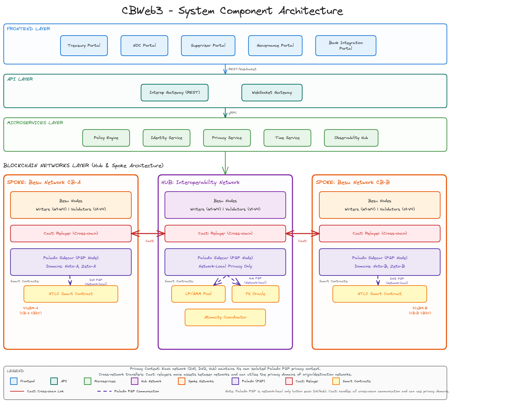

# Introduction

**CBWeb3** is an IDB Lab project that enables a regional test network (**Test Net**) for
Latin America and the Caribbean, allowing the issuance of **tCeBM (tokenized Central Bank
Money)** and the tokenization of financial assets, with a focus on cross-regional
interoperability between central banks and financial institutions.

The Test Net builds upon the technological capabilities and infrastructure of IDB Lab's
initiative **[LNet](https://lnet.global/)** — the Alliance for the Development of the
Blockchain Ecosystem in Latin America and the Caribbean.

Its strategic intent is to be recognised as a **Digital Public Good (DPG)** — freely
reusable, transparent and co-governed by the region's public sector, by regional financial
organisations such as CEMLA and FLAR, and by the open-source community.

## How it works

CBWeb3 connects domestic central bank networks (**Spokes**) through a shared transnational
settlement layer (**Hub**), supporting three types of transaction:

| Transaction | Description |
|-------------|-------------|
| **Domestic issuance & redemption** | A central bank issues or redeems tCeBM within its own network |
| **Enhanced Correspondent Banking** | Two parties settle a cross-border payment atomically using Hash Time-Lock Contracts (HTLC) |
| **Automated Market Maker (AMM)** | Commercial banks exchange currencies through a shared liquidity pool on the transnational hub |

## Architecture

The platform uses a **Hub & Spoke topology**: each country operates a domestic Hyperledger
Besu network (Spoke), connected through a shared transnational settlement layer (Hub) via
Hyperledger Cacti.

Full detail is in the [Technical Blueprint](CBWeb3_Technical_Blueprint.md).

## Where to go next

| If you want to… | Go to |
|---|---|
| Understand the DPG case | [CBWeb3 as a DPG](dpg-assesment/CBWeb3_as_a_DPG.md) |
| Understand the privacy model | [Privacy vs Confidentiality](dpg-assesment/Privacy%20vs%20Confidentiality.md) |
| Read the underlying research | [Research Papers](research-papers/index.md) |
| Build against the platform | [Toolbox](https://github.com/LF-Decentralized-Trust-labs/cbweb3/tree/main/Toolbox) |
| Contribute | [Participation & Collaboration Guidelines](https://github.com/LF-Decentralized-Trust-labs/cbweb3/blob/main/CONTRIBUTING.md) |

## Background

CBWeb3 also draws on the Korean experience with tokenized central bank money, including
collaboration with public, private and academic entities such as the Bank of Korea (BOK),
the Korea Exchange (KRX), the KAIST Network Security and Privacy Lab, and Sungkyunkwan
University (SKKU).
