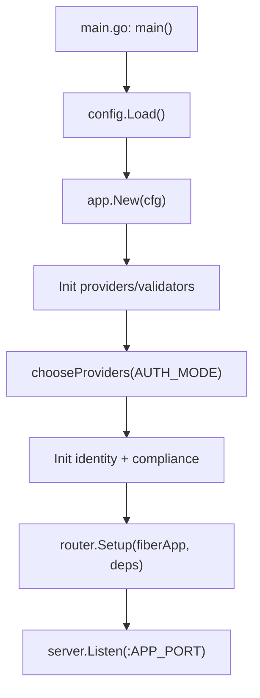
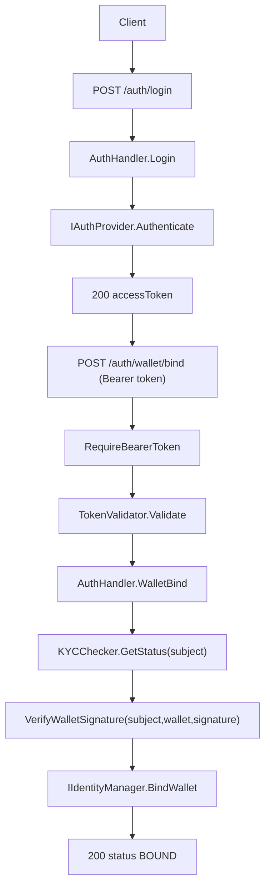
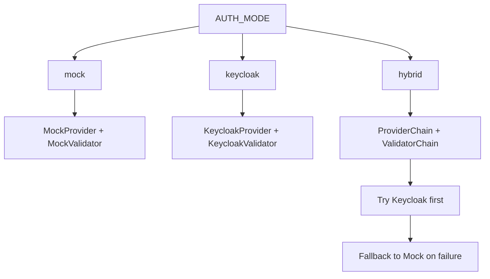

# API Gateway - Detailed Technical Explanation

## 1) What this service does

The `api-gateway` is a Go (Fiber) HTTP service that centralizes four responsibilities:

1. authenticating institutional clients (`POST /auth/login`);
2. validating bearer tokens for protected routes;
3. binding an Ethereum wallet to the authenticated user (`POST /auth/wallet/bind`);
4. retrieving KYC status for a subject (`GET /compliance/kyc/status/:subject`).

It is organized with clear separation between:
- HTTP entry layer (`internal/http`);
- application and domain rules (`internal/application`, `internal/domain`);
- integration adapters (`internal/adapters`);
- composition/wiring (`internal/app`).

## 2) Folder architecture

- `cmd/api-gateway/main.go`: process entrypoint, loads config, starts server.
- `internal/config`: environment variable parsing and typed config.
- `internal/app`: dependency injection and auth strategy selection.
- `internal/http/router`: route and middleware registration.
- `internal/http/handlers`: endpoint request/response logic.
- `internal/http/middleware`: bearer token validation.
- `internal/adapters/auth`: auth/validation implementations (mock, keycloak, chains, wallet signature).
- `internal/adapters/identity`: in-memory user-wallet binding store.
- `internal/application/compliance`: in-memory KYC status service.
- `internal/interfaces`: contracts used to decouple handlers and adapters.
- `internal/domain`: domain types and errors.

## 3) Startup flow

1. `main()` calls `config.Load()`.
2. `app.New(cfg)` builds providers/validators:
   - mock: `MockAuthProvider` + `MockTokenValidator`;
   - keycloak: `KeycloakAuthProvider` + `KeycloakTokenValidator`.
3. `chooseProviders` selects strategy based on `AUTH_MODE`.
4. Initializes `MemoryIdentityManager` and `compliance.Service`.
5. Creates handlers and registers routes through `router.Setup(...)`.
6. Starts HTTP listener on `:<APP_PORT>`.

## 4) Endpoints and behavior

### `GET /healthz`
- Returns `200` with `{"status":"ok"}`.
- Used for lightweight health checks.

### `POST /auth/login`
- JSON input: `clientId`, `clientSecret`.
- Flow:
  - validates body/required fields;
  - delegates to `authProvider.Authenticate(...)`;
  - returns `accessToken`, `expiresIn`, `tokenType`.
- Errors:
  - `400`: invalid body or missing fields;
  - `401`: invalid credentials.

### `POST /auth/wallet/bind` (protected route)
- Requires header `Authorization: Bearer <token>`.
- Middleware validates token and injects `claims` into request context.
- Handler:
  - validates `claims.Subject`;
  - validates body (`walletAddress`, `signature`);
  - blocks if KYC is `REJECTED`;
  - validates Ethereum signature;
  - performs user-wallet binding with 1:1 constraint.
- Main errors:
  - `401`: missing/invalid token or invalid claims;
  - `400`: invalid body, missing fields, invalid signature;
  - `403`: KYC rejected;
  - `409`: wallet already bound to another user or user already bound to another wallet;
  - `500`: unexpected internal bind error.

### `GET /compliance/kyc/status/:subject`
- Returns current KYC status for `subject`.
- If subject is unknown, default status is `PENDING`.

## 5) Detailed auth and wallet-bind flow

## 6) Authentication modes (`AUTH_MODE`)

The mode is loaded from environment and applied in `chooseProviders`:

- `mock`:
  - local provider login;
  - local RS256 JWT issuance;
  - local signature/issuer/audience validation.

- `keycloak`:
  - login through Keycloak token endpoint (`client_credentials`);
  - validation through Keycloak introspection.

- `hybrid`:
  - chain with fallback:
    - provider: `keycloak -> mock`;
    - validator: `keycloak -> mock`.
  - If the first option fails, the next one is attempted.

## 7) Important business rules

### KYC rule
- Wallet binding is blocked only when status is `REJECTED`.
- `PENDING` does not block the flow in current code.

### Ethereum signature rule
- Canonical message:
  - `CBWEB3_WALLET_BIND:<subject>:<wallet_lowercase>`
- Validations:
  - valid Ethereum address;
  - 65-byte hex signature;
  - valid recovery id;
  - recovered signature address must match `walletAddress`.

### Identity binding rule (1:1)
- A wallet cannot belong to two different users.
- A user cannot be bound to two different wallets.

## 8) Environment configuration

Main variables read by `config.Load()`:

- `APP_PORT`
- `AUTH_MODE`
- `AUTH_TOKEN_TTL_SEC`
- `AUTH_TOKEN_ISSUER`
- `AUTH_TOKEN_AUDIENCE`
- `AUTH_MOCK_CLIENTS`
- `REQUEST_TIMEOUT_SEC`
- `KEYCLOAK_TOKEN_URL`
- `KEYCLOAK_INTROSPECTION_URL`
- `KEYCLOAK_CLIENT_ID`
- `KEYCLOAK_CLIENT_SECRET`
- `POSTGRES_DSN`

Note: in current code, `POSTGRES_DSN` is loaded in config, but main runtime flow still uses in-memory stores for identity/KYC.

## 9) Test coverage (summary)

Current tests cover:
- mock login and validation;
- Keycloak adapter integration via `httptest`;
- fallback chain (`hybrid`);
- bearer middleware;
- HTTP handlers (status codes and success/error scenarios);
- broad app flow (health, login, bind, conflicts, KYC).

This provides strong confidence for implemented flows.

## 10) Current limitations

1. identity and KYC are in-memory (state is lost on restart);
2. no route authorization by roles/scopes beyond token validation;
3. no persistent storage wired in current runtime flow;
4. `hybrid` mode falls back for any failure from the first option.

## 11) Code references

- `cmd/api-gateway/main.go`
- `internal/config/config.go`
- `internal/app/app.go`
- `internal/http/router/router.go`
- `internal/http/middleware/auth.go`
- `internal/http/handlers/auth.go`
- `internal/http/handlers/compliance.go`
- `internal/http/handlers/health.go`
- `internal/adapters/auth/mock_provider.go`
- `internal/adapters/auth/mock_validator.go`
- `internal/adapters/auth/keycloak_provider.go`
- `internal/adapters/auth/keycloak_validator.go`
- `internal/adapters/auth/provider_chain.go`
- `internal/adapters/auth/wallet_signature.go`
- `internal/adapters/identity/memory_manager.go`
- `internal/application/compliance/service.go`
- `internal/domain/auth.go`
