# CBWeb3 Platform — Scenario A Architecture

> Single-ledger (per-spoke) settlement with Paladin privacy layer (Zeto ZKP tokens)
> and cross-spoke FX agreement coordination via Hyperledger Cacti relay.

## System Component Diagram

```mermaid
graph TB
    %% ─────────────────────────────────────────────
    %% FRONTEND
    %% ─────────────────────────────────────────────
    subgraph FRONTEND["🖥️ Frontend Layer"]
        direction LR
        FE_TREASURY["Treasury Portal"]
        FE_NOC["NOC Portal"]
        FE_SUPERVISOR["Supervisor Portal"]
        FE_GOV["Governance Portal"]
        FE_BANK["Bank Integration Portal"]
    end

    %% ─────────────────────────────────────────────
    %% SHARED INFRASTRUCTURE
    %% ─────────────────────────────────────────────
    subgraph INFRA["🗄️ Shared Infrastructure (cbweb3_network)"]
        direction LR
        KEYCLOAK["Keycloak\n:8081\n6 OIDC Realms\n(1 per entity)"]
        POSTGRES["PostgreSQL\n:5432\n7 databases\n(6 app + 1 KC)"]
        REDIS["Redis\n:6379\n6 logical DBs\n(nonce isolation)"]
    end

    %% ─────────────────────────────────────────────
    %% CACTI RELAY
    %% ─────────────────────────────────────────────
    subgraph RELAY["🔗 Interoperability Relay — Hyperledger Cacti"]
        direction TB
        CACTI_RELAY["HtlcRelay Service\n(TypeScript / Node.js)\n:4000 REST API\n\nPluginLedgerConnectorBesu\npolls eth_getLogs on both spokes\ntriggers SettleHTLC via gRPC"]
        CACTI_API["REST API\nGET /relay/events/settle\nGET /relay/events/lock\nPOST /relay/proof"]
        CACTI_RELAY --> CACTI_API
    end

    %% ─────────────────────────────────────────────
    %% SPOKE A
    %% ─────────────────────────────────────────────
    subgraph SPOKE_A["🔵 Spoke A — Chain 1338"]
        direction TB

        subgraph BESU_A["Hyperledger Besu QBFT (spoke_a_besu_network)"]
            direction LR
            BESU_A_CB["Besu CB-A\nbootnode :8645"]
            BESU_A_BANKA["Besu Bank-A\nvalidator :8646"]
            BESU_A_BANKC["Besu Bank-C\nvalidator :8647"]
            BESU_A_CB <-->|"P2P QBFT"| BESU_A_BANKA
            BESU_A_CB <-->|"P2P QBFT"| BESU_A_BANKC
            BESU_A_BANKA <-->|"P2P QBFT"| BESU_A_BANKC
        end

        subgraph CONTRACTS_A["Smart Contracts on Spoke-A"]
            direction LR
            SC_TCBM_A["tCeBM\n(ERC-20 CBDC)"]
            SC_HTLC_A["HTLC\n(HashTimeLock)"]
            SC_FXA_A["FXAgreement"]
            SC_CHR_A["CommitmentHash\nRegistry"]
            SC_IR_A["IdentityRegistry"]
        end

        subgraph PALADIN_A["🛡️ Paladin Privacy Layer — Spoke A"]
            direction LR
            PAL_A_CB["Paladin CB-A\n:31648 RPC / :31649 gRPC"]
            PAL_A_BANKA["Paladin Bank-A\n:31658 RPC / :31659 gRPC"]
            PAL_A_BANKC["Paladin Bank-C\n:31668 RPC / :31669 gRPC"]
        end

        subgraph SVC_A["Backend Services — Spoke A"]
            direction TB
            subgraph ENT_CB_A["Central Bank A stack"]
                direction LR
                CB_A_GW["api-gateway\n:58080"]
                CB_A_AUTH["auth\n:59091"]
                CB_A_COMP["compliance\n:59093"]
                CB_A_PO["payment-orchestrator\n:59094"]
            end
            subgraph ENT_BANK_A["Bank A stack"]
                direction LR
                BA_GW["api-gateway\n:18080"]
                BA_AUTH["auth\n:19091"]
                BA_COMP["compliance\n:19093"]
                BA_PO["payment-orchestrator\n:19094"]
            end
            subgraph ENT_BANK_C["Bank C stack"]
                direction LR
                BC_GW["api-gateway\n:38080"]
                BC_AUTH["auth\n:39091"]
                BC_COMP["compliance\n:39093"]
                BC_PO["payment-orchestrator\n:39094"]
            end
        end

        BESU_A_CB -.->|"deploys / queries"| CONTRACTS_A
        PAL_A_CB -->|"Besu RPC :8645"| BESU_A_CB
        PAL_A_BANKA -->|"Besu RPC :8646"| BESU_A_BANKA
        PAL_A_BANKC -->|"Besu RPC :8647"| BESU_A_BANKC
        CB_A_PO -->|"gRPC :31649"| PAL_A_CB
        BA_PO -->|"gRPC :31659"| PAL_A_BANKA
        BC_PO -->|"gRPC :31669"| PAL_A_BANKC
        CB_A_PO -->|"Besu RPC"| BESU_A_CB
        BA_PO -->|"Besu RPC"| BESU_A_BANKA
        BC_PO -->|"Besu RPC"| BESU_A_BANKC
    end

    %% ─────────────────────────────────────────────
    %% SPOKE B
    %% ─────────────────────────────────────────────
    subgraph SPOKE_B["🟢 Spoke B — Chain 1339"]
        direction TB

        subgraph BESU_B["Hyperledger Besu QBFT (spoke_b_besu_network)"]
            direction LR
            BESU_B_CB["Besu CB-B\nbootnode :8745"]
            BESU_B_BANKB["Besu Bank-B\nvalidator :8746"]
            BESU_B_BANKD["Besu Bank-D\nvalidator :8747"]
            BESU_B_CB <-->|"P2P QBFT"| BESU_B_BANKB
            BESU_B_CB <-->|"P2P QBFT"| BESU_B_BANKD
            BESU_B_BANKB <-->|"P2P QBFT"| BESU_B_BANKD
        end

        subgraph CONTRACTS_B["Smart Contracts on Spoke-B"]
            direction LR
            SC_TCBM_B["tCeBM\n(ERC-20 CBDC)"]
            SC_HTLC_B["HTLC\n(HashTimeLock)"]
            SC_FXA_B["FXAgreement"]
            SC_CHR_B["CommitmentHash\nRegistry"]
            SC_IR_B["IdentityRegistry"]
        end

        subgraph PALADIN_B["🛡️ Paladin Privacy Layer — Spoke B"]
            direction LR
            PAL_B_CB["Paladin CB-B\n:31748 RPC / :31749 gRPC"]
            PAL_B_BANKB["Paladin Bank-B\n:31758 RPC / :31759 gRPC"]
            PAL_B_BANKD["Paladin Bank-D\n:31768 RPC / :31769 gRPC"]
        end

        subgraph SVC_B["Backend Services — Spoke B"]
            direction TB
            subgraph ENT_CB_B["Central Bank B stack"]
                direction LR
                CB_B_GW["api-gateway\n:60080"]
                CB_B_AUTH["auth\n:60091"]
                CB_B_COMP["compliance\n:60093"]
                CB_B_PO["payment-orchestrator\n:60094"]
            end
            subgraph ENT_BANK_B["Bank B stack"]
                direction LR
                BB_GW["api-gateway\n:28080"]
                BB_AUTH["auth\n:29091"]
                BB_COMP["compliance\n:29093"]
                BB_PO["payment-orchestrator\n:29094"]
            end
            subgraph ENT_BANK_D["Bank D stack"]
                direction LR
                BD_GW["api-gateway\n:48080"]
                BD_AUTH["auth\n:49091"]
                BD_COMP["compliance\n:49093"]
                BD_PO["payment-orchestrator\n:49094"]
            end
        end

        BESU_B_CB -.->|"deploys / queries"| CONTRACTS_B
        PAL_B_CB -->|"Besu RPC :8745"| BESU_B_CB
        PAL_B_BANKB -->|"Besu RPC :8746"| BESU_B_BANKB
        PAL_B_BANKD -->|"Besu RPC :8747"| BESU_B_BANKD
        CB_B_PO -->|"gRPC :31749"| PAL_B_CB
        BB_PO -->|"gRPC :31759"| PAL_B_BANKB
        BD_PO -->|"gRPC :31769"| PAL_B_BANKD
        CB_B_PO -->|"Besu RPC"| BESU_B_CB
        BB_PO -->|"Besu RPC"| BESU_B_BANKB
        BD_PO -->|"Besu RPC"| BESU_B_BANKD
    end

    %% ─────────────────────────────────────────────
    %% HUB (Scenario B – future)
    %% ─────────────────────────────────────────────
    subgraph HUB["🟠 Hub — International Settlement (Scenario B / Future)"]
        direction LR
        AMM["AutomatedMarketMaker\n(constant-product AMM)\nliquidity pools per currency pair"]
        ORACLE["ManualOracle\n(FX price oracle)"]
        SPOKE_BRIDGE["SpokeBridge\n(cross-spoke token bridge)"]
        AMM --- ORACLE
        AMM --- SPOKE_BRIDGE
    end

    %% ─────────────────────────────────────────────
    %% TOP-LEVEL CONNECTIONS
    %% ─────────────────────────────────────────────

    %% Frontend → API Gateways
    FRONTEND -->|"HTTPS REST"| CB_A_GW
    FRONTEND -->|"HTTPS REST"| BA_GW
    FRONTEND -->|"HTTPS REST"| BC_GW
    FRONTEND -->|"HTTPS REST"| CB_B_GW
    FRONTEND -->|"HTTPS REST"| BB_GW
    FRONTEND -->|"HTTPS REST"| BD_GW

    %% API Gateways → internal gRPC
    CB_A_GW -->|"gRPC"| CB_A_AUTH
    CB_A_GW -->|"gRPC"| CB_A_COMP
    CB_A_GW -->|"gRPC"| CB_A_PO
    BA_GW -->|"gRPC"| BA_AUTH
    BA_GW -->|"gRPC"| BA_COMP
    BA_GW -->|"gRPC"| BA_PO
    BB_GW -->|"gRPC"| BB_AUTH
    BB_GW -->|"gRPC"| BB_COMP
    BB_GW -->|"gRPC"| BB_PO

    %% Auth → Keycloak + Redis
    CB_A_AUTH -->|"OIDC JWKS"| KEYCLOAK
    BA_AUTH -->|"OIDC JWKS"| KEYCLOAK
    BC_AUTH -->|"OIDC JWKS"| KEYCLOAK
    CB_B_AUTH -->|"OIDC JWKS"| KEYCLOAK
    BB_AUTH -->|"OIDC JWKS"| KEYCLOAK
    BD_AUTH -->|"OIDC JWKS"| KEYCLOAK
    BA_AUTH -->|"nonce (DB 0)"| REDIS
    BB_AUTH -->|"nonce (DB 1)"| REDIS
    CB_A_AUTH -->|"nonce (DB 2)"| REDIS
    BC_AUTH -->|"nonce (DB 3)"| REDIS
    BD_AUTH -->|"nonce (DB 4)"| REDIS
    CB_B_AUTH -->|"nonce (DB 5)"| REDIS

    %% Services → PostgreSQL
    BA_PO -->|"GORM / Postgres"| POSTGRES
    BB_PO -->|"GORM / Postgres"| POSTGRES
    CB_A_PO -->|"GORM / Postgres"| POSTGRES
    CB_B_PO -->|"GORM / Postgres"| POSTGRES

    %% Cacti Relay watches both spokes
    CACTI_RELAY -->|"eth_getLogs (HTTP/WS)\nBesu RPC :8645-:8647"| BESU_A_CB
    CACTI_RELAY -->|"eth_getLogs (HTTP/WS)\nBesu RPC :8745-:8747"| BESU_B_CB

    %% payment-orchestrators poll Cacti
    BA_PO -->|"REST poll\n:4000/relay/events"| CACTI_API
    BB_PO -->|"REST poll\n:4000/relay/events"| CACTI_API

    %% Cacti triggers SettleHTLC via gRPC
    CACTI_RELAY -->|"SettleHTLC gRPC"| BA_PO
    CACTI_RELAY -->|"SettleHTLC gRPC"| BB_PO

    %% Hub connections (future/Scenario B)
    SPOKE_BRIDGE -.->|"future bridge"| BESU_A_CB
    SPOKE_BRIDGE -.->|"future bridge"| BESU_B_CB

    %% ─────────────────────────────────────────────
    %% STYLES
    %% ─────────────────────────────────────────────

    %% Node classes
    classDef frontend    fill:#dce9ff,stroke:#6699cc,color:#1a1a2e
    classDef infra       fill:#e8e0f5,stroke:#9966cc,color:#1a1a2e
    classDef relay       fill:#dce9ff,stroke:#4488bb,color:#1a1a2e
    classDef besu_a      fill:#dce9ff,stroke:#4488bb,color:#1a1a2e
    classDef besu_b      fill:#dcf5e8,stroke:#44aa66,color:#1a1a2e
    classDef contract_a  fill:#c8dcf5,stroke:#3366aa,color:#1a1a2e
    classDef contract_b  fill:#c8f0da,stroke:#228855,color:#1a1a2e
    classDef paladin_a   fill:#d0e8ff,stroke:#5577bb,color:#1a1a2e
    classDef paladin_b   fill:#d0f0e0,stroke:#336644,color:#1a1a2e
    classDef svc_a       fill:#dce9ff,stroke:#4477aa,color:#1a1a2e
    classDef svc_b       fill:#dcf5e8,stroke:#33aa55,color:#1a1a2e
    classDef hub         fill:#fff5d0,stroke:#cc9900,color:#1a1a2e

    %% Apply classes to nodes
    class FE_TREASURY,FE_NOC,FE_SUPERVISOR,FE_GOV,FE_BANK frontend
    class KEYCLOAK,POSTGRES,REDIS infra
    class CACTI_RELAY,CACTI_API relay
    class BESU_A_CB,BESU_A_BANKA,BESU_A_BANKC besu_a
    class BESU_B_CB,BESU_B_BANKB,BESU_B_BANKD besu_b
    class SC_TCBM_A,SC_HTLC_A,SC_FXA_A,SC_CHR_A,SC_IR_A contract_a
    class SC_TCBM_B,SC_HTLC_B,SC_FXA_B,SC_CHR_B,SC_IR_B contract_b
    class PAL_A_CB,PAL_A_BANKA,PAL_A_BANKC paladin_a
    class PAL_B_CB,PAL_B_BANKB,PAL_B_BANKD paladin_b
    class CB_A_GW,CB_A_AUTH,CB_A_COMP,CB_A_PO,BA_GW,BA_AUTH,BA_COMP,BA_PO,BC_GW,BC_AUTH,BC_COMP,BC_PO svc_a
    class CB_B_GW,CB_B_AUTH,CB_B_COMP,CB_B_PO,BB_GW,BB_AUTH,BB_COMP,BB_PO,BD_GW,BD_AUTH,BD_COMP,BD_PO svc_b
    class AMM,ORACLE,SPOKE_BRIDGE hub

    %% Subgraph fill colours
    style FRONTEND   fill:#dce9ff,stroke:#6699cc,opacity:0.6
    style INFRA      fill:#e8e0f5,stroke:#9966cc,opacity:0.6
    style RELAY      fill:#dce9ff,stroke:#4488bb,opacity:0.6
    style SPOKE_A    fill:#dce9ff,stroke:#4477aa,opacity:0.4
    style BESU_A     fill:#c8dcf5,stroke:#3366aa,opacity:0.5
    style CONTRACTS_A fill:#bdd4f0,stroke:#2255aa,opacity:0.5
    style PALADIN_A  fill:#d0e8ff,stroke:#5577bb,opacity:0.5
    style SVC_A      fill:#e4eeff,stroke:#4477aa,opacity:0.5
    style ENT_CB_A   fill:#ccddf5,stroke:#3366aa,opacity:0.6
    style ENT_BANK_A fill:#ccddf5,stroke:#3366aa,opacity:0.6
    style ENT_BANK_C fill:#ccddf5,stroke:#3366aa,opacity:0.6
    style SPOKE_B    fill:#dcf5e8,stroke:#33aa55,opacity:0.4
    style BESU_B     fill:#c8f0da,stroke:#228855,opacity:0.5
    style CONTRACTS_B fill:#bdeacc,stroke:#117744,opacity:0.5
    style PALADIN_B  fill:#d0f0e0,stroke:#336644,opacity:0.5
    style SVC_B      fill:#e4f8ee,stroke:#33aa55,opacity:0.5
    style ENT_CB_B   fill:#cceedb,stroke:#228855,opacity:0.6
    style ENT_BANK_B fill:#cceedb,stroke:#228855,opacity:0.6
    style ENT_BANK_D fill:#cceedb,stroke:#228855,opacity:0.6
    style HUB        fill:#fff5d0,stroke:#cc9900,opacity:0.6
```

---

## Participants & Roles

| Entity | Role | Spoke | Besu RPC | API Gateway | Paladin gRPC |
|--------|------|-------|----------|-------------|-------------|
| Central Bank A | Governance, Mint/Burn tCeBM | Spoke-A | :8645 | :58080 | :31649 |
| Central Bank B | Governance, Mint/Burn tCeBM | Spoke-B | :8745 | :60080 | :31749 |
| Bank A | Commercial Bank | Spoke-A | :8646 | :18080 | :31659 |
| Bank B | Commercial Bank | Spoke-B | :8746 | :28080 | :31759 |
| Bank C | Commercial Bank | Spoke-A | :8647 | :38080 | :31669 |
| Bank D | Commercial Bank | Spoke-B | :8747 | :48080 | :31769 |

## Smart Contracts (per Spoke)

| Contract | Purpose |
|----------|---------|
| tCeBM (TokenizedCentralBankMoney) | ERC-20 CBDC — public Besu token |
| HTLC (HashTimeLockedContract) | Coordination-only atomic swap (no token custody) |
| FXAgreement | Bilateral FX trade lifecycle |
| CommitmentHashRegistry | On-chain commitment hash anchoring |
| IdentityRegistry | Participant registration & role governance |
| Zeto_AnonNullifier | Private ZKP token (Paladin domain) |

## Privacy Architecture

| Layer | Technology | Purpose |
|-------|------------|-------|
| Public Besu | Hyperledger Besu QBFT | Consensus, ERC-20 tokens, HTLC coordination |
| Private (Paladin) | Zeto domain (AnonNullifier) | Private UTXO transfers with ZK proofs |
| Interop | Hyperledger Cacti | Cross-spoke event relay and settlement propagation |

## Docker Networks

| Network | Connects |
|---------|----------|
| `spoke_a_besu_network` | Besu Spoke-A nodes + Paladin spoke-a nodes |
| `spoke_b_besu_network` | Besu Spoke-B nodes + Paladin spoke-b nodes |
| `cbweb3_network` | Shared infra (Keycloak, PostgreSQL, Redis) + all backends |
| `cacti_default` | Cacti HTLC relay |
