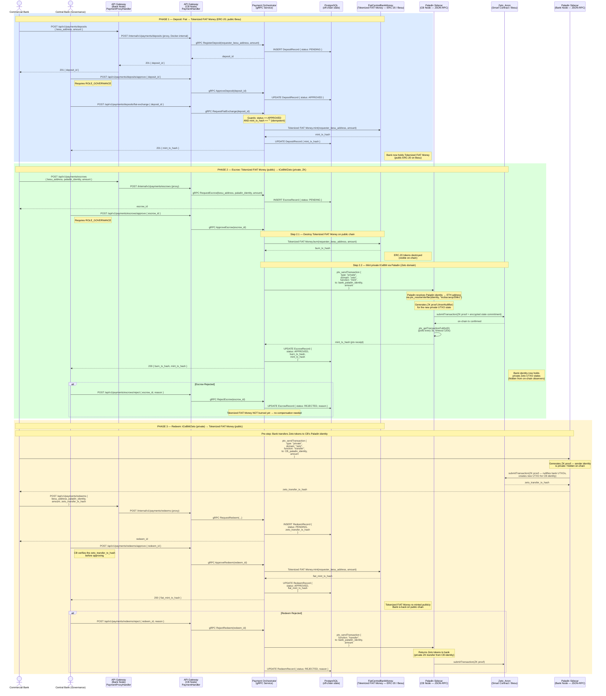

# CBWeb3 Scenario A — Deposit, Escrow & Redeem Flow

> Lifecycle of tokenized central bank money: Fiat → public ERC-20 (FiatCentralBankMoney)
> → private ZKP token (Zeto tCeBM) → back to public ERC-20.
>
> This is the **liquidity injection** process that enables commercial banks to
> hold private tCeBM for use in PvP settlement (see [transfer.md](transfer.md)).

---

## Sequence Diagram

---

## Phase Summary

| Phase | Operation | Input | Output | Actor |
|-------|-----------|-------|--------|-------|
| 1 — Deposit | Fiat → FiatCentralBankMoney (ERC-20) | Bank fiat deposit request | `mint_tx_hash` | Central Bank (governance) |
| 2 — Escrow | FiatCentralBankMoney → tCeBM (Zeto) | Escrow request + approval | `burn_tx_hash` + `mint_tx_hash` (ZKP) | Central Bank (governance) |
| 3 — Redeem | tCeBM (Zeto) → FiatCentralBankMoney | Redeem request + ZK transfer proof | `fiat_mint_tx_hash` | Central Bank (governance) |

## Key Design Properties

| Property | Description |
|----------|-------------|
| **Governance-gated** | All state transitions require Central Bank approval (ROLE_GOVERNANCE) |
| **Idempotent minting** | Guards prevent double-mint: `mint_tx_hash == ""` check before execution |
| **Privacy boundary** | FiatCentralBankMoney is public (ERC-20); tCeBM is private (Zeto ZKP UTXO) |
| **Rejection safety** | Escrow rejection before burn = no compensation; Redeem rejection = Zeto tokens returned via ZK transfer |
| **Audit trail** | All tx hashes (fiat mint, burn, zeto mint) stored in PostgreSQL per record |

## API Endpoints

| Method | Endpoint | Actor | Phase |
|--------|----------|-------|-------|
| POST | `/api/v1/payments/deposits` | Commercial Bank | 1 |
| POST | `/api/v1/payments/deposits/approve` | Central Bank | 1 |
| POST | `/api/v1/payments/deposits/fiat-exchange` | Central Bank | 1 |
| POST | `/api/v1/payments/escrows` | Commercial Bank | 2 |
| POST | `/api/v1/payments/escrows/approve` | Central Bank | 2 |
| POST | `/api/v1/payments/escrows/reject` | Central Bank | 2 |
| POST | `/api/v1/payments/redeems` | Commercial Bank | 3 |
| POST | `/api/v1/payments/redeems/approve` | Central Bank | 3 |
| POST | `/api/v1/payments/redeems/reject` | Central Bank | 3 |
