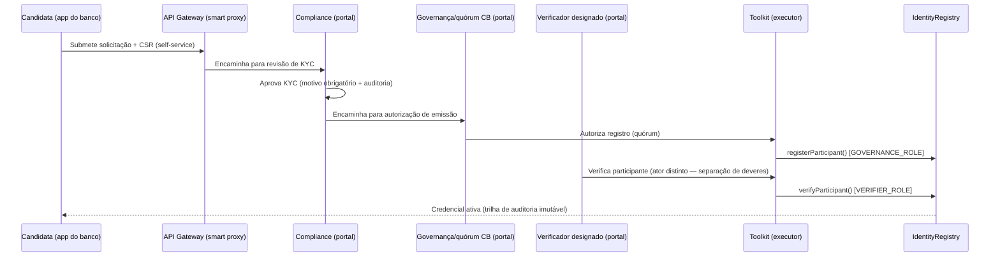

# ADR-002: Modelo-alvo de onboarding pelo portal de governança

**Status**: Proposto
**Data**: 2026-07-23
**Decisores**: Time de arquitetura CBWeb3 (AH/GL) — pendente alinhamento IDB/LNet/CEMLA
**Findings relacionados**: A-ARCH-2 / 7.2 (feedback LNet, Rodada 2)

---

## Pedido de decisão

Este bloco existe para que a decisão possa ser tomada sem ler o ADR inteiro. O corpo
abaixo continua sendo a fundamentação.

| | |
|---|---|
| **O que se pede** | Aprovar o modelo-alvo em que o **portal de governança é o orquestrador de política** (a autoridade origina e aprova) e o **toolkit permanece o único executor do registro on-chain**, com a reativação da UI de emissão de credencial hoje comentada — **ou** decidir o modelo alternativo (self-service pelo banco, com a autoridade apenas aprovando, que é o que está implementado hoje). |
| **Quem assina** | IDB, LNet e **CEMLA** — é a CEMLA que opera o portal de governança no modelo acordado, e a escolha altera quem origina um onboarding. |
| **Recomendação a aprovar** | Portal como orquestrador de política + toolkit como executor (ver §Recomendação). |
| **Se aprovado, desbloqueia** | `[R1-§7.2 / R2-A-ARCH-2]` — reativar a UI de registro/credencial/CSR e documentar a matriz de autorização por passo. |
| **Se não for aprovado** | O modelo self-service atual passa a ser a decisão, não o estado de fato, e a divergência com o modelo acordado (CEMLA origina) deixa de ser um finding aberto e passa a ser um desvio aceito e registrado. |
| **Evidência reverificada** | `develop` @ `bfa89aa1`, 2026-08-22. Todas as citações deste ADR continuam exatas: handler `onIssue` comentado, card "Issue Credential" comentado em `scenario-b/.../RegistryPage.tsx:132-176` e `scenario-a/.../RegistryPage.tsx:129-173`, card "Compliance Registry" comentado apenas no Scenario A (`:95-127`), e "Pending KYC Approvals" ativo nos dois. |

---

## Contexto

O onboarding de participantes evoluiu de forma desalinhada entre duas superfícies:
o **toolkit de provisionamento (CLI)** e o **portal de governança (UI web)**.

- **O bootstrap de banco central por script tornou-se obsoleto.** O toolkit
  cobre a fundação da rede de forma declarativa:
  - `mode: found` (fundação da rede pelo banco central) e o passo
    `scenario-a/toolkit/engine/orchestrator/step_onboard_registry.go` registram o
    participante no `IdentityRegistry` on-chain durante o provisionamento, sem
    depender de scripts imperativos de bootstrap. Esse caminho é **dirigido por
    operador** via CLI (`cbweb3 apply`), referenciado em
    `scenario-a/samples/README.md`.

- **Já existe um caminho self-service iniciado pelo banco (candidato).** Ao
  contrário do que uma leitura inicial do finding sugere, o Scenario A **entrega**
  um fluxo self-service iniciado pela instituição candidata:
  - Assistente de onboarding no app do banco:
    `scenario-a/frontend/apps/bank/src/features/onboarding/OnboardingWizard.tsx`
    (Step1–Step4) com polling de status (`hooks/useOnboardingPolling`).
  - O API gateway opera em "smart proxy mode": lê o CSR do disco e **inicia** a
    solicitação de credencial, encaminhando para
    `/api/v1/onboarding/credential-request`
    (`scenario-a/backend/services/api-gateway/internal/http/handlers/onboarding_proxy.go:62-107`).
  - **Este caminho iniciado pelo banco é exatamente o objeto do finding A-ARCH-2**:
    coexiste com o registro on-chain do toolkit sem um modelo-alvo acordado de quem
    inicia e quem aprova cada passo.

- **A UI de registro/emissão de credencial/CSR está comentada** em ambos os
  cenários:
  - `scenario-b/frontend/apps/governance/src/pages/RegistryPage.tsx`: o handler
    `onIssue` está comentado (linha 64) e o card "Issue Credential" com o
    formulário de emissão e o fluxo de confirmação está inteiramente comentado
    (linhas 132-176, bloco `{/* <Card> ... </Card> */}`).
  - `scenario-a/frontend/apps/governance/src/pages/RegistryPage.tsx` apresenta o
    mesmo padrão (handler `onIssue` comentado na linha 61; card "Issue Credential"
    comentado nas linhas 129-173). Neste cenário o próprio card "Compliance Registry"
    também está comentado (linhas 95-127), ao contrário do Scenario B, onde essa
    listagem permanece ativa.
  - O que permanece **ativo** na página é a listagem read-only ("Compliance
    Registry") e o fluxo de **"Pending KYC Approvals"** (`onApproveKyc`,
    `scenario-b/.../RegistryPage.tsx:82-94`), que aprova KYC com motivo obrigatório
    e gera entrada de auditoria.

**Conclusão do contexto**: existem hoje **três** superfícies parcialmente
sobrepostas — (1) o toolkit (operador, CLI, declarativo) faz o registro on-chain;
(2) o app do banco tem um assistente self-service ativo (wizard + smart proxy que
inicia CSR e `credential-request`); e (3) o portal de governança tem um fluxo de
aprovação de KYC ativo, mas a emissão de credencial/CSR pela UI foi desativada
(comentada). Falta uma decisão sobre o **modelo-alvo de onboarding** e a matriz de
autorização por passo, **incluindo se o wizard iniciado pelo banco é mantido ou
depreciado** — questão levantada pela LNet no finding 7.2 e relevante ao modelo de
governança discutido com a CEMLA.

---

## Opções

### Opção A — Portal como orquestrador de política; toolkit como executor

O portal de governança conduz o fluxo de **decisão** (KYC, autorização, emissão
de credencial) e delega a **execução** on-chain ao toolkit, invocando o mesmo
caminho de `step_onboard_registry` por trás de uma API de gateway. A UI comentada
de "Issue Credential" é reativada, mas apenas como frontend do fluxo já
implementado no toolkit — sem reimplementar a lógica de registro.

**Prós**
- Fonte única de verdade para o registro on-chain (o toolkit), evitando duas
  implementações divergentes da mesma escrita no `IdentityRegistry`.
- Separação limpa: portal = política/aprovação humana; toolkit = execução
  determinística e auditável.
- Aproveita o fluxo de KYC já ativo e a trilha de auditoria existente.
- Modelo compatível com governança CEMLA (aprovação humana explícita antes da
  emissão).

**Contras**
- Requer expor o caminho do toolkit por trás de uma API de gateway (o toolkit foi
  desenhado como CLI de operador), com autenticação/autorização adequadas.
- Reativar a UI exige reconciliar o contrato de `issueCredential` com a assinatura
  atual do backend/toolkit.

### Opção B — Reativar a UI de emissão como caminho autônomo (portal self-service completo)

Reativar `onIssue` e o card de emissão para que o portal execute emissão de
credencial/CSR de forma autônoma, independente do toolkit.

**Prós**
- Self-service completo pela UI; onboarding sem operador de CLI.
- Menor atrito para participantes que já passaram no KYC.

**Contras**
- **Duplica a lógica de registro** já implementada no toolkit
  (`step_onboard_registry.go`), criando risco de divergência de comportamento
  entre o caminho CLI (`cbweb3 apply`) e o caminho UI.
- Emissão de credencial de participante é um ato de governança sensível; permitir
  execução autônoma pela UI amplia a superfície de autorização e exige controles
  fortes (aprovação de quórum, MFA, trilha) que hoje não existem no card comentado.
- Vai contra a direção de tornar o toolkit a fonte declarativa de onboarding.

### Opção C — Manter apenas o toolkit (portal permanece read-only + KYC)

Formalizar o toolkit CLI como único caminho de onboarding e remover
definitivamente a UI comentada de emissão, mantendo no portal apenas a listagem e
a aprovação de KYC.

**Prós**
- Menor esforço; consolida o que já funciona.
- Onboarding 100% declarativo e auditável via manifesto.

**Contras**
- Onboarding continua dependente de operador de CLI — não atende à expectativa de
  self-service pelo portal levantada no finding 7.2.
- Deixa código morto comentado no repositório (dívida técnica de UI) a menos que
  seja efetivamente removido.

---

## Recomendação

**Adotar a Opção A — portal como orquestrador de política, toolkit como executor.**

Justificativa: preserva o toolkit como fonte única de verdade do registro on-chain
(evitando a divergência que a Opção B introduziria), reaproveita o fluxo de KYC já
ativo e entrega a experiência de portal que o finding 7.2 pede, sob controle de
governança compatível com a CEMLA. A UI comentada de "Issue Credential" é
reativada como frontend do fluxo do toolkit, não como reimplementação.

**Matriz de autorização recomendada (a validar com IDB/LNet/CEMLA):**

| Passo | Autorizado | Papel on-chain (#116) | Superfície |
|-------|-----------|------------------------|------------|
| Submissão de solicitação de participação / CSR | Instituição candidata | — | App do banco (self-service) ¹ |
| Revisão e aprovação de KYC | Operador de compliance | — | Portal de governança (fluxo já ativo) |
| Registro do participante (`registerParticipant`) | Governança (quórum banco central) | `GOVERNANCE_ROLE` | Portal aciona → toolkit executa |
| Verificação do participante (`verifyParticipant`) | Verificador designado (ator distinto) | `VERIFIER_ROLE` | Portal aciona → toolkit executa |
| Fundação da rede (`mode: found`) | Operador do banco central | — | CLI (`cbweb3 apply`) |

¹ A linha 1 mantém o caminho self-service iniciado pelo banco (o wizard já
existente). Isso é uma **divergência** frente a um eventual modelo CEMLA-originado e
exige sign-off explícito da CEMLA: ou o wizard é adotado como caminho oficial, ou é
depreciado em favor de um modelo originado pela autoridade.

² O PR #116 separa `registerParticipant` (`GOVERNANCE_ROLE`) de `verifyParticipant`
(`VERIFIER_ROLE`) em `IdentityRegistry`. A matriz **deve** nomear qual papel do
portal detém `VERIFIER_ROLE`, e esse ator deve ser distinto de quem executa o
registro; caso contrário a separação de deveres do #116 é anulada no caminho do
portal.

### Fluxo de onboarding (iniciador e aprovador por passo)

---

## Plano de implementação

1. **Definir a matriz de autorização e o fluxo-alvo** — validar com IDB/LNet/CEMLA
   quem inicia e quem aprova cada passo (matriz e diagrama acima), formalizando o
   requisito de quórum para a emissão e a decisão sobre **manter ou depreciar** o
   wizard self-service iniciado pelo banco. Registrar como anexo deste ADR.
2. **Alinhar com o PR #116 (separação de deveres)** — refletir na matriz e no código
   a separação `registerParticipant` (`GOVERNANCE_ROLE`) → `verifyParticipant`
   (`VERIFIER_ROLE`), nomeando explicitamente qual papel do portal detém
   `VERIFIER_ROLE` e garantindo que registro e verificação sejam atores distintos.
   O #116 deve ser mesclado **antes** de qualquer implementação deste ADR.
3. **Expor o caminho do toolkit via API de gateway** — publicar uma operação
   autenticada (Keycloak OIDC) que aciona a lógica de `step_onboard_registry`,
   preservando a passagem obrigatória pelo compliance gate do API gateway (sem
   bypass em chamadas serviço-a-serviço).
4. **Documentar a configuração manual de Keycloak para bancos centrais** —
   especificar os realms/clients/roles (`GOVERNANCE_ROLE`, `VERIFIER_ROLE`, papel de
   compliance) hoje provisionados manualmente, para que a matriz seja operável no
   portal.
5. **Reconciliar o contrato `issueCredential`** — alinhar a assinatura esperada
   pela UI comentada (`entityName`, `legalEntityId`, `scopes`, `reason`) com a API
   dos passos 2–3.
6. **Reativar a UI de emissão** — descomentar e adaptar `onIssue` e o card "Issue
   Credential" em ambos os `RegistryPage.tsx` (Scenario A e Scenario B),
   condicionando a ação de registro ao `GOVERNANCE_ROLE` e a de verificação ao
   `VERIFIER_ROLE`, com o motivo obrigatório já usado no fluxo de KYC.
7. **Encadear KYC → registro → verificação** — garantir que a emissão só fique
   disponível para participantes com KYC aprovado (ligando o fluxo `onApproveKyc`
   existente), e que registro e verificação permaneçam atos distintos (separação de
   deveres do #116).
8. **Trilha de auditoria** — assegurar entrada imutável de auditoria em cada passo
   (o próprio comentário da UI já promete "immutable audit entry").
9. **Testes e documentação** — cobrir o fluxo com testes de frontend e de gateway,
   atualizar o README de governança e o `samples/README.md` para descrever o modelo
   portal + toolkit, e registrar o fechamento do finding 7.2.

---

## Esforço e cronograma (estimativa preliminar — a confirmar pelo time)

| Fase | Escopo | Esforço estimado |
|------|--------|------------------|
| Matriz + diagrama + alinhamento #116 (passos 1–2) | Acordo de fluxo/autorização + merge #116 | ~1 semana-dev + sign-off (externo) |
| Gateway + Keycloak (passos 3–4) | API autenticada para o toolkit + config de realms | ~2 semanas-dev |
| UI de emissão + encadeamento (passos 5–7) | Reativar card, papéis, KYC→registro→verificação | ~2–3 semanas-dev |
| Auditoria + testes + docs (passos 8–9) | Trilha, testes de frontend/gateway, docs | ~1–2 semanas-dev |

Estimativa total: **~6–8 semanas-dev**, bloqueadas pelo merge do #116 e pelo
sign-off da matriz. Datas-alvo a definir no planejamento de release.

---

## Status / Sign-off

| Parte | Papel | Decisão | Data |
|-------|-------|---------|------|
| Time de arquitetura CBWeb3 (AH/GL) | Autor | Proposto | 2026-07-23 |
| IDB | Aprovação da matriz de autorização | Pendente | — |
| LNet | Aprovação da matriz de autorização | Pendente | — |
| CEMLA | Aprovação do modelo self-service vs. originado pela autoridade | Pendente | — |

O Status permanece **Proposto** até que as linhas de sign-off acima estejam
preenchidas.
