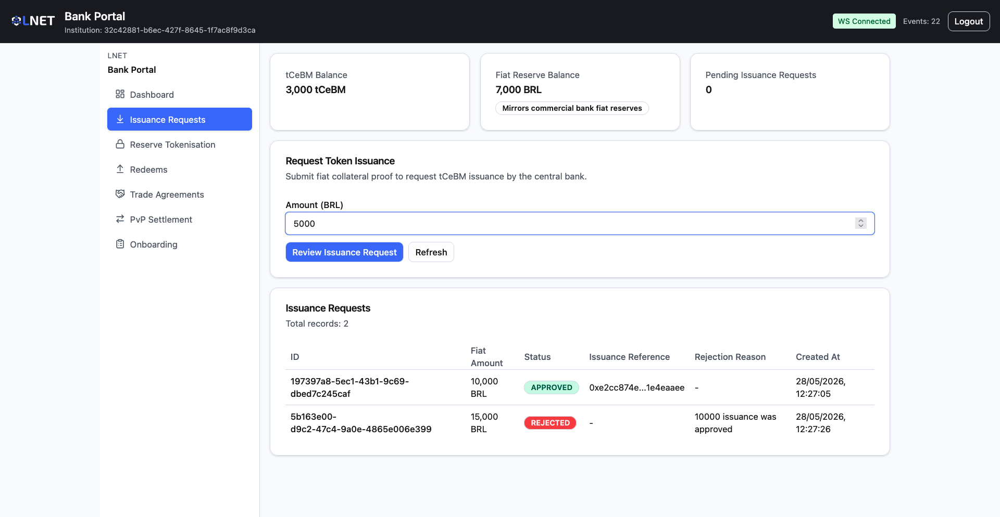
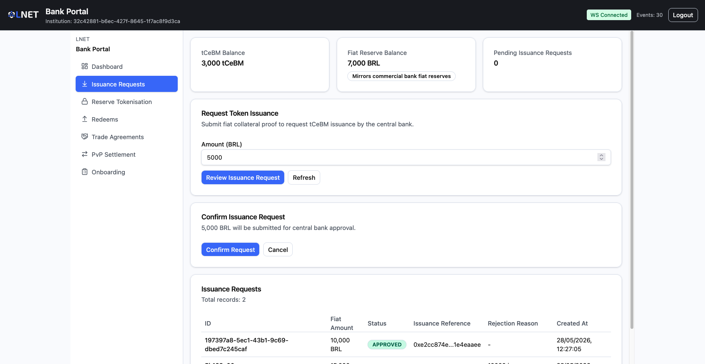
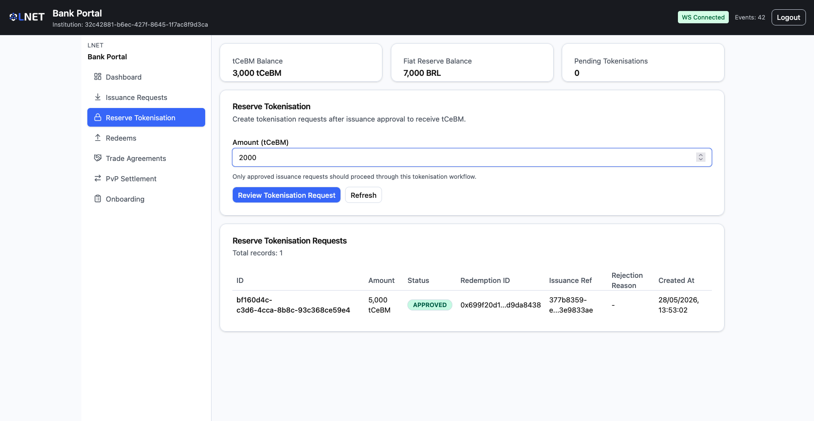
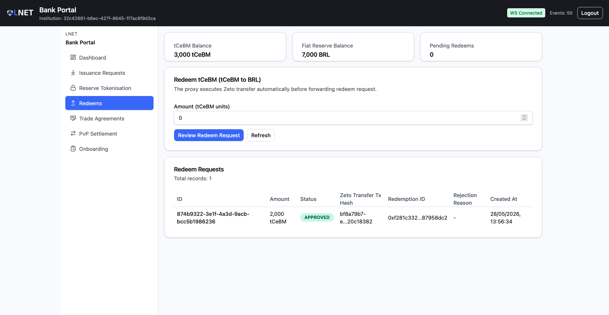
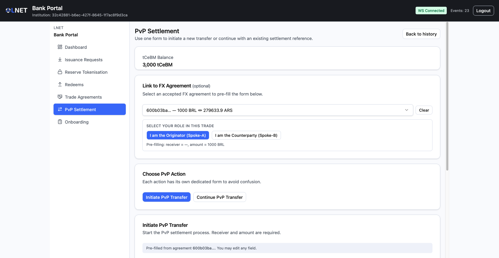

# Commercial Bank Portal — Operator Guide

This guide covers the day-to-day operation of the **Commercial Bank Portal**: managing digital currency balances, requesting issuance and redemption, conducting cross-border FX trades, and executing atomic PvP settlements.

---

## Table of Contents

1. [Overview](#1-overview)
2. [Prerequisites](#2-prerequisites)
3. [Access and Login](#3-access-and-login)
4. [Dashboard](#4-dashboard)
5. [Onboarding](#5-onboarding)
6. [Token Issuance — Deposits](#6-token-issuance--deposits)
7. [Reserve Tokenisation — Escrows](#7-reserve-tokenisation--escrows)
8. [Token Redemption — Redeems](#8-token-redemption--redeems)
9. [Trade Agreements](#9-trade-agreements)
10. [Cross-Border PvP Settlement — HTLC](#10-cross-border-pvp-settlement--htlc)
11. [Status Reference](#11-status-reference)
12. [Troubleshooting](#12-troubleshooting)

---

## 1. Overview

The Commercial Bank Portal is the **operational interface for commercial bank operators** participating in a CBWeb3 spoke. Through this portal, operators manage the full digital currency lifecycle: obtaining tCeBM (tokenized Central Bank Money), conducting cross-border trades with counterparty banks, and redeeming tCeBM back to fiat reserves.

| Actor | Portal | Role |
|---|---|---|
| Commercial Bank Operator | Bank Portal | Manages institution balances, requests issuance/redemption, conducts FX trades and PvP settlements |

### Core Capabilities

| Capability | Section |
|---|---|
| Onboard the institution | [Section 5](#5-onboarding) |
| Request tCeBM issuance from Central Bank | [Section 6](#6-token-issuance--deposits) |
| Convert approved deposits into tCeBM tokens | [Section 7](#7-reserve-tokenisation--escrows) |
| Redeem tCeBM back to fiat reserves | [Section 8](#8-token-redemption--redeems) |
| Propose and manage FX trade agreements | [Section 9](#9-trade-agreements) |
| Execute cross-border atomic settlements | [Section 10](#10-cross-border-pvp-settlement--htlc) |

---

## 2. Prerequisites

> **Initial test environment:** For the initial testing phase, credentials and access URLs will be provided by the system administrator. The test setup consists of **2 spokes**, each containing three institutions: one Central Bank, one Commercial Bank, and one Financial Correspondent.

Before accessing the portal:

- The spoke infrastructure must be running (Bank node containers are up).
- The commercial bank operator has received a **Client ID** and **Client Secret** from the Central Bank.
- The institution has been onboarded and its status is `ACTIVE` (see [Section 5](#5-onboarding)).
- The operator has been provided with the **dispatcher URL** — the single entry point that automatically routes each user to the correct portal based on their credentials.

---

## 3. Access and Login

Open the **dispatcher URL** in your browser. Enter your credentials and the dispatcher will automatically redirect you to the Bank Portal.

> 

| Field | Description |
|---|---|
| **Client ID** | The institutional client identifier provided by the Central Bank (UUID format). |
| **Client Secret** | The corresponding secret password for the Client ID. |

Click **Sign in**. On success, you are redirected to the Dashboard.

> **Session note:** If you see an "unauthorized" error immediately after entering correct credentials, confirm that the institution's status is `ACTIVE`. New institutions must complete onboarding before they can log in to the operational portal.

---

## 4. Dashboard

**Route:** `/`

The Dashboard provides a real-time overview of the institution's balances, pending transactions, and recent cross-border settlement activity.

> 

### Balances

| Widget | Description |
|---|---|
| **tCeBM Balance** | The current tCeBM token balance held by the institution's EVM wallet. |
| **Fiat Reserve Balance** | The institution's current fiat reserve balance as registered in the spoke. |

### Pending Transactions

Three metric cards indicate how many requests are currently awaiting Central Bank approval or on-chain processing:

| Card | Description | Action |
|---|---|---|
| **Pending Deposits** | Issuance requests submitted and not yet approved. | Click to navigate to the Deposits page. |
| **Pending Pledges** | Tokenisation requests awaiting approval. | Click to navigate to the Escrows page. |
| **Pending Redeems** | Redemption requests awaiting approval. | Click to navigate to the Redeems page. |

### Cross-Border Locks

A summary of HTLC (atomic settlement) contracts linked to this institution:

| Counter | Description |
|---|---|
| **Locked** | Contracts in the Pending Settlement state. |
| **Processing** | Contracts currently being settled or revoked on-chain. |
| **Settled** | Contracts that completed successfully. |
| **Refunded** | Contracts whose timelock expired and funds were returned. |

Below the counters, a table lists the **5 most recent HTLC contracts** with their Contract ID, state, and expiry.

---

## 5. Onboarding

**Route:** `/onboarding`

Before using the operational features of the portal, a new commercial bank must complete the onboarding process. Onboarding registers the institution with the Central Bank and provisions an EVM wallet.

For the complete step-by-step onboarding guide, refer to:

> **[ONBOARDING-DOCS.md](./ONBOARDING-DOCS.md)**

The process follows four stages:

```
1. Operator Confirmation  →  2. Institution Form  →  3. Onboarding Pending  →  4. Complete
```

Once onboarding is complete and the institution status is `ACTIVE`, all other portal features become available.

---

## 6. Token Issuance — Deposits

**Route:** `/deposits`

Use this page to request the Central Bank to **issue tCeBM** against your institution's fiat collateral. Each request is submitted for Central Bank approval before any tokens are minted.

> 

### Page Elements

| Element | Description |
|---|---|
| **tCeBM Balance** | Current token balance. |
| **Fiat Reserve Balance** | Current fiat reserve balance. |
| **Pending Issuance Counter** | Number of your requests currently awaiting Central Bank approval. |

### Submitting an Issuance Request

1. Enter the **fiat amount** you wish to convert into tCeBM in the amount input field.
2. Click **Review** to see a confirmation summary of the request.
3. Review the details and click **Confirm** to submit.

> 

The request is submitted to the Central Bank for approval. It will appear in the table below with status `PENDING`.

### Deposits Table

| Column | Description |
|---|---|
| **ID** | Unique identifier for the deposit request. |
| **Fiat Amount** | The fiat amount specified in the request. |
| **Status** | Current request status (see [Status Reference](#11-status-reference)). |
| **Issuance Ref** | On-chain transaction hash of the token mint (populated after approval). |
| **Rejection Reason** | The Central Bank's reason if the request was rejected. |
| **Created At** | Timestamp of submission. |

> Tokens are only minted after the Central Bank approves the request. Monitor the status column or check back later — the page does not auto-refresh.

---

## 7. Reserve Tokenisation — Escrows

**Route:** `/escrows`

After a deposit (issuance request) is approved by the Central Bank, the next step is to **convert the approved fiat reserve into tCeBM tokens**. This is done through a tokenisation request (also called a pledge).

> 

### When to Use This Page

Only submit a tokenisation request after a deposit request on the [Deposits page](#6-token-issuance--deposits) has reached `APPROVED` status.

### Submitting a Tokenisation Request

1. Enter the **tCeBM amount** to tokenise in the amount input field.
2. Click **Review** to see the confirmation summary.
3. Click **Confirm** to submit.

The request is sent to the Central Bank. Upon approval, the system executes a burn-and-mint operation: old fiat-backed tokens are burned and new tCeBM is minted to your institution's wallet.

### Escrows Table

| Column | Description |
|---|---|
| **ID** | Unique identifier for the tokenisation request. |
| **Amount (tCeBM)** | The tCeBM amount specified in the request. |
| **Status** | Current request status. |
| **Redemption ID** | Transaction hash of the burn operation (populated after approval). |
| **Issuance Ref** | Transaction hash of the mint operation (populated after approval). |
| **Rejection Reason** | The Central Bank's reason if the request was rejected. |
| **Created At** | Submission timestamp. |

---

## 8. Token Redemption — Redeems

**Route:** `/redeems`

Use this page to **convert tCeBM back to fiat reserves**. A redemption request instructs the system to execute a privacy-preserving token transfer and, upon Central Bank approval, release the corresponding fiat amount.

> 

### Submitting a Redemption Request

1. Enter the **tCeBM amount** you wish to redeem in the amount input field.
2. Click **Review** to see the confirmation summary.
3. Click **Confirm** to submit.

The system automatically executes the Zeto (privacy-preserving) token transfer. The request is then sent to the Central Bank for fiat release approval.

### Redeems Table

| Column | Description |
|---|---|
| **ID** | Unique identifier for the redemption request. |
| **Amount (tCeBM)** | The tCeBM amount to be redeemed. |
| **Status** | Current request status. |
| **Zeto Transfer Tx Hash** | Transaction hash of the privacy-preserving token transfer (populated by the system). |
| **Redemption ID** | Transaction hash of the fiat release (populated after Central Bank approval). |
| **Rejection Reason** | The Central Bank's reason if the request was rejected. |
| **Created At** | Submission timestamp. |

---

## 9. Trade Agreements

**Route:** `/agreements`

Trade agreements are formal, multi-party contracts that define the terms of a cross-border FX exchange between two commercial banks. They must be established and accepted before initiating a PvP (Payment vs. Payment) settlement.

### Agreement Inbox

The inbox lists all FX trade agreements associated with your institution.

> 

| Column | Description |
|---|---|
| **Trade ID** | Unique identifier for the trade agreement. |
| **Originator** | The institution that proposed the agreement. |
| **Send Amount / Currency** | The amount and currency the originator will send. |
| **Receive Amount / Currency** | The amount and currency the originator expects to receive. |
| **Exchange Rate** | The auto-calculated rate between the two currencies. |
| **State** | Current agreement state (see [Status Reference](#11-status-reference)). |
| **Actions** | Available actions depending on state. |

Click **New Agreement** to propose a new trade.

---

### Creating a New Trade Agreement

**Route:** `/agreements/new`

> 

Fill in the agreement form in two sections:

> **Paladin Identity format**
>
> Several fields in this form expect a **Paladin Identity** — the network-level identifier for a participant node. Paladin Identities follow the format:
>
> ```
> funded_operator@<spoke>-<entity>
> ```
>
> Examples for the test environment:
>
> | Institution | Paladin Identity |
> |---|---|
> | Central Bank — Spoke A | `funded_operator@spoke-a-cb` |
> | Commercial Bank A — Spoke A | `funded_operator@spoke-a-bank-a` |
> | Financial Correspondent — Spoke A | `funded_operator@spoke-a-bank-c` |
> | Central Bank — Spoke B | `funded_operator@spoke-b-cb` |
> | Commercial Bank B — Spoke B | `funded_operator@spoke-b-bank-b` |
> | Financial Correspondent — Spoke B | `funded_operator@spoke-b-bank-d` |
>
> The Paladin Identity is **not** an Ethereum address. It is resolved to an on-chain address at runtime by the Paladin node. Contact your system administrator if you are unsure of the correct identity for a counterparty.

#### Parties

| Field | Description |
|---|---|
| **Counterparty B Identity** | The Paladin identity of the receiving institution. |
| **Settlement Agent Identity** | The Paladin identity of the settlement intermediary. |
| **Custodian Identity** | The Paladin identity of the custodian. |
| **Beneficiary Identity** | The Paladin identity of the end beneficiary. |
| **Spoke-A HTLC Receiver** | (Optional) The HTLC receiver identity on the originating spoke. |
| **Spoke-B HTLC Receiver** | (Optional) The HTLC receiver identity on the counterparty spoke. |

#### Trade Terms

| Field | Description |
|---|---|
| **Send Amount** | The amount your institution will transfer. |
| **Send Currency** | The currency of the send leg (BRL, EUR, ARS, CLP, MXN, USD). |
| **Receive Amount** | The amount your institution expects to receive. |
| **Receive Currency** | The currency of the receive leg. |
| **Exchange Rate** | Auto-calculated from send and receive amounts. Read-only. |
| **Expiry** | Date and time after which the agreement can no longer be settled. |

After filling all fields:

1. Click **Review** to see the full agreement summary.
2. Verify all parties and trade terms.
3. Click **Confirm** to submit the agreement.

The agreement is sent to the counterparty institution and enters the `PROPOSED` state.

---

### Agreement Detail

**Route:** `/agreements/:tradeId`

Click any row in the Agreement Inbox to open the detail page.

> 

The page displays:
- **Status badge** showing the current agreement state.
- **Parties section** with all identities.
- **Trade terms** summary (amounts, currencies, exchange rate, expiry).

#### Available Actions

| Condition | Available Buttons |
|---|---|
| Agreement is `PROPOSED` and your institution is the counterparty | **Accept**, **Reject**, **Cancel** |
| Agreement is `PROPOSED` and your institution is the originator | **Cancel** |
| Agreement is `ACCEPTED` | **Initiate PvP Transfer**, **Continue PvP Transfer** |

- **Accept** — Accepts the proposed terms. The agreement moves to `ACCEPTED` and can now be used to initiate a settlement.
- **Reject** — Declines the proposal. The agreement moves to `REJECTED`.
- **Cancel** — Cancels the proposal (available to the originator). The agreement moves to `CANCELLED`.
- **Initiate PvP Transfer** — Navigates to the [HTLC new transfer page](#initiating-a-pvp-transfer-mode-1-initiate) pre-filled with this agreement's details, with your role as Originator (Spoke-A).
- **Continue PvP Transfer** — Navigates to the [HTLC new transfer page](#continuing-a-pvp-transfer-mode-2-continue) pre-filled with your role as Counterparty (Spoke-B).

---

## 10. Cross-Border PvP Settlement — HTLC

**Route:** `/htlc`

PvP (Payment vs. Payment) settlements use **Hash Time Lock Contracts (HTLCs)** to perform atomic cross-border transfers between two institutions. Atomic means either both legs of the transfer complete or neither does — the settlement cannot partially execute.

The process involves two legs:
1. **Spoke-A (Originator):** Locks funds in an HTLC with a hash lock and a timelock.
2. **Spoke-B (Counterparty):** Uses the settlement code to claim the locked funds, which simultaneously reveals the secret and allows Spoke-A to claim the counterpart funds.

---

### Settlement History

**Route:** `/htlc`

> 

#### Filters

| Filter | Description |
|---|---|
| **Status** | Dropdown: All, Pending Settlement, Processing, Settled, Revoking, Revoked. |
| **Agreement ID** | Text input to search for contracts linked to a specific trade agreement. |

Click **Search** to apply filters.

#### Contracts Table

| Column | Description |
|---|---|
| **Contract ID** | Unique identifier for the HTLC contract. |
| **Sender** | The Paladin identity of the initiating institution. |
| **Receiver** | The Paladin identity of the receiving institution. |
| **State** | Current contract state. |
| **Expiry** | The settlement window expiry timestamp. |
| **Action** | **View** button to open the contract detail page. |

---

### Initiating a PvP Transfer — Mode 1: Initiate

**Route:** `/htlc/new`

Use this mode when your institution is the **Originator (Spoke-A)** — i.e., you are the one locking the funds first.

> 

#### Optional: FX Agreement Picker

Select an accepted FX agreement from the dropdown and choose your role (**Originator** or **Counterparty**) to auto-fill the form fields. You can also fill all fields manually.

#### Form Fields

| Field | Description |
|---|---|
| **Agreement ID** | (Optional) The FX trade agreement ID this settlement is linked to. |
| **Receiver** | The Paladin identity of the receiving institution (e.g., `funded_operator@spoke-b-bank-b`). See the [Paladin Identity format note](#creating-a-new-trade-agreement) in the Trade Agreements section. |
| **Amount (tCeBM)** | The amount of tCeBM to lock in the HTLC. |
| **Timelock Duration** | How long the receiver has to claim the funds: No timelock, 1 hour, 6 hours, 24 hours, or a custom datetime. |

After filling all fields:

1. Click **Review** to see the summary.
2. Verify the receiver identity and amount carefully — this action locks funds.
3. Click **Confirm** to initiate the HTLC.

A **Settlement Code** (hash lock) is generated automatically. Share this code with the counterparty institution so they can complete the settlement on their spoke.

---

### Continuing a PvP Transfer — Mode 2: Continue

**Route:** `/htlc/new`

Use this mode when your institution is the **Counterparty (Spoke-B)** — i.e., you have received the settlement code from the originator and are claiming the locked funds.

> 

#### Form Fields

| Field | Description |
|---|---|
| **Settlement Code** | The 64-character hexadecimal hash received from the originating institution. |
| **Receiver** | The Paladin identity that will receive the tCeBM on your spoke. |
| **Amount (tCeBM)** | The amount of tCeBM specified in the agreement for this leg. |
| **Agreement ID** | (Optional) The FX trade agreement ID this settlement is linked to. |

After filling all fields:

1. Click **Review** to see the summary.
2. Click **Confirm** to submit the continuation.

---

### Settlement Detail

**Route:** `/htlc/:contractId`

Click **View** on any row in the Settlement History to open the contract detail page.

> 

#### State Section

| Field | Description |
|---|---|
| **Status** | Current contract state badge. |
| **Sender** | The initiating institution's Paladin identity. |
| **Receiver** | The receiving institution's Paladin identity. |
| **Settlement Code** | The hash lock securing the atomic swap. |
| **Settlement Expiry** | Timestamp after which the contract can be revoked. |
| **Settlement Reference** | On-chain reference of the completed settlement transaction (populated after settlement). |
| **Completion Code** | The pre-image secret (first 8 characters shown). |

#### Settlement Window Countdown

A live countdown shows how much time remains in the settlement window. When the window expires, the status changes to allow revocation.

#### Actions

| Action | When Available | Description |
|---|---|---|
| **Complete Settlement** | Contract is locked and the completion secret is available. | Finalises the atomic swap and delivers funds to the receiver. **Irreversible.** |
| **Revoke Settlement** | Settlement window has expired. | Returns the locked funds to the sender. **Irreversible.** |

> **Warning:** Both Complete Settlement and Revoke Settlement are irreversible on-chain operations. A confirmation dialog will appear before execution — review the details carefully before confirming.

---

## 11. Status Reference

### Deposit / Escrow / Redeem Request Statuses

| Status | Meaning |
|---|---|
| `PENDING` | Request submitted and awaiting Central Bank approval. |
| `APPROVED` | Request approved; on-chain operation complete. |
| `REJECTED` | Request denied by the Central Bank. Check the Rejection Reason column. |
| `MINT_FAILED` | Approval was granted but the on-chain mint transaction failed. Contact your Central Bank operator. |

### Trade Agreement States

| State | Meaning |
|---|---|
| `PROPOSED` | Agreement submitted and awaiting counterparty response. |
| `ACCEPTED` | Counterparty accepted the terms. Agreement is ready for settlement. |
| `REJECTED` | Counterparty declined the agreement. |
| `CANCELLED` | Agreement was cancelled by the originator before acceptance. |
| `SETTLED` | The associated PvP settlement completed successfully. |

### HTLC Contract States

| State | Meaning |
|---|---|
| `PENDING_SETTLEMENT` | Contract is locked; waiting for the receiver to complete the settlement. |
| `PROCESSING` | Settlement or revocation is being processed on-chain. |
| `SETTLED` | Atomic swap completed successfully; funds delivered to receiver. |
| `REVOKING` | Timelock expired; revocation in progress. |
| `REVOKED` | Funds returned to the sender after settlement window expiry. |

---

## 12. Troubleshooting

### Login fails with "unauthorized"

- Verify the **Client ID** and **Client Secret** are correct and have not expired.
- Confirm the institution's onboarding status is `ACTIVE`. New accounts must complete onboarding first.
- Confirm the spoke backend services are running (`make spoke-up` or check `docker compose ps`).

### Deposit, Escrow, or Redeem form shows an error after submission

- Ensure the amount entered is positive and within any system-configured transaction limits.
- Verify backend connectivity: the Bank Portal must be able to reach the API gateway.
- Check for a toast error message in the top-right corner of the screen for the specific error from the backend.

### Deposit is stuck in `PENDING`

- The Central Bank must log into the Governance Portal and approve the request on the **Issuance Approvals** page.
- Confirm the Central Bank governance operators are aware of the pending request.

### HTLC settlement is not progressing

- Verify the settlement code was shared correctly with the counterparty (must be exactly 64 hexadecimal characters).
- Check the settlement window expiry — if it has passed, the only available action is to revoke the contract.
- Confirm that the counterparty institution has submitted the continuation on their spoke.

### Trade agreement counterparty cannot find the proposal

- Confirm the **Counterparty B Identity** entered in the agreement form matches exactly the counterparty's Paladin identity.
- Ask the counterparty to check their Agreement Inbox and use the **Refresh** button.
