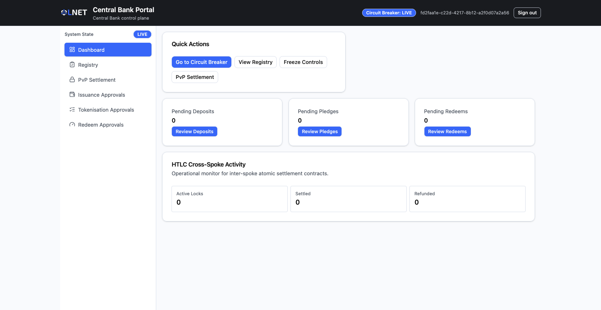
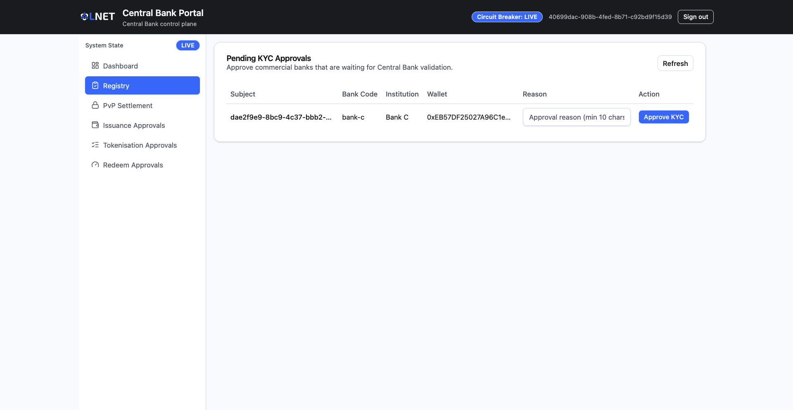
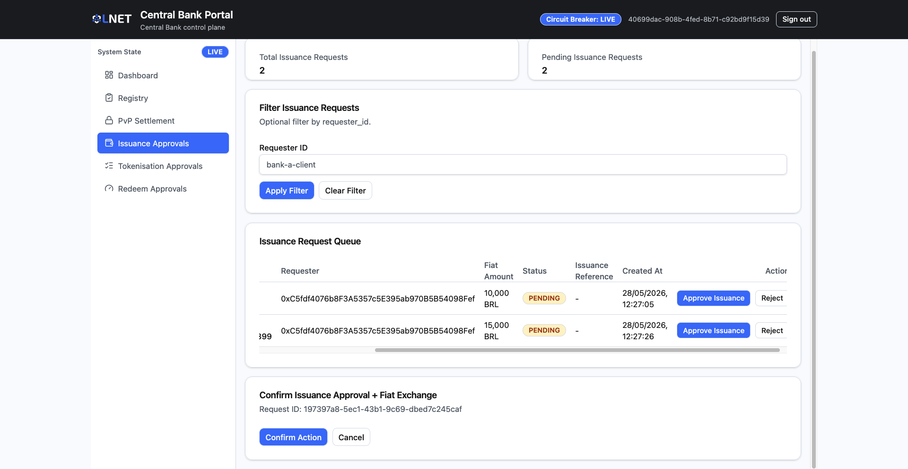
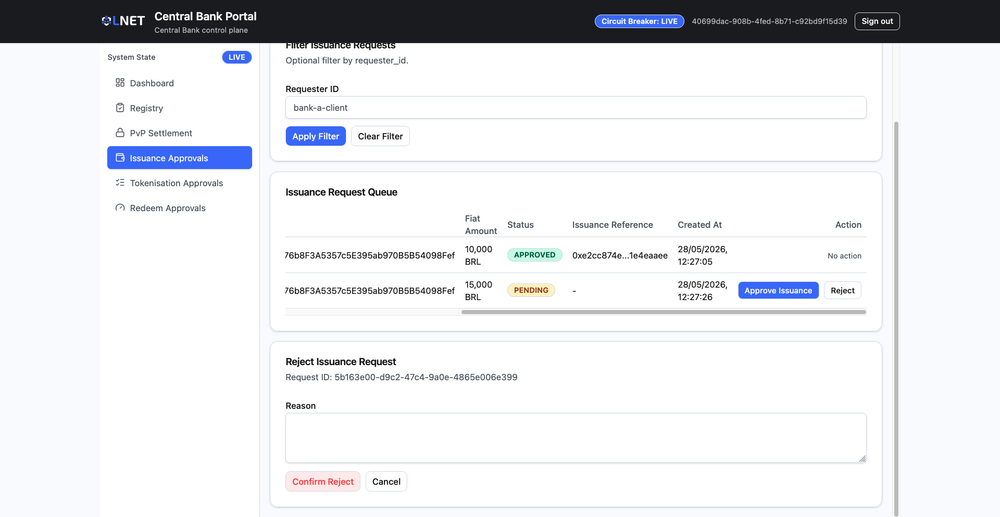
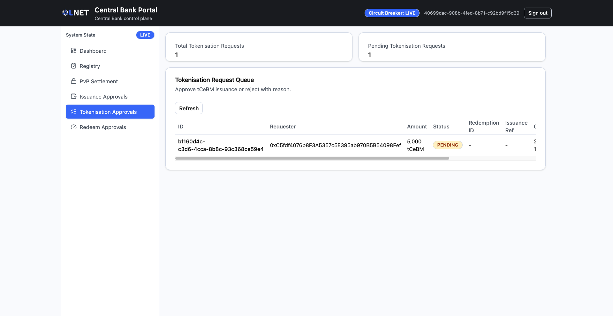

# Treasury Portal — Operator Guide

This guide covers the complete day-to-day operation of the **Treasury Portal**: approving Onboarding registrations, managing currency issuance and redemption approvals, and monitoring cross-border settlements.

---

## Table of Contents

1. [Overview](#1-overview)
2. [Prerequisites](#2-prerequisites)
3. [Access and Login](#3-access-and-login)
4. [Dashboard](#4-dashboard)
5. [Registry](#5-registry)
6. [Issuance Approvals](#6-issuance-approvals)
7. [Tokenisation Approvals](#7-tokenisation-approvals)
8. [Redeem Approvals](#8-redeem-approvals)
9. [PvP Settlement Monitor](#9-pvp-settlement-monitor)
10. [Status Reference](#10-status-reference)
11. [Troubleshooting](#11-troubleshooting)

---

## 1. Overview

The Treasury Portal is the **Central Bank's operational control plane** for a CBWeb3 spoke. Treasury operators review and approve all actions that require Central Bank authority: onboarding new participants, issuing digital currency, converting reserves, and redeeming tokens back to fiat.

| Actor | Portal | Role |
|---|---|---|
| Central Bank Treasury Operator | Treasury Portal | Reviews and approves Onboarding, issuance, tokenisation, and redemption requests |

### Participant Status Lifecycle

```
NONE → PENDING → CREDENTIAL_REQUESTED → ONBOARDING_APPROVED → ACTIVE
                                                     ↘ REJECTED / REVOKED / FROZEN
```

### Currency Flow

```
Fiat Deposit Request → Issuance Approval (mint tokenized fiat) → Tokenisation Approval (burn tokenized fiat → mint tCeBM) → tCeBM in circulation
tCeBM Redemption Request → Redeem Approval → tCeBM burned → Fiat released
```

> **Design note — Burn-to-Mint simulation model**
>
> CBWeb3 operates in a **simulation environment** where real fiat currency does not exist on-chain. To faithfully replicate a real CBDC lifecycle, the platform uses a two-token model:
>
> 1. **Tokenized fiat** is minted by the Central Bank upon an issuance request. It represents fiat collateral within the simulation — a stand-in for the real-world deposit that a commercial bank would make with the Central Bank.
> 2. **tCeBM (tokenized Central Bank Money)** is the actual CBDC token. It is only ever created by **burning** the tokenized fiat in a single atomic operation, ensuring a 1:1 backing ratio is maintained at all times.
>
> This burn-to-mint design was adopted at project inception to make the simulation as faithful as possible to a real issuance flow, without requiring actual fiat settlement infrastructure.

---

## 2. Prerequisites

> **Initial test environment:** For the initial testing phase, credentials and access URLs will be provided by the system administrator. The test setup consists of **2 spokes**, each containing three institutions: one Central Bank, one Commercial Bank, and one Financial Correspondent.

Before accessing the portal:

- The spoke infrastructure must be running (Central Bank node containers are up).
- The treasury operator has received a **username** (e.g., `central-bank-a-client`) and **password** from the system administrator.
- The operator has been provided with the **dispatcher URL** — the single entry point that automatically routes each user to the correct portal based on their credentials.

---

## 3. Access and Login

Open the **dispatcher URL** in your browser. Enter your credentials and the dispatcher will automatically redirect you to the Treasury Portal.

> 

| Field | Description |
|---|---|
| **Username** | Your operator username (e.g., `central-bank-a-client`). |
| **Password** | Your operator password. |

Click **Sign in**. On success, you are redirected to the Dashboard.

> **Session note:** Session credentials are stored in memory only and are not persisted across browser tabs. If you open the portal in a new tab, you will be prompted to log in again.

---

## 4. Dashboard

**Route:** `/`

The Dashboard is the landing page after login. It provides a real-time summary of all pending work items and recent network activity.

> 

### Summary Cards

Three cards display the count of pending requests awaiting your attention:

| Card | Description | Action |
|---|---|---|
| **Pending Deposits** | Number of tokenized fiat issuance requests submitted by commercial banks and awaiting approval. | Click **Review Deposits** to go to the Issuance Approvals page. |
| **Pending Pledges** | Number of burn-to-mint (tokenisation) requests awaiting approval. | Click **Review Pledges** to go to the Tokenisation Approvals page. |
| **Pending Redeems** | Number of redemption requests awaiting approval. | Click **Review Redeems** to go to the Redeem Approvals page. |

> A non-zero count on any card indicates pending work. Requests should be reviewed promptly.

### HTLC Activity Panel

Displays a summary of cross-border atomic settlement contracts currently tracked by the system:

| Metric | Description |
|---|---|
| **Active Locks** | Contracts in the Pending Settlement or Processing state. |
| **Settled** | Contracts that have been successfully completed. |
| **Refunded** | Contracts whose timelock expired and whose funds were returned to the sender. |

### Quick Actions

A set of direct navigation links to the most frequently used sections:

| Link | Destination |
|---|---|
| **Registry** | Participant registry and Onboarding approvals. |
| **PvP Settlement** | Cross-border settlement monitor. |

---

## 5. Registry

**Route:** `/registry`

The Registry page displays the **Pending Onboarding Approvals** queue — commercial banks that have submitted an onboarding request and are waiting for Central Bank validation.

> 

| Column | Description |
|---|---|
| **Subject** | Unique user identifier of the bank's operator account. |
| **Bank Code** | The bank code submitted by the bank during onboarding. |
| **Institution** | The institution name submitted during onboarding. |
| **Wallet** | The EVM wallet address provisioned for this institution. |
| **Reason** | Text input field — you must provide a justification before approving. |
| **Action** | The **Approve Onboarding** button. |

The table auto-refreshes every **15 seconds**. Click **Refresh** at any time to manually poll for new entries.

#### How to Approve a Onboarding Request

1. Locate the bank's row in the **Pending Onboarding Approvals** table.
2. In the **Reason** column, type the approval justification. The reason must be **at least 10 characters** long.
3. Click **Approve Onboarding**.

On success, the row disappears from the pending table and the participant becomes `ACTIVE` in the system.

> If the **Reason** field is left blank or is too short, the button click will be rejected with an inline validation error. Provide a valid reason and retry.

---

## 6. Issuance Approvals

**Route:** `/deposits-approval`

Commercial banks submit issuance requests when they need the Central Bank to mint **tokenized fiat** — a simulated fiat currency used as collateral within the platform. This is the first step in the burn-to-mint model: tokenized fiat is not yet CBDC; it will later be burned to generate tCeBM. This page is where those requests are reviewed and approved.

> 

### Summary Cards

| Card | Description |
|---|---|
| **Total Requests** | Total number of issuance requests received (all statuses). |
| **Pending Requests** | Number of requests awaiting your action. |

### Filter

Use the **Requester ID** input to filter the table to a specific commercial bank's requests. Click **Apply** to filter, **Clear** to reset.

### Requests Table

| Column | Description |
|---|---|
| **ID** | Unique identifier for the issuance request. |
| **Requester** | The commercial bank's operator identity. |
| **Fiat Amount** | The fiat collateral amount backing the issuance request. |
| **Status** | Current request status (see [Status Reference](#10-status-reference)). |
| **Issuance Ref** | On-chain transaction hash of the token mint (populated after approval). |
| **Created At** | Timestamp of when the request was submitted. |
| **Action** | Available actions based on the current status. |

### Actions

#### Approve Issuance

Available for rows with status `PENDING`.

1. Click **Approve Issuance** in the row's Action column.
2. A confirmation modal appears showing the Request ID. Verify the details.
3. Click **Confirm** to proceed.

> 

On success, the status changes to `APPROVED` and the **Issuance Ref** column is populated with the on-chain mint transaction hash.

#### Reject

Available for rows with status `PENDING`.

1. Click **Reject** in the row's Action column.
2. A rejection modal appears. Type a reason in the text area (minimum 3 characters).
3. Click **Confirm Rejection**.

> 

On success, the status changes to `REJECTED`.

#### Retry Mint

Available for rows with status `MINT_FAILED`. This re-attempts the on-chain token minting operation without requiring a new approval.

1. Click **Retry Mint** in the row's Action column.
2. Confirm the retry in the dialog.

---

## 7. Tokenisation Approvals

**Route:** `/escrows-approval`

After an issuance request is approved (tokenized fiat minted), the commercial bank submits a **tokenisation request** (also called a pledge) to execute the **burn-to-mint** operation: the tokenized fiat is burned and tCeBM (CBDC) is minted to the bank's wallet in its place. This page manages those requests.

> 

### Summary Cards

| Card | Description |
|---|---|
| **Total Requests** | Total tokenisation requests received. |
| **Pending Requests** | Requests awaiting approval. |

### Requests Table

| Column | Description |
|---|---|
| **ID** | Unique identifier for the tokenisation request. |
| **Requester** | The commercial bank's operator identity. |
| **Amount (tCeBM)** | The amount of tCeBM to be minted. |
| **Status** | Current request status. |
| **Redemption ID** | Transaction hash of the burn operation (populated after approval). |
| **Issuance Ref** | Transaction hash of the mint operation (populated after approval). |
| **Created At** | Submission timestamp. |
| **Action** | Available actions. |

### Actions

#### Approve

Triggers the **burn-to-mint** operation: the tokenized fiat held in escrow is burned and an equivalent amount of tCeBM (CBDC) is minted to the commercial bank's wallet.

1. Click **Approve** for the target request.
2. Confirm in the approval modal.

#### Reject

1. Click **Reject** for the target request.
2. Type a mandatory reason (minimum 3 characters) in the rejection modal.
3. Click **Confirm Rejection**.

---

## 8. Redeem Approvals

**Route:** `/redeems-approval`

When a commercial bank wants to convert tCeBM back to fiat reserves, it submits a redemption request. This page is where those requests are reviewed and the fiat release is authorized.

> 

### Summary Cards

| Card | Description |
|---|---|
| **Total Redeems** | Total redemption requests received. |
| **Pending Redeems** | Requests awaiting approval. |

### Requests Table

| Column | Description |
|---|---|
| **ID** | Unique identifier for the redemption request. |
| **Requester** | The commercial bank's operator identity. |
| **Amount (tCeBM)** | The amount of tCeBM to be redeemed. |
| **Status** | Current request status. |
| **Zeto Transfer Tx Hash** | Transaction hash of the privacy-preserving token transfer executed by the proxy (populated by the system). |
| **Redemption ID** | Transaction hash of the fiat mint/release (populated after approval). |
| **Created At** | Submission timestamp. |
| **Action** | Available actions. |

### Actions

#### Approve

Authorises the fiat release and completes the redemption cycle.

1. Click **Approve** for the target request.
2. Confirm in the approval modal.

#### Reject

1. Click **Reject** for the target request.
2. Provide a mandatory reason in the rejection modal.
3. Click **Confirm Rejection**.

---

## 9. PvP Settlement Monitor

**Route:** `/htlc-monitor`

This page provides a **read-only** view of all cross-border atomic settlement contracts (Hash Time Lock Contracts — HTLCs) currently tracked by the system. No approval actions are available here; it is used for monitoring and auditing purposes.

> 

### Filters

| Filter | Description |
|---|---|
| **State** | Dropdown to filter by contract state: All, Pending Settlement, Processing, Settled, Revoking, Revoked. |
| **Agreement ID** | Text input to search for contracts linked to a specific FX agreement. |

Click **Search** to apply filters.

### Contracts Table

| Column | Description |
|---|---|
| **Contract ID** | Unique identifier for the HTLC contract. |
| **Sender** | The Paladin identity of the initiating commercial bank. |
| **Receiver** | The Paladin identity of the receiving commercial bank. |
| **State** | Current contract state (see [Status Reference](#10-status-reference)). |
| **Expiry** | The timestamp after which the contract can be revoked if not settled. |
| **Action** | **View details** button. |

### Contract Detail Modal

Click **View details** on any row to open the detail modal.

> 

| Field | Description |
|---|---|
| **Sender** | Initiating bank's Paladin identity. |
| **Receiver** | Receiving bank's Paladin identity. |
| **Settlement Code** | The hash lock used to secure the atomic swap. |
| **Expiry** | Settlement window expiry timestamp. |
| **State** | Current contract state. |
| **Settlement Reference** | On-chain reference of the completed settlement transaction (populated after settlement). |
| **Completion Code** | The secret pre-image (restricted — first 8 characters shown). |

---

## 10. Status Reference

### Participant Statuses

| Status | Meaning |
|---|---|
| `NONE` | No onboarding request exists for this account. |
| `PENDING` | Onboarding request submitted; awaiting Central Bank Onboarding review. |
| `CREDENTIAL_REQUESTED` | System is internally requesting the PKI credential. |
| `ONBOARDING_APPROVED` | Central Bank approved the Onboarding; final activation is in progress. |
| `ACTIVE` | Institution is fully onboarded and operational. |
| `REJECTED` | Central Bank rejected the onboarding request. |
| `REVOKED` | Institution's access was revoked after activation. |
| `FROZEN` | Institution's account was frozen by the Central Bank treasury team. |

### Issuance / Tokenisation / Redeem Request Statuses

| Status | Meaning |
|---|---|
| `PENDING` | Request submitted; awaiting treasury approval. |
| `APPROVED` | Request approved; on-chain operation in progress or complete. |
| `REJECTED` | Request rejected by the treasury operator. |
| `MINT_FAILED` | Approval was granted but the on-chain mint transaction failed. Use **Retry Mint**. |

### HTLC Contract States

| State | Meaning |
|---|---|
| `PENDING_SETTLEMENT` | Contract is locked; waiting for the receiver to complete the settlement. |
| `PROCESSING` | Settlement or revocation is being processed on-chain. |
| `SETTLED` | Atomic swap completed successfully; funds delivered to receiver. |
| `REVOKING` | Timelock expired; revocation in progress. |
| `REVOKED` | Funds returned to the sender after settlement window expiry. |

---

## 11. Troubleshooting

### Login fails with "unauthorized"

- Verify the username and password are correct.
- Confirm the treasury operator account exists and has not been deactivated.
- Confirm the spoke backend services are running (`make spoke-up` or check `docker compose ps`).

### Pending Onboarding table is empty

- Click **Refresh** to force a manual poll.
- Confirm the commercial bank has completed Step 2 of the Onboarding Wizard and the wizard shows Step 3 (Onboarding Approval) with a valid Request ID.

### Issuance or redeem approval fails

- Check that the backend API gateway is reachable.
- Look for a toast error message in the top-right corner of the screen — it usually contains the root cause.
- If the on-chain mint fails (`MINT_FAILED`), use the **Retry Mint** action rather than re-approving.

### Status does not update after approval

- Wait a few seconds for the on-chain transaction to confirm.
- Click the manual **Refresh** button if the page has not auto-refreshed.
