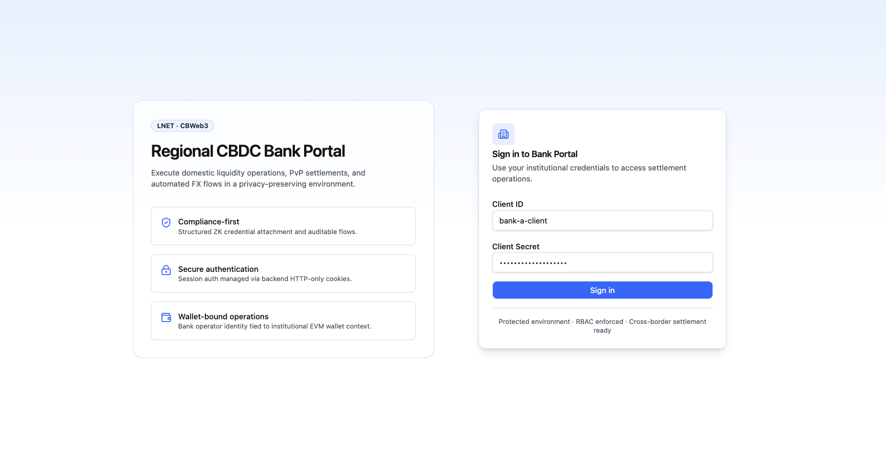
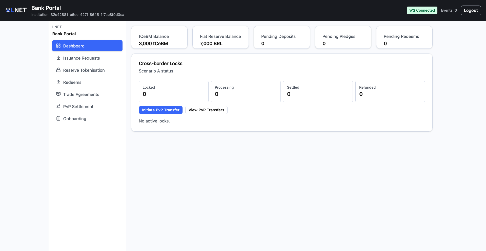
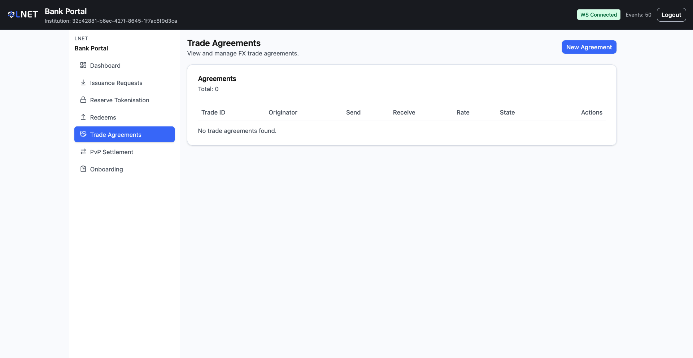
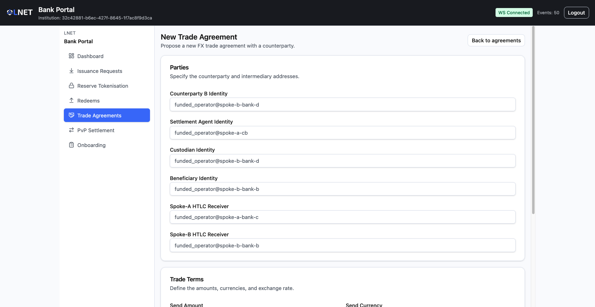
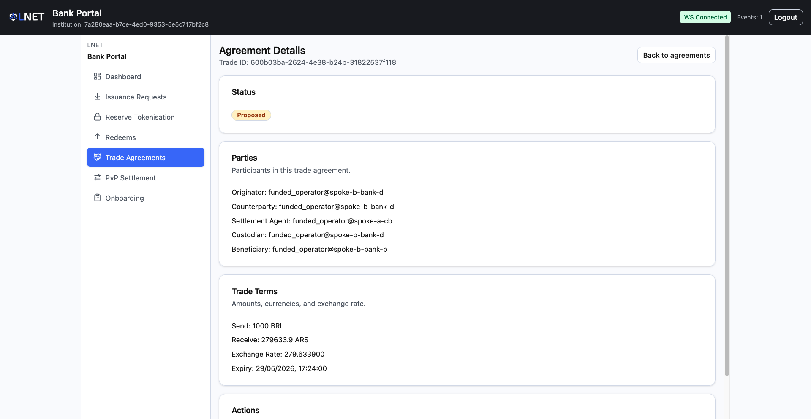
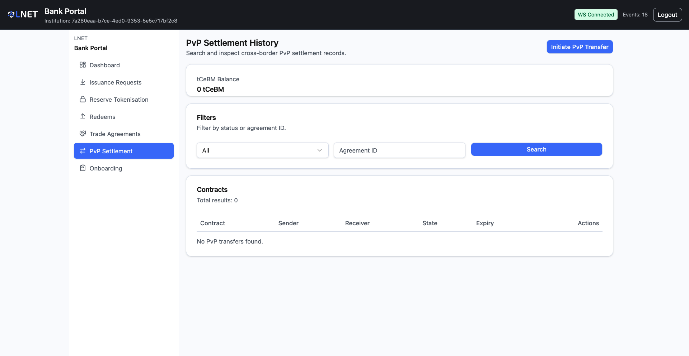
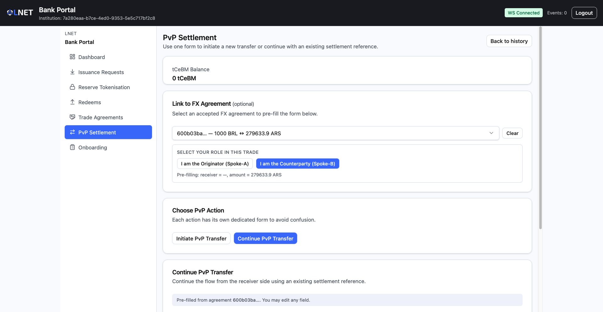
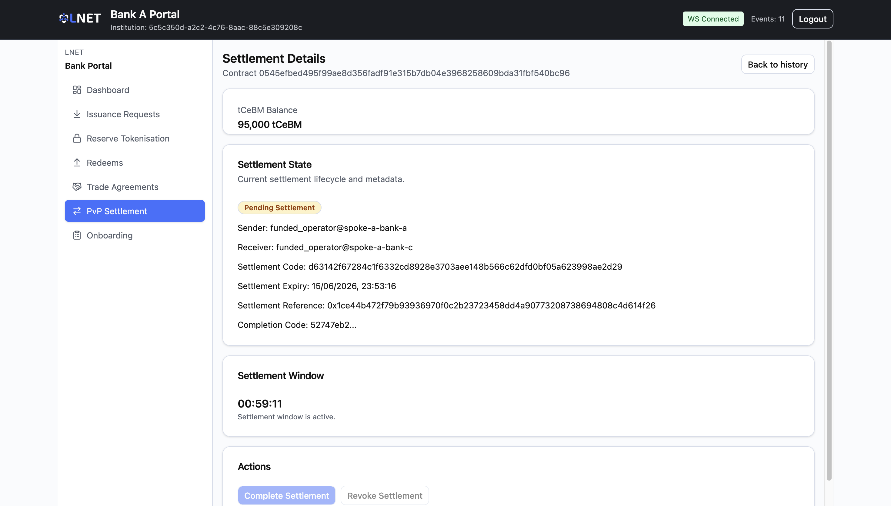

# Bank Portal — User Manual (Scenario A)

**Audience:** Commercial bank operators participating in a CBWeb3 spoke.
**Data source:** Live backend (real API Gateway).
**Scenario:** Enhanced Correspondent Banking — dual-layer HTLC PvP settlement.

---

## Overview

The Bank Portal is the day-to-day operational interface for a commercial bank in
**Scenario A — Enhanced Correspondent Banking**. Through it you manage the full
digital-currency lifecycle:

- Obtain tCeBM (tokenised Central Bank Money) by requesting issuance from the Central Bank.
- Convert approved fiat reserves into on-chain tCeBM tokens (reserve tokenisation).
- Redeem tCeBM back to fiat reserves when no longer needed for settlement.
- Propose and accept FX trade agreements with counterparty banks on other spokes.
- Execute atomic PvP (Payment vs. Payment) cross-border settlements using Hash Time Lock Contracts (HTLCs).

| Actor | Portal | Role |
|---|---|---|
| Commercial Bank Operator | Bank Portal | Manages balances, requests issuance/redemption, runs FX trades and PvP settlements |

---

## Access & Login

**URL:** The Bank Portal URL provided by your system administrator (e.g., `http://localhost:5173` in a local deployment).

**Credentials:** A **Client ID** and **Client Secret** issued by the Central Bank operator. The Client ID is in UUID format.



### Signing in

1. Open the Bank Portal URL in your browser.
2. Enter your **Client ID** and **Client Secret**.
3. Click **Sign in**.

On success you are redirected to the Dashboard. A "Welcome back" toast appears in the top-right corner.

> **First login / new institution:** If you see an "unauthorized" error immediately after entering correct credentials, your institution may not yet be fully onboarded. Complete the Onboarding flow first (see [Onboarding](#onboarding-onboarding)).

**Session management:** Authentication is handled via backend HTTP-only cookies. The session is tied to your institutional EVM wallet context.

---

## Navigation

The left-hand sidebar exposes the following pages. All items below are active in the current build.

| Sidebar label | Route | Purpose |
|---|---|---|
| Dashboard | `/` | Balances, pending counts, recent HTLC activity |
| Issuance Requests | `/deposits` | Request tCeBM issuance from the Central Bank |
| Reserve Tokenisation | `/escrows` | Convert approved fiat reserves into tCeBM |
| Redeems | `/redeems` | Redeem tCeBM back to fiat reserves |
| Trade Agreements | `/agreements` | Manage FX agreements with counterparty banks |
| PvP Settlement | `/htlc` | Initiate and track atomic cross-border HTLC transfers |
| Onboarding | `/onboarding` | Register a new institution with the Central Bank |

**Not available in this build (Scenario A):** Liquidity Transfers, AMM Trading, Compliance Center, and Settings are present in the codebase but are not exposed in the sidebar for Scenario A. Do not attempt to access them directly.

---

## Screens

### Dashboard (`/`)

The Dashboard provides a real-time snapshot of the institution's financial position and active settlement contracts. Data is fetched from the live backend each time the page loads.



#### Balance widgets

| Widget | Description |
|---|---|
| **tCeBM Balance** | Current tCeBM token balance held by the institution's EVM wallet. |
| **Fiat Reserve Balance** | Current fiat reserve balance registered in the spoke. |

#### Pending transaction counters

| Counter | What it counts | Where to act |
|---|---|---|
| **Pending Deposits** | Issuance requests awaiting Central Bank approval. | Issuance Requests (`/deposits`) |
| **Pending Pledges** | Reserve tokenisation requests awaiting approval. | Reserve Tokenisation (`/escrows`) |
| **Pending Redeems** | Redemption requests awaiting approval. | Redeems (`/redeems`) |

#### Cross-Border Locks

A summary card shows HTLC contract counts by lifecycle state:

| Counter | Corresponding HTLC state |
|---|---|
| **Locked** | `HTLC_STATE_LOCKED` — contract active, awaiting counterparty claim |
| **Processing** | `HTLC_STATE_SETTLING` or `HTLC_STATE_REFUNDING` — on-chain operation in progress |
| **Settled** | `HTLC_STATE_SETTLED` — atomic swap completed |
| **Refunded** | `HTLC_STATE_REFUNDED` — funds returned after expiry |

Below the counters, the 5 most recent HTLC contracts are listed with their Contract ID, receiver identity, and state badge. Two quick-action buttons are available: **Initiate PvP Transfer** (goes to `/htlc/new`) and **View PvP Transfers** (goes to `/htlc`).

---

### Onboarding (`/onboarding`)

Before using any operational features, a new commercial bank must complete the onboarding process. This registers the institution with the Central Bank and provisions an EVM wallet.

The wizard progresses through four stages:

```
1. Operator Confirmation  →  2. Institution Form  →  3. Pending Approval  →  4. Complete
```

#### Stage 1: Operator Confirmation

The screen displays your current Operator ID. Verify it matches your institutional account and click **Start Onboarding**.

#### Stage 2: Institution Form

Fill in your institution's registration details.

| Field | Constraints |
|---|---|
| **Institution Name** | Minimum 2 characters |
| **Bank Code** | 1–8 characters; lowercase letters (`a–z`), digits (`0–9`), or hyphens (`-`) only |
| **Country** | ISO 3166-1 alpha-2 code (e.g., `BR`); exactly 2 characters |
| **Role** | Select `Commercial Bank` or `Treasury Bank` |
| **Username** | Minimum 3 characters; lowercase letters, digits, underscores, or hyphens only |
| **Email** | Valid email address |

Click **Submit Onboarding Request**. Inline validation errors appear below each field if constraints are violated.

#### Stage 3: Pending Approval

The request enters `PENDING` state. The portal polls the backend every **5 seconds** automatically; you can also click **Refresh status** manually.

| Element shown | Description |
|---|---|
| Status badge | `PENDING`, `CREDENTIAL_REQUESTED`, or `APPROVED` |
| Request ID | Keep this for reference in communications with the Central Bank |
| Wallet | EVM wallet address (may show `—` until the Central Bank processes the request) |
| Elapsed | Time since submission |

> Keep this browser tab open while waiting. The wizard will automatically advance when the Central Bank acts.

A **Central Bank Governance operator** must log into the Governance Portal, navigate to the Registry, and click **Approve Onboarding** for your pending request. They must provide a reason of at least 10 characters.

#### Stage 4: Completion

Once approved, the portal finalises onboarding: it exchanges the approval for a PKI credential and activates the institution account on-chain.

The completion screen shows:
- **Wallet Address** — the EVM wallet permanently associated with this institution.
- **Transaction Hash** — the on-chain activation transaction.
- **PKI login badge** — `PKI login validated` or `PKI login pending`.

After completion, all other portal features become available.

#### Onboarding status reference

| Status | Meaning |
|---|---|
| `NONE` | No request submitted; wizard starts at Stage 1 |
| `PENDING` | Submitted and awaiting Central Bank review |
| `CREDENTIAL_REQUESTED` | System is internally requesting the PKI credential (shown as Pending to the operator) |
| `ONBOARDING_APPROVED` | Central Bank approved; final activation in progress |
| `ACTIVE` | Fully onboarded; all features accessible |
| `REJECTED` | Central Bank rejected the request; contact governance support |
| `REVOKED` | Access revoked after activation; contact governance support |
| `FROZEN` | Account frozen by Central Bank governance; contact governance support |

---

### Issuance Requests (`/deposits`)

Use this page to request the Central Bank to **issue tCeBM** against your institution's fiat collateral. Tokens are only minted after the Central Bank approves the request.


#### Balance widgets

The page displays your current **tCeBM Balance**, **Fiat Reserve Balance**, and the count of **Pending Issuance Requests**.

#### Submitting an issuance request

1. Enter the **fiat amount** in the amount field. Must be a **positive whole number** (decimals are not accepted).
2. Click **Review Issuance Request** to trigger client-side validation.
3. A confirmation card appears showing the formatted amount.
4. Click **Confirm Request** to submit to the Central Bank.

A success toast displays the new request ID. The request appears in the table with status `PENDING`.

Use the **Refresh** button to reload the table at any time (the page does not auto-refresh).

#### Issuance Requests table

| Column | Description |
|---|---|
| **ID** | Unique identifier for the request |
| **Fiat Amount** | The fiat amount submitted |
| **Status** | Current status (see [Status Reference](#status-reference)) |
| **Issuance Reference** | On-chain mint transaction hash (truncated; hover for full value) — populated after approval |
| **Rejection Reason** | Central Bank's reason if the request was rejected |
| **Created At** | Submission timestamp |

---

### Reserve Tokenisation (`/escrows`)

After a deposit request reaches `APPROVED` status, use this page to **convert the approved fiat reserve into tCeBM tokens** (a tokenisation request, also called a pledge). The Central Bank executes a burn-and-mint operation on approval: old fiat-backed tokens are burned and new tCeBM is minted to your institution's wallet.

> Only submit a tokenisation request after a Deposit has been approved. Submitting without a corresponding approved deposit will be rejected.


#### Submitting a tokenisation request

1. Enter the **tCeBM amount** in the amount field. Must be a positive whole number.
2. Click **Review Tokenisation Request**.
3. Review the confirmation card and click **Confirm Request**.

#### Reserve Tokenisation Requests table

| Column | Description |
|---|---|
| **ID** | Unique identifier |
| **Amount** | tCeBM amount requested |
| **Status** | Current status |
| **Redemption ID** | Burn transaction hash (populated after approval) |
| **Issuance Ref** | Mint transaction hash (populated after approval) |
| **Rejection Reason** | Central Bank's reason if rejected |
| **Created At** | Submission timestamp |

---

### Redeems (`/redeems`)

Use this page to **convert tCeBM back to fiat reserves**. The system automatically executes a Zeto (privacy-preserving) token transfer before forwarding the request to the Central Bank for fiat release approval.


#### Submitting a redemption request

1. Enter the **tCeBM amount** to redeem. Must be a positive whole number.
2. Click **Review Redeem Request**.
3. Review the confirmation card (the Central Bank fiat release approval message is shown).
4. Click **Confirm Request** to submit.

The system executes the Zeto transfer automatically. Monitor the status column for progress.

#### Redeem Requests table

| Column | Description |
|---|---|
| **ID** | Unique identifier |
| **Amount** | tCeBM amount redeemed |
| **Status** | Current status |
| **Zeto Transfer Tx Hash** | Privacy-preserving token transfer hash (populated by the system automatically) |
| **Redemption ID** | Fiat release transaction hash (populated after Central Bank approval) |
| **Rejection Reason** | Central Bank's reason if rejected |
| **Created At** | Submission timestamp |

---

### Trade Agreements

#### Agreement Inbox (`/agreements`)

Lists all FX trade agreements associated with your institution, both proposed by you and received from counterparties.



| Column | Description |
|---|---|
| **Trade ID** | Unique identifier (truncated; click to open detail) |
| **Originator** | Institution that proposed the agreement |
| **Send** | Amount and currency the originator sends |
| **Receive** | Amount and currency the originator receives |
| **Rate** | Auto-calculated exchange rate |
| **State** | Current agreement state (see [Status Reference](#status-reference)) |
| **Actions** | View button — opens the Agreement Detail page |

Click any row or the **View** button to open the detail. Click **New Agreement** (top right) to create a proposal.

---

#### Propose Agreement (`/agreements/new`)

Use this page to propose a new FX trade agreement with a counterparty on another spoke.



> **Paladin Identity format:** Several fields require a Paladin Identity — the network-level identifier for a participant node. The format is:
>
> `funded_operator@<spoke>-<entity>`
>
> Examples for the standard test environment:
>
> | Institution | Paladin Identity |
> |---|---|
> | Central Bank — Spoke A | `funded_operator@spoke-a-cb` |
> | Commercial Bank A — Spoke A | `funded_operator@spoke-a-bank-a` |
> | Financial Correspondent — Spoke A | `funded_operator@spoke-a-bank-c` |
> | Central Bank — Spoke B | `funded_operator@spoke-b-cb` |
> | Commercial Bank B — Spoke B | `funded_operator@spoke-b-bank-b` |
> | Financial Correspondent — Spoke B | `funded_operator@spoke-b-bank-d` |
>
> Contact your system administrator if you are unsure of the correct identity for a counterparty.

**Parties section** (all fields required except HTLC receivers):

| Field | Description |
|---|---|
| **Counterparty B Identity** | Paladin identity of the receiving institution |
| **Settlement Agent Identity** | Paladin identity of the settlement intermediary |
| **Custodian Identity** | Paladin identity of the custodian |
| **Beneficiary Identity** | Paladin identity of the end beneficiary |
| **Spoke-A HTLC Receiver** | (Optional) HTLC receiver identity on the originating spoke — used to auto-fill the PvP form |
| **Spoke-B HTLC Receiver** | (Optional) HTLC receiver identity on the counterparty spoke — used to auto-fill the PvP form |

**Trade Terms section:**

| Field | Description |
|---|---|
| **Send Amount** | The amount your institution will transfer |
| **Send Currency** | Currency of the send leg (BRL, EUR, ARS, CLP, MXN, USD) |
| **Receive Amount** | The amount your institution expects to receive |
| **Receive Currency** | Currency of the receive leg |
| **Exchange Rate** | Auto-calculated from the two amounts (read-only; displayed as "1 {send} = {rate} {receive}") |
| **Expiry Date** | Date and time after which the agreement can no longer be settled — must be at least 5 minutes in the future |

After filling all required fields:

1. Click **Review Agreement** — client-side validation runs; inline errors appear for any invalid fields.
2. A confirmation card shows all parties and trade terms.
3. Click **Confirm Proposal** to submit.

On success, you are navigated to the Agreement Detail page for the new agreement, which is now in `PROPOSED` state.

---

#### Agreement Detail (`/agreements/:tradeId`)

Opened by clicking any agreement row in the inbox or after creating a proposal.



The page shows three sections:

- **Status** — current state badge.
- **Parties** — Originator, Counterparty, Settlement Agent, Custodian, Beneficiary.
- **Trade Terms** — Send/Receive amounts and currencies, exchange rate, expiry timestamp.

**Available actions by state:**

| Agreement state | Available buttons |
|---|---|
| `PROPOSED` | **Accept**, **Reject**, **Cancel** |
| `ACCEPTED` | **Initiate PvP Transfer**, **Continue PvP Transfer** |
| All other states | No actions available |

> Note: All three actions (Accept, Reject, Cancel) are available on a `PROPOSED` agreement regardless of whether your institution is the originator or the counterparty. A confirmation dialog always appears before executing.

- **Accept** — Moves the agreement to `ACCEPTED`; it is now ready for PvP settlement.
- **Reject** — Declines the proposal. Moves to `REJECTED`. Irreversible.
- **Cancel** — Cancels the proposal. Moves to `CANCELLED`. Irreversible.
- **Initiate PvP Transfer** — Navigates to `/htlc/new` pre-filled with your role as Originator (Spoke-A). The agreement ID and receiver are auto-populated from the `Spoke-A HTLC Receiver` field.
- **Continue PvP Transfer** — Navigates to `/htlc/new` pre-filled with your role as Counterparty (Spoke-B). The agreement ID and receiver are auto-populated from the `Spoke-B HTLC Receiver` field.

---

### PvP Settlement (HTLC)

PvP (Payment vs. Payment) settlements use **Hash Time Lock Contracts (HTLCs)** to perform atomic cross-border transfers. Either both legs complete or neither does — partial settlement is not possible.

#### How the two-leg process works

1. **Originator (Spoke-A):** Locks tCeBM in an HTLC with a hash lock and optional timelock. A Settlement Code is generated.
2. **Counterparty (Spoke-B):** Uses the Settlement Code to lock their tCeBM on their spoke.
3. **Settlement:** Once both locks are in place, the originator completes the settlement, which atomically delivers funds to both receivers.
4. **If the settlement window expires:** Either party can revoke their lock to recover their funds.

---

#### Settlement History (`/htlc`)

Lists all HTLC contracts linked to your institution.



**Filters:**

| Filter | Options |
|---|---|
| **Status** | All, Pending Settlement (LOCKED), Processing (SETTLING), Settled, Revoking (REFUNDING), Revoked (REFUNDED) |
| **Agreement ID** | Free-text search for contracts linked to a specific trade agreement |

Click **Search** to apply filters. The table shows total matching results.

**Contracts table:**

| Column | Description |
|---|---|
| **Contract** | HTLC contract ID |
| **Sender** | Paladin identity of the initiating institution |
| **Receiver** | Paladin identity of the receiving institution |
| **State** | Current contract state badge |
| **Expiry** | Settlement window expiry timestamp |
| **Actions** | **View** button — opens the Settlement Detail page |

The **Initiate PvP Transfer** button (top right) navigates to `/htlc/new`.

---

#### New Transfer (`/htlc/new`)

This single page handles both roles in a PvP settlement. Use the **Choose PvP Action** selector to switch between the two modes.




##### Optional: Link to an FX Agreement

At the top of the page, select an accepted FX agreement from the dropdown. Then select your role (**I am the Originator (Spoke-A)** or **I am the Counterparty (Spoke-B)**). The form below is auto-filled with the receiver identity and amount from the agreement. You can still edit any field.

##### Mode 1: Initiate PvP Transfer (you are Originator / Spoke-A)

Use this mode when your institution is locking funds first.

| Field | Required | Description |
|---|---|---|
| **Agreement ID** | No | FX trade agreement ID this settlement is linked to (alphanumeric, hyphens, underscores; max 64 chars) |
| **Receiver (Paladin identity)** | Yes | The Paladin identity of the receiving institution on your spoke |
| **Amount (tCeBM)** | Yes | Positive integer; amount to lock in the HTLC |
| **Timelock Duration** | No | No explicit timelock, 1 hour, 6 hours, 24 hours, or a custom date/time. Must be at least 5 minutes in the future. If not set, the backend applies its default. |

Steps:
1. Fill in all required fields.
2. Click **Review PvP Transfer** — validation runs.
3. A confirmation card shows Agreement ID, Receiver, Amount, and Timelock.
4. Click **Confirm PvP Transfer**.

On success, you are navigated to the Settlement Detail page. A **Settlement Code** (hash lock) is generated automatically. You must share this 64-character hex code with the counterparty institution so they can lock funds on their spoke.

##### Mode 2: Continue PvP Transfer (you are Counterparty / Spoke-B)

Use this mode when the originator has already locked funds and has sent you the Settlement Code.

| Field | Required | Description |
|---|---|---|
| **Settlement Code** | Yes | The 64-character hexadecimal hash received from the originating institution (with or without `0x` prefix) |
| **Receiver (Paladin identity)** | Yes | The Paladin identity that will receive tCeBM on your spoke |
| **Amount (tCeBM)** | Yes | Positive integer; the amount specified for the counterparty leg |
| **Agreement ID** | No | Optional: the FX agreement ID |

Steps:
1. Enter the Settlement Code exactly as received from the originator.
2. Fill in the Receiver identity and Amount.
3. Click **Review PvP Continuation**.
4. Confirm the details and click **Confirm PvP Continuation**.

On success, you are navigated to the Settlement Detail page for the new contract.

---

#### Settlement Detail (`/htlc/:contractId`)

Opened by clicking **View** on any row in the Settlement History, or navigated to automatically after creating a new transfer.



The page auto-polls the backend every **5 seconds** while the contract is in an active state (`LOCKED`, `SETTLING`, `REFUNDING`). Polling stops automatically once the contract reaches `SETTLED` or `REFUNDED`.

**Settlement State card:**

| Field | Description |
|---|---|
| **Status badge** | Current contract state |
| **Sender** | Initiating institution's Paladin identity |
| **Receiver** | Receiving institution's Paladin identity |
| **Settlement Code** | The hash lock securing the atomic swap |
| **Settlement Expiry** | Timestamp after which the settlement window closes |
| **Settlement Reference** | On-chain Zeto lock reference (populated after settlement completes) |
| **Completion Code** | The pre-image secret (first 8 characters shown when available; "not available" while waiting for the counterparty) |

**Settlement Window card** (only shown while contract is `LOCKED`):

A live countdown shows time remaining. When expired: "Settlement window has expired. Revocation is available."

**Actions:**

| Button | When enabled | What it does |
|---|---|---|
| **Complete Settlement** | Contract is `LOCKED`, the Completion Code is available, **and** the counterparty has also locked funds (`counterparty_locked = true`) | Finalises the atomic swap. Delivers tCeBM to both receivers. **Irreversible.** |
| **Revoke Settlement** | Contract is `LOCKED` and the settlement window has expired | Returns the locked funds to the sender. **Irreversible.** |

Both actions display a confirmation dialog before execution. If a network timeout occurs during settlement, the page polls for up to 30 seconds to confirm whether the settlement completed on-chain.

---

## Typical Workflows

### Workflow 1: Get tCeBM into your wallet (issuance)

1. Go to **Issuance Requests** (`/deposits`).
2. Enter the fiat amount and click **Review Issuance Request**, then **Confirm Request**.
3. Wait for the Central Bank to approve the request in the Governance Portal. The status changes from `PENDING` to `APPROVED`.
4. Go to **Reserve Tokenisation** (`/escrows`).
5. Enter the same amount and click **Review Tokenisation Request**, then **Confirm Request**.
6. Wait for the Central Bank to process the tokenisation. On approval, the tCeBM balance on the Dashboard increases.

### Workflow 2: Initiate a cross-border PvP payment (as Originator)

**Prerequisite:** Your institution has tCeBM in its wallet. You have an accepted FX trade agreement with the counterparty.

1. Go to **Trade Agreements** (`/agreements`), open the accepted agreement.
2. Click **Initiate PvP Transfer**. The form at `/htlc/new` opens pre-filled.
3. Verify the receiver identity and amount. Set a timelock if required.
4. Click **Review PvP Transfer**, then **Confirm PvP Transfer**.
5. Copy the **Settlement Code** shown on the Settlement Detail page.
6. Share the Settlement Code with the counterparty bank's operator out-of-band (e.g., by secure message).
7. Wait for the counterparty to lock their funds on Spoke-B.
8. Once `counterparty_locked` is true, the **Complete Settlement** button becomes active.
9. Click **Complete Settlement**, confirm the dialog. Both legs of the transfer complete atomically.

### Workflow 3: Complete a cross-border PvP payment (as Counterparty)

**Prerequisite:** You have received a 64-character Settlement Code from the originator and an accepted FX agreement.

1. Go to **Trade Agreements** (`/agreements`), open the accepted agreement.
2. Click **Continue PvP Transfer**. The form at `/htlc/new` opens pre-filled.
3. Paste the Settlement Code into the **Settlement Code** field.
4. Verify the receiver identity and amount.
5. Click **Review PvP Continuation**, then **Confirm PvP Continuation**.
6. Monitor the Settlement Detail page. Once the originator calls Complete Settlement, your contract moves to `SETTLED` and tCeBM is delivered to the receiver.

### Workflow 4: Accept an incoming FX agreement

1. Go to **Trade Agreements** (`/agreements`). Look for agreements in `PROPOSED` state.
2. Click the row to open the Agreement Detail.
3. Review all parties and trade terms carefully.
4. Click **Accept**, then confirm. The agreement moves to `ACCEPTED`.
5. You can now initiate or continue a PvP settlement against this agreement.

### Workflow 5: Redeem tCeBM back to fiat

1. Go to **Redeems** (`/redeems`).
2. Enter the tCeBM amount and click **Review Redeem Request**, then **Confirm Request**.
3. The system automatically executes the Zeto privacy-preserving token transfer.
4. Wait for the Central Bank to approve the fiat release. On approval, the redemption ID is populated.

---

## Status Reference

### Deposit / Escrow / Redeem Request Statuses

| Status | Meaning |
|---|---|
| `PENDING` | Submitted and awaiting Central Bank approval |
| `APPROVED` | Approved; on-chain operation complete |
| `REJECTED` | Denied by the Central Bank — check the Rejection Reason column |
| `MINT_FAILED` | Approval was granted but the on-chain mint transaction failed — contact your Central Bank operator |

### FX Trade Agreement States

| State | Display label | Meaning |
|---|---|---|
| `FX_STATE_PROPOSED` | Proposed | Submitted and awaiting counterparty response |
| `FX_STATE_ACCEPTED` | Accepted | Counterparty accepted; ready for PvP settlement |
| `FX_STATE_REJECTED` | Rejected | Counterparty declined the proposal |
| `FX_STATE_CANCELLED` | Cancelled | Cancelled by the originator before acceptance |
| `FX_STATE_SETTLED` | Settled | The associated PvP settlement completed successfully |

### HTLC Contract States

| State (internal) | Display label | Meaning |
|---|---|---|
| `HTLC_STATE_LOCKED` | Pending Settlement | Contract is locked; waiting for the receiver to lock their side and complete the settlement |
| `HTLC_STATE_SETTLING` | Processing | Settlement is being executed on-chain |
| `HTLC_STATE_SETTLED` | Settled | Atomic swap completed successfully; funds delivered |
| `HTLC_STATE_REFUNDING` | Revoking | Timelock expired; revocation is being processed on-chain |
| `HTLC_STATE_REFUNDED` | Revoked | Funds returned to the sender after settlement window expiry |

### Onboarding States

See the [Onboarding status table](#onboarding-status-reference) in the Onboarding section above.

---

## Troubleshooting

### Login fails with "unauthorized"

- Verify the **Client ID** and **Client Secret** are correct and have not been rotated.
- Confirm the institution's onboarding status is `ACTIVE`. New accounts must complete onboarding first.
- Confirm the spoke backend services are running (`make spoke-up` or check `docker compose ps`).

### Amount field shows an error on submission

- Amounts on the Deposits, Escrows, and Redeems pages must be **positive integers** (whole numbers). Decimals are not accepted.
- Verify the amount is greater than zero.

### Deposit, Escrow, or Redeem is stuck in `PENDING`

- The Central Bank operator must log into the Governance Portal and approve the request.
- Confirm that governance operators are aware of the pending request.
- Click **Refresh** on the page to reload the latest status.

### HTLC settlement is not progressing — "Complete Settlement" button is greyed out

- The **Complete Settlement** button requires two conditions: the Completion Code must be available (your lock generated it) **and** the counterparty must have also locked funds on their spoke (`counterparty_locked = true`). Check the Settlement Code was shared correctly with the counterparty.
- The Settlement Detail page auto-polls every 5 seconds — wait for the counterparty to submit their continuation before the button enables.

### HTLC settlement window has expired

- Once expired, the only available action is **Revoke Settlement** to return your locked funds.
- If you still wish to settle, both parties must cancel their existing contracts and create a new agreement with a fresh timelock.

### Counterparty cannot find the FX agreement proposal

- Confirm the **Counterparty B Identity** in the agreement form exactly matches the counterparty's Paladin identity (format: `funded_operator@spoke-<x>-<entity>`).
- Ask the counterparty to click **Refresh** or reload the Trade Agreements page — the inbox does not auto-refresh on that page.

### Onboarding form submission fails

- Check that all fields satisfy the constraints listed in the [Institution Form](#stage-2-institution-form) table.
- Verify the Bank Portal can reach the API Gateway (check backend connectivity).

### The institution shows `ACTIVE` in the Governance Portal but the wizard is still at Stage 3

- Click **Refresh status** on the Stage 3 screen to force an immediate status check.
- If the session has expired, log out, log back in, and return to the Onboarding page.

### Settlement Code validation error

- The Settlement Code must be exactly **64 hexadecimal characters** (0–9, a–f, A–F). An `0x` prefix is accepted.
- Ensure no spaces or line breaks were introduced when copying the code from the originator.
