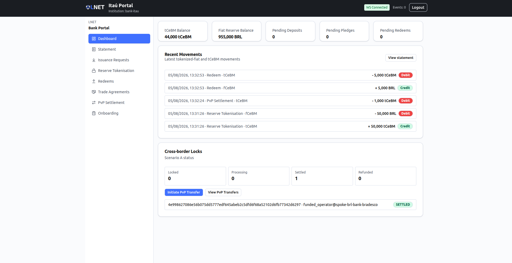
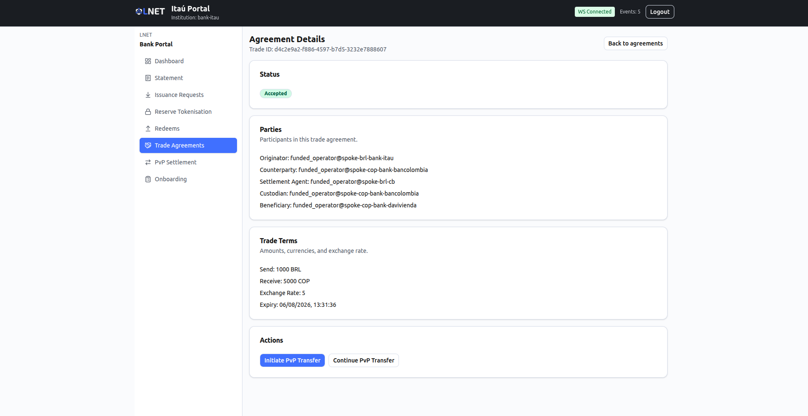
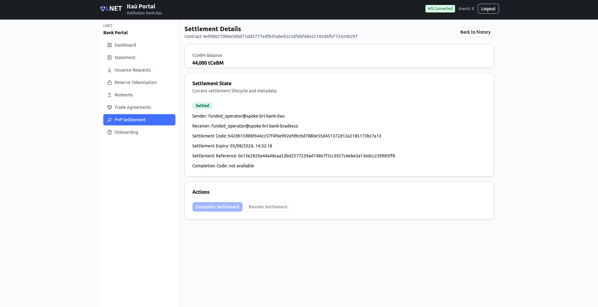

# End-to-End Walkthrough (Scenario A)

**Audience:** Anyone running or demonstrating a complete Scenario A cross-border
PvP settlement — operators, integrators, reviewers, and demo drivers.
**Scenario:** Scenario A — Enhanced Correspondent Banking (dual-layer HTLC
Payment-vs-Payment settlement).
**Scope:** This document ties the five per-portal manuals together into one
"golden path": the ordered sequence of actions, across every portal, that
atomically settles a cross-border currency exchange between Bank A (BRL leg) and
Bank B (ARS leg) under an agreed FX rate — either both legs settle or neither
does.

Each per-portal manual documents its own screens in isolation (see the
"Typical Workflows" section in each). This walkthrough is the cross-portal view:
who does what, in which portal, in what order, and what a successful result looks
like at each hand-off.

> This is the **happy path** — the successful case with no exceptions. Timeout,
> revocation (refund), rejection, and account-freeze paths are covered per-screen
> in the individual manuals and in the Troubleshooting section of each.

---

## Table of Contents

1. [The cast](#1-the-cast)
2. [Prerequisites](#2-prerequisites)
3. [The golden path](#3-the-golden-path)
   - 3.1 [Stage A — Onboard the commercial banks](#31-stage-a--onboard-the-commercial-banks)
   - 3.2 [Stage B — Fund both banks with tCeBM](#32-stage-b--fund-both-banks-with-tcebm)
   - 3.3 [Stage C — Negotiate the FX trade agreement](#33-stage-c--negotiate-the-fx-trade-agreement)
   - 3.4 [Stage D — Originator locks the first leg](#34-stage-d--originator-locks-the-first-leg)
   - 3.5 [Stage E — Counterparty locks the second leg](#35-stage-e--counterparty-locks-the-second-leg)
   - 3.6 [Stage F — Atomic settlement](#36-stage-f--atomic-settlement)
   - 3.7 [Stage G — Redeem back to fiat](#37-stage-g--redeem-back-to-fiat)
4. [Oversight overlay (optional)](#4-oversight-overlay-optional)
5. [Success checklist](#5-success-checklist)

---

## 1. The cast

| Actor | Portal | Manual |
|---|---|---|
| Central Bank A / B treasury (issuance, tokenisation, redeem approvals) | Treasury | [treasury.md](./treasury.md) |
| Central Bank A / B governance (registry KYC, account freeze, audit) | Governance | [governance.md](./governance.md) |
| Commercial Bank A operator (originator) | Bank | [bank.md](./bank.md) |
| Commercial Bank B operator (counterparty) | Bank | [bank.md](./bank.md) |
| Supervisor / regulator (read-only monitoring, disclosure) | Supervisor | [supervisor.md](./supervisor.md) |
| Network operations engineer (infrastructure and relay health) | NOC | [noc.md](./noc.md) |

Running example used throughout: **Spoke A settles in BRL, Spoke B settles in
ARS.** Bank A originates the settlement and locks its BRL leg; Bank B is the
counterparty and locks its ARS leg. At settlement each side receives the
counterpart currency per the agreed FX rate. Substitute your own corridor's
currencies as needed.

> Unlike Scenario B (one-directional payment through a Hub AMM), Scenario A is a
> **bilateral, symmetric** exchange: there is no shared liquidity pool, so
> **both** banks must hold their own tCeBM and **both** lock a leg before
> settlement can complete.

---

## 2. Prerequisites

Before you start, confirm:

- **Access.** You have the portal URL and sign-in credentials for each role you
  will act as, provided by your administrator or Central Bank. Each manual's
  "Access and Login" section describes the sign-in screen for its portal.
- **A healthy network.** Both spoke networks and the relay must be operational so
  the two HTLC legs can be observed and settled atomically. A network operations
  engineer can confirm this in the NOC portal: all spokes report healthy on the
  Dashboard, and the relay is running.
  See [noc.md → Relay Status](./noc.md#43-relay-status-relays).

If a gateway or the relay is unavailable, the lock and settlement steps stall in
a pending state rather than fail loudly — check relay health first.

---

## 3. The golden path

The path has seven stages. Stages A–B are one-time set-up per bank; Stage C is
per-corridor negotiation; Stages D–F are the settlement itself; Stage G is
routine liquidity management.

### 3.1 Stage A — Onboard the commercial banks

Each commercial bank registers with its own central bank and is approved through
KYC. Both banks must be onboarded, because the settlement resolves each leg's
receiver by bank identity.

| # | Actor | Portal → screen | Action | Expected result |
|---|---|---|---|---|
| A1 | Bank A operator | Bank → [Onboarding](./bank.md#onboarding-onboarding) | Complete the registration wizard (Steps 1–4) | Onboarding submitted to CB-A |
| A2 | CB-A governance | Governance → [Registry](./governance.md#42-registry-registry) | Approve Bank A's pending KYC request | Bank A status becomes ACTIVE |
| A3 | Bank B operator | Bank → [Onboarding](./bank.md#onboarding-onboarding) | Complete the registration wizard | Onboarding submitted to CB-B |
| A4 | CB-B governance | Governance → [Registry](./governance.md#42-registry-registry) | Approve Bank B's pending KYC request | Bank B status becomes ACTIVE |

Both banks can now sign in and reach the operational screens (see
[bank.md → Access & Login](./bank.md#access--login)).

### 3.2 Stage B — Fund both banks with tCeBM

Both banks need transferable CBDC (tCeBM) to lock, because each locks its own
currency leg. Funding is a two-step, central-bank-approved flow per bank: issue
the fiat reserve, then tokenise it. Repeat the whole stage for Bank A (BRL) and
Bank B (ARS).

| # | Actor | Portal → screen | Action | Expected result |
|---|---|---|---|---|
| B1 | Bank operator | Bank → [Issuance Requests](./bank.md#issuance-requests-deposits) | Submit an issuance (deposit) request for the fiat amount | Request created, status PENDING |
| B2 | CB treasury | Treasury → [Issuance Approvals](./treasury.md#42-issuance-approvals-deposits-approval) | Approve the request | Reserve minted to the bank; request APPROVED |
| B3 | Bank operator | Bank → [Reserve Tokenisation](./bank.md#reserve-tokenisation-escrows) | Request tokenisation of the approved reserve | Escrow created, status PENDING |
| B4 | CB treasury | Treasury → [Tokenisation Approvals](./treasury.md#43-tokenisation-approvals-escrows-approval) | Approve the escrow | tCeBM minted to the bank |
| B5 | Bank operator | Bank → [Dashboard](./bank.md#dashboard) | Refresh | tCeBM balance is non-zero — the bank is ready to transact |

### 3.3 Stage C — Negotiate the FX trade agreement

The two banks agree bilaterally on the exchange: who sends what, in which
currency, at which rate, and by when. Bank A proposes; Bank B accepts.

| # | Actor | Portal → screen | Action | Expected result |
|---|---|---|---|---|
| C1 | Bank A operator | Bank → [Propose Agreement](./bank.md#propose-agreement-agreementsnew) | Fill parties (counterparty, settlement agent, custodian, beneficiary) and trade terms (send BRL, receive ARS, rate, expiry ≥ 5 min ahead); Review then Confirm Proposal | Agreement created in PROPOSED state |
| C2 | Bank B operator | Bank → [Agreement Inbox](./bank.md#agreement-inbox-agreements) → [Agreement Detail](./bank.md#agreement-detail-agreementstradeid) | Open the PROPOSED agreement, review parties and terms, click Accept | Agreement moves to ACCEPTED — ready for PvP settlement |

### 3.4 Stage D — Originator locks the first leg

Bank A locks its BRL-side tCeBM in an HTLC. A Settlement Code (the hash lock) is
generated and must be shared with Bank B out-of-band so it can lock the matching
leg.

| # | Actor | Portal → screen | Action | Expected result |
|---|---|---|---|---|
| D1 | Bank A operator | Bank → [Agreement Detail](./bank.md#agreement-detail-agreementstradeid) | On the ACCEPTED agreement, click Initiate PvP Transfer | New Transfer form opens pre-filled as Originator |
| D2 | Bank A operator | Bank → [New Transfer](./bank.md#new-transfer-htlcnew) | Verify receiver and amount, set a timelock if required, Review then Confirm PvP Transfer | Contract created in LOCKED state; a 64-char Settlement Code is generated |
| D3 | Bank A operator | Bank → [Settlement Details](./bank.md#settlement-details-htlccontractid) | Copy the Settlement Code and share it with Bank B out-of-band (secure channel) | Settlement Code delivered to the counterparty |

### 3.5 Stage E — Counterparty locks the second leg

Bank B uses the Settlement Code to lock its ARS-side tCeBM on Spoke B. Both legs
are now locked against the same hash.

| # | Actor | Portal → screen | Action | Expected result |
|---|---|---|---|---|
| E1 | Bank B operator | Bank → [Agreement Detail](./bank.md#agreement-detail-agreementstradeid) | On the same ACCEPTED agreement, click Continue PvP Transfer | New Transfer form opens pre-filled as Counterparty |
| E2 | Bank B operator | Bank → [New Transfer](./bank.md#new-transfer-htlcnew) | Paste the Settlement Code, verify receiver and amount, Review then Confirm PvP Continuation | Counterparty contract created in LOCKED state on Spoke B |

Once both legs are locked, the relay reflects `counterparty_locked = true` on the
originator's contract, and Bank A's **Complete Settlement** action becomes
available.

### 3.6 Stage F — Atomic settlement

With both legs locked, the originator reveals the secret to finalise the swap.
Completion is atomic — it delivers tCeBM to both receivers at once.

| # | Actor | Portal → screen | Action | Expected result |
|---|---|---|---|---|
| F1 | Bank A operator | Bank → [Settlement Details](./bank.md#settlement-details-htlccontractid) | Once the Completion Code is available and the counterparty leg is locked, click Complete Settlement and confirm | Both legs move to SETTLED; Settlement Reference and Completion Code populate |
| F2 | Bank B operator | Bank → [Settlement Details](./bank.md#settlement-details-htlccontractid) | Refresh (the page auto-polls every 5 s) | Counterparty contract reaches SETTLED; the BRL counterpart is delivered to Bank B's receiver |
| F3 | CB treasury | Treasury → [HTLC Monitor](./treasury.md#45-htlc-monitor-htlc-monitor) | Review | Both contracts show as SETTLED end-to-end |

### 3.7 Stage G — Redeem back to fiat

Routine liquidity management: a bank that received tCeBM can redeem it back to
fiat with its central bank's approval.

| # | Actor | Portal → screen | Action | Expected result |
|---|---|---|---|---|
| G1 | Bank operator | Bank → [Redeems](./bank.md#redeems-redeems) | Submit a redemption request for the tCeBM amount; Review then Confirm | Redeem request created, status PENDING (Zeto transfer executes) |
| G2 | CB treasury | Treasury → [Redeems Approval](./treasury.md#44-redeems-approval-redeems-approval) | Approve the fiat release | Redemption approved; redemption ID populated |

---

## 4. Oversight overlay (optional)

Central-bank and supervisory oversight runs alongside the settlement flow. These
actions do not block the settlement but exercise the control surface:

- **Account freeze / unfreeze.** A governance operator can freeze a participant
  account (with a reason of at least 10 characters) and later unfreeze it. On the
  successful path all participants stay ACTIVE throughout.
  See [governance.md → Accounts](./governance.md#43-accounts-accounts).
- **Transfer limits.** A treasury operator can set a daily transfer limit per
  participant, which the settlement paths respect.
  See [treasury.md → Transfer Limits](./treasury.md#46-transfer-limits-transfer-limits).
- **Multi-party AML disclosure.** A supervisor opens a 2-of-N disclosure request
  for a specific transaction and a second party co-signs it to reach quorum,
  authorising decryption of shielded details for investigation.
  See [supervisor.md → Investigation](./supervisor.md#53-investigation-investigation)
  and [supervisor.md → Audit Vault](./supervisor.md#52-audit-vault-audit).
- **Continuous monitoring.** Throughout the flow, the Supervisor portal's
  [Settlement Health](./supervisor.md#55-settlement-health-stability) view tracks
  HTLC expiry risk, and the NOC portal's
  [Relay Status](./noc.md#43-relay-status-relays) confirms the relay is observing
  both spokes.

---

## 5. Success checklist

The walkthrough is complete when all of the following hold:

- [ ] Bank A and Bank B are both **ACTIVE** in the Registry (Governance → Registry).
- [ ] Both banks hold a non-zero **tCeBM** balance after tokenisation (Bank → Dashboard).
- [ ] The FX trade agreement is **ACCEPTED** (Bank → Trade Agreements).
- [ ] The originator leg is **LOCKED** and the Settlement Code has been shared (Bank → Settlement Details).
- [ ] The counterparty leg is **LOCKED** (`counterparty_locked = true` on the originator contract).
- [ ] Both legs reach **SETTLED** with a Settlement Reference and Completion Code (Bank → Settlement Details).
- [ ] No expired settlement window and no stuck relay events (Treasury → HTLC Monitor; NOC → Relay Status).
