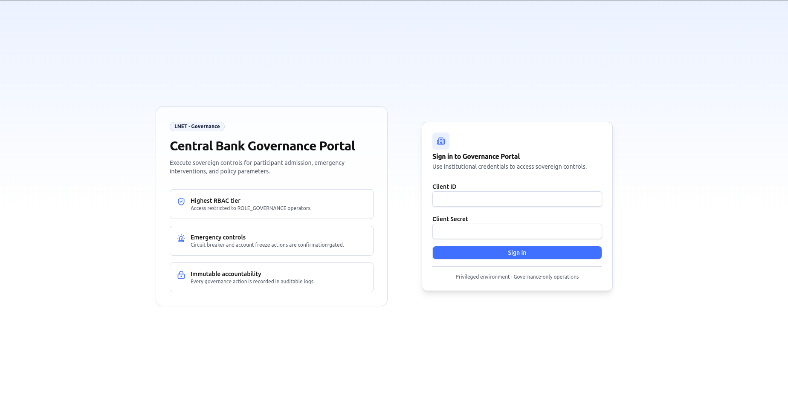
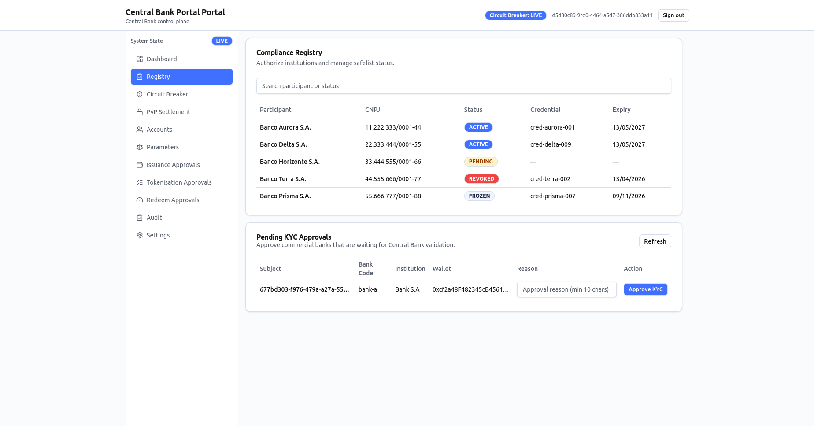
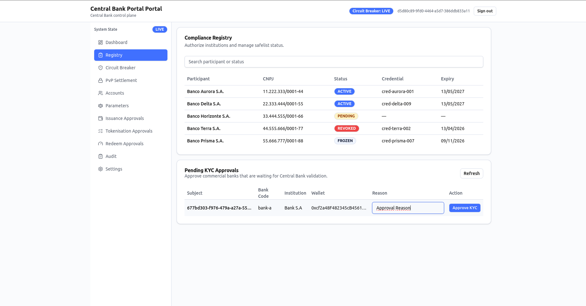

# Governance Portal — User Manual (Scenario A)

**Audience:** Central bank governance operators.
**Data source:** Live backend by default (`VITE_USE_MOCKS=false`). A local mock mode is available for development — if the portal is running in mock mode, data shown is synthetic and no changes reach the backend. Confirm with your system administrator which mode is active in your environment.

---

## Table of Contents

1. [Overview](#1-overview)
2. [Access and login](#2-access-and-login)
3. [Navigation](#3-navigation)
4. [Screens](#4-screens)
   - [Dashboard (`/`)](#41-dashboard-)
   - [Registry (`/registry`)](#42-registry-registry)
   - [Accounts (`/accounts`)](#43-accounts-accounts)
   - [Circuit Breaker (`/circuit-breaker`)](#44-circuit-breaker-circuit-breaker)
   - [Parameters (`/parameters`)](#45-parameters-parameters)
   - [Audit (`/audit`)](#46-audit-audit)
   - [Settings (`/settings`)](#47-settings-settings)
5. [Typical workflows](#5-typical-workflows)
   - [Approve a pending KYC request](#51-approve-a-pending-kyc-request)
   - [Freeze a participant account](#52-freeze-a-participant-account)
   - [Unfreeze a participant account](#53-unfreeze-a-participant-account)
   - [Update a system parameter](#54-update-a-system-parameter)
   - [Trigger the circuit breaker (pause swaps)](#55-trigger-the-circuit-breaker-pause-swaps)
   - [Resume swaps after a circuit breaker halt](#56-resume-swaps-after-a-circuit-breaker-halt)
   - [Review the audit trail for a governance action](#57-review-the-audit-trail-for-a-governance-action)
6. [Status reference](#6-status-reference)
7. [Troubleshooting](#7-troubleshooting)

---

## 1. Overview

The Governance Portal is the Central Bank's control surface for **Scenario A — Enhanced Correspondent Banking**. It gives governance officers sovereign-level controls over:

- **KYC / participant admission** — approving commercial banks that have submitted onboarding requests
- **Account intervention** — freezing or unfreezing participant accounts with an auditable reason
- **System parameters** — setting transaction limits, slippage tolerance, and settlement windows
- **Emergency circuit breaker** — halting or resuming all AMM swap operations across the hub
- **Audit trail** — immutable log of all governance actions with filtering by category, severity, and date

All actions performed in the portal are confirmation-gated and permanently recorded in the governance audit log. The portal communicates exclusively with the Central Bank's API Gateway over HTTPS; there is no direct connection to the blockchain or Paladin sidecar.

Access is restricted to accounts holding the **`ROLE_GOVERNANCE`** role — the highest RBAC tier in the system.

---

## 2. Access and login

### Portal URLs (local development)

| Instance | URL | API Gateway |
|---|---|---|
| Central Bank A | `http://localhost:5177` | `http://localhost:38080/api/v1` |
| Central Bank B | `http://localhost:5178` | `http://localhost:60080/api/v1` |

In a production or staging deployment, the URL is provided by your network administrator. Always confirm you are connecting to the correct spoke's portal.

### Signing in

1. Open the portal URL.
2. On the **Sign in to Governance Portal** page, enter your **Client ID** and **Client Secret**.
   - The Client ID is the Keycloak client identifier for your governance operator account (example: `central-bank-a-client`).
   - The Client Secret is the corresponding secret provisioned by the network administrator.
3. Click **Sign in**.
4. On success, you are redirected to the Dashboard.

> **Access denied immediately after sign-in?** Your account must hold the `ROLE_GOVERNANCE` role in the Keycloak realm for your spoke. Contact your network administrator to verify your role assignment.

---

## 3. Navigation

The portal uses a left-hand sidebar with the following items. All routes require authentication.

| Sidebar label | Route | Purpose |
|---|---|---|
| Dashboard | `/` | At-a-glance health summary and recent events |
| Registry | `/registry` | KYC approval queue for pending commercial banks |
| Accounts | `/accounts` | Freeze or unfreeze participant accounts |
| Circuit Breaker | `/circuit-breaker` | Halt or resume all swap operations |
| Parameters | `/parameters` | Update global transaction limits and settlement window |
| Audit | `/audit` | Full audit trail with filters |
| Settings | `/settings` | Operator display preferences |

Unauthenticated requests to any protected route redirect to `/login`. Unknown routes redirect to the Dashboard.

---

## 4. Screens

### 4.1 Dashboard (`/`)

<!-- TODO: screenshot — dashboard -->

The Dashboard is the landing page after login. It loads data from three live data sources in parallel — the participant registry, the accounts list, and the audit log — and presents a summary without requiring manual refresh.

**Summary cards**

| Card | What it shows | Action |
|---|---|---|
| **Pending KYC Approvals** | Number of commercial banks awaiting Central Bank validation. Highlighted in yellow when greater than zero with a "NEEDS ATTENTION" badge. | Links to Registry |
| **Active Participants** | Count of active commercial banks vs. total registered commercial banks. | Links to Accounts |
| **Frozen Accounts** | Number of accounts currently frozen by governance. Highlighted in red when greater than zero. | Links to Accounts |

**Recent Governance Events** table shows the five most recent entries from the audit log, with columns: Time, Action, Category, Severity, and Outcome. Use the "View all audit logs" link to open the full Audit page.

When the portal starts up, if Pending KYC Approvals is greater than zero, review and act on those requests before proceeding with other tasks.

---

### 4.2 Registry (`/registry`)

The Registry screen is the primary admission gate for new commercial banks. Its current active section is the **Pending KYC Approvals** table.

> **Note on commented-out sections.** The full participant list (compliance registry) and the manual credential issuance form exist in the codebase but are currently disabled pending a UI redesign. The only active functionality on this page is the KYC approval queue.

#### Pending KYC Approvals table

The table lists every commercial bank that has submitted an onboarding request with status `CREDENTIAL_REQUESTED`. The page **auto-refreshes this list every 15 seconds**; you can also trigger an immediate refresh with the **Refresh** button.

| Column | Description |
|---|---|
| **Subject** | The bank's unique identity identifier (UUID). Truncated in the display; hover for the full value. |
| **Bank Code** | Short alphanumeric code for the institution (e.g., `horizonte`). |
| **Institution** | Human-readable institution name (e.g., "Banco Horizonte S.A."). |
| **Wallet** | The institution's registered on-chain wallet address. Truncated; hover for the full address. |
| **Reason** | Free-text field where you enter your approval justification (minimum 10 characters). |
| **Action** | **Approve KYC** button — confirms the institution and moves it to `KYC_APPROVED` status. |

When there are no pending requests, the table displays "No pending KYC requests."

For the approval workflow, see [Approve a pending KYC request](#51-approve-a-pending-kyc-request).

---

### 4.3 Accounts (`/accounts`)

<!-- TODO: screenshot — accounts page -->

The Accounts page (titled **Account Intervention** in the UI) allows governance operators to freeze or unfreeze participant accounts. This is a high-privilege action — it directly blocks or restores a participant's ability to transact.

#### Account list

Use the **Search** field to filter by account ID or participant name.

| Column | Description |
|---|---|
| **Account** | The account identifier. |
| **Participant** | The name of the institution that holds the account. |
| **Status** | `ACTIVE` or `FROZEN`. |
| **Frozen At** | Timestamp when the account was frozen. Shown as `—` if the account is not frozen. |
| **Reason** | The reason provided when the account was frozen. Shown as `—` if not frozen. |
| **Action** | **Freeze** (for active accounts) or **Unfreeze** (for frozen accounts). |

#### Confirmation panel

Clicking **Freeze** or **Unfreeze** on a row opens a confirmation panel below the table:

1. A **Reason** text area appears (required, minimum 10 characters).
2. Click **Confirm Freeze** or **Confirm Unfreeze** to apply. The button shows "Submitting..." while the request is in flight.
3. Click **Cancel** to dismiss without taking action.

Both freeze and unfreeze actions are recorded in the audit log under the `FREEZE` category with `CRITICAL` severity.

---

### 4.4 Circuit Breaker (`/circuit-breaker`)

<!-- TODO: screenshot — circuit breaker page -->

The Circuit Breaker screen provides emergency control over all AMM swap operations across the hub. This is an irreversible-in-kind action (swaps halt immediately) and is permanently recorded in the audit log at `CRITICAL` severity.

#### Current state display

The current state panel shows:

| Field | Meaning |
|---|---|
| **State badge** | `LIVE` (green/default) or `HALTED` (red/destructive). |
| **Last update** | Timestamp of the most recent state change. |

#### Toggling the circuit breaker

1. Enter a **Reason** in the text area (required, minimum 10 characters) describing why the intervention is needed.
2. Click **Pause Swaps** (when state is `LIVE`) or **Resume Swaps** (when state is `HALTED`).
3. A confirmation panel appears with the message: "This action changes the global swap state and will be permanently recorded in audit logs."
4. Click **Confirm** to apply, or **Cancel** to abort.

The button shows "Submitting..." while the request is in flight. On success, the state badge updates immediately.

For the full workflow, see [Trigger the circuit breaker](#55-trigger-the-circuit-breaker-pause-swaps) and [Resume swaps](#56-resume-swaps-after-a-circuit-breaker-halt).

---

### 4.5 Parameters (`/parameters`)

<!-- TODO: screenshot — parameters page -->

The Parameters page (titled **Global Parameters** in the UI) controls the system-wide transaction and settlement constraints that apply to all participants.

#### Editable parameters

| Parameter label | Internal field | Description |
|---|---|---|
| **Transaction Minimum** | `txLimitMin` | The minimum allowed transaction amount. |
| **Transaction Maximum** | `txLimitMax` | The maximum allowed transaction amount. |
| **Slippage Tolerance** | `slippageTolerance` | Maximum acceptable price slippage for AMM swap operations (as a decimal, e.g., `0.01` for 1%). |
| **Settlement Window (seconds)** | `settlementWindowSeconds` | The maximum time allowed for HTLC settlement before a refund path is triggered. |

All four fields are editable directly in the form. A **Reason** text area (required, minimum 10 characters) must be completed before submitting any change.

#### Reviewing and confirming changes

1. Edit one or more parameter fields.
2. Fill in the **Reason** field.
3. Click **Review Changes**. A **Confirm Parameter Diff** table appears listing only the fields you changed, showing the current value and the proposed value side by side.
4. If no changes are detected the diff table shows "No changes detected" and the **Confirm Update** button is disabled.
5. Click **Confirm Update** to apply, or **Cancel** to return to the edit form.

Parameter updates are recorded in the audit log under the `PARAMETER` category with `CRITICAL` severity.

---

### 4.6 Audit (`/audit`)

<!-- TODO: screenshot — audit page -->

The Audit page (titled **Governance Audit Trail** in the UI) provides an immutable history of all governance actions and their outcomes. Use it to investigate past decisions and fulfill compliance or regulatory reporting requirements.

#### Filters

| Filter | Options |
|---|---|
| **Category** | All categories · Credential · Circuit Breaker · Freeze · Parameter |
| **Severity** | All severities · Info · Warning · Critical |
| **From date** | Date picker — start of the date range |
| **To date** | Date picker — end of the date range |

Set the desired filters and click **Apply Filters**. The button shows "Applying..." while results load.

#### Audit log table

| Column | Description |
|---|---|
| **Timestamp** | Date and time the event was recorded (locale-formatted). |
| **Actor** | The operator or system that performed the action. |
| **Action** | A short description of what was done (e.g., "Account frozen", "KYC approved", "Parameters updated"). |
| **Category** | The governance domain. See the [Audit category reference](#audit-category-reference) table below. |
| **Severity** | `INFO`, `WARNING`, or `CRITICAL`. |
| **Outcome** | `SUCCESS` or `FAILURE`. |

#### Audit category reference

| Category | Events included |
|---|---|
| `CREDENTIAL` | KYC approvals, credential issuance |
| `CIRCUIT_BREAKER` | Swap pause and resume events |
| `FREEZE` | Account freeze and unfreeze events |
| `PARAMETER` | Parameter update events |

---

### 4.7 Settings (`/settings`)

<!-- TODO: screenshot — settings page -->

The Settings page controls operator display preferences for the current session. It does not affect backend state.

| Setting | Description |
|---|---|
| **Current Session** | Read-only. Shows your authenticated user subject and assigned roles. |
| **Timezone** | The timezone used to format dates in the portal. Default: `America/Sao_Paulo`. |
| **Date format** | The display format for dates and times. Default: `dd/MM/yyyy HH:mm`. |
| **Enable dashboard alert sounds** | Checkbox — enables audio alerts for dashboard notifications. |

Click **Save Settings** to apply. A confirmation toast appears on success.

> **Note:** Timezone and date format settings are currently stored in component state only. They reset when you navigate away or reload the page. Persistent preference storage is planned for a future release.

---

## 5. Typical workflows

### 5.1 Approve a pending KYC request

Use this workflow when a commercial bank has completed onboarding and their request appears in the Registry.

1. Open the **Dashboard**. If the **Pending KYC Approvals** card shows a count greater than zero, navigate to **Registry**.
2. On the **Registry** page, locate the pending institution in the **Pending KYC Approvals** table.
3. Verify the **Subject**, **Bank Code**, **Institution**, and **Wallet** fields match the institution's onboarding documentation.
4. In the **Reason** field on the same row, enter a justification for approval (minimum 10 characters, e.g., "AML screening passed — approved per board resolution 2026-06-15").
5. Click **Approve KYC**.
6. A success toast confirms "KYC approved for [subject]".
7. The row is removed from the pending list on the next refresh (within 15 seconds, or immediately if you click **Refresh**).
8. Navigate to **Audit** and confirm a `CREDENTIAL` / `INFO` / `SUCCESS` entry was recorded.

---

### 5.2 Freeze a participant account

Use this workflow when a compliance event requires immediate blocking of a participant.

1. Navigate to **Accounts**.
2. Use the search field to find the institution by account ID or participant name.
3. Confirm the account **Status** is `ACTIVE`.
4. Click **Freeze** on the relevant row.
5. In the confirmation panel that appears below the table, enter a detailed reason in the **Reason** field (minimum 10 characters).
6. Click **Confirm Freeze**.
7. The account **Status** changes to `FROZEN` and the **Frozen At** and **Reason** columns populate.
8. Navigate to **Audit** and confirm a `FREEZE` / `CRITICAL` / `SUCCESS` entry was recorded.

---

### 5.3 Unfreeze a participant account

Use this workflow when a previously frozen account is cleared to resume operations.

1. Navigate to **Accounts**.
2. Locate the frozen account (Status badge shows `FROZEN` in red).
3. Click **Unfreeze** on the relevant row.
4. In the confirmation panel, enter a reason explaining why the freeze is being lifted (minimum 10 characters).
5. Click **Confirm Unfreeze**.
6. The account **Status** returns to `ACTIVE` and the **Frozen At** and **Reason** columns clear.
7. Navigate to **Audit** and confirm an unfreeze entry was recorded.

---

### 5.4 Update a system parameter

Use this workflow when a policy decision requires changing transaction limits or the settlement window.

1. Navigate to **Parameters**.
2. Review the current values shown in each field.
3. Edit the field(s) you want to change.
4. Enter a **Reason** explaining the change (minimum 10 characters, e.g., "Board directive 2026-Q2 — increasing maximum transaction limit").
5. Click **Review Changes**.
6. The **Confirm Parameter Diff** table appears. Verify the **Current** and **Proposed** values are exactly what you intend.
7. If the diff is correct, click **Confirm Update**.
8. A success toast confirms "Parameters updated".
9. Navigate to **Audit** and confirm a `PARAMETER` / `CRITICAL` / `SUCCESS` entry was recorded.

> If you click **Review Changes** without editing any field, the diff table shows "No changes detected" and the **Confirm Update** button is disabled. Return to the form and make your edits.

---

### 5.5 Trigger the circuit breaker (pause swaps)

Use this workflow only in emergency situations requiring immediate suspension of all swap activity.

1. Navigate to **Circuit Breaker**.
2. Confirm the current state badge shows `LIVE`.
3. Enter a **Reason** describing the emergency (minimum 10 characters).
4. Click **Pause Swaps**.
5. Read the confirmation warning: "This action changes the global swap state and will be permanently recorded in audit logs."
6. Click **Confirm**.
7. The state badge immediately changes to `HALTED` (red).
8. Navigate to **Audit** and confirm a `CIRCUIT_BREAKER` / `CRITICAL` / `SUCCESS` entry was recorded.
9. Notify relevant stakeholders that swap operations are halted.

---

### 5.6 Resume swaps after a circuit breaker halt

Use this workflow when the emergency condition has been resolved.

1. Navigate to **Circuit Breaker**.
2. Confirm the current state badge shows `HALTED`.
3. Enter a **Reason** explaining why operations are being resumed (minimum 10 characters).
4. Click **Resume Swaps**.
5. Read the confirmation warning and click **Confirm**.
6. The state badge immediately changes to `LIVE` (green).
7. Navigate to **Audit** and confirm a resume entry was recorded.

---

### 5.7 Review the audit trail for a governance action

Use this workflow when investigating a past governance action for compliance or incident review.

1. Navigate to **Audit**.
2. Set the **Category** filter to the relevant domain (e.g., `FREEZE` to review account freeze actions).
3. Optionally set **Severity** (e.g., `CRITICAL` for high-impact events).
4. Optionally set a **From date** and **To date** to narrow the time range.
5. Click **Apply Filters**.
6. Review the results. Each row shows the timestamp, actor, action description, category, severity, and outcome.
7. Cross-reference the **Actor** and **Action** fields with the expected operator and action description.

---

## 6. Status reference

### Account status

| Status | Meaning | Displayed in |
|---|---|---|
| `ACTIVE` | Account is operational; participant can transact. | Accounts page, Dashboard |
| `FROZEN` | Account has been suspended by governance; participant cannot transact. | Accounts page, Dashboard |

### Circuit breaker state

| State | Meaning | Badge color |
|---|---|---|
| `LIVE` | All AMM swap operations are running normally. | Default (green) |
| `HALTED` | All AMM swap operations are paused. | Destructive (red) |

### KYC / participant status

| Status | Meaning | Displayed in |
|---|---|---|
| `CREDENTIAL_REQUESTED` | The institution has submitted an onboarding request awaiting governance approval. | Registry — Pending KYC table |
| `KYC_APPROVED` | Governance has approved the KYC request; credential is being finalized. | Audit log |
| `ACTIVE` | Institution is fully onboarded and authorized to transact. | Dashboard participant count |
| `FROZEN` | Institution has been suspended by governance. | Dashboard, Accounts |

### Audit severity

| Severity | Meaning |
|---|---|
| `INFO` | Routine governance action (e.g., KYC approval). |
| `WARNING` | Action that may require follow-up attention. |
| `CRITICAL` | High-impact action: freeze, circuit breaker toggle, parameter update. |

### Audit outcome

| Outcome | Meaning |
|---|---|
| `SUCCESS` | The action completed successfully on the backend. |
| `FAILURE` | The action failed; review the action description and contact backend support. |

### Audit category

| Category | Governance domain |
|---|---|
| `CREDENTIAL` | KYC approvals and credential issuance |
| `CIRCUIT_BREAKER` | Swap pause and resume |
| `FREEZE` | Account freeze and unfreeze |
| `PARAMETER` | System parameter updates |

---

## 7. Troubleshooting

### Sign-in fails with correct credentials

- Confirm your Keycloak account is enabled in the realm for your spoke.
- Confirm your account holds the `ROLE_GOVERNANCE` role. Other roles (e.g., `ROLE_COMMERCIAL_BANK`, `ROLE_TREASURY`) do not grant access to this portal.
- Confirm the Central Bank backend services (API Gateway, auth service) are running for your spoke.
- Confirm you are pointing at the correct portal URL for your entity (Central Bank A vs. Central Bank B).

### Dashboard shows zeros for all cards

- The Dashboard loads data from the live backend on each page load. If all cards show zero immediately after login, check that the backend registry and audit services are reachable.
- If running in mock mode (`VITE_USE_MOCKS=true`), synthetic data should populate immediately. If it does not, check the browser console for errors.

### Pending KYC table is empty but you expect requests

- The table auto-refreshes every 15 seconds. Wait for a refresh cycle or click **Refresh**.
- Confirm the institution has completed their onboarding flow and submitted a credential request. The institution must have status `CREDENTIAL_REQUESTED` in the compliance registry for the entry to appear here.
- Confirm the portal is connected to the correct spoke's API Gateway.

### "Reason must contain at least 10 characters" error

- All confirmation-gated actions (KYC approval, account freeze/unfreeze, circuit breaker toggle, parameter update) require a reason of at least 10 characters. Enter a descriptive justification before confirming.

### Accounts list is empty or stale

- The Accounts page loads data on mount. Reload the page to refresh.
- Confirm the compliance service is accessible via the API Gateway.

### Circuit Breaker state does not update after confirming

- If the state badge does not change after clicking **Confirm**, check the error message displayed below the form.
- Common causes: API Gateway unreachable, insufficient role permissions on the backend, or a backend service outage.
- Reload the page to fetch the current state from the backend.

### Parameters do not save

- Confirm the **Reason** field has at least 10 characters before clicking **Review Changes**.
- In the diff table, confirm the **Proposed** column shows values different from **Current**. If values are identical, the **Confirm Update** button is disabled.
- If a backend error appears, contact the network administrator.

### Audit log is empty

- Audit log entries are created by backend governance actions. If no governance actions have been performed yet, the log will be empty.
- Confirm the audit service is running and accessible.
- Use the **Apply Filters** button with all filters set to `ALL` to ensure no active filter is hiding results.
