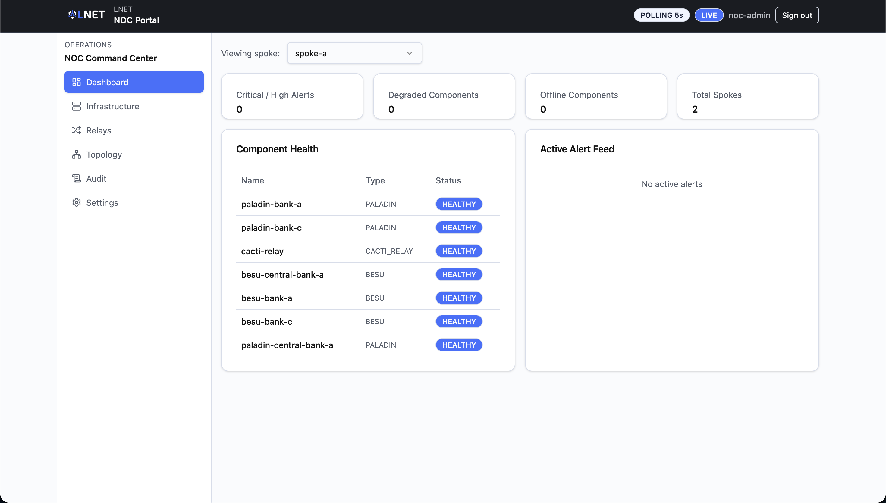
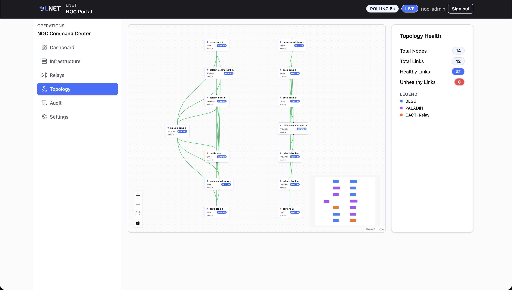
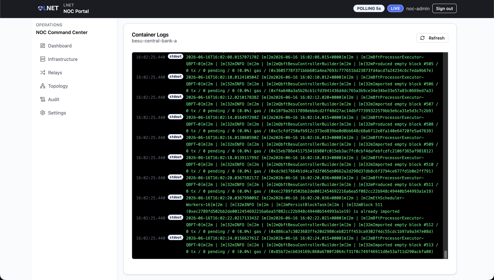
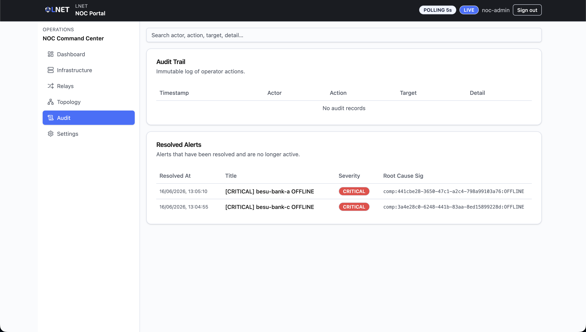

# NOC Portal — User Manual (Scenario A)

**Audience:** Network operations / SRE engineers.
**Scenario:** A — Enhanced Correspondent Banking (dual-layer HTLC).
**Data source:** The portal connects to a live NOC backend service. The backend
exposes real component health, alert, log, and topology data. The WebSocket
telemetry stream is not yet implemented; the portal falls back to HTTP polling
automatically.

---

> ## Read first — current status
>
> The NOC Portal is wired to a real backend API (Keycloak auth + NOC backend
> service). Component health, alerts, and logs reflect actual spoke state when
> the stack is running. The **WebSocket push stream** is a stub — the portal
> always runs in HTTP polling mode until the stream is implemented.
> Authenticated sessions are stored as JWT tokens in `localStorage`.

---

## Table of Contents

1. [Overview](#1-overview)
2. [Access and Login](#2-access-and-login)
3. [Navigation](#3-navigation)
4. [Screens](#4-screens)
   - [Dashboard (`/`)](#41-dashboard-)
   - [Infrastructure (`/infrastructure`)](#42-infrastructure-infrastructure)
   - [Relay Status (`/relays`)](#43-relay-status-relays)
   - [Topology (`/topology`)](#44-topology-topology)
   - [Log Viewer (`/logs/:componentId`)](#45-log-viewer-logscomponentid)
   - [Audit (`/audit`)](#46-audit-audit)
   - [Settings (`/settings`)](#47-settings-settings)
5. [Alert Management](#5-alert-management)
6. [Typical Workflows](#6-typical-workflows)
7. [Alert Reference](#7-alert-reference)
8. [Status Reference](#8-status-reference)
9. [Troubleshooting](#9-troubleshooting)

---

## 1. Overview

The NOC (Network Operations Center) Portal is the monitoring surface for
engineers responsible for the health of Scenario A's spoke network. It provides:

- Real-time health status for blockchain nodes (Hyperledger Besu), Paladin
  privacy nodes, payment orchestrators, and CACTI relay containers.
- An active alert feed with acknowledge/dismiss workflow.
- Container log inspection for any registered component.
- An interactive topology diagram showing spoke layout and link health.
- An immutable audit trail of operator actions.

| Actor | Portal | Role |
|---|---|---|
| Network Operations Engineer / SRE | NOC Portal | Infrastructure health, alert triage, relay monitoring, log review, topology |

The portal is **read-only with two exceptions**: operators can acknowledge and
dismiss alerts. No destructive infrastructure controls (token issuance,
configuration changes) are exposed here.

---

## 2. Access and Login

**URL:** The NOC Portal URL provided by your system administrator.

**Authentication:** Keycloak OIDC. The portal authenticates against the
`cbweb3` realm with client ID `noc-portal`. Only accounts carrying the
`SYS_ADMIN` role are accepted.

### Login steps

1. Open the NOC Portal URL in your browser.
2. Enter your `SYS_ADMIN` username and password.
3. Click **Sign in**.
4. On success, you are redirected to the Dashboard.

### Login page layout

The login page has two panels on desktop:

- **Left panel** — feature summary (SYS_ADMIN restriction, live telemetry,
  read-only operations plane).
- **Right panel** — sign-in form (username, password, submit button).

| Field | Notes |
|---|---|
| **Username** | Your `SYS_ADMIN` Keycloak username. |
| **Password** | Your `SYS_ADMIN` Keycloak password. |

> Standard bank-portal or governance-portal credentials cannot be used here.
> If login fails immediately, verify the account has the `SYS_ADMIN` role in
> Keycloak.

**Session persistence:** On successful login the portal stores `noc_access_token`
and `noc_refresh_token` in `localStorage`. The session is checked on page reload;
if the token is expired the operator is redirected to the login page. Logging
out clears both tokens.

---

## 3. Navigation

The portal uses a persistent left sidebar. All routes are protected — the login
page is the only publicly accessible screen.

| Sidebar label | Route | Description |
|---|---|---|
| Dashboard | `/` | Platform-wide health snapshot and alert feed. |
| Infrastructure | `/infrastructure` | Per-component health table (nodes, orchestrators). |
| Relays | `/relays` | CACTI relay container health per spoke. |
| Topology | `/topology` | Interactive network diagram. |
| Audit | `/audit` | Operator action history and resolved alerts. |
| Settings | `/settings` | Polling interval and notification preferences. |

The **Log Viewer** (`/logs/:componentId`) has no sidebar entry. It is reached
by clicking the **View Logs** button on the Infrastructure or Relays pages.

Unknown routes redirect to `/` (Dashboard).

---

## 4. Screens

### 4.1 Dashboard (`/`)

The Dashboard is the primary monitoring view. It aggregates platform-wide health
data across all spokes (or a single selected spoke) and displays the active
alert feed.

#### Spoke Selector

A dropdown at the top of the page. By default, the first available spoke is
selected automatically. Select **a specific spoke** to filter both the Component
Health table and the Alert Feed to that spoke only. The "All Spokes" option
(when no spoke is explicitly selected) shows alerts across all spokes.

#### Summary Cards

Four cards provide an instant platform status snapshot:

| Card | Colour when non-zero | Description |
|---|---|---|
| **Critical / High Alerts** | Red | Active alerts with severity `HIGH` or `CRITICAL`. Requires immediate attention. |
| **Degraded Components** | Orange | Components not in `HEALTHY` state (includes `DEGRADED`, `OFFLINE`, `UNKNOWN`). |
| **Offline Components** | Red | Components in `OFFLINE` state. Requires immediate attention. |
| **Total Spokes** | — | Count of active spokes registered in the system. |

#### Component Health Table

Shows the first 8 components for the selected scope. Columns: **Name**, **Type**,
**Status** badge. For the full component list, navigate to
[Infrastructure](#42-infrastructure-infrastructure).

#### Active Alert Feed

Lists up to 8 active alerts. Each alert row shows:

| Element | Description |
|---|---|
| **Title** | Short description of the alert condition. |
| **Severity badge** | `INFO`, `WARNING`, `HIGH`, or `CRITICAL`. |
| **ACK badge** | Shown when the alert has been acknowledged by any operator. |
| **Dismiss button** | X icon on the right — click to dismiss directly from the feed. |

Click any alert row (not the dismiss button) to open the **Alert Detail Modal**.

**Alert Detail Modal** fields:

| Field | Description |
|---|---|
| **Title** | Alert title. |
| **Severity** | Severity badge. |
| **Affected component** | The component that raised the alert. |
| **Description** | Full alert description. |
| **First detected** | ISO timestamp of alert creation. |
| **Acknowledge button** | Marks the alert as seen; keeps it in the feed. |
| **Dismiss button** | Removes the alert from the active feed. |

#### Polling

The Dashboard refreshes automatically at the interval configured in
[Settings](#47-settings-settings) (default: 15 seconds, minimum: 5 seconds).
The WebSocket stream is not yet active; the portal always uses HTTP polling.

---

### 4.2 Infrastructure (`/infrastructure`)

Lists the health status of all non-relay infrastructure components for the
selected spoke: Hyperledger Besu blockchain nodes, Paladin privacy nodes, and
payment orchestrators. CACTI relay containers are excluded here — use
[Relays](#43-relay-status-relays) for those.

#### Controls

| Control | Description |
|---|---|
| **Spoke Selector** | Select a spoke. The table is empty until a spoke is selected. |
| **Refresh button** | Force an immediate health poll; disabled while loading. |

#### Component Health Table

| Column | Description |
|---|---|
| **Name** | The component's display name. |
| **Type** | Component category: `BESU`, `PALADIN`, or `PAYMENT_ORCHESTRATOR`. |
| **Endpoint** | The component's API or RPC endpoint (truncated). |
| **Block #** | Latest block number — populated for `BESU` nodes only. `—` for other types. |
| **Last Check** | Timestamp of the most recent health poll (shown as local time). |
| **Status** | Health status badge. See [Status Reference](#8-status-reference). |
| **View Logs** | Icon button — navigates to the [Log Viewer](#45-log-viewer-logscomponentid) for this component. |

The table auto-refreshes at the configured polling interval whenever a spoke is
selected.

---

### 4.3 Relay Status (`/relays`)

Shows the health of **CACTI interoperability relay containers** — the components
responsible for cross-spoke event propagation. When a cross-border settlement
appears stuck, this page is the first place to check.

#### Controls

| Control | Description |
|---|---|
| **Spoke Selector** | You must select a specific spoke. The table is empty until a spoke is chosen. |

#### Relay Components Table

Displays only `CACTI_RELAY` type components for the selected spoke.

| Column | Description |
|---|---|
| **Name** | Relay container name. |
| **Type** | Always `CACTI_RELAY`. |
| **Endpoint** | The relay container's API endpoint (truncated). |
| **Last Check** | Timestamp of the last health poll (local time). |
| **Status** | Health status badge. See [Status Reference](#8-status-reference). |
| **View Logs** | Icon button — navigates to the [Log Viewer](#45-log-viewer-logscomponentid) for this relay. |

> If no relay components appear after selecting a spoke, verify that the CACTI
> relay containers for that spoke are registered in the NOC backend and that the
> backend service can reach them.

---

### 4.4 Topology (`/topology`)

Renders an interactive network diagram of all nodes and their links across the
platform. Useful for identifying where in the topology a fault is isolated.

#### Diagram Elements

| Element | Colour | Description |
|---|---|---|
| **BESU node** | Blue dot | A Hyperledger Besu blockchain node. |
| **PALADIN node** | Purple dot | A Paladin privacy node. |
| **CACTI relay node** | Orange dot | An interoperability relay container. |
| **Green edge** | Green line | A healthy link between two nodes. |
| **Red edge** | Red line | An unhealthy link between two nodes. |

Each node card shows: a colour-coded dot, the node name, its kind label, a
health status badge, and the name of the spoke it belongs to.

Nodes are grouped by spoke in columns. The layout is generated automatically
based on spoke membership.

#### Diagram Controls

| Control | Action |
|---|---|
| **Scroll wheel** | Zoom in / out. |
| **Click and drag** (on the canvas) | Pan the diagram. |
| **Mini-map** (bottom-right corner) | Navigate quickly across a large topology. |
| **Controls panel** (bottom-left) | Zoom in, zoom out, fit view, lock layout buttons provided by ReactFlow. |

#### Topology Health Summary Card

Located to the right of the diagram:

| Metric | Description |
|---|---|
| **Total Nodes** | Number of nodes registered in the topology. |
| **Total Links** | Number of directed edges between nodes. |
| **Healthy Links** | Count of edges marked as healthy (green). |
| **Unhealthy Links** | Count of edges marked as unhealthy (red). |

A colour legend below the metrics identifies each node type.

---

### 4.5 Log Viewer (`/logs/:componentId`)

Displays container logs for a specific infrastructure or relay component. There
is no sidebar entry for this screen — navigate here by clicking the **View Logs**
button from the [Infrastructure](#42-infrastructure-infrastructure) or
[Relays](#43-relay-status-relays) pages.

The component name is shown in the page subtitle. The `componentId` in the URL
is the internal component ID; the human-readable name is passed as a query
parameter (`?name=...`).

#### Controls

| Control | Description |
|---|---|
| **Refresh button** | Force an immediate log fetch. Spinner is shown while loading. |

#### Log Panel

Terminal-style viewer (black background, green text).

| Column | Description |
|---|---|
| **Timestamp** | Time portion of the log line's `occurred_at` timestamp (HH:MM:SS.mmm). |
| **Stream badge** | `stdout` (normal output) or `stderr` (error output). `stderr` lines appear in red. |
| **Log line** | Raw log text from the container. |

- Displays the **last 500 lines**.
- Auto-scrolls to the bottom on initial load and on each refresh.
- Refreshes automatically every **15 seconds**.

---

### 4.6 Audit (`/audit`)

Provides an immutable record of all operator actions taken within the NOC Portal
and a history of resolved alerts.

A **search box** at the top filters both tables simultaneously. The filter
matches against actor, action, target ID, and detail text in the Audit Trail
table; and against title, severity, and root cause signature in the Resolved
Alerts table.

#### Audit Trail Table

Every alert acknowledgement and dismissal performed by any NOC operator is
recorded here.

| Column | Description |
|---|---|
| **Timestamp** | When the action was performed (local time). |
| **Actor** | Username of the NOC operator who performed the action. |
| **Action** | The action type: `Acknowledge` (from `ACKNOWLEDGE_ALERT`) or `Dismiss` (from `DISMISS_ALERT`). |
| **Target** | The internal ID of the alert that was acted upon. |
| **Detail** | Any additional context recorded at the time of the action. |

#### Resolved Alerts Table

A searchable history of alerts that have been resolved (automatically or via
dismissal).

| Column | Description |
|---|---|
| **Resolved At** | Timestamp when the alert transitioned to resolved (local time). `—` if not yet recorded. |
| **Title** | The alert title. |
| **Severity** | Severity badge at the time of resolution. |
| **Root Cause Sig** | System-generated identifier for the root cause pattern (monospaced, truncated). |

---

### 4.7 Settings (`/settings`)

Configures operator-level monitoring preferences. Settings are persisted to
`localStorage` (key: `noc-ui-settings`) and survive page reloads within the
same browser. They reset when the browser storage is cleared.

| Setting | Default | Description |
|---|---|---|
| **Alert Email** | `noc-ops@cbweb3.local` | Email address for alert notifications. Stored locally — not sent to the backend. |
| **Critical Alerts Only** | Off | When checked, mutes `INFO` and `WARNING` severity alerts from the Dashboard feed. Only `HIGH` and `CRITICAL` alerts appear. |
| **Polling Interval** | 15 seconds | How frequently the Dashboard auto-refreshes. **Minimum: 5 seconds.** Values below 5 are rejected. |

Click **Save Settings** to apply changes. A toast confirms success. The active
polling interval shown below the input updates immediately.

---

## 5. Alert Management

NOC operators can take two actions on active alerts: **Acknowledge** and
**Dismiss**. Both actions are logged in the [Audit](#46-audit-audit) page.

### Acknowledge vs. Dismiss

| Action | Meaning | Effect |
|---|---|---|
| **Acknowledge** | An operator has seen the alert and is actively investigating. | Alert remains in the active feed. An **ACK** badge appears on the row. Action logged in Audit. |
| **Dismiss** | The alert is not actionable, is a false positive, or has been resolved externally. | Alert is removed from the active feed and moved to Resolved Alerts on the Audit page. Action logged in Audit. |

### How to Acknowledge

1. On the Dashboard, locate the alert in the **Active Alert Feed**.
2. Click the alert row to open the **Alert Detail Modal**.
3. Review the alert title, severity, affected component, and description.
4. Click **Acknowledge**.

The ACK badge appears on the alert row. The action appears in the Audit Trail.

### How to Dismiss

**Option A — from the alert feed directly:**

1. Click the **X (dismiss) button** on the right side of the alert row.
2. The alert is removed immediately.

**Option B — from the Alert Detail Modal:**

1. Click the alert row to open the modal.
2. Click **Dismiss** in the modal.

In both cases the alert disappears from the feed and is logged in the Audit
Trail. Dismissed alerts cannot be re-activated from the portal.

---

## 6. Typical Workflows

### 6.1 Morning health check

1. Log in to the NOC Portal.
2. On the **Dashboard**, check the four summary cards. Any non-zero values in
   **Critical / High Alerts** or **Offline Components** require immediate action.
3. If critical/high alerts are present, click each alert row to open the
   Alert Detail Modal and review the affected component and description.
4. Navigate to **Infrastructure** and select each spoke in turn. Confirm no
   unexpected `DEGRADED` or `OFFLINE` components.
5. Navigate to **Relays** and select each spoke. Confirm all CACTI relay
   containers show `HEALTHY`.
6. Navigate to **Topology** and verify that all edges are green (healthy links).

### 6.2 Investigating a stuck cross-border settlement

1. Navigate to **Relays** and select the spoke involved in the settlement.
2. Identify any relay in `DEGRADED` or `OFFLINE` state.
3. Click **View Logs** for the suspect relay to open the Log Viewer.
4. Review `stderr` lines (highlighted in red) for error messages. Look for
   connection failures, timeout errors, or panics.
5. If the relay log shows no recent activity (no entries within the expected
   settlement window), the relay may be stalled — not the contract.
6. Escalate to the infrastructure team with the component ID, the log excerpt,
   and the last-checked timestamp from the Relays table.

### 6.3 Acknowledging and tracking an active alert

1. On the **Dashboard**, click the alert row in the Active Alert Feed.
2. Read the Alert Detail Modal fully: title, severity, affected component,
   description, and first-detected time.
3. If you are taking ownership, click **Acknowledge**. The ACK badge appears.
4. Investigate using the **Log Viewer** for the affected component.
5. Once resolved externally, return to the Dashboard and **Dismiss** the alert.
6. Verify the action appears in **Audit** > Audit Trail.

### 6.4 Checking container logs for a specific component

1. Navigate to **Infrastructure** (for nodes/orchestrators) or **Relays** (for
   CACTI containers).
2. Select the appropriate spoke from the Spoke Selector.
3. Locate the component in the table and click the **View Logs** icon button.
4. The Log Viewer opens showing the last 500 lines.
5. Look for `stderr` lines (red) — these typically contain error or warning
   messages.
6. Click **Refresh** to force an immediate fetch if the 15-second auto-refresh
   has not triggered yet.

### 6.5 Adjusting the polling interval during an incident

1. Navigate to **Settings**.
2. Lower the **Polling Interval** to `5` seconds (the minimum) for faster
   alert and health updates during active incident investigation.
3. Click **Save Settings**.
4. Return the interval to the normal value (15–30 seconds) after the incident
   is resolved to reduce backend load.

---

## 7. Alert Reference

### Severity Levels

| Severity | Badge colour | When to act |
|---|---|---|
| `INFO` | Grey | Informational — no action required. Review periodically. |
| `WARNING` | Yellow/orange | Potential issue — monitor. Investigate if condition persists or worsens. |
| `HIGH` | Red | Significant problem — investigate as soon as possible. |
| `CRITICAL` | Red | Severe failure — requires immediate action. |

### Recommended Response by Severity

| Severity | Recommended response |
|---|---|
| `INFO` | Acknowledge to mark as seen; dismiss if it is a known benign event. |
| `WARNING` | Acknowledge and investigate root cause. Check component logs. Dismiss once confirmed non-critical. |
| `HIGH` | Acknowledge immediately. Investigate component logs and relay status. Escalate if not resolved within SLA. |
| `CRITICAL` | Page on-call engineer. Acknowledge immediately. Isolate affected spoke if necessary. Escalate to lead. |

---

## 8. Status Reference

### Component Health Statuses

| Status | Badge colour | Meaning |
|---|---|---|
| `HEALTHY` | Green (default) | Component is responding correctly to health checks. |
| `DEGRADED` | Yellow/orange (warning) | Component is responding but with errors or elevated latency. Investigate promptly. |
| `OFFLINE` | Red (destructive) | Component is not responding to health checks. Requires immediate attention. |
| `UNKNOWN` | Grey (secondary) | Health check has not been performed yet, or the last result could not be determined. |

### Relay-Specific Interpretation

| Status | Relay meaning |
|---|---|
| `HEALTHY` | CACTI relay container is up and forwarding events between spokes. |
| `DEGRADED` | Relay is responding but may be experiencing partial failures, high latency, or reconnection loops. Cross-spoke settlements may be slow. |
| `OFFLINE` | Relay container is not responding. Cross-spoke settlements will stall. Investigate relay logs and container state immediately. |
| `UNKNOWN` | Relay has not been polled yet, or the NOC backend cannot reach the container endpoint. |

### Topology Link Colours

| Colour | Meaning |
|---|---|
| Green edge | Link between nodes is healthy. |
| Red edge | Link between nodes is unhealthy. |

---

## 9. Troubleshooting

### Login fails

- Verify the username and password are correct for a `SYS_ADMIN` Keycloak
  account. Standard bank-portal credentials will not work.
- Confirm the Keycloak service is running (`docker compose ps` in the deploy
  directory — look for the `keycloak` container).
- Confirm the NOC backend service is running and reachable.
- Check the browser console for the Keycloak error description; the portal
  surfaces the `error_description` field from the Keycloak token endpoint.

### Dashboard shows no data or all components show `UNKNOWN`

- Verify the NOC backend service is running and that the spoke services are up.
- Navigate to **Infrastructure**, select a spoke, and click **Refresh** to
  trigger a manual health poll.
- Check the NOC backend service logs for database connectivity issues or
  spoke-endpoint unreachability.

### Relay page shows an empty table

- A spoke must be selected in the **Spoke Selector** before relay data is
  shown. Select a specific spoke — the table will populate with `CACTI_RELAY`
  components for that spoke.
- If the table remains empty after selecting a spoke, no CACTI relay components
  are registered for that spoke in the NOC backend. Verify the spoke was
  onboarded with relay container registration.

### Log Viewer shows no logs or an error

- Verify the component is running and that its endpoint is reachable from the
  NOC backend host.
- Click **Refresh** to force a new fetch.
- Some components produce minimal stdout output; check the `stderr` stream for
  error messages.
- If the backend returns an error, check the NOC backend logs for the
  `/components/:id/logs` request.

### Alerts are not updating

- Check the **Polling Interval** in [Settings](#47-settings-settings). If set
  to a high value, new alerts will appear infrequently.
- The WebSocket stream is not yet active — the portal always polls. This is
  expected behavior and not an error.
- Click **Refresh** on the Infrastructure page or navigate away and back to the
  Dashboard to trigger an immediate data pull.

### Alert dismissed by mistake

- Dismissed alerts are moved to the **Resolved Alerts** table on the Audit
  page and cannot be re-activated from the portal.
- Contact the system administrator to re-raise the alert at the backend level
  if re-activation is required.

### Topology diagram shows no nodes or all links red

- Navigate to **Infrastructure** and verify that component data is loading
  (indicates the backend is reachable and spokes are registered).
- If components load but the topology is empty, the topology endpoint
  (`/topology`) may have no data registered. Check the NOC backend for topology
  seeding.
- All-red links indicate that the NOC backend's link health checks are failing
  for every pair. Check backend logs for the health check job errors.

### Settings do not persist after page reload

- Settings are stored in `localStorage` under the key `noc-ui-settings`.
  Verify the browser is not running in a private/incognito mode (which clears
  storage on close) or that storage is not being cleared by a browser extension.
