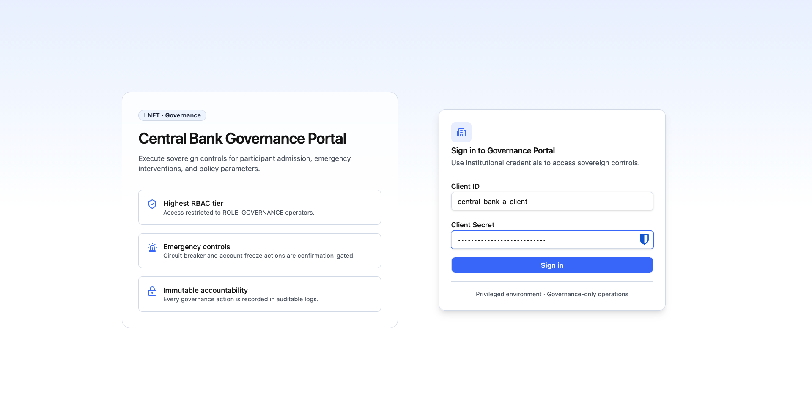
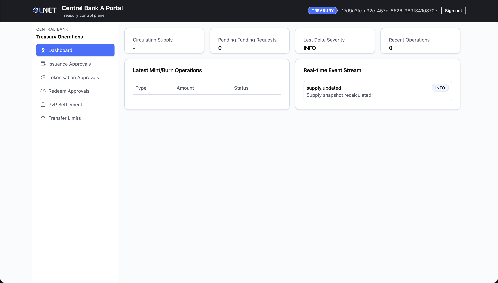
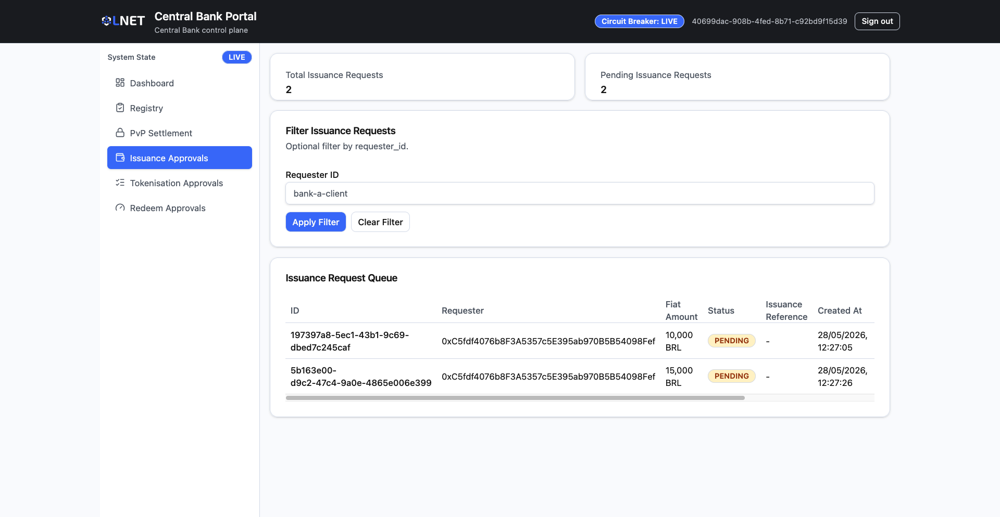
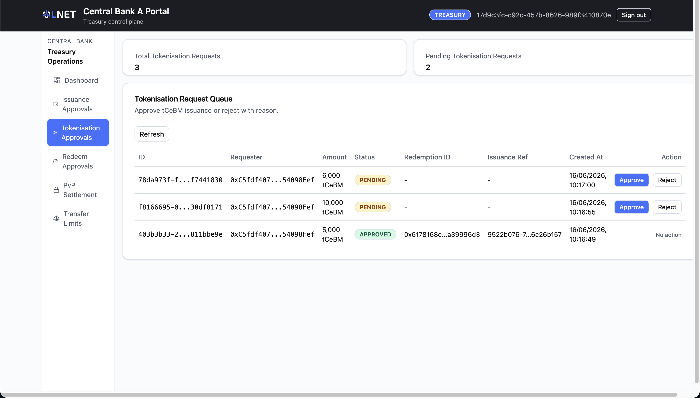
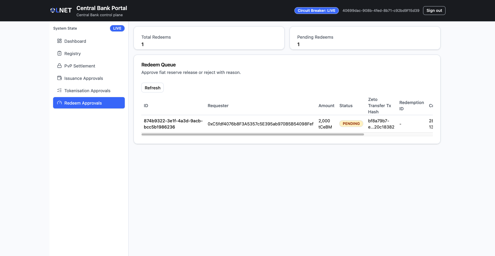
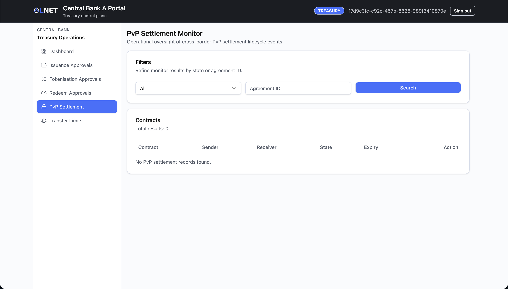
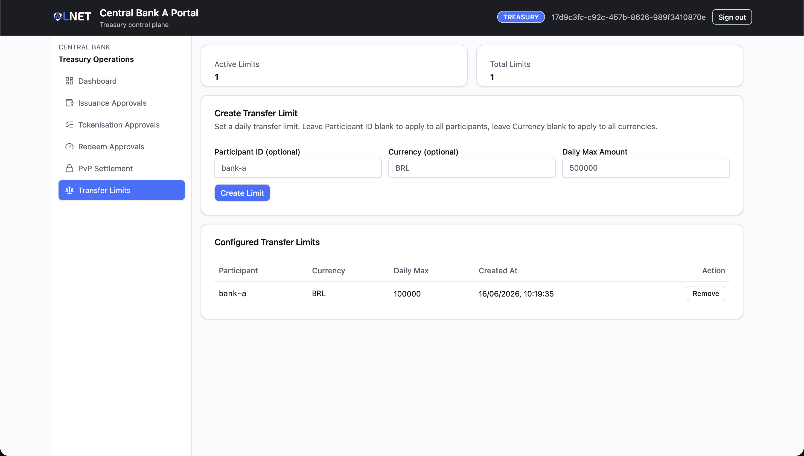

# Treasury Portal — User Manual (Scenario A)

**Audience:** Central bank treasury and issuance operators.
**Data source:** Live backend (real API Gateway) for all approval and monitoring screens.

---

## Table of Contents

1. [Overview](#1-overview)
2. [Access and Login](#2-access-and-login)
3. [Navigation](#3-navigation)
4. [Screens](#4-screens)
   - [Dashboard](#41-dashboard-)
   - [Issuance Approvals](#42-issuance-approvals-deposits-approval)
   - [Tokenisation Approvals](#43-tokenisation-approvals-escrows-approval)
   - [Redeems Approval](#44-redeems-approval-redeems-approval)
   - [HTLC Monitor](#45-htlc-monitor-htlc-monitor)
   - [Transfer Limits](#46-transfer-limits-transfer-limits)
5. [Screens not currently enabled](#5-screens-not-currently-enabled)
6. [Typical Workflows](#6-typical-workflows)
7. [Status Reference](#7-status-reference)
8. [Troubleshooting](#8-troubleshooting)

---

## 1. Overview

The Treasury Portal is the Central Bank's **operational control plane** for a CBWeb3 spoke. Treasury operators review and approve all actions that require Central Bank authority: minting tokenised fiat against bank deposit requests, converting tokenised fiat into tCeBM (the wholesale CBDC reserve token), authorising tCeBM redemptions back to fiat, and monitoring cross-border HTLC atomic settlements. The portal also provides a per-participant transfer-limit management screen.

### Role in the system

| Actor | Portal | Responsibilities |
|---|---|---|
| Central Bank Treasury Operator | Treasury Portal | Approve or reject issuance (deposit) requests, tokenisation (escrow) requests, and redemption (redeem) requests; monitor HTLC settlement lifecycle; manage transfer limits |

Every approval action in this portal is the counterpart to a request submitted by a commercial bank in the Bank Portal. The bank requests — the Central Bank approves — and only then does the relevant on-chain operation execute.

### Currency flow summary

```
Bank submits deposit request
  → Treasury approves (Issuance Approval) — tokenised fiat minted
    → Bank submits tokenisation (pledge) request
      → Treasury approves (Tokenisation Approval) — tokenised fiat burned, tCeBM minted
        → tCeBM in circulation

Bank submits redemption request
  → Treasury approves (Redeems Approval) — tCeBM burned, fiat released
```

> **Simulation note:** CBWeb3 operates in a simulation environment where real fiat currency does not exist on-chain. Tokenised fiat is a stand-in for the fiat collateral a commercial bank would deposit with the Central Bank in production. tCeBM is the actual CBDC token, always minted by burning tokenised fiat in a single atomic burn-to-mint operation. This maintains a 1:1 backing ratio at all times within the simulation.

---

## 2. Access and Login

Open the **Treasury Portal URL** provided by your system administrator in your browser and enter your institutional credentials.



| Field | Description |
|---|---|
| **Client ID** | Your operator client identifier (e.g., `central-bank-a-treasury-client`). |
| **Client Secret** | Your operator client secret. Minimum 6 characters. |

Click **Sign in**. On success, you are redirected to the Dashboard. If the account does not carry the `ROLE_TREASURY` claim, sign-in will succeed at the authentication layer but the portal will deny access with an authorisation error.

> **Session note:** Session credentials are held in memory only and are not persisted to local storage or across browser tabs. Opening the portal in a new browser tab requires a fresh sign-in.

> **PKI accounts:** Accounts that require PKI-certificate-based authentication cannot log in through this portal. Use a standard client-ID / client-secret treasury account.

---

## 3. Navigation

The sidebar provides access to all currently active screens.

| Sidebar label | Route | Notes |
|---|---|---|
| Dashboard | `/` | Landing page after login |
| Issuance Approvals | `/deposits-approval` | Approve or reject bank deposit / issuance requests |
| Tokenisation Approvals | `/escrows-approval` | Approve or reject burn-to-mint (pledge) requests |
| Redeems Approval | `/redeems-approval` | Approve or reject tCeBM redemption requests |
| PvP Settlement | `/htlc-monitor` | Read-only monitor of cross-border HTLC contracts |
| Transfer Limits | `/transfer-limits` | Create and remove per-participant daily transfer limits |

Any URL that does not match a known route redirects automatically to the Dashboard.

---

## 4. Screens

### 4.1 Dashboard (`/`)

The Dashboard is the landing page after login. It provides a live summary of supply metrics, pending work, recent mint/burn operations, and a real-time event stream.



#### Summary Cards

| Card | Description |
|---|---|
| **Circulating Supply** | Current tCeBM total circulating supply across this spoke. |
| **Pending Funding Requests** | Number of funding requests with status `PENDING` awaiting action. |
| **Last Delta Severity** | Severity level of the most recent reconciliation delta computation (`OK`, `WARNING`, or `CRITICAL`). |
| **Recent Operations** | Count of recent mint and burn operations recorded by the supply audit service. |

#### Latest Mint/Burn Operations Table

Displays the six most recent token operations (mints and burns), including operation type, amount, and confirmation status.

| Column | Description |
|---|---|
| **Type** | `MINT` or `BURN`. |
| **Amount** | Token amount involved in the operation. |
| **Status** | `CONFIRMED` (highlighted) or pending/other state. |

#### Real-time Event Stream

Displays the eight most recent events pushed from the backend over the live event connection. Events are classified by type and severity (`INFO`, `WARNING`, `CRITICAL`). The stream is read-only; no actions are available here.

---

### 4.2 Issuance Approvals (`/deposits-approval`)

When a commercial bank submits a request for the Central Bank to mint tokenised fiat — the first step in the currency lifecycle — that request appears on this page. Approving a request triggers the on-chain mint of tokenised fiat; it does not yet create tCeBM.



#### Summary Cards

| Card | Description |
|---|---|
| **Total Issuance Requests** | Total count of issuance requests across all statuses. |
| **Pending Issuance Requests** | Count of requests currently awaiting your action. |

#### Filter

Enter a **Requester ID** (e.g., `bank-a-client`) and click **Apply Filter** to narrow the table to a specific institution's requests. Click **Clear Filter** to reset.

#### Issuance Request Queue

| Column | Description |
|---|---|
| **ID** | Unique request identifier (truncated; hover for full value). |
| **Requester** | The commercial bank operator's identity (truncated; hover for full value). |
| **Fiat Amount** | The fiat collateral amount backing this issuance request. |
| **Status** | Current request status — see [Status Reference](#7-status-reference). |
| **Issuance Reference** | On-chain transaction hash of the tokenised fiat mint (populated after approval). |
| **Created At** | Timestamp when the bank submitted the request. |
| **Action** | Available actions based on current status. |

#### Available Actions

**Approve Issuance** — available for `PENDING` requests only.

1. Click **Approve Issuance** in the row's Action column. A confirmation panel appears at the bottom of the page showing the Request ID.
2. Review the Request ID carefully.
3. Click **Confirm Action** to proceed. The system approves the deposit record and immediately executes a fiat exchange (minting tokenised fiat). On success, a toast notification confirms approval and displays the first and last characters of the mint transaction hash.

> Approval is an on-chain action. Confirm the requester and amount before confirming — the action cannot be undone.

**Reject** — available for `PENDING` requests only.

1. Click **Reject** in the row's Action column. A rejection panel appears at the bottom of the page.
2. Type a rejection reason in the text area (minimum 3 characters).
3. Click **Confirm Reject**. The status changes to `REJECTED` and no tokens are minted.

**Retry Mint** — available for `MINT_FAILED` requests only.

The approval step succeeded but the on-chain fiat exchange (mint) failed. Click **Retry Mint** to re-attempt the mint operation without requiring a new approval decision.

---

### 4.3 Tokenisation Approvals (`/escrows-approval`)

After the Central Bank approves an issuance request (tokenised fiat minted), the commercial bank submits a **tokenisation request** (also referred to as a pledge). This requests the burn-to-mint operation: tokenised fiat is burned and an equivalent amount of tCeBM (CBDC) is minted to the bank's wallet. This page manages those requests.



#### Summary Cards

| Card | Description |
|---|---|
| **Total Tokenisation Requests** | Total count of tokenisation requests across all statuses. |
| **Pending Tokenisation Requests** | Count of requests currently awaiting your action. |

#### Tokenisation Request Queue

| Column | Description |
|---|---|
| **ID** | Unique request identifier (truncated; hover for full value). |
| **Requester** | The commercial bank operator's identity. |
| **Amount** | The amount of tCeBM to be minted (and the equivalent tokenised fiat to be burned). |
| **Status** | Current request status — see [Status Reference](#7-status-reference). |
| **Redemption ID** | Transaction hash of the burn operation (populated after approval). |
| **Issuance Ref** | Transaction hash of the tCeBM mint operation (populated after approval). |
| **Created At** | Timestamp of submission. |
| **Action** | Available actions. |

#### Available Actions

**Approve** — available for `PENDING` requests only.

1. Click **Approve** in the row's Action column. A confirmation panel appears.
2. Click **Confirm Approve**. The burn-to-mint operation executes atomically: tokenised fiat is burned and tCeBM is minted. On success, a toast notification displays the first and last characters of both the burn transaction hash (Redemption) and the mint transaction hash (Issuance).

**Reject** — available for `PENDING` requests only.

1. Click **Reject** in the row's Action column. A rejection panel appears.
2. Type a rejection reason (minimum 3 characters).
3. Click **Confirm Reject**. The status changes to `REJECTED`.

Click **Refresh** at any time to manually reload the tokenisation queue from the backend.

---

### 4.4 Redeems Approval (`/redeems-approval`)

When a commercial bank wishes to convert tCeBM back to fiat reserves, it submits a redemption request. This page is where those requests are reviewed and the fiat release is authorised.



#### Summary Cards

| Card | Description |
|---|---|
| **Total Redeems** | Total count of redemption requests across all statuses. |
| **Pending Redeems** | Count of requests currently awaiting your action. |

#### Redeem Queue

| Column | Description |
|---|---|
| **ID** | Unique request identifier (truncated; hover for full value). |
| **Requester** | The commercial bank operator's identity. |
| **Amount** | The amount of tCeBM to be redeemed. |
| **Status** | Current request status — see [Status Reference](#7-status-reference). |
| **Zeto Transfer Tx Hash** | Transaction hash of the privacy-preserving Zeto token transfer previously executed by the privacy proxy (system-populated). |
| **Redemption ID** | Transaction hash of the fiat mint/release (populated after approval). |
| **Created At** | Timestamp of submission. |
| **Action** | Available actions. |

#### Available Actions

**Approve** — available for `PENDING` requests only.

1. Click **Approve** in the row's Action column. A confirmation panel appears showing the Redeem ID.
2. Click **Confirm Approve** to authorise the fiat release. On success, a toast notification displays the first and last characters of the fiat mint transaction hash (Redemption ID).

**Reject** — available for `PENDING` requests only.

1. Click **Reject** in the row's Action column. A rejection panel appears.
2. Provide a mandatory rejection reason.
3. Click **Confirm Reject**.

Click **Refresh** at any time to manually reload the redeem queue.

---

### 4.5 HTLC Monitor (`/htlc-monitor`)

This page provides a **read-only** view of all cross-border atomic settlement contracts (Hash Time Lock Contracts — HTLCs) tracked by the system. No approval actions are available here; it is used for oversight and auditing of the PvP settlement lifecycle.



#### Filters

| Filter | Description |
|---|---|
| **State** | Dropdown to filter by contract state: All, Pending Settlement, Processing, Settled, Revoking, Revoked. |
| **Agreement ID** | Text input to search for contracts linked to a specific FX agreement identifier. |

Click **Search** to apply the selected filters.

#### Contracts Table

| Column | Description |
|---|---|
| **Contract** | Unique identifier for the HTLC contract. |
| **Sender** | Paladin identity of the initiating commercial bank. |
| **Receiver** | Paladin identity of the receiving commercial bank. |
| **State** | Current contract state — see [Status Reference](#7-status-reference). |
| **Expiry** | Timestamp after which the contract can be revoked if not yet settled. |
| **Action** | **View details** button. |

The total number of results matching the current filters is displayed above the table.

#### Contract Detail Panel

Click **View details** on any row to expand a detail panel below the contracts table.

| Field | Description |
|---|---|
| **Sender** | Initiating bank's Paladin identity. |
| **Receiver** | Receiving bank's Paladin identity. |
| **Settlement Code** | The hash lock used to secure the atomic swap. |
| **Settlement Expiry** | The settlement window expiry timestamp. |
| **State** | Current contract state. |
| **Settlement Reference** | On-chain reference of the Zeto lock (populated when the contract progresses). |
| **Completion Code** | The secret pre-image — shown as `[restricted]` when present. |

Click **Close** to dismiss the detail panel.

> This screen is for oversight only. Completing or revoking a settlement is performed by the participating banks in the Bank Portal, not here. If a contract appears stuck, refer to [Troubleshooting](#8-troubleshooting).

---

### 4.6 Transfer Limits (`/transfer-limits`)

This screen allows treasury operators to create and remove daily transfer limits for participants. Limits can be scoped to a specific participant and/or currency, or applied globally.



#### Summary Cards

| Card | Description |
|---|---|
| **Active Limits** | Number of currently active transfer limits. |
| **Total Limits** | Total number of configured limits (including inactive). |

#### Create Transfer Limit

| Field | Required | Description |
|---|---|---|
| **Participant ID** | Optional | The participant identifier to apply the limit to (e.g., `bank-a`). If left blank, the limit applies to all participants. |
| **Currency** | Optional | The currency to restrict (e.g., `BRL`). If left blank, the limit applies to all currencies. |
| **Daily Max Amount** | Required | The maximum transfer amount per day for the scope defined by the above fields. |

Click **Create Limit** to save. On success, a toast confirms creation and the new limit appears in the table below.

> A limit with both Participant ID and Currency blank acts as a global cap affecting all participants and currencies. Use this configuration with care.

#### Configured Transfer Limits Table

| Column | Description |
|---|---|
| **Participant** | Participant ID the limit applies to, or "all participants" if global. |
| **Currency** | Currency the limit applies to, or "all currencies" if unconstrained. |
| **Daily Max** | The configured daily maximum transfer amount. |
| **Created At** | When the limit was created. |
| **Action** | **Remove** button. |

**Removing a limit:** Click **Remove** in the row's Action column. A confirmation panel appears. Click **Confirm Remove** to permanently delete the limit. This action is irreversible.

---

## 5. Screens Not Currently Enabled

The following pages exist in the codebase but are **not wired into the current application routes** and are therefore inaccessible from the sidebar or by URL. Do not present them as working.

| Screen | Route | Status |
|---|---|---|
| Issuance (direct mint form) | `/issuance` | Disabled — direct issuance is handled via Issuance Approvals |
| Redemption (direct burn form) | `/redemption` | Disabled — redemptions are handled via Redeems Approval |
| Funding Requests | `/funding-requests` | Disabled |
| Reconciliation | `/reconciliation` | Disabled |
| Audit | `/audit` | Disabled |
| Settings | `/settings` | Disabled |

These screens may be enabled in future releases.

---

## 6. Typical Workflows

### 6.1 Approving a Bank's Issuance (Deposit) Request

This is the most frequent treasury action. A commercial bank has submitted a deposit request and is waiting for tokenised fiat to be minted.

1. Navigate to **Issuance Approvals** (`/deposits-approval`).
2. Confirm the **Pending Issuance Requests** card shows a non-zero count.
3. Review the request table. Identify rows with status `PENDING`.
4. Optionally filter by **Requester ID** to isolate a specific bank's requests.
5. In the target row, click **Approve Issuance**.
6. In the confirmation panel, verify the Request ID.
7. Click **Confirm Action**.
8. Wait for the success toast confirming approval and the fiat exchange transaction hash.
9. Verify that the row's status has changed from `PENDING` to `APPROVED` and that the **Issuance Reference** column now contains a transaction hash.

If the row transitions to `MINT_FAILED` instead, use the **Retry Mint** action — see [Troubleshooting](#8-troubleshooting).

---

### 6.2 Approving a Tokenisation (Pledge) Request

After an issuance is approved, the bank submits a pledge to convert tokenised fiat into tCeBM.

1. Navigate to **Tokenisation Approvals** (`/escrows-approval`).
2. Identify rows with status `PENDING`.
3. Click **Approve** in the target row.
4. In the confirmation panel, click **Confirm Approve**.
5. Wait for the success toast displaying both the burn transaction hash (Redemption) and the mint transaction hash (Issuance Ref).
6. Verify the row status changes to `APPROVED` and both hash columns are populated.

---

### 6.3 Approving a Redemption Request

A commercial bank has submitted a request to redeem tCeBM back to fiat.

1. Navigate to **Redeems Approval** (`/redeems-approval`).
2. Identify rows with status `PENDING`.
3. Review the **Requester**, **Amount**, and **Zeto Transfer Tx Hash** (confirming that the privacy-preserving transfer has already been executed by the system).
4. Click **Approve** in the target row.
5. In the confirmation panel, click **Confirm Approve**.
6. Wait for the success toast displaying the fiat release transaction hash.
7. Verify the row status changes to `APPROVED` and the **Redemption ID** column is populated.

---

### 6.4 Rejecting Any Request

The reject flow is identical across all three approval queues.

1. Navigate to the relevant approvals page.
2. Click **Reject** in the target row's Action column.
3. In the rejection panel, type a clear, descriptive reason (minimum 3 characters).
4. Click **Confirm Reject**.
5. Verify the row status changes to `REJECTED`.

The rejection reason is recorded in the backend and is visible to the requesting institution.

---

### 6.5 Monitoring the HTLC Settlement Lifecycle

1. Navigate to **PvP Settlement** (`/htlc-monitor`).
2. Use the **State** dropdown to filter by contract state (e.g., **Pending Settlement** to see contracts awaiting receiver action).
3. Use the **Agreement ID** input to locate contracts tied to a known FX agreement.
4. Click **Search** to apply filters.
5. Click **View details** on any contract to see the hash lock, expiry, Zeto lock reference, and current state.
6. Click **Close** to return to the contracts table.

If a contract is stuck in `PENDING_SETTLEMENT` past its expiry, the counterparty bank must initiate revocation from the Bank Portal. Refer to [Troubleshooting](#8-troubleshooting).

---

### 6.6 Setting a Daily Transfer Limit for a Participant

1. Navigate to **Transfer Limits** (`/transfer-limits`).
2. In the **Create Transfer Limit** form, enter the **Participant ID** (e.g., `bank-a`) and/or **Currency** (e.g., `BRL`). Leave either blank for a global scope.
3. Enter the **Daily Max Amount**.
4. Click **Create Limit**.
5. Verify the new limit appears in the **Configured Transfer Limits** table with the correct participant, currency, and amount.

---

## 7. Status Reference

### Issuance / Tokenisation / Redeem Request Statuses

| Status | Meaning | Next Step |
|---|---|---|
| `PENDING` | Request submitted by the bank; awaiting your action. | Approve or Reject. |
| `APPROVED` | Request approved; on-chain operation completed successfully. | No action required. |
| `REJECTED` | Request rejected by a treasury operator; a reason is recorded. | No further action. The bank must submit a new request if needed. |
| `MINT_FAILED` | Approval was granted but the on-chain mint transaction failed. | Use **Retry Mint** (Issuance Approvals only). Investigate backend and node connectivity. |

### HTLC Contract States

| State (displayed) | Internal state | Meaning |
|---|---|---|
| Pending Settlement | `HTLC_STATE_LOCKED` | Contract locked; waiting for the receiver to claim by revealing the pre-image. |
| Processing | `HTLC_STATE_SETTLING` | Settlement or revocation is being processed on-chain. |
| Settled | `HTLC_STATE_SETTLED` | Atomic swap completed successfully; funds delivered to the receiver. |
| Revoking | `HTLC_STATE_REFUNDING` | Timelock expired; revocation in progress. |
| Revoked | `HTLC_STATE_REFUNDED` | Funds returned to the sender after settlement window expiry. |

---

## 8. Troubleshooting

### Login fails with "unauthorized" or access is denied

- Verify that the Client ID and Client Secret are correct.
- Confirm the treasury operator account exists and carries the `ROLE_TREASURY` claim. Accounts without this claim will be rejected after authentication.
- Accounts requiring PKI-certificate authentication cannot log in here. Use a standard client-ID/client-secret treasury account.
- Confirm the spoke backend services are running (`docker compose ps` from the relevant `deploy/local/` directory).

### An approval request does not appear in the queue

- Click the **Refresh** button (available on the Tokenisation and Redeems pages) or reload the page. The page does not auto-refresh on all queues.
- Confirm the commercial bank has completed their request submission from the Bank Portal and that the request shows a valid Request ID on their side.
- Check the **Requester ID** filter is not limiting the displayed results.

### Approval action fails with an error toast

- Note the error message shown in the toast notification — it typically contains the root cause.
- Confirm the API Gateway is reachable.
- If the on-chain mint fails and the request transitions to `MINT_FAILED`, use **Retry Mint** rather than creating a new approval.

### A request shows `MINT_FAILED`

1. Note the Request ID.
2. Check the backend API Gateway and Besu node logs for the failed transaction.
3. Confirm the Central Bank signer account has sufficient gas.
4. Once the issue is resolved, click **Retry Mint** in the row's Action column on the Issuance Approvals page.

### Status does not update after approval

- Wait several seconds for the on-chain transaction to confirm on the Besu network.
- Click **Refresh** or reload the page. The list will reflect the updated status on the next fetch.

### A PvP settlement is stuck in Pending Settlement

- This screen is read-only; treasury operators cannot complete or revoke settlements.
- Check whether the settlement window has expired (the **Expiry** column). If it has, the sending bank must initiate revocation from the Bank Portal.
- If the expiry has not passed, the receiving bank must complete the settlement from their Bank Portal.
- If a cross-spoke settlement appears frozen before expiry, check the relay (Cacti hub-and-spoke) logs for event propagation issues.

### The Real-time Event Stream on the Dashboard shows no events

- The event stream uses a server-sent event connection to the backend. If the connection drops, events stop arriving.
- Reload the page to re-establish the connection.
- Confirm the backend services are running and reachable.
