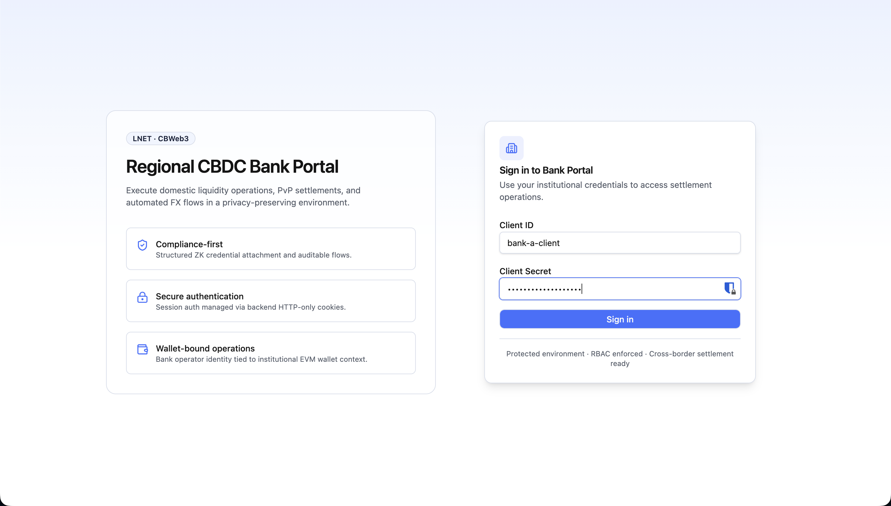
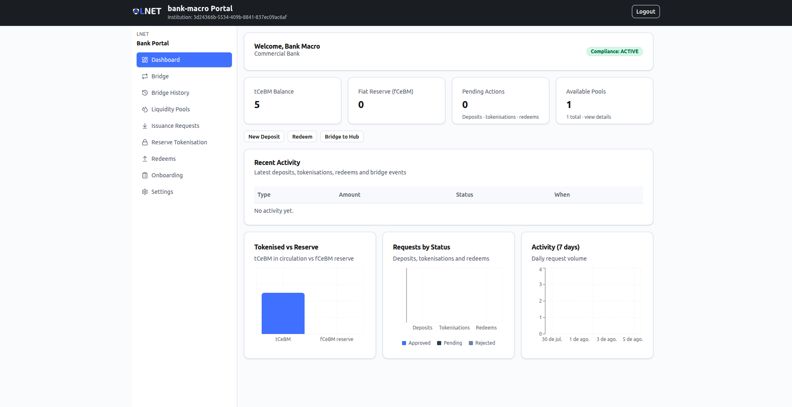
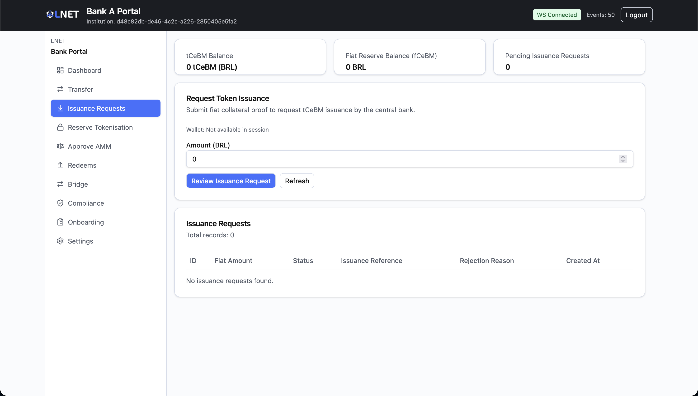
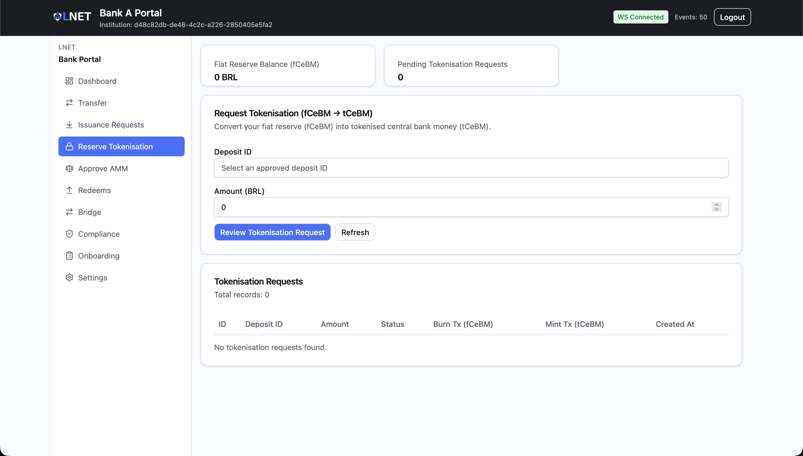
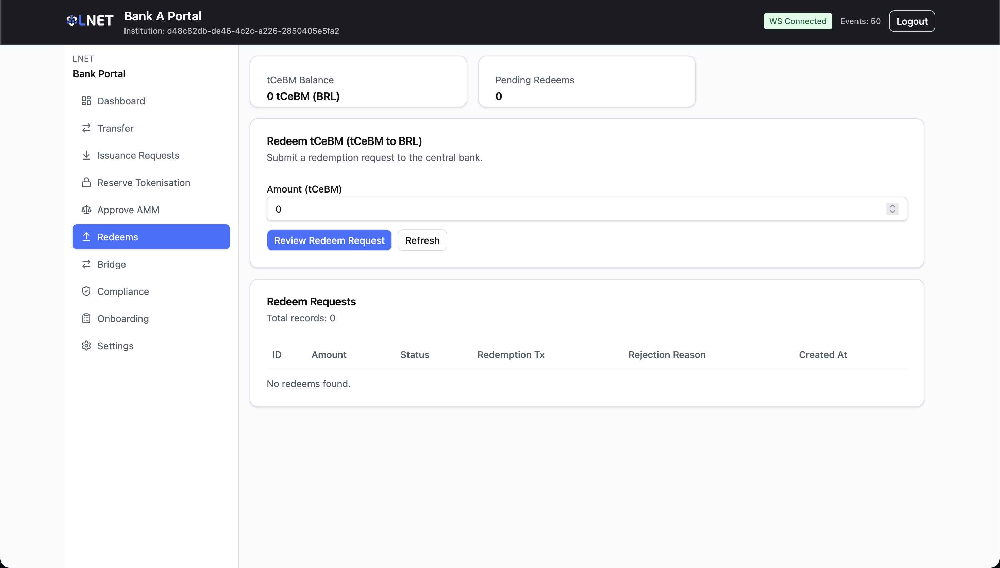
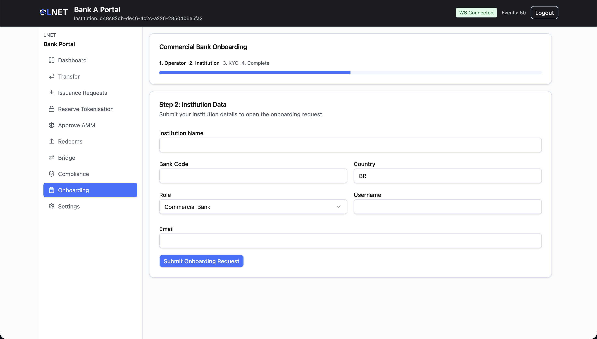
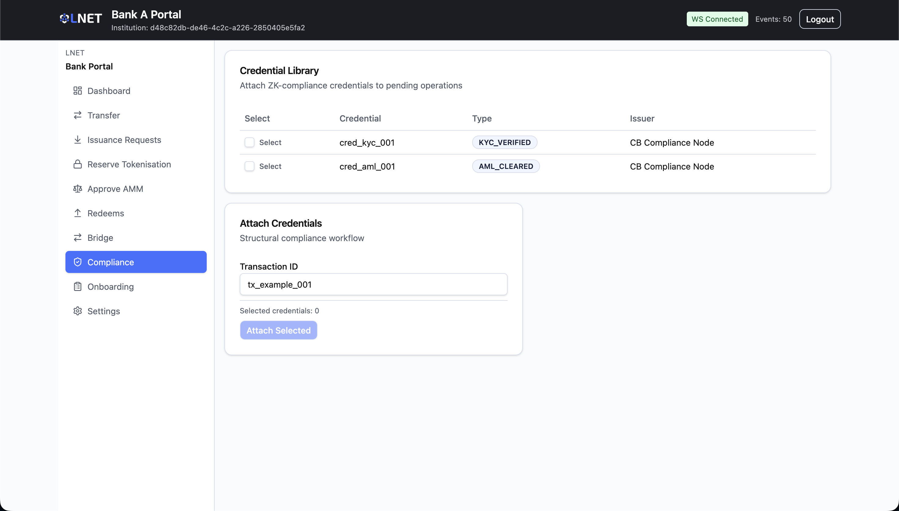

# Bank Portal — User Manual (Scenario B)

**Audience:** Commercial bank operators participating in the International Hub.
**Scenario:** Scenario B — International Hub (FXAgreement + AMM + Bridge).
**Data source:** Live backend (real API Gateway) for all operational screens.

---

## Table of Contents

1. [Overview](#1-overview)
2. [Access and Login](#2-access-and-login)
3. [Navigation](#3-navigation)
4. [Screens](#4-screens)
   - 4.1 [Dashboard](#41-dashboard)
   - 4.2 [Bridge (`/bridge`)](#42-bridge-bridge)
   - 4.3 [Bridge History (`/bridge/history`)](#43-bridge-history-bridgehistory)
   - 4.4 [Liquidity Pools (`/pools`)](#44-liquidity-pools-pools)
   - 4.5 [Issuance Requests / Deposits (`/deposits`)](#45-issuance-requests--deposits-deposits)
   - 4.6 [Reserve Tokenisation / Escrows (`/escrows`)](#46-reserve-tokenisation--escrows-escrows)
   - 4.7 [Redeems (`/redeems`)](#47-redeems-redeems)
   - 4.8 [Onboarding (`/onboarding`)](#48-onboarding-onboarding)
   - 4.9 [Settings (`/settings`)](#49-settings-settings)
   - 4.10 [Compliance (`/compliance`) — not in sidebar](#410-compliance-compliance--not-in-sidebar)
5. [Typical Workflows](#5-typical-workflows)
   - 5.1 [Getting started: obtain tCeBM](#51-getting-started-obtain-tcebm)
   - 5.2 [Send a cross-currency payment (Bridge)](#52-send-a-cross-currency-payment-bridge)
   - 5.3 [Redeem tCeBM for fiat](#53-redeem-tcebm-for-fiat)
6. [Status Reference](#6-status-reference)
7. [Troubleshooting](#7-troubleshooting)

---

## 1. Overview

The Bank Portal is the day-to-day operational interface for a commercial bank operator in **Scenario B — International Hub**. Unlike Scenario A (which settles value bilaterally between two spokes using HTLC), Scenario B routes cross-border value through a shared **Hub** equipped with an **Automated Market Maker (AMM)** for FX. A commercial bank sends value through the **Bridge**, a single cross-currency operation over a liquidity pool that the Central Banks provision: the bank spends its own sovereign currency (tCeBM) and the beneficiary receives the pool counterpart currency on its spoke.

The end-to-end operational lifecycle is:

1. **Onboard** your institution with the Central Bank (one-time).
2. **Request tCeBM issuance** by submitting a fiat collateral proof (Issuance Requests page).
3. **Tokenise** the approved fiat reserve into tCeBM (Reserve Tokenisation page).
4. **Bridge** value cross-border by selecting a liquidity pool, obtaining a quote, and executing the swap (Bridge page).
5. **Redeem** tCeBM back to fiat when needed (Redeems page).

| Actor | Portal | Role |
|---|---|---|
| Commercial Bank Operator | Bank Portal (this portal) | Manages tCeBM balances, issuance, tokenisation, redemption, and cross-currency bridge operations |
| Central Bank Governance Operator | Governance Portal | Approves onboarding KYC, issuance, tokenisation, and redeem requests; provisions and seeds liquidity pools |

---

## 2. Access and Login

**Route:** `/login`

Open the Bank Portal URL provided by your administrator. You will land on the **Sign in to Bank Portal** screen.



Fill in both fields and click **Sign in**:

| Field | Description |
|---|---|
| **Client ID** | The institutional client identifier provided by the Central Bank (minimum 3 characters). |
| **Client Secret** | The corresponding credential secret (minimum 6 characters). |

Authentication is managed via backend HTTP-only session cookies. On success you are redirected to the Dashboard.

> If sign-in fails immediately with correct credentials, confirm your institution's onboarding status is `ACTIVE`. New institutions must complete onboarding before they can access operational screens.

---

## 3. Navigation

The left-hand sidebar lists all screens available in Scenario B:

| Sidebar label | Route | Purpose |
|---|---|---|
| **Dashboard** | `/` | Real-time overview of balances, pool availability, and recent activity |
| **Bridge** | `/bridge` | Send a cross-currency payment over a Hub liquidity pool |
| **Bridge History** | `/bridge/history` | Read-only history of your cross-currency bridge operations |
| **Liquidity Pools** | `/pools` | Read-only view of the pools your spoke can operate |
| **Issuance Requests** | `/deposits` | Request the Central Bank to issue tCeBM |
| **Reserve Tokenisation** | `/escrows` | Convert approved fiat reserve (fCeBM) into tCeBM |
| **Redeems** | `/redeems` | Convert tCeBM back to fiat |
| **Onboarding** | `/onboarding` | Institution registration wizard |
| **Settings** | `/settings` | Portal environment information |

> The **Compliance** page (`/compliance`) is accessible by direct URL but is not shown in the sidebar. It is described in section 4.10.

---

## 4. Screens

### 4.1 Dashboard

**Route:** `/` · **Sidebar label:** Dashboard


<!-- SCREENSHOT-UPDATE: ../img/scenario-b/bank/02-dashboard.png — KPI row now shows "Available Pools" (not "Bridged to Hub"), the circuit-breaker/FX-proposals status strip and Bridge Positions panel were removed, and quick actions reduced to New Deposit / Redeem / Bridge to Hub -->

The Dashboard provides a real-time summary of your institution's position. It refreshes pool availability and bridge activity every 30 seconds automatically.

**Identity / context card**

Displays a welcome line with your institution name (or bank ID), your country, wallet address (truncated), roles, and a **Compliance** status badge derived from your onboarding state.

**KPI row**

| Card | What it shows |
|---|---|
| **tCeBM Balance** | Your current on-chain tCeBM token balance. |
| **Fiat Reserve (fCeBM)** | Your current fCeBM (fiat-backed reserve token) balance. |
| **Pending Actions** | Combined count of deposits, tokenisations, and redeems in PENDING status. |
| **Available Pools** | Number of pools currently `ACTIVE`, with the total pool count. This card links to the Liquidity Pools page. |

**Quick actions**

Shortcut buttons to: New Deposit, Redeem, and Bridge to Hub.

**Recent Activity table**

Chronological list (up to 8 records) of deposits, tokenisations, redeems, and bridge events, with type, amount, status badge, and timestamp.

**Charts**

Three bar charts summarising: **Tokenised vs Reserve** balance comparison, **Requests by Status** (Pending/Approved/Rejected) across deposits/tokenisations/redeems, and **Activity (7 days)** — daily request volume over the past 7 days.

---

### 4.2 Bridge (`/bridge`)

**Route:** `/bridge` · **Sidebar label:** Bridge

<!-- SCREENSHOT-NEW: ../img/scenario-b/bank/03-bridge.png — the Bridge (cross-currency) page: pool selector with fixed direction, Get Quote, and Execute Bridge steps -->

This is the primary screen for sending a **cross-currency payment** over a Hub liquidity pool. The bridge combines the bridge-in, swap, and bridge-out into one operation: your sovereign tCeBM is spent on the source spoke, swapped at the Hub for the target currency, and delivered to the beneficiary's spoke.

Direction is **not** user-selectable. Your institution always spends its own sovereign currency (the source); the beneficiary receives the pool counterpart (the target). Only pools that include your sovereign currency are listed.

**Step 1 — Select Pool**

| Field | Description |
|---|---|
| **Liquidity Pool** | Drop-down of `ACTIVE` pools that include your sovereign currency (for example `BRL ⇄ ARS`). |
| **Direction (fixed by sovereignty)** | Read-only. Shows `<source> → <target>`; you spend your sovereign currency and the beneficiary receives the counterpart. |

When a pool is selected, a status banner shows whether it is `ACTIVE` (with current reserves for each side) or another lifecycle state. The page polls pool status every 30 seconds.

**Step 2 — Get Quote**

| Field | Description |
|---|---|
| **Amount Out** | The amount the beneficiary should receive, in the target currency (exact-output). |

Click **Get Quote**. The Quote Details card appears showing:

| Field | Description |
|---|---|
| **Effective Rate** | The implied exchange rate for this swap. |
| **Amount In** | How much of your source currency you will spend. |
| **Amount Out** | The target amount you entered. |
| **TTL** | Seconds remaining before the quote expires. |

> Quotes expire. If the TTL reaches zero before you execute, the Execute Bridge button becomes disabled — re-submit the Get Quote form to obtain a fresh quote. Quotes are also auto-refreshed in the background; when that happens a banner reads *"Quote was refreshed. Review and confirm again."*

**Step 3 — Execute Bridge**

Once a valid quote is shown:

| Field | Description |
|---|---|
| **Max Amount In** | Your slippage ceiling — the maximum source currency you will allow the swap to consume. Enter a value manually or click **Use Suggested Max** to fill in the quote amount plus slippage buffer. |
| **Beneficiary Bank ID** | The bank identifier of the recipient institution (for example `bank-macro`). |

Click **Execute Bridge**. The button is disabled if the pool is not `ACTIVE`, if no quote is loaded, if the quote has expired, or if any required field is empty.

**Bridge Progress**

While the bridge is in flight, a four-step progress indicator is shown:

| Step | Meaning |
|---|---|
| **BRIDGE IN PROGRESS** | Your tCeBM is being locked on your spoke. |
| **SWAP IN PROGRESS** | The AMM swap is executing on the Hub. |
| **BRIDGE OUT PROGRESS** | The swapped tokens are being delivered on the beneficiary's spoke. |
| **COMPLETED** | The bridge has settled end-to-end. |

On completion, the **Bridge Completed** card shows the bridge transaction hash, amounts in and out, and a correlation ID. Click **New Bridge** to start another operation.

**Bridge errors**

If the operation fails, a **Bridge Failed** card shows a plain-language message and a **Try Again** button. Common causes:

| Error | What it means | Action |
|---|---|---|
| Circuit breaker paused | The pool is paused by a Central Bank. | Wait for governance to resume, then retry. |
| Slippage limit exceeded | Price moved beyond your Max Amount In. | Re-quote and retry. |
| Bridge in failed | Funds could not be locked on the source network; the operation was rolled back and no funds were lost. | Retry. |
| Insufficient pool liquidity | Pool reserves too low for this amount. | Try a smaller amount or wait for the Central Bank to add liquidity. |
| Quote expired | Quote expired during submission; a new quote was auto-fetched. | Review the refreshed quote and confirm again. |
| Swap failed | The swap transaction failed on the Hub; no funds were moved. | Retry. |
| Daily transfer limit reached | Your Central Bank has set a volume cap for today. | Contact your Central Bank to adjust the limit. |

---

### 4.3 Bridge History (`/bridge/history`)

**Route:** `/bridge/history` · **Sidebar label:** Bridge History

<!-- SCREENSHOT-NEW: ../img/scenario-b/bank/11-bridge-history.png — the Bridge History page: date filters and the paginated operations table -->

A **read-only** history of the cross-currency bridge operations initiated by your institution.

**Filters**

| Control | Description |
|---|---|
| **From** / **To** | Date range. Changing either resets to the first page. |
| **Clear** | Resets both date filters. |

A counter shows the total number of operations matching the current filter.

**Operations table**

| Column | Description |
|---|---|
| **When** | Timestamp the operation was created. |
| **Route** | Source → target currency, with the beneficiary bank ID beneath it. |
| **Sent** | Amount spent, in the source currency. |
| **Received** | Amount delivered, in the target currency. |
| **Rate** | Effective exchange rate applied. |
| **Status** | Status badge (see below). |
| **Tx** | Bridge transaction hash (truncated). |

Results are paginated (20 rows per page) with **Prev** / **Next** controls.

**Status badges**

| Badge | Meaning |
|---|---|
| **Completed** | Operation settled end-to-end. |
| **Failed** | Operation errored (hover the badge for the failure reason). |
| **Quoting** | A quote is being prepared. |
| **Bridging in** | Funds are being locked on the source spoke. |
| **Swapping** | The AMM swap is executing on the Hub. |
| **Bridging out** | Swapped tokens are being delivered on the beneficiary's spoke. |

---

### 4.4 Liquidity Pools (`/pools`)

**Route:** `/pools` · **Sidebar label:** Liquidity Pools

<!-- SCREENSHOT-NEW: ../img/scenario-b/bank/12-pools.png — the Liquidity Pools page: summary cards, pool list, and the selected-pool detail panel -->

A **read-only** view of the cross-currency pools your spoke can operate — that is, pools whose Central Bank created a corridor that includes your sovereign currency. The page polls live pool and circuit-breaker data every 15 seconds.

**Summary cards**

| Card | What it shows |
|---|---|
| **Pools listed** | Number of pools your spoke can operate. |
| **Active** | Pools currently in `ACTIVE` status. |
| **Paused (circuit breaker)** | Pools whose circuit breaker is `HALTED`. |

**Pool list**

A selectable list of pools, each showing the currency pair, a pool-status badge (`Active`, `Awaiting counterpart`, `Empty`, or the raw state), and a circuit-breaker indicator (`Live` / `Paused`).

**Pool detail panel**

Selecting a pool opens a detail panel:

- **Circuit breaker banner** — `Operational` (LIVE), `Paused` (HALTED, with reason and initiator where available), or `Resume pending` (RESUME_PENDING, awaiting the 2-of-N Central Bank quorum).
- **Reserves** — a balance bar and per-side reserve amounts, with an **Imbalanced** badge when the pool flags an imbalance.
- **Metrics** — Current ratio, Fee rate, Liquidity providers, Pool state, and Last updated.
- **On-chain references** — AMM contract address, both token addresses (click to copy), and the Proposer/Confirmer Central Bank identifiers where present.

---

### 4.5 Issuance Requests / Deposits (`/deposits`)

**Route:** `/deposits` · **Sidebar label:** Issuance Requests



Use this screen to request the Central Bank to **issue tCeBM** against your fiat collateral. The top of the screen shows your current tCeBM balance, fiat reserve (fCeBM) balance, and count of pending issuance requests.

**Submitting a request**

1. Enter the **Amount** in fiat currency units.
2. Click **Review Issuance Request**.
3. A confirmation card appears with the formatted amount. Click **Confirm Request** to submit, or **Cancel** to go back.
4. On success a toast notification shows the assigned request ID.

**Issuance Requests table**

| Column | Description |
|---|---|
| **ID** | Unique request identifier. |
| **Fiat Amount** | The amount submitted. |
| **Status** | Current status badge (see [Status Reference](#6-status-reference)). |
| **Issuance Reference** | On-chain transaction hash once approved and minted (truncated). |
| **Rejection Reason** | Populated when the Central Bank rejects the request. |
| **Created At** | Submission timestamp. |

> tCeBM is minted only after the Central Bank approves the request from the Governance Portal. The page does not auto-refresh — click **Refresh** to update balances and statuses.

---

### 4.6 Reserve Tokenisation / Escrows (`/escrows`)

**Route:** `/escrows` · **Sidebar label:** Reserve Tokenisation



After a deposit (issuance request) is approved, use this screen to **convert the approved fiat reserve (fCeBM) into tCeBM**. The top of the screen shows your fCeBM balance and count of pending tokenisation requests.

**Submitting a tokenisation request**

1. Enter or select the **Deposit ID** of an approved deposit (a drop-down datalist shows approved IDs with their amounts).
2. Enter the **Amount** to tokenise (in fiat currency units).
3. Click **Review Tokenisation Request**.
4. A confirmation card shows the fCeBM amount being converted and the equivalent tCeBM. Click **Confirm Request** to submit, or **Cancel** to go back.

**Tokenisation Requests table**

| Column | Description |
|---|---|
| **ID** | Unique tokenisation request identifier. |
| **Deposit ID** | The parent deposit this request is linked to. |
| **Amount** | The fCeBM amount being converted. |
| **Status** | Current status badge. |
| **Burn Tx (fCeBM)** | Transaction hash of the fCeBM burn (truncated). |
| **Mint Tx (tCeBM)** | Transaction hash of the tCeBM mint (truncated). |
| **Created At** | Submission timestamp. |

> The Central Bank must approve the tokenisation request before the on-chain burn/mint executes. Click **Refresh** to update.

---

### 4.7 Redeems (`/redeems`)

**Route:** `/redeems` · **Sidebar label:** Redeems



Use this screen to **convert tCeBM back to fiat**. The top of the screen shows your tCeBM balance and count of pending redeem requests.

**Submitting a redeem request**

1. Enter the **Amount** of tCeBM to redeem.
2. Click **Review Redeem Request**.
3. A confirmation card shows the tCeBM amount being submitted for fiat reserve release. Click **Confirm Request** to submit, or **Cancel** to go back.
4. On success a toast notification shows the assigned redeem request ID.

**Redeem Requests table**

| Column | Description |
|---|---|
| **ID** | Unique redeem request identifier. |
| **Amount** | The tCeBM amount submitted. |
| **Status** | Current status badge. |
| **Redemption Tx** | On-chain transaction hash of the redemption (truncated). |
| **Rejection Reason** | Populated when the Central Bank rejects the request. |
| **Created At** | Submission timestamp. |

> The Central Bank must approve the redeem from the Governance Portal before fiat is released. Click **Refresh** to update.

---

### 4.8 Onboarding (`/onboarding`)

**Route:** `/onboarding` · **Sidebar label:** Onboarding



The Onboarding Wizard registers a new commercial bank with the Central Bank and provisions its on-chain wallet. This is a one-time process. Until onboarding completes and the institution status reaches `ACTIVE`, the operational screens are inaccessible.

For the full step-by-step onboarding procedure, see the [ONBOARDING-DOCS runbook](../../../scenario-b/docs/runbooks/ONBOARDING-DOCS.md).

**Wizard stages**

```
1. Operator  →  2. Institution  →  3. KYC  →  4. Complete
```

| Stage | Description |
|---|---|
| **1. Operator Confirmation** | Confirms the signed-in operator identity before proceeding. Click **Start Onboarding**. |
| **2. Institution Data** | Fill in Institution Name, Bank Code, Country, Role, Username, and Email. Click **Submit Onboarding Request**. |
| **3. KYC Approval** | Waiting state. The portal polls for Central Bank approval every 5 seconds. Displays Request ID, Wallet, and elapsed time. Click **Refresh status** to force an immediate check. |
| **4. Complete** | Finalization: PKI credential exchange and on-chain activation. Shows Wallet Address, Transaction Hash, and PKI login badge. Click **Go to Dashboard**. |

---

### 4.9 Settings (`/settings`)

**Route:** `/settings` · **Sidebar label:** Settings

The Settings screen displays read-only environment information for the portal under an **Environment** card:

| Item | Description |
|---|---|
| **API mode** | Indicates whether the frontend is running against mock services or the live backend. |
| **Authentication** | Backend-managed HTTP-only session cookies. |
| **WebSocket** | Relay event source used to drive UI flow. |

There are no editable settings on this screen.

---

### 4.10 Compliance (`/compliance`) — not in sidebar

**Route:** `/compliance` · **Not shown in the sidebar** (accessible by direct URL)



The Compliance Center allows you to view your institution's ZK-compliance credentials and attach them to pending on-chain operations. It is reachable at `/compliance` but is not listed in the Scenario B sidebar.

**Credential Library**

A table listing all credentials associated with your institution:

| Column | Description |
|---|---|
| **Select** | Checkbox to include this credential in an attachment. |
| **Credential** | Unique credential identifier. |
| **Type** | Credential type badge (e.g. KYC, AML). |
| **Issuer** | The entity that issued this credential. |

**Attach Credentials**

1. Select one or more credentials using the checkboxes.
2. Enter the **Transaction ID** of the pending operation you want to attach them to.
3. Click **Attach Selected**.

> Credentials are issued by the Central Bank after KYC approval. Contact your Central Bank if the credential library is empty.

---

## 5. Typical Workflows

### 5.1 Getting started: obtain tCeBM

Before you can send a cross-currency payment you need tCeBM in your wallet. Follow these steps in order:

1. **Onboard** (if not already done): navigate to **Onboarding** and complete all four wizard stages.
2. **Request issuance**: go to **Issuance Requests**, enter a fiat amount, and confirm. Wait for the Central Bank to approve the request (status changes from `PENDING` to `APPROVED`).
3. **Tokenise the reserve**: go to **Reserve Tokenisation**, select the approved Deposit ID, enter an amount, and confirm. Wait for Central Bank approval (status changes to `APPROVED`). Your tCeBM balance increases.

---

### 5.2 Send a cross-currency payment (Bridge)

Prerequisites: tCeBM balance available; an `ACTIVE` pool that includes your sovereign currency.

1. Navigate to **Bridge**.
2. In **Step 1 — Select Pool**, choose a liquidity pool. The direction is fixed: you spend your sovereign currency and the beneficiary receives the counterpart. Confirm the pool banner shows the pool is `ACTIVE`; if it shows another state, contact your Central Bank.
3. In **Step 2 — Get Quote**, enter the **Amount Out** (the amount the recipient should receive) and click **Get Quote**. Review the effective rate and Amount In in the Quote Details card.
4. Check the TTL — if it is low, proceed quickly or re-quote.
5. In **Step 3 — Execute Bridge**, click **Use Suggested Max** to fill the Max Amount In field (or enter a custom ceiling).
6. Enter the **Beneficiary Bank ID**.
7. Click **Execute Bridge**.
8. Monitor the four-step progress indicator until the status reaches **COMPLETED**.
9. Note the Bridge Tx Hash and Correlation ID for your records. Click **New Bridge** to prepare for the next operation.
10. To review past operations, open **Bridge History**.

---

### 5.3 Redeem tCeBM for fiat

1. Navigate to **Redeems**.
2. Confirm your tCeBM balance is sufficient.
3. Enter the tCeBM amount to redeem.
4. Click **Review Redeem Request**, then **Confirm Request**.
5. The request appears as `PENDING`. The Central Bank approves it from the Governance Portal; status changes to `APPROVED` once the fiat reserve is released.

---

## 6. Status Reference

### Issuance (Deposit) request statuses

| Status | Meaning |
|---|---|
| `PENDING` | Submitted; awaiting Central Bank approval. |
| `APPROVED` | Approved by the Central Bank; tCeBM has been minted. |
| `REJECTED` | Declined by the Central Bank; check the Rejection Reason column. |
| `MINT_FAILED` | Approved but the on-chain mint failed — contact your Central Bank. |

### Tokenisation (Escrow) request statuses

| Status | Meaning |
|---|---|
| `PENDING` | Submitted; awaiting Central Bank approval. |
| `APPROVED` | Approved; fCeBM burned and tCeBM minted on-chain. |
| `REJECTED` | Declined by the Central Bank. |

### Redeem request statuses

| Status | Meaning |
|---|---|
| `PENDING` | Submitted; awaiting Central Bank approval. |
| `APPROVED` | Approved; fiat reserve released. |
| `REJECTED` | Declined by the Central Bank; check the Rejection Reason column. |
| `MINT_FAILED` | Error during on-chain processing — contact your Central Bank. |

### Bridge progress states (Bridge page)

Shown in the four-step progress indicator on the Bridge page.

| State | Meaning |
|---|---|
| `BRIDGE_IN_PROGRESS` | Your tCeBM is being locked on your spoke. |
| `SWAP_IN_PROGRESS` | The AMM swap is executing on the Hub. |
| `BRIDGE_OUT_PROGRESS` | Swapped tokens are being delivered on the beneficiary's spoke. |
| `COMPLETED` | The bridge fully settled. |

### Bridge History statuses

Shown as badges in the Bridge History table.

| Status | Displayed as | Meaning |
|---|---|---|
| `QUOTING` | Quoting | A quote is being prepared. |
| `BRIDGE_IN_PROGRESS` | Bridging in | Funds are being locked on the source spoke. |
| `SWAP_IN_PROGRESS` | Swapping | The AMM swap is executing on the Hub. |
| `BRIDGE_OUT_PROGRESS` | Bridging out | Swapped tokens are being delivered on the beneficiary's spoke. |
| `COMPLETED` | Completed | Operation settled end-to-end. |
| `FAILED` | Failed | Operation errored (hover the badge for the failure reason). |

### Pool and circuit-breaker states (Liquidity Pools page)

| Pool status | Displayed as | Meaning |
|---|---|---|
| `ACTIVE` | Active | Pool is live and swappable. |
| `PENDING_COUNTERPART` | Awaiting counterpart | The counterpart Central Bank has not yet confirmed the corridor. |
| `EMPTY` | Empty | Pool has no liquidity. |

| Circuit-breaker state | Displayed as | Meaning |
|---|---|---|
| `LIVE` | Operational | Swaps are open on this pool. |
| `HALTED` | Paused | A Central Bank triggered the circuit breaker (1-of-N pause). Swaps are suspended. |
| `RESUME_PENDING` | Resume pending | A resume proposal is awaiting the 2-of-N Central Bank quorum. |

### Onboarding statuses

| Status | Meaning |
|---|---|
| `NONE` | No onboarding request exists. Start the wizard. |
| `PENDING` | Onboarding request submitted; awaiting Central Bank KYC review. |
| `CREDENTIAL_REQUESTED` | System is internally requesting the PKI credential (shows as PENDING to you). |
| `KYC_APPROVED` | Central Bank approved KYC; final on-chain activation in progress. |
| `ACTIVE` | Institution fully onboarded; all operational screens are accessible. |
| `REJECTED` | Central Bank rejected the onboarding request. Contact governance support. |
| `REVOKED` | Institution access was revoked after activation. |
| `FROZEN` | Institution account was frozen. |

---

## 7. Troubleshooting

### Sign-in fails with "unauthorized"

- Verify your **Client ID** and **Client Secret** are correct.
- Confirm the spoke backend services are running and reachable (check with your infrastructure team).
- Confirm your institution's status is `ACTIVE` — if it is not, complete onboarding first.

### Operational screens are inaccessible after login

- Your institution is not yet `ACTIVE`. Navigate to **Onboarding** to check the wizard state and continue from where it left off.

### Issuance, tokenisation, or redeem request is stuck in PENDING

- The Central Bank must approve it from the Governance Portal. Contact your Central Bank governance operator.
- Click **Refresh** on the relevant page to check for status updates.

### Pool is not ACTIVE — Execute Bridge disabled

- The selected pool is not yet activated for your corridor. Select another `ACTIVE` pool from the Step 1 drop-down, or contact your Central Bank to activate the pool. You can also review pool availability on the **Liquidity Pools** page.

### Circuit breaker paused — swaps disabled

- Cross-border swaps on the pool have been suspended by a Central Bank (1-of-N pause governance). Wait for governance to resume (2-of-N resume). No action is required from the bank operator. The **Liquidity Pools** page shows the current breaker state per pool.

### Quote expired — Execute Bridge disabled

- Click **Get Quote** again to obtain a fresh quote. If the quote was auto-refreshed, review the new figures before confirming. If the pool is paused or inactive, swaps are not possible until it is operational again.

### A bridge operation failed

- The Bridge page shows a **Bridge Failed** card with a plain-language reason and a **Try Again** button.
- A "bridge in failed" or "swap failed" message means the operation was rolled back and no funds were moved — you may retry safely.
- For a slippage error, re-quote and increase your Max Amount In within tolerance.
- If the message indicates a daily transfer limit, contact your Central Bank to adjust the cap.

### Onboarding wizard appears stuck at Step 3 (KYC Pending)

- Click **Refresh status** on the Step 3 screen to force an immediate status poll.
- If your institution already shows `ACTIVE` in the Governance Portal but the wizard still shows Step 3, log out and log back in, then navigate to Onboarding again.

### Compliance credential library is empty

- Credentials are issued by the Central Bank as part of the onboarding process. If the library is empty after your institution is `ACTIVE`, contact your Central Bank governance operator.
