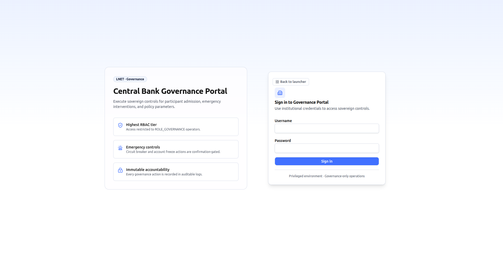
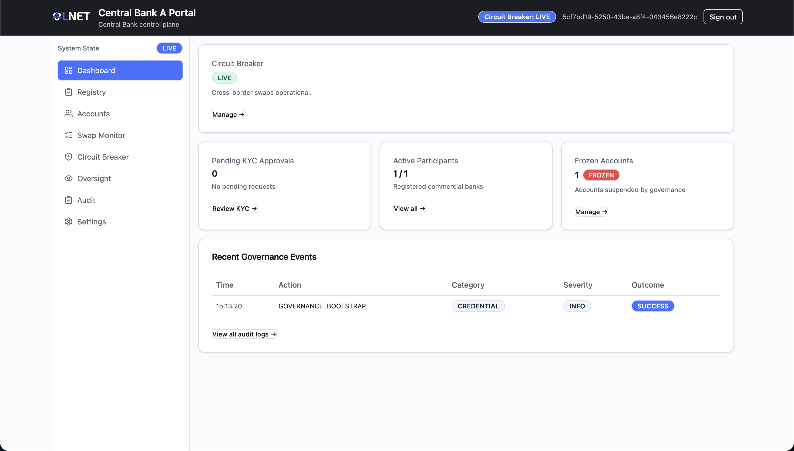
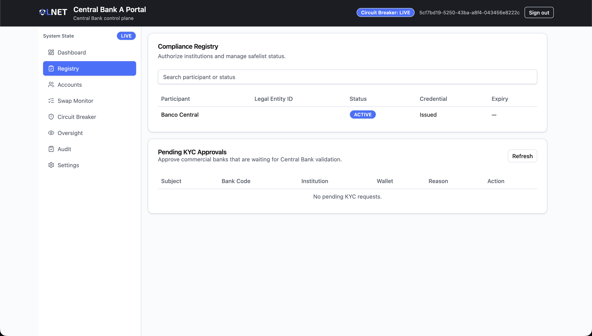
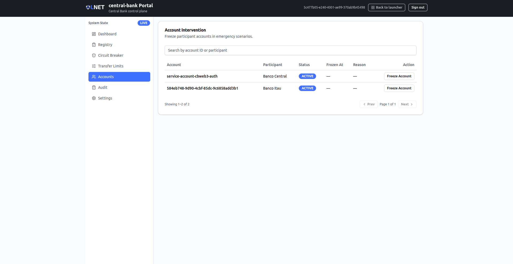
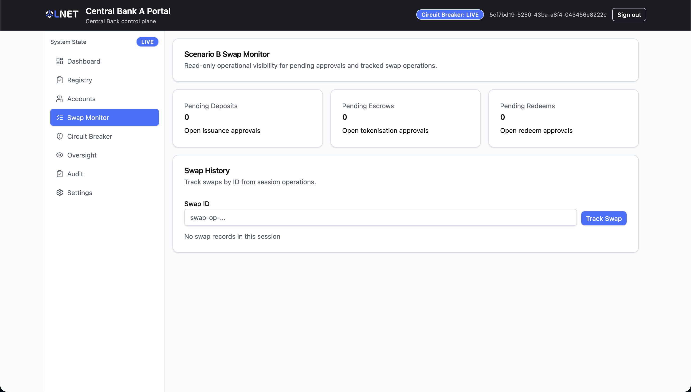
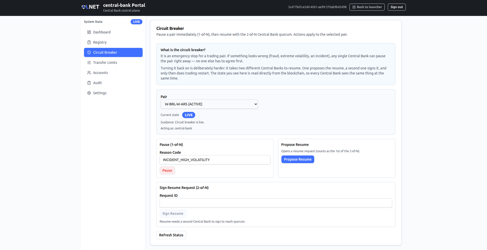
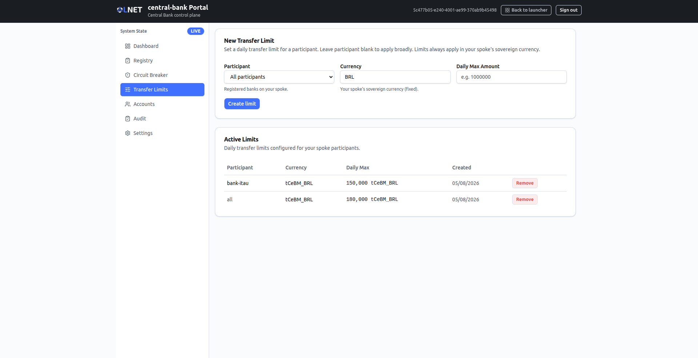
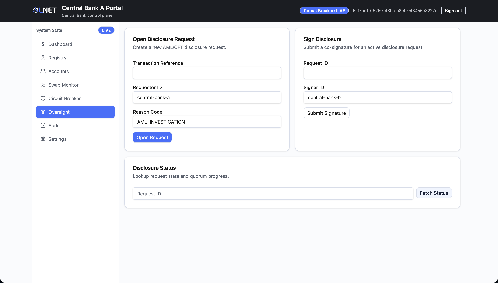
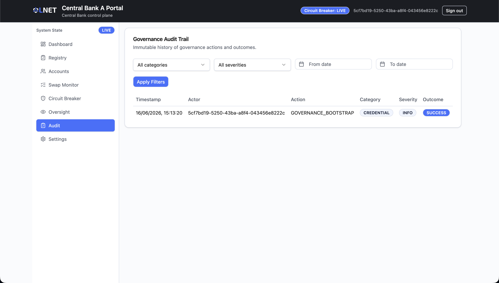
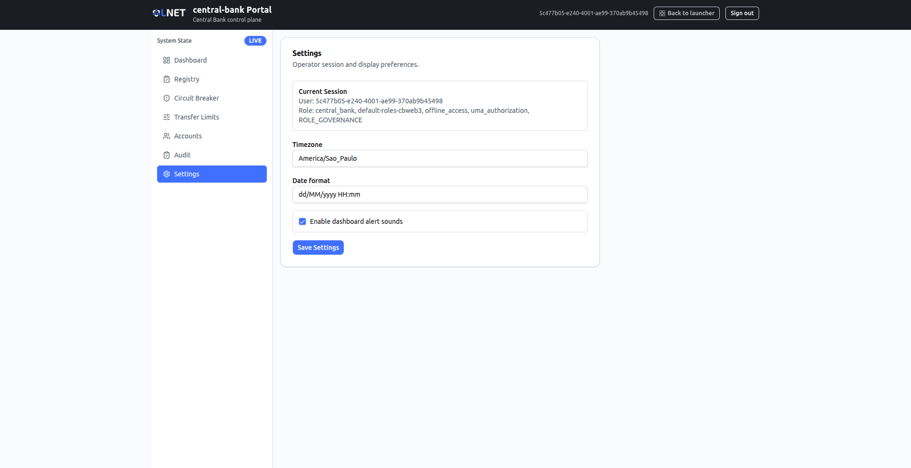

# Governance Portal — User Manual (Scenario B)

**Audience:** Central bank governance operators.
**Scenario:** Scenario B — International Hub (FXAgreement + AMM + Cacti relay).
**Data source:** Live backend via API Gateway. No mock data toggle is present in Scenario B build.

---

## Table of Contents

1. [Overview](#1-overview)
2. [Who uses it](#2-who-uses-it)
3. [Access and login](#3-access-and-login)
4. [Navigation](#4-navigation)
5. [Screens](#5-screens)
   - [Dashboard](#51-dashboard)
   - [Registry](#52-registry)
   - [Accounts](#53-accounts)
   - [Swap Monitor](#54-swap-monitor)
   - [Circuit Breaker](#55-circuit-breaker)
   - [Transfer Limits](#56-transfer-limits)
   - [Oversight](#57-oversight)
   - [Audit](#58-audit)
   - [Settings](#59-settings)
6. [Typical workflows](#6-typical-workflows)
7. [Status reference](#7-status-reference)
8. [Troubleshooting](#8-troubleshooting)

---

## 1. Overview

The Governance Portal is the sovereign control surface for a central bank participating in **Scenario B — International Hub**. In Scenario B, the hub is a shared blockchain network with an Automated Market Maker (AMM) at its centre. Cross-border payments are executed through AMM swaps rather than bilateral HTLC channels.

This portal gives the central bank governance team authority over:

- **Participant admission** — KYC approval for commercial banks requesting access to the network.
- **Account intervention** — emergency freeze of a participant account.
- **AMM oversight** — read-only visibility into in-progress and historical swaps.
- **Circuit breaker** — pause and resume AMM swaps per currency pair using a 1-of-N pause / 2-of-N resume multi-signature mechanism.
- **Transfer limits** — set daily transfer limits per participant in the spoke's sovereign currency.
- **Oversight and disclosure** — open and co-sign AML/CFT disclosure requests for cross-border transactions.
- **Audit trail** — immutable record of every governance action.

> **Important — Scenario B vs Scenario A.** The Governance Portal serves both scenarios from the same codebase. When `VITE_SCENARIO=b`, a Scenario B-specific route set is activated. In Scenario B, the Deposits Approval, Escrows Approval, Redeems Approval, HTLC Monitor, and Parameters screens are **not available** in this portal — they belong to other portals (Treasury, Bank) in the Scenario B architecture. Do not expect those screens to be accessible.

| Actor | Portal | Role |
|---|---|---|
| Central Bank Governance Operator | Governance Portal | Admits participants, freezes and unfreezes accounts, monitors swaps, operates the circuit breaker, sets transfer limits, manages AML disclosures |

---

## 2. Who uses it

Central bank governance and compliance officers. Access is provisioned by the network administrator. A Keycloak institutional account with the `ROLE_GOVERNANCE` role is required — the login page explicitly states that this is the highest RBAC tier and is restricted to governance operators.

---

## 3. Access and login

Open the Governance Portal URL for your central bank entity. The URL is defined in the **Portal Ports** table of `scenario-b/frontend/README.md` for the local deployment, or provided by the network administrator for production deployments.

The login form requires two fields:

| Field | Description |
|---|---|
| **Username** | Institutional service account identifier (minimum 3 characters). |
| **Password** | Institutional service account secret (minimum 6 characters). |

After submitting valid credentials, the portal authenticates via Keycloak OIDC and verifies the `ROLE_GOVERNANCE` role. If the role check passes, the operator is redirected to the Dashboard with a "Welcome to the Governance Portal" confirmation. If the credentials are invalid or the role is missing, an error message is displayed inline on the login form.

Every governance action performed after login is recorded in the immutable audit log. Operators should treat their credentials as privileged secrets.

---

## 4. Navigation

In Scenario B, the sidebar contains exactly the following items in order:

| Sidebar label | Route | Purpose |
|---|---|---|
| Dashboard | `/` | Network health summary and alert cards |
| Registry | `/registry` | Participant compliance registry and KYC approvals |
| Accounts | `/accounts` | Account freeze for emergency intervention |
| Swap Monitor | `/swap-monitor` | Read-only visibility into AMM swap operations |
| Circuit Breaker | `/circuit-breaker` | Pause / resume AMM swaps per pair (multi-sig) |
| Transfer Limits | `/transfer-limits` | Daily transfer limits per participant |
| Oversight | `/oversight` | AML/CFT disclosure requests |
| Audit | `/audit` | Full governance action audit trail |
| Settings | `/settings` | Session and display preferences |

Unknown routes redirect to `/` automatically.

---

## 5. Screens

### 5.1 Dashboard

**Route:** `/`

The Dashboard is the first screen after login. It provides a real-time summary of the most important network health indicators.

#### Circuit Breaker status card

In Scenario B, the top of the Dashboard shows a dedicated Circuit Breaker card. When the breaker is in the `HALTED` state, the card border turns red and the status badge is highlighted in destructive (red) colour. The card reads "Cross-border swaps are paused network-wide." A "Manage →" link navigates directly to the Circuit Breaker screen.

#### Summary cards

Three summary cards are displayed side by side:

| Card | Description |
|---|---|
| **Pending KYC Approvals** | Count of commercial banks waiting for Central Bank validation. A yellow border and "NEEDS ATTENTION" badge appear when the count is above zero. Links to Registry. |
| **Active Participants** | Count of participants with `ACTIVE` status out of total registered institutions. Links to Accounts. |
| **Frozen Accounts** | Count of accounts currently frozen by governance. A red border and "FROZEN" badge appear when the count is above zero. Links to Accounts. |

#### Recent Governance Events

A table showing the five most recent audit log entries with columns: Time, Action, Category, Severity, and Outcome. Severity badges are colour-coded: `CRITICAL` is red, `WARNING` is amber, and `INFO` is grey. Outcome badges are green for `SUCCESS` and red for any failure. A "View all audit logs →" link navigates to the Audit screen.

---

### 5.2 Registry

**Route:** `/registry`

The Registry is the compliance registry of all institutions known to the network. It has two sections: the full participant list and a live queue of pending KYC approvals.

#### Compliance Registry table

A searchable table of all registered participants. The search field filters by participant name or status.

| Column | Description |
|---|---|
| **Participant** | Institution display name. |
| **Legal Entity ID** | The institution's legal entity identifier. |
| **Status** | Current compliance status (see [Status reference](#7-status-reference)). |
| **Credential** | Credential identifier if one has been issued, otherwise "—". |
| **Expiry** | Credential expiry date, or "—" if not applicable. |

#### Pending KYC Approvals table

This section refreshes automatically every 15 seconds. It shows commercial banks that have completed the onboarding flow and are waiting for the central bank to grant network access.

| Column | Description |
|---|---|
| **Subject** | Keycloak subject identifier of the bank's service account. |
| **Bank Code** | Short bank code, if available. |
| **Institution** | Full institution name. |
| **Wallet** | On-chain wallet address registered for the bank. |
| **Reason** | Text input where the governance operator enters an approval reason (minimum 10 characters). |
| **Action** | "Approve KYC" button. |

To approve a pending bank:
1. Enter an approval reason of at least 10 characters in the Reason field for that row.
2. Click **Approve KYC**.
3. A success notification confirms the approval. The entry disappears from the pending list on the next refresh.

> The "Issue Credential" form visible in earlier versions of this portal is currently commented out in the source and is not available.

---

### 5.3 Accounts

**Route:** `/accounts`

The Accounts screen (titled "Account Intervention") provides emergency account intervention: governance operators can freeze and unfreeze participant accounts. Every action must be accompanied by a written reason of at least 10 characters.

#### Account list

A searchable, paginated table of all participant accounts. The search field filters by account ID or participant name. The table shows 10 accounts per page, with Prev / Next controls and a "Showing X–Y of N" indicator below it.

| Column | Description |
|---|---|
| **Account** | Account identifier. |
| **Participant** | Name of the institution that holds the account. Central Bank accounts are tagged with an "Admin" badge. |
| **Status** | `ACTIVE` (green) or `FROZEN` (red). |
| **Frozen At** | Timestamp when the account was frozen, or "—" if active. |
| **Reason** | The reason recorded at freeze time, or "—" if active. |
| **Action** | "Freeze Account" for active accounts, "Unfreeze Account" for frozen accounts. Central Bank accounts show "Central Bank — protected" and cannot be frozen or unfrozen. |

#### Freezing or unfreezing an account

1. Locate the account in the list using the search field if needed.
2. Click **Freeze Account** (or **Unfreeze Account** for a frozen account) on the target row. A confirmation panel appears below the list, titled "Confirm Freeze" or "Confirm Unfreeze".
3. Enter a reason of at least 10 characters in the text area.
4. Click **Confirm Freeze** (or **Confirm Unfreeze**). The action is submitted and a success notification appears.
5. Click **Cancel** to abandon the action.

> Freeze and unfreeze actions are recorded permanently in the audit log under the `FREEZE` category. The Central Bank is the governance administrator and can never freeze or unfreeze its own account — its row is protected.

---

### 5.4 Swap Monitor

**Route:** `/swap-monitor`

The Swap Monitor provides read-only operational visibility into the Scenario B payment pipeline. It shows live counts of pending approval queues and allows governance operators to track individual swaps by swap ID during a session.

#### Pending approval summary

Three summary cards at the top of the screen:

| Card | What it counts |
|---|---|
| **Pending Deposits** | Issuance requests awaiting approval. |
| **Pending Escrows** | Tokenisation requests awaiting approval. |
| **Pending Redeems** | Redemption requests awaiting approval. |

> These counts are informational only. Each card carries a link (Open issuance approvals / Open tokenisation approvals / Open redeem approvals), but the approval screens for deposits, escrows, and redeems are part of other portals in the Scenario B architecture and are not present in the Governance Portal navigation. The cards show the queue depth so governance operators can monitor pipeline health.

#### Swap History

Governance operators can track individual swap operations by ID. Enter a swap ID in the **Swap ID** field and click **Track Swap**. The swap record is fetched and displayed as a card with the following fields:

| Field | Description |
|---|---|
| **Status** | Current swap status (see swap status table in [Status reference](#7-status-reference)). |
| **Payer Bank** | Bank ID of the institution initiating the payment. |
| **Beneficiary Bank** | Bank ID of the receiving institution. |
| **Bridge In Position** | Position ID for the incoming bridge leg, or "—". |
| **Swap Tx Ref** | On-chain transaction reference for the AMM swap, or "—". |
| **Bridge Out Position** | Position ID for the outgoing bridge leg, or "—". |
| **Created At** | Timestamp when the swap was initiated. |
| **Updated At** | Timestamp of the most recent status change. |

Multiple swaps can be tracked in a single session; each appears as a separate card. Tracked swap IDs are retained for the duration of the browser session only.

---

### 5.5 Circuit Breaker

**Route:** `/circuit-breaker`

The Circuit Breaker is the emergency control for AMM swap operations on the hub. The breaker is applied **per currency pair** — one AMM instance exists per pair — so all actions on this screen apply to the pair currently selected. Governance operators use this screen to halt or resume swap processing for a pair.

In Scenario B, the circuit breaker uses a **multi-signature governance model** across Central Banks:

- **Pausing** the breaker is a unilateral action: any single Central Bank can halt the selected pair immediately (1-of-N).
- **Resuming** the breaker is a two-step process that requires two different Central Banks (2-of-N). One Central Bank proposes the resume; a second Central Bank signs it before swaps are re-enabled.

The acting institution identity is derived from the operator session (falling back to the configured institution name) and is **never typed manually**. The institutional signature is generated server-side from the Central Bank PKI key — operators do not paste a signature. The page polls the current breaker state automatically every 15 seconds and reads the state directly from the blockchain, so every Central Bank sees the same state.

At the top of the screen, an explanatory panel titled "What is the circuit breaker?" describes the control in plain language.

#### Pair selector and current state

| Element | Description |
|---|---|
| **Pair** | A dropdown of the AMM pairs created on the hub. Each option shows the pair identifier and its status, for example `BRL-USD (ACTIVE)`. If no pairs exist yet, the selector reads "No pairs created yet". |
| **Current state badge** | `LIVE` (default), `HALTED` (red), or `RESUME_PENDING` (amber). |
| **Resume proposal** | When a resume proposal is in flight, a line shows the truncated resume request ID and signature progress, for example `X/Y signatures`. |
| **Guidance** | Operational guidance text derived from the current state and freshness. |
| **Stale indicator** | If the most recent status refresh failed, an amber warning reads "Showing last known state. Latest status refresh failed." |
| **Acting as** | The Central Bank identity that pause and resume actions are recorded under. |

#### Pause (1-of-N)

Use this panel to halt the selected pair immediately.

| Field | Description |
|---|---|
| **Reason Code** | Machine-readable reason code, pre-filled with `INCIDENT_HIGH_VOLATILITY`. |

Click **Pause** to submit (disabled until a pair is selected). The state updates to `HALTED` on success.

> Pausing stops swaps for the selected pair immediately and does not require a second operator. Choose the reason code carefully — it is recorded permanently.

#### Propose Resume

Use this panel to open the resume process after a pause. It counts as the first of the 2-of-N signatures.

Click **Propose Resume** (disabled until a pair is selected). A resume request ID is created and displayed below the button as "Created request: …". A second Central Bank must then sign it.

#### Sign Resume Request (2-of-N)

Use this panel to add the second Central Bank signature to a pending resume proposal.

| Field | Description |
|---|---|
| **Request ID** | The resume request ID. This field is auto-filled with the resume request discovered on-chain, so a Central Bank that did not propose can co-sign in one click. |

Click **Sign Resume** (enabled only when a pair is selected and a Request ID is present). Once the 2-of-N quorum is reached, swaps are re-enabled. Click **Refresh Status** at any time to confirm the current state.

> **Operational protocol.** When a pause is engaged, communicate the event to all participant banks promptly — their transfer operations for that pair will fail until the breaker is resumed. Resuming requires two different Central Banks. Signatures are produced server-side from each Central Bank's PKI key; the quorum cannot be satisfied by a single institution.

---

### 5.6 Transfer Limits

**Route:** `/transfer-limits`

The Transfer Limits screen lets a Central Bank set daily transfer limits for participants on its spoke. Limits always apply in the spoke's own sovereign currency; a Central Bank cannot set a limit in another currency.

#### New Transfer Limit

| Field | Description |
|---|---|
| **Participant** | Dropdown of registered banks on the spoke. The default option, "All participants", applies the limit broadly. |
| **Currency** | Read-only. The spoke's sovereign currency (the human code, for example `COP`, derived from the reserve token such as `tCeBM_COP`). The backend fixes this value. |
| **Daily Max Amount** | The daily maximum transfer amount, for example `1000000`. Required. |

Click **Create limit** to submit. A success notification confirms the new limit.

#### Active Limits

A table of the daily transfer limits configured for the spoke. When no limits exist, the panel reads "No limits configured."

| Column | Description |
|---|---|
| **Participant** | The participant bank code, or "all" if the limit applies broadly. |
| **Currency** | The currency of the limit, or "all". |
| **Daily Max** | The formatted daily maximum amount with its currency. |
| **Created** | Date the limit was created. |
| (action) | "Remove" button that deletes the limit. |

---

### 5.7 Oversight

**Route:** `/oversight`

The Oversight screen is for AML/CFT disclosure requests. A governance operator can open a formal disclosure request tied to a cross-border transaction reference, and a second operator from another institution can co-sign the request to reach quorum.

#### Open Disclosure Request

| Field | Description |
|---|---|
| **Transaction Reference** | The on-chain or backend transaction reference under investigation. |
| **Requestor ID** | Institutional identifier of the requesting central bank (e.g. `central-bank-a`). |
| **Reason Code** | Machine-readable reason code (e.g. `AML_INVESTIGATION`). |

Click **Open Request** to submit. The new request appears in the Disclosure Status panel.

#### Sign Disclosure

| Field | Description |
|---|---|
| **Request ID** | ID of the disclosure request to co-sign. |
| **Signer ID** | Institutional identifier of the co-signing central bank. |

Click **Submit Signature** to record the co-signature. An error message is shown if this institution has already signed or the request is closed.

#### Disclosure Status

Enter a Request ID and click **Fetch Status** to retrieve the current state of any disclosure request. The result panel shows:

| Field | Description |
|---|---|
| **State** | Current disclosure state (see [Status reference](#7-status-reference)). |
| **Request ID** | Identifier of the disclosure request. |
| **Quorum** | Current signatures collected vs required signatures. |
| **Expires At** | Timestamp after which the request automatically expires. |
| **Closed At** | Timestamp when the request was closed, or "—" if still open. |

A full JSON view of the disclosure record is shown below the summary for detailed inspection.

---

### 5.8 Audit

**Route:** `/audit`

The Audit screen (titled "Governance Audit Trail") provides the immutable governance action trail. Every action taken through this portal — credential approvals, account freezes, parameter changes, circuit breaker operations — is recorded here.

#### Filters

Four filters can be applied independently or in combination:

| Filter | Options |
|---|---|
| **Category** | All, Credential, Circuit Breaker, Freeze, Parameter |
| **Severity** | All, Info, Warning, Critical |
| **From date** | Date picker — earliest timestamp to include |
| **To date** | Date picker — latest timestamp to include |

Click **Apply Filters** to execute the filtered query. The filter state is not persisted across page loads.

#### Audit log table

| Column | Description |
|---|---|
| **Timestamp** | ISO-8601 timestamp of the action. |
| **Actor** | Operator or service account that performed the action. |
| **Action** | Human-readable description of the governance event. |
| **Category** | `CREDENTIAL`, `CIRCUIT_BREAKER`, `FREEZE`, or `PARAMETER`. |
| **Severity** | `INFO`, `WARNING`, or `CRITICAL`. |
| **Outcome** | `SUCCESS` (green) or failure status (red). |

---

### 5.9 Settings

**Route:** `/settings`

The Settings screen holds operator session information and local display preferences.

#### Current Session

A read-only panel showing the signed-in operator:

| Field | Description |
|---|---|
| **User** | The operator's subject identifier from the session. |
| **Role** | The roles carried by the session, joined by commas. |

#### Display preferences

| Control | Description |
|---|---|
| **Timezone** | Free-text timezone, default `America/Sao_Paulo`. |
| **Date format** | Free-text date format, default `dd/MM/yyyy HH:mm`. |
| **Enable dashboard alert sounds** | Checkbox, enabled by default. |

Click **Save Settings** to confirm. These preferences are display-only client-side settings.

---

## 6. Typical workflows

### Onboarding a new commercial bank

1. The bank completes the onboarding wizard (see the Onboarding Portal documentation).
2. Navigate to **Registry** (`/registry`).
3. Scroll to the **Pending KYC Approvals** table. The bank's entry appears here automatically — the table refreshes every 15 seconds.
4. Review the bank's subject ID, bank code, institution name, and wallet address.
5. Enter an approval reason (at least 10 characters) in the Reason field on the bank's row.
6. Click **Approve KYC**. A success notification confirms the approval.
7. The bank's entry moves from the pending table to the Compliance Registry with `ACTIVE` status.

### Freezing an account in an emergency

1. Navigate to **Accounts** (`/accounts`).
2. Use the search field to locate the account by participant name or account ID.
3. Click **Freeze Account** on the target row.
4. In the confirmation panel that appears, enter a reason of at least 10 characters.
5. Click **Confirm Freeze**.
6. Notify the relevant parties that the account has been frozen. The freeze reason is visible in the Accounts table and in the Audit log.

### Halting AMM swaps (emergency pause)

1. Navigate to **Circuit Breaker** (`/circuit-breaker`).
2. Select the affected pair in the **Pair** dropdown and confirm the current state is `LIVE`.
3. In the **Pause (1-of-N)** panel, adjust the reason code if required.
4. Click **Pause**.
5. The state updates to `HALTED`. Communicate the pause to all participant banks immediately.
6. The pause is recorded in the Audit log under the `CIRCUIT_BREAKER` category.

### Resuming AMM swaps (two-signature process)

1. **First Central Bank:** Navigate to **Circuit Breaker** (`/circuit-breaker`). Select the pair, then click **Propose Resume** in the **Propose Resume** panel. Note the resume request ID that appears as "Created request: …".
2. A second Central Bank opens the **Circuit Breaker** screen and selects the same pair. The resume request ID is auto-filled in the **Sign Resume Request (2-of-N)** panel from the on-chain state; if needed, the request ID from step 1 can be entered manually.
3. **Second Central Bank:** Click **Sign Resume**.
4. The state updates to `LIVE` once the 2-of-N quorum is reached. Verify with **Refresh Status**.
5. Both signature events are recorded in the Audit log. Signatures are produced server-side from each Central Bank's PKI key.

### Investigating a suspicious transaction (AML disclosure)

1. Obtain the transaction reference (on-chain tx hash or backend transaction ID) from the NOC or compliance team.
2. Navigate to **Oversight** (`/oversight`).
3. In the **Open Disclosure Request** panel, enter the transaction reference, your institution's requestor ID, and a reason code such as `AML_INVESTIGATION`. Click **Open Request**.
4. Note the request ID from the Disclosure Status panel or the API response.
5. Share the request ID with a second central bank operator for co-signature.
6. The second operator navigates to **Oversight**, enters the request ID and their signer ID in the **Sign Disclosure** panel, and clicks **Submit Signature**.
7. Monitor quorum progress in the **Disclosure Status** panel by entering the request ID and clicking **Fetch Status**.

### Monitoring swap pipeline health

1. Navigate to **Swap Monitor** (`/swap-monitor`).
2. Review the three pending count cards (Deposits, Escrows, Redeems). Elevated counts indicate a processing backlog in the payment pipeline.
3. To investigate a specific swap, obtain the swap ID from the payment team or NOC, enter it in the **Swap ID** field, and click **Track Swap**.
4. Review the swap record card for status, parties, and transaction references.
5. If the swap shows a failure status (e.g. `BRIDGE_OUT_FAILED`), escalate to the NOC team — do not attempt to intervene from this portal.

### Setting a daily transfer limit

1. Navigate to **Transfer Limits** (`/transfer-limits`).
2. In the **New Transfer Limit** form, choose a participant, or leave "All participants" selected to apply the limit broadly.
3. Confirm the read-only **Currency** — it is fixed to your spoke's sovereign currency.
4. Enter the **Daily Max Amount** and click **Create limit**. A success notification confirms the new limit.
5. The limit appears in the **Active Limits** table. Use its **Remove** button to delete it if needed.

---

## 7. Status reference

### Participant / registry status

| Status | Meaning |
|---|---|
| `ACTIVE` | Onboarded and cleared to transact. |
| `APPROVED` | Credential approved; may be transitioning to ACTIVE. |
| `PENDING` | Onboarding or credential issuance in progress. |
| `CREDENTIAL_REQUESTED` | Awaiting credential approval in the Registry. |
| `KYC_APPROVED` | KYC step completed; awaiting full activation. |
| `REVOKED` | Credential has been revoked; institution cannot transact. |
| `REJECTED` | Onboarding or credential request was rejected. |
| `FROZEN` | Account suspended by governance action. |

### Circuit breaker state

| State | Meaning |
|---|---|
| `LIVE` | AMM swaps for the pair are operational. Normal operating state and the default shown when no state has been retrieved. |
| `HALTED` | AMM swaps for the pair are stopped. Cross-border transfers on that pair fail closed until resumed. |
| `RESUME_PENDING` | A resume proposal is open and collecting signatures. Swaps remain halted until the 2-of-N quorum is reached. |
| `UNKNOWN` | Shown on the Dashboard circuit breaker card when the state could not be retrieved from the backend; check connectivity. |

### Swap status

| Status | Meaning |
|---|---|
| `COMPLETED` | Swap fully settled on both sides. |
| `PENDING` | Swap initiated, awaiting processing. |
| `*_PROGRESS` | Any status ending in `_PROGRESS` — swap is actively processing (bridge or AMM step in flight). |
| `BRIDGE_OUT_FAILED` | Settlement failed on the outgoing bridge leg; manual investigation required. |

### Audit event severity

| Severity | Meaning |
|---|---|
| `INFO` | Routine governance action. |
| `WARNING` | Action that warrants attention; no immediate incident. |
| `CRITICAL` | High-priority event requiring immediate review. |

### Disclosure request state

| State | Meaning |
|---|---|
| `PENDING` | Request is open and collecting signatures. |
| `QUORUM_REACHED` | Sufficient signatures collected; disclosure is complete. |
| `EXPIRED` | The request expired before quorum was reached. |
| `REJECTED` | The request was closed without quorum. |

---

## 8. Troubleshooting

### The Circuit Breaker state panel shows "Showing last known state. Latest status refresh failed."

The portal could not reach the backend API on the most recent 15-second poll. The displayed state is the last known value and may be stale. Check network connectivity and confirm the API Gateway service is running. Click **Refresh Status** manually to retry.

### Banks report that cross-border transfers are failing

1. Navigate to **Circuit Breaker** (`/circuit-breaker`). If the state is `HALTED`, swaps are intentionally blocked. Initiate the resume process if the halt is no longer required (see [Resuming AMM swaps](#resuming-amm-swaps-two-signature-process)).
2. If the state is `LIVE`, navigate to **Swap Monitor** (`/swap-monitor`) and check whether pending queue counts are elevated or individual swaps show `BRIDGE_OUT_FAILED`. Escalate to the NOC team for infrastructure investigation.

### A pending KYC entry does not appear in the Registry

The Pending KYC table refreshes every 15 seconds. Click **Refresh** on the Pending KYC panel header to trigger an immediate reload. If the entry still does not appear, confirm that the bank completed the full onboarding wizard and that the auth service is reachable.

### Resume does not re-enable the AMM

The resume process requires signatures from two different institutions. Confirm:
1. A resume proposal was submitted by one institution and a valid request ID was created.
2. A second institution submitted a co-signature against that exact request ID.
3. Neither signature came from the same institution.

If both conditions are met and the state remains `HALTED`, click **Refresh Status** and check the API Gateway logs for errors.

### KYC approval fails with "Provide an approval reason with at least 10 characters"

The reason field on the KYC approval row requires a minimum of 10 characters. Enter a descriptive reason before clicking **Approve KYC**.

### Account freeze fails with "Reason must contain at least 10 characters"

The freeze confirmation panel requires a reason of at least 10 characters. Enter a more detailed reason and retry.

### The Oversight "Sign Disclosure" panel returns "Already signed or invalid request"

This error appears when the signer ID has already submitted a signature for this request, or when the request is closed (expired or quorum already reached). Fetch the disclosure status by request ID to confirm its current state.

### Audit log is empty after applying filters

Filters are applied as a server-side query. If no results appear, try expanding the date range or selecting "All" for category and severity. If the log remains empty with no filters applied, confirm the audit service is running and the API Gateway is accessible.
