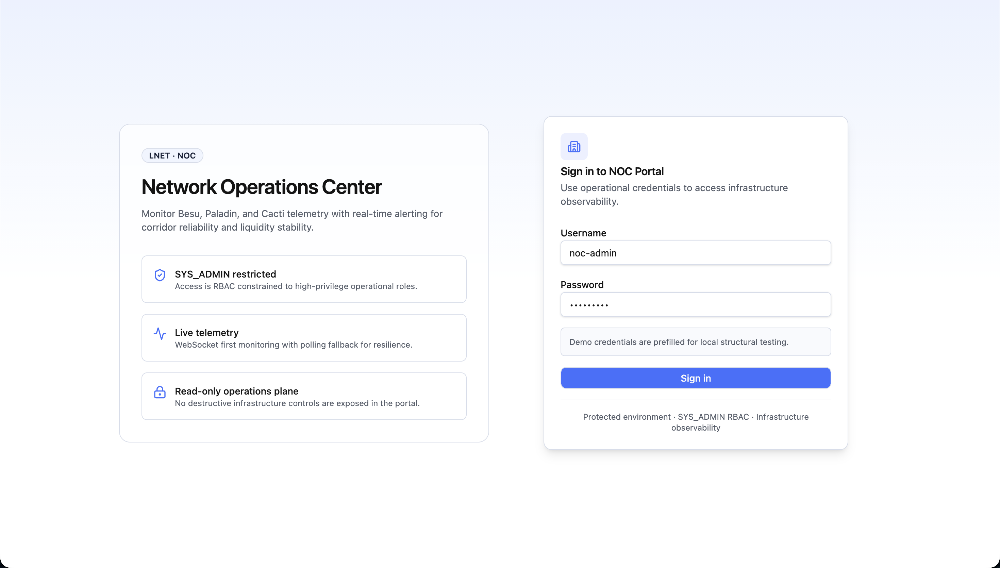
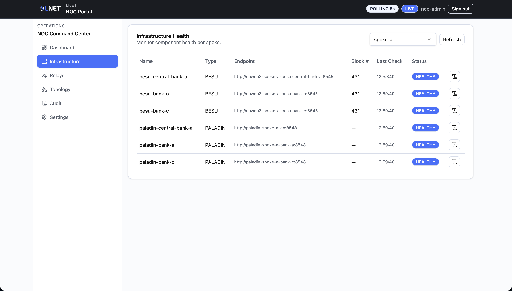
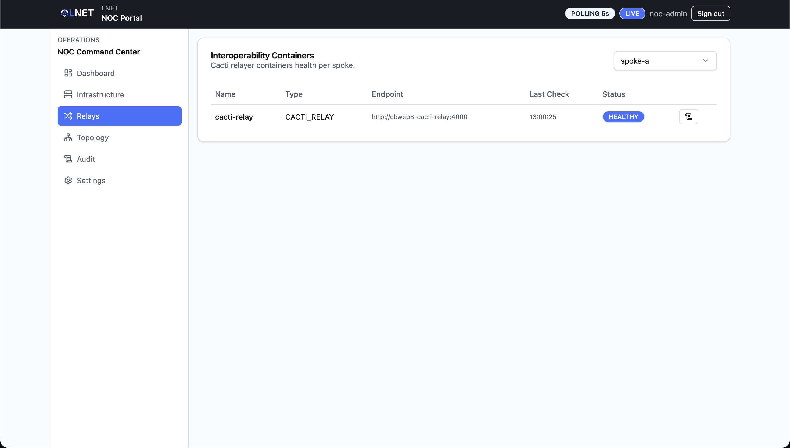
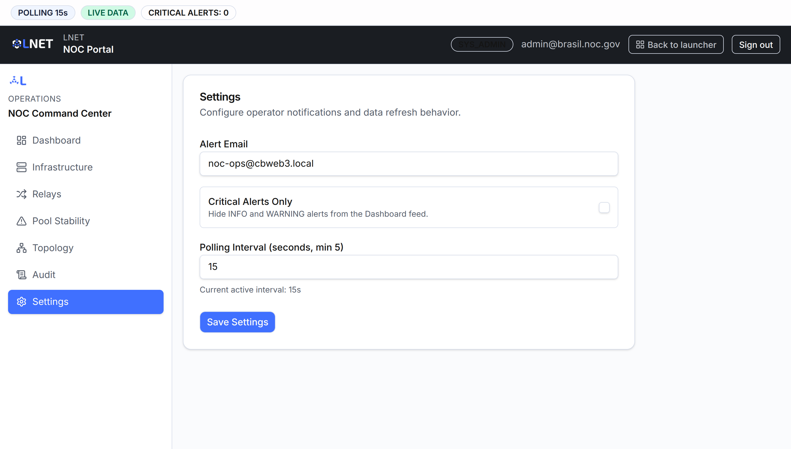

# NOC Portal — User Manual (Scenario B)

**Audience:** Network operations / SRE engineers.
**Scenario:** B — International Hub (hub-and-spoke, AMM-based FX settlement).
**Data source:** The portal connects to a live NOC backend service. Component
health, alerts, logs, and topology data reflect actual spoke and hub state when
the stack is running. Every screen refreshes by HTTP polling — there is no
telemetry push stream.

---

> ## Read first — current status
>
> The NOC Portal is wired to a real backend API (Keycloak auth + NOC backend
> service). Component health, alerts, and logs reflect actual spoke and hub
> state when the stack is running. There is **no WebSocket push stream** — the
> portal runs in HTTP polling mode on every screen, at the interval configured
> in [Settings](#48-settings-settings). Authenticated sessions are stored as JWT
> tokens in `localStorage` and renewed automatically (see
> [Access and Login](#2-access-and-login)).
>
> **Pool Stability** requires the NOC backend to be configured with a reachable
> api-gateway (`spec.noc.ammGatewayURL`) and at least one active AMM pair. The
> page states which of the two is missing, so an empty table is never ambiguous.

---

## Table of Contents

1. [Overview](#1-overview)
2. [Access and Login](#2-access-and-login)
3. [Navigation](#3-navigation)
4. [Screens](#4-screens)
   - [Dashboard (`/`)](#41-dashboard-)
   - [Infrastructure (`/infrastructure`)](#42-infrastructure-infrastructure)
   - [Relay Status (`/relays`)](#43-relay-status-relays)
   - [Pool Stability (`/pool-stability`)](#44-pool-stability-pool-stability)
   - [Topology (`/topology`)](#45-topology-topology)
   - [Log Viewer (`/logs/:componentId`)](#46-log-viewer-logscomponentid)
   - [Audit (`/audit`)](#47-audit-audit)
   - [Settings (`/settings`)](#48-settings-settings)
5. [Alert Management](#5-alert-management)
6. [Typical Workflows](#6-typical-workflows)
7. [Alert Reference](#7-alert-reference)
8. [Status Reference](#8-status-reference)
9. [Troubleshooting](#9-troubleshooting)

---

## 1. Overview

The NOC (Network Operations Center) Portal is the monitoring surface for
engineers responsible for the health of Scenario B's hub-and-spoke
infrastructure. Scenario B uses a **Regional Hub** network connected to
multiple **spoke networks** (one per central bank) via a Cacti-based relay. The
AMM (AutomatedMarketMaker) handles FX settlement between spoke currencies.

The NOC Portal gives operations engineers a unified view of:

- Real-time health status for Hyperledger Besu nodes, Paladin privacy nodes,
  payment orchestrators, and CACTI relay containers across all spokes and the Hub.
- An active alert feed with acknowledge/dismiss workflow.
- Container log inspection for any registered component.
- AMM liquidity pool reserve ratios and 70/30 breach alerts.
- An interactive topology diagram showing the full hub-and-spoke layout.
- An immutable audit trail of operator actions.

| Actor | Portal | Role |
|---|---|---|
| Network Operations Engineer / SRE | NOC Portal | Infrastructure health, alert triage, relay monitoring, pool stability, log review, topology |

The portal is **read-only with two exceptions**: operators can acknowledge and
dismiss alerts. No destructive infrastructure controls are exposed here.

### How Scenario B differs from Scenario A

| Dimension | Scenario A | Scenario B |
|---|---|---|
| Architecture | Peer-to-peer corridors (HTLC) | Hub-and-spoke (Regional Hub + spoke networks) |
| 4th Dashboard KPI | Total Spokes | Pool Breaches (70/30) |
| Pool Stability page | Not present | Present — monitors AMM 70/30 reserve ratio |
| Topology node kinds | BESU, PALADIN, CACTI | BESU, PALADIN, CACTI, HUB |
| Log Viewer page | Present | Present |
| Privacy tokens | ZetoToken / NotoToken | ZetoToken / NotoToken via Paladin |

---

## 2. Access and Login

**URL:** The NOC Portal URL provided by your system administrator (default local
port: `5910`).

**Authentication:** Keycloak OIDC. The portal authenticates against the
`cbweb3` realm with client ID `noc-portal`. Only accounts carrying the
`SYS_ADMIN` role are accepted.

### Login steps

1. Open the NOC Portal URL in your browser.
2. Enter your `SYS_ADMIN` username and password.
3. Click **Sign in**.
4. On success, you are redirected to the Dashboard.

### Login page layout

The login page has two panels on desktop:

- **Left panel** — feature summary (SYS_ADMIN restriction, continuous
  monitoring, read-only operations plane).
- **Right panel** — sign-in form (username, password, submit button).

| Field | Notes |
|---|---|
| **Username** | Your `SYS_ADMIN` Keycloak username. |
| **Password** | Your `SYS_ADMIN` Keycloak password. |

> Standard bank-portal or governance-portal credentials cannot be used here.
> If login fails immediately, verify the account has the `SYS_ADMIN` role in
> Keycloak.

**Demo credentials** (local environments only): username `noc.admin`, password
`NOCAdmin2026!`. These must not be used in any non-local deployment.

**Session persistence:** On successful login the portal stores `noc_access_token`
and `noc_refresh_token` in `localStorage`. The access token is short-lived (5
minutes by realm default), so the portal renews it automatically — shortly
before expiry and again if a request is still rejected — using the refresh
token. A portal left open therefore keeps working without re-authentication up
to the realm's SSO session limit (10 hours by default), and a page reload within
that window restores the session instead of returning to the login page.

When renewal is no longer possible (refresh token expired, session revoked), the
portal drops the session and returns to the login page with *"Session expired.
Sign in again."*. **Sign out** clears both tokens and returns to the login page;
use **Back to launcher** to leave the portal for the entity launcher.

---

## 3. Navigation

The portal uses a persistent left sidebar. All routes are protected — the
login page is the only publicly accessible screen.

| Sidebar label | Route | Description |
|---|---|---|
| Dashboard | `/` | Platform-wide health snapshot and alert feed. |
| Infrastructure | `/infrastructure` | Per-component health table (nodes, orchestrators). |
| Relays | `/relays` | CACTI relay container health per spoke. |
| Pool Stability | `/pool-stability` | AMM pool reserve ratios and 70/30 breach status. |
| Topology | `/topology` | Interactive hub-and-spoke network diagram. |
| Audit | `/audit` | Operator action history and resolved alerts. |
| Settings | `/settings` | Polling interval and notification preferences. |

The **Log Viewer** (`/logs/:componentId`) has no sidebar entry. It is reached
by clicking the **View Logs** button on the Infrastructure or Relays pages.

Unknown routes redirect to `/` (Dashboard).

### Status bar

A thin bar above the header carries three badges, visible on every screen:

| Badge | Meaning |
|---|---|
| **POLLING `<n>`s** | The active refresh interval, as configured in [Settings](#48-settings-settings). |
| **LIVE DATA** / **STALE DATA** | `STALE DATA` appears when no backend request has succeeded for three polling cycles (minimum 20 seconds) — the screen is showing the last data received. A banner with the same meaning appears above the page content. |
| **CRITICAL ALERTS: `<n>`** | Count of `CRITICAL` alerts currently loaded, turning red above zero. |

`STALE DATA` points at the portal's link to the NOC backend, not at the health of
the monitored components — a spoke can be perfectly healthy while the browser
cannot reach the backend, and vice versa.

---

## 4. Screens

### 4.1 Dashboard (`/`)

The Dashboard is the primary monitoring view. It aggregates platform-wide
health data across all spokes and the Regional Hub (or a single selected
spoke) and displays the active alert feed.

#### Spoke Selector

A dropdown at the top of the page. By default, the first available spoke is
selected automatically. Select **a specific spoke** to filter both the
Component Health table and the Alert Feed to that spoke only.

Select **All Spokes** for a platform-wide view: the Alert Feed then lists alerts
from every registered spoke. Component health is only available per spoke, so in
this mode the Component Health table shows *"Select a spoke to see component
health"* and the **Degraded Components** / **Offline Components** cards show `—`
instead of a count.

#### Summary Cards

Four cards provide an instant platform status snapshot:

| Card | Colour when non-zero | Description |
|---|---|---|
| **Critical / High Alerts** | Red | Active alerts with severity `HIGH` or `CRITICAL`. Requires immediate attention. |
| **Degraded Components** | Orange | Components not in `HEALTHY` state (includes `DEGRADED`, `OFFLINE`, `UNKNOWN`). |
| **Offline Components** | Red | Components in `OFFLINE` state. Requires immediate attention. |
| **Pool Breaches (70/30)** | Red | AMM pools whose reserve ratio has exceeded the 70/30 threshold. |

#### Component Health Table

Shows the first 8 components for the selected scope. Columns: **Name**,
**Type**, **Status** badge. For the full component list, navigate to
[Infrastructure](#42-infrastructure-infrastructure).

#### Active Alert Feed

Lists up to 8 active alerts. Each alert row shows:

| Element | Description |
|---|---|
| **Title** | Short description of the alert condition. |
| **Severity badge** | `INFO`, `WARNING`, `HIGH`, or `CRITICAL`. |
| **ACK badge** | Shown when the alert has been acknowledged by any operator. |
| **Dismiss button** | X icon on the right — click to dismiss directly from the feed. |

When **Critical Alerts Only** is enabled in [Settings](#48-settings-settings),
the feed lists only `HIGH` and `CRITICAL` alerts and a `CRITICAL ONLY` badge
appears next to the feed title. The Summary Cards are not affected by that
setting.

Click any alert row (not the dismiss button) to open the **Alert Detail Modal**.

**Alert Detail Modal** fields:

| Field | Description |
|---|---|
| **Title** | Alert title. |
| **Severity** | Severity badge. |
| **State** | `ACTIVE` or `RESOLVED`. |
| **Affected component** | The component that raised the alert with its health status. |
| **Created** | Timestamp of alert creation (shown in local time). |
| **Root cause sig** | System-generated root cause pattern identifier. |
| **Acknowledge button** | Marks the alert as seen; keeps it in the feed. |
| **Dismiss button** | Removes the alert from the active feed. |

#### Polling

The Dashboard refreshes automatically at the interval configured in
[Settings](#48-settings-settings) (default: 15 seconds, minimum: 5 seconds).
The WebSocket stream is not yet active; the portal always uses HTTP polling.

---

### 4.2 Infrastructure (`/infrastructure`)

Lists the health status of all non-relay infrastructure components for the
selected spoke or the Regional Hub: Hyperledger Besu blockchain nodes, Paladin
privacy nodes, and payment orchestrators. CACTI relay containers are excluded
here — use [Relays](#43-relay-status-relays) for those.

#### Controls

| Control | Description |
|---|---|
| **Spoke Selector** | Select a spoke or the Regional Hub. The table is empty until a spoke is selected. |
| **Refresh button** | Force an immediate health poll; disabled while loading. |

#### Component Health Table

| Column | Description |
|---|---|
| **Name** | The component's display name. |
| **Type** | Component category: `BESU`, `PALADIN`, or `PAYMENT_ORCHESTRATOR`. |
| **Endpoint** | The component's API or RPC endpoint (truncated). |
| **Block #** | Latest block number — populated for `BESU` nodes only. `—` for other types. |
| **Last Check** | Timestamp of the most recent health poll (shown as local time). |
| **Status** | Health status badge. See [Status Reference](#8-status-reference). |
| **View Logs** | Icon button — navigates to the [Log Viewer](#46-log-viewer-logscomponentid) for this component. |

The table auto-refreshes at the configured polling interval whenever a spoke is
selected.

---

### 4.3 Relay Status (`/relays`)

Shows the health of **CACTI interoperability relay containers** — the components
responsible for bridging events between spoke networks and the Regional Hub.
When a cross-spoke settlement appears stuck, this page is the first place to
check. In the portal the page itself is titled **Interoperability Containers**;
the sidebar entry is **Relays**.

#### Controls

| Control | Description |
|---|---|
| **Spoke Selector** | You must select a specific spoke. The table is empty until a spoke is chosen. |

#### Relay Components Table

Displays only `CACTI_RELAY` type components for the selected spoke.

| Column | Description |
|---|---|
| **Name** | Relay container name. |
| **Type** | Always `CACTI_RELAY`. |
| **Endpoint** | The relay container's API endpoint (truncated). |
| **Last Check** | Timestamp of the last health poll (local time). |
| **Status** | Health status badge. See [Status Reference](#8-status-reference). |
| **View Logs** | Icon button — navigates to the [Log Viewer](#46-log-viewer-logscomponentid) for this relay. |

> If no relay components appear after selecting a spoke, verify that the CACTI
> relay containers for that spoke are registered in the NOC backend and that
> the backend service can reach them.

---

### 4.4 Pool Stability (`/pool-stability`)

**This page is specific to Scenario B.** It is not present in the Scenario A
NOC Portal.

Displays the reserve ratios of each AMM (AutomatedMarketMaker) liquidity pool
and flags pools that have breached the 70/30 threshold. A **Refresh** button
triggers a manual data reload.

The NOC backend does not hold pool data of its own: it queries the api-gateway
for each AMM pair it is configured with. The page therefore distinguishes three
empty outcomes, and it is worth reading which one you are looking at:

| What you see | What it means |
|---|---|
| *"No AMM pools are configured for this deployment."* | The backend read the gateway successfully and there is nothing to show — no sovereign pair has been opened yet, or none is configured. |
| An amber warning listing pairs that **could not be read** | The gateway is unreachable or the pair does not exist there. This is a configuration or connectivity problem, not an empty AMM — the reason reported for each pair comes straight from the gateway. |
| A red banner: *"Could not reach the NOC backend."* | The portal could not reach the NOC backend at all; nothing on this page is current. |

#### Understanding the 70/30 rule

The AMM maintains two-sided reserve pools for each currency pair (e.g.
`BRL-tCeBM/ARS-tCeBM`). The platform enforces a maximum reserve imbalance of
70% / 30% — if either side of the pool drops below 30% of total reserves, the
circuit breaker may halt swaps for that corridor to prevent excessive price
impact on settlement transactions.

#### Column reference

| Column | Description |
|---|---|
| **Pool** | Currency pair identifier. |
| **Reserve A** | Total units held for token A. |
| **Reserve B** | Total units held for token B. |
| **Split** | Visual progress bar showing `ratioA% / ratioB%` — the current reserve split. |
| **Status** | `STABLE` (within 70/30) or `BREACHED` (threshold exceeded). |
| **Updated At** | Timestamp of the last pool snapshot. |

#### Responding to a BREACHED pool

1. Note which pool pair is flagged and whether it is a single corridor or
   multiple.
2. Cross-reference with [Relay Status](#43-relay-status-relays) — if the relay
   carrying that corridor is also degraded, the imbalance may be caused by
   undelivered settlement events rather than organic trading pressure.
3. Escalate to the liquidity operations team with the pool name, current
   ratios, and the time the breach appeared.
4. Do not attempt to rebalance the pool directly from this portal; the portal
   is read-only.

---

### 4.5 Topology (`/topology`)

Renders an interactive network diagram of all nodes and their links across the
hub-and-spoke topology. Useful for identifying where in the topology a fault is
isolated and for verifying the Regional Hub's connectivity to all spokes.

#### Diagram Elements

| Element | Colour | Description |
|---|---|---|
| **BESU node** | Blue dot | A Hyperledger Besu blockchain node. |
| **PALADIN node** | Purple dot | A Paladin privacy node. |
| **CACTI relay node** | Orange dot | An interoperability relay container. |
| **HUB node** | Green dot | The Regional Hub network node. |
| **Green edge** | Green line | A healthy link between two nodes. |
| **Red edge** | Red line | An unhealthy link between two nodes. |

Each node card shows: a colour-coded dot, the node name, its kind label, a
health status badge, and the name of the spoke or hub it belongs to.

Nodes are grouped by spoke in columns. The Regional Hub nodes appear in their
own column. The layout is generated automatically based on spoke membership.

#### Diagram Controls

| Control | Action |
|---|---|
| **Scroll wheel** | Zoom in / out. |
| **Click and drag** (on the canvas) | Pan the diagram. |
| **Mini-map** (bottom-right corner) | Navigate quickly across a large topology. |
| **Controls panel** (bottom-left) | Zoom in, zoom out, fit view, lock layout buttons provided by ReactFlow. |

#### Topology Health Summary Card

Located to the right of the diagram:

| Metric | Description |
|---|---|
| **Total Nodes** | Number of nodes registered in the topology. |
| **Total Links** | Number of directed edges between nodes. |
| **Healthy Links** | Count of edges marked as healthy (green). |
| **Unhealthy Links** | Count of edges marked as unhealthy (red). |

A colour legend below the metrics identifies each node type, including the
HUB kind which is specific to Scenario B.

---

### 4.6 Log Viewer (`/logs/:componentId`)

Displays container logs for a specific infrastructure or relay component. There
is no sidebar entry for this screen — navigate here by clicking the **View
Logs** button from the [Infrastructure](#42-infrastructure-infrastructure) or
[Relays](#43-relay-status-relays) pages.

The component name is shown in the page subtitle. The `componentId` in the URL
is the internal component ID; the human-readable name is passed as a query
parameter (`?name=...`).

#### Controls

| Control | Description |
|---|---|
| **Refresh button** | Force an immediate log fetch. Spinner is shown while loading. |
| **SNAPSHOT `<n>`s OLD** badge | Appears when the newest line collected is more than 60 seconds old — see *Snapshots, not a live tail* below. |

#### Log Panel

Terminal-style viewer (black background, green text).

| Column | Description |
|---|---|
| **Timestamp** | Time portion of the log line's `occurred_at` timestamp (HH:MM:SS.mmm). This is when the **agent collected** the batch, so a whole batch shares one timestamp; each line's own time appears inside the log text. |
| **Stream badge** | `stdout` (normal output) or `stderr` (error output). `stderr` lines appear in red. |
| **Log line** | Raw log text from the container. |

- Displays the **last 500 lines**.
- Auto-scrolls to the bottom on initial load and on each refresh.
- Refreshes automatically every **15 seconds**. This cycle is fixed and is not
  affected by the Settings polling interval.

#### Snapshots, not a live tail

Logs are collected by the spoke's NOC agent and pushed to the backend; the
viewer reads what the backend stored. If the container stops, or its agent stops
collecting, the screen keeps showing the last snapshot with no other visible
change — the **SNAPSHOT `<n>`s OLD** badge is what tells you the lines are not
current.

> Log collection requires the component to be registered with its container name.
> A component registered without one always reports *"No logs available."* even
> while healthy — for relay components this depends on `spec.relay.containerName`
> being set in the entity's deployment manifest.

---

### 4.7 Audit (`/audit`)

Provides an immutable record of all operator actions taken within the NOC
Portal and a history of resolved alerts.

A **search box** at the top filters both tables simultaneously. The filter
matches against actor, action, target ID, and detail text in the Audit Trail
table; and against title, severity, and root cause signature in the Resolved
Alerts table.

#### Audit Trail Table

Every alert acknowledgement and dismissal performed by any NOC operator is
recorded here.

| Column | Description |
|---|---|
| **Timestamp** | When the action was performed (local time). |
| **Actor** | Username of the NOC operator who performed the action, taken from the `preferred_username` claim of the token used. Deployments whose token carries no username fall back to the account's internal ID, and a request with no readable identity is recorded as `dev-user`. |
| **Action** | The action type: `Acknowledge` (from `ACKNOWLEDGE_ALERT`) or `Dismiss` (from `DISMISS_ALERT`). |
| **Target** | The internal ID of the alert that was acted upon. |
| **Detail** | Any additional context recorded at the time of the action. |

#### Resolved Alerts Table

A searchable history of alerts that have been resolved (automatically or via
dismissal).

| Column | Description |
|---|---|
| **Resolved At** | Timestamp when the alert transitioned to resolved (local time). `—` if not yet recorded. |
| **Title** | The alert title. |
| **Severity** | Severity badge at the time of resolution. |
| **Root Cause Sig** | System-generated identifier for the root cause pattern (monospaced, truncated). |

---

### 4.8 Settings (`/settings`)

Configures operator-level monitoring preferences. Settings are persisted to
`localStorage` (key: `noc-ui-settings`) and survive page reloads within the
same browser. They reset when the browser storage is cleared.

| Setting | Default | Description |
|---|---|---|
| **Alert Email** | `noc-ops@cbweb3.local` | Email address for alert notifications. Stored locally — not sent to the backend. Applied on **Save Settings**. |
| **Critical Alerts Only** | Off | When checked, hides `INFO` and `WARNING` severity alerts from the Dashboard's Active Alert Feed. Only `HIGH` and `CRITICAL` alerts appear, and a `CRITICAL ONLY` badge is shown on the feed header. Applied immediately on toggle. |
| **Polling Interval** | 15 seconds | How frequently the auto-refreshing pages reload data. **Minimum: 5 seconds.** Values below 5 are rejected. Applied on **Save Settings**. |

Click **Save Settings** to apply the Alert Email and Polling Interval. A toast
confirms success, and the active polling interval shown below the input updates
immediately. If the interval is below 5 seconds or not a number, an error toast
appears and **nothing is saved** — including the Alert Email. The **Critical
Alerts Only** checkbox does not require Save; it takes effect as soon as it is
toggled.

The Polling Interval governs every auto-refreshing page in the portal —
[Dashboard](#41-dashboard-), [Infrastructure](#42-infrastructure-infrastructure)
and [Relay Status](#43-relay-status-relays) — not the Dashboard alone. The
Container Logs refresh cycle is fixed at 15 seconds and is not affected by this
setting.

Note that the **Critical / High Alerts** counter in the Dashboard KPI row always
counts `HIGH` and `CRITICAL` active alerts regardless of this setting.

---

## 5. Alert Management

NOC operators can take two actions on active alerts: **Acknowledge** and
**Dismiss**. Both actions are logged in the [Audit](#47-audit-audit) page.

### Acknowledge vs. Dismiss

| Action | Meaning | Effect |
|---|---|---|
| **Acknowledge** | An operator has seen the alert and is actively investigating. | Alert remains in the active feed. An **ACK** badge appears on the row. Action logged in Audit. |
| **Dismiss** | The alert is not actionable, is a false positive, or has been resolved externally. | Alert is removed from the active feed and moved to Resolved Alerts on the Audit page. Action logged in Audit. |

### How to Acknowledge

1. On the Dashboard, locate the alert in the **Active Alert Feed**.
2. Click the alert row to open the **Alert Detail Modal**.
3. Review the alert title, severity, affected component, and description.
4. Click **Acknowledge**.

The ACK badge appears on the alert row. The action appears in the Audit Trail.

### How to Dismiss

**Option A — from the alert feed directly:**

1. Click the **X (dismiss) button** on the right side of the alert row.
2. The alert is removed immediately.

**Option B — from the Alert Detail Modal:**

1. Click the alert row to open the modal.
2. Click **Dismiss** in the modal.

In both cases the alert disappears from the feed and is logged in the Audit
Trail. Dismissed alerts cannot be re-activated from the portal.

**Dismissing does not silence an ongoing fault.** If the component is still
unhealthy, the next agent report raises a new alert for it — dismissal clears
the row you acted on, not the condition behind it. The alert stops coming back
once the component reports `HEALTHY`, which also resolves it automatically. Use
**Acknowledge** for a fault you are actively working on: it keeps the alert in
the feed and marks it as taken.

---

## 6. Typical Workflows

### 6.1 Morning health check

1. Log in to the NOC Portal.
2. On the **Dashboard**, check the four summary cards. Any non-zero values in
   **Critical / High Alerts**, **Offline Components**, or **Pool Breaches**
   require immediate action.
3. If critical/high alerts are present, click each alert row to open the Alert
   Detail Modal and review the affected component.
4. Navigate to **Infrastructure** and select each spoke and the Regional Hub in
   turn. Confirm no unexpected `DEGRADED` or `OFFLINE` components.
5. Navigate to **Relays** and select each spoke. Confirm all CACTI relay
   containers show `HEALTHY`.
6. Open **Pool Stability** and confirm all pools are `STABLE`.
7. Navigate to **Topology** and verify that all edges are green (healthy links),
   including the Hub-to-spoke connections.

### 6.2 Investigating a stuck cross-spoke transfer

1. Navigate to **Relays** and select the spoke involved in the settlement.
2. Identify any relay in `DEGRADED` or `OFFLINE` state.
3. Click **View Logs** for the suspect relay to open the Log Viewer.
4. Review `stderr` lines (highlighted in red) for error messages — connection
   failures, timeout errors, or panics.
5. If the relay log shows no recent activity within the expected settlement
   window, the relay may be stalled — not the contract.
6. Open **Pool Stability** for the affected currency pair. A `BREACHED` pool
   may cause settlement to fail on price impact rather than the relay being
   the bottleneck.
7. Check the **Topology** panel for unhealthy links on the Hub-to-spoke corridor.
8. Escalate with: spoke name, relay component ID, log excerpt, pool status,
   and last-checked timestamp.

### 6.3 Acknowledging and tracking an active alert

1. On the **Dashboard**, click the alert row in the Active Alert Feed.
2. Read the Alert Detail Modal fully: title, severity, affected component,
   created time, and root cause signature.
3. If you are taking ownership, click **Acknowledge**. The ACK badge appears.
4. Investigate using the **Log Viewer** for the affected component.
5. Once resolved externally, return to the Dashboard and **Dismiss** the alert.
6. Verify the action appears in **Audit** > Audit Trail.

### 6.4 Checking container logs for a specific component

1. Navigate to **Infrastructure** (for nodes/orchestrators) or **Relays** (for
   CACTI containers).
2. Select the appropriate spoke from the Spoke Selector.
3. Locate the component in the table and click the **View Logs** icon button.
4. The Log Viewer opens showing the last 500 lines.
5. Look for `stderr` lines (red) — these typically contain error or warning
   messages.
6. Click **Refresh** to force an immediate fetch if the 15-second auto-refresh
   has not triggered yet.

### 6.5 Monitoring pool stability before a high-volume settlement window

1. Open **Pool Stability** and click **Refresh**.
2. Review the **Split** column for each pool that will be used in the
   settlement window.
3. Alert the liquidity operations team if any pool's ratio is approaching
   70/30 (e.g. A ratio above 65% or below 35%) even if not yet flagged
   `BREACHED`.
4. Monitor the **Dashboard** "Pool Breaches (70/30)" card during the window
   for any breach that occurs mid-flight.

### 6.6 Adjusting the polling interval during an incident

1. Navigate to **Settings**.
2. Lower the **Polling Interval** to `5` seconds (the minimum) for faster
   alert and health updates during active incident investigation.
3. Click **Save Settings**.
4. Return the interval to the normal value (15–30 seconds) after the incident
   is resolved to reduce backend load.

---

## 7. Alert Reference

### Severity Levels

| Severity | Badge colour | When to act |
|---|---|---|
| `INFO` | Grey | Informational — no action required. Review periodically. |
| `WARNING` | Yellow/orange | Potential issue — monitor. Investigate if condition persists or worsens. |
| `HIGH` | Red | Significant problem — investigate as soon as possible. |
| `CRITICAL` | Red | Severe failure — requires immediate action. |

### Recommended Response by Severity

| Severity | Recommended response |
|---|---|
| `INFO` | Acknowledge to mark as seen; dismiss if it is a known benign event. |
| `WARNING` | Acknowledge and investigate root cause. Check component logs. Dismiss once confirmed non-critical. |
| `HIGH` | Acknowledge immediately. Investigate component logs and relay status. Escalate if not resolved within SLA. |
| `CRITICAL` | Page on-call engineer. Acknowledge immediately. Isolate affected spoke if necessary. Escalate to lead. |

---

## 8. Status Reference

### Component Health Statuses

| Status | Badge colour | Meaning |
|---|---|---|
| `HEALTHY` | Green (default) | Component is responding correctly to health checks. |
| `DEGRADED` | Yellow/orange (warning) | Component is responding but with errors or elevated latency. Investigate promptly. |
| `OFFLINE` | Red (destructive) | Component is not responding to health checks. Requires immediate attention. |
| `UNKNOWN` | Grey (secondary) | Health check has not been performed yet, or the last result could not be determined. |

### Relay-Specific Interpretation

| Status | Relay meaning |
|---|---|
| `HEALTHY` | CACTI relay container is up and forwarding events between the spoke and the Regional Hub. |
| `DEGRADED` | Relay is responding but may be experiencing partial failures, high latency, or reconnection loops. Cross-spoke settlements may be slow. |
| `OFFLINE` | Relay container is not responding. Cross-spoke settlements will stall. Investigate relay logs and container state immediately. |
| `UNKNOWN` | Relay has not been polled yet, or the NOC backend cannot reach the container endpoint. |

### Pool Stability Statuses

| Status | Meaning |
|---|---|
| `STABLE` | Pool reserves are within the 70/30 tolerance. |
| `BREACHED` | One side of the pool has dropped below 30% of total reserves; transfers on this corridor may fail on price impact. |

### Topology Link Colours

| Colour | Meaning |
|---|---|
| Green edge | Link between nodes is healthy. |
| Red edge | Link between nodes is unhealthy. |

---

## 9. Troubleshooting

### Login fails

- Verify the username and password are correct for a `SYS_ADMIN` Keycloak
  account. Standard bank-portal credentials will not work.
- Confirm the Keycloak service is running (`docker compose ps` in the deploy
  directory — look for the `keycloak` container).
- Confirm the NOC backend service is running and reachable on port `8091`.
- Check the browser console for the Keycloak error description; the portal
  surfaces the `error_description` field from the Keycloak token endpoint.
- Run `make noc.setup-keycloak` from `scenario-b/` if the `noc-portal` client
  does not yet exist in Keycloak.

### Returned to the login page while working

- The portal renews its token automatically, so this normally only happens when
  the realm's SSO session limit is reached (10 hours by default) or the session
  was revoked in Keycloak. The message shown is *"Session expired. Sign in
  again."*
- If it happens after only a few minutes, the renewal call is failing: check the
  browser network tab for a rejected request to the Keycloak token endpoint, and
  confirm the portal's `VITE_KEYCLOAK_URL` points at a realm reachable from the
  browser.

### Status bar shows STALE DATA

- The browser has not completed a backend request for three polling cycles. The
  monitored components may be perfectly healthy — what failed is the portal's
  own link to the NOC backend.
- Confirm the NOC backend container is up and answering on its published port.
- Check the browser console for CORS or connection errors; a portal built with
  the wrong `VITE_NOC_BACKEND_URL` shows exactly this symptom.

### Dashboard shows no data or all components show `UNKNOWN`

- Verify the NOC backend service is running and that the spoke services are up.
- Navigate to **Infrastructure**, select a spoke, and click **Refresh** to
  trigger a manual health poll.
- Check the NOC backend service logs for database connectivity issues or
  spoke-endpoint unreachability.
- Run `make noc.setup-agents` from `scenario-b/` if spokes are not yet
  registered in the NOC backend.

### Relay logs are empty while the relay is healthy

- Log collection needs the relay's container name in the entity's deployment
  manifest (`spec.relay.containerName`). Without it the component is registered
  with an endpoint only, so there is nothing for the agent to read logs from.
- After adding it, the entity must be re-applied (or its `noc-agent`
  configuration refreshed) for the change to reach the agent.

### Relay page shows an empty table

- A spoke must be selected in the **Spoke Selector** before relay data is
  shown. Select a specific spoke — the table will populate with `CACTI_RELAY`
  components for that spoke.
- If the table remains empty after selecting a spoke, no CACTI relay components
  are registered for that spoke in the NOC backend. Verify the spoke was
  onboarded correctly.

### Pool Stability shows no pools

- Read the page's own message first: it says whether the gateway answered with
  nothing, could not be read, or was never reached (see
  [Pool Stability](#44-pool-stability-pool-stability)).
- When pairs are listed as unreadable, the NOC backend logs one line per failed
  pair with the gateway URL it tried: `docker logs <noc-backend container>`.
  A wrong `AMM_GATEWAY_URL`, or a gateway on a network the backend cannot reach,
  produces exactly this.
- *"not found among active pairs"* means the gateway is reachable but the
  configured pair does not exist there. Confirm the pair identifier in
  `AMM_PAIRS` matches an active pair on the api-gateway.
- If the corridor was never opened, there is genuinely nothing to show: a
  sovereign pair must be proposed, confirmed and funded with liquidity (done by
  the central banks from the Governance portal) before any pool exists.

### Log Viewer shows no logs or an error

- Verify the component is running and that its endpoint is reachable from the
  NOC backend host.
- Click **Refresh** to force a new fetch.
- Some components produce minimal stdout output; check the `stderr` stream for
  error messages.
- If the backend returns an error, check the NOC backend logs for the
  `/components/:id/logs` request.

### Alerts are not updating

- Check the **Polling Interval** in [Settings](#48-settings-settings). If set
  to a high value, new alerts will appear infrequently.
- The WebSocket stream is not yet active — the portal always polls. This is
  expected behavior and not an error.
- If `INFO` and `WARNING` alerts are missing from the Dashboard feed, check
  whether **Critical Alerts Only** is enabled in [Settings](#48-settings-settings).
  The setting persists across reloads, so it may have been left on by an earlier
  session in the same browser.
- Click **Refresh** on the Infrastructure page or navigate away and back to the
  Dashboard to trigger an immediate data pull.

### Alert dismissed by mistake

- Dismissed alerts are moved to the **Resolved Alerts** table on the Audit
  page and cannot be re-activated from the portal.
- Contact the system administrator to re-raise the alert at the backend level
  if re-activation is required.

### Topology diagram shows no nodes or all links red

- Navigate to **Infrastructure** and verify that component data is loading
  (indicates the backend is reachable and spokes are registered).
- If components load but the topology is empty, the topology endpoint
  (`/topology`) may have no data registered. Check the NOC backend for topology
  seeding.
- All-red links indicate that the NOC backend's link health checks are failing
  for every pair. Check backend logs for the health check job errors.

### Settings do not persist after page reload

- Settings are stored in `localStorage` under the key `noc-ui-settings`.
  Verify the browser is not running in a private/incognito mode (which clears
  storage on close) or that storage is not being cleared by a browser extension.
