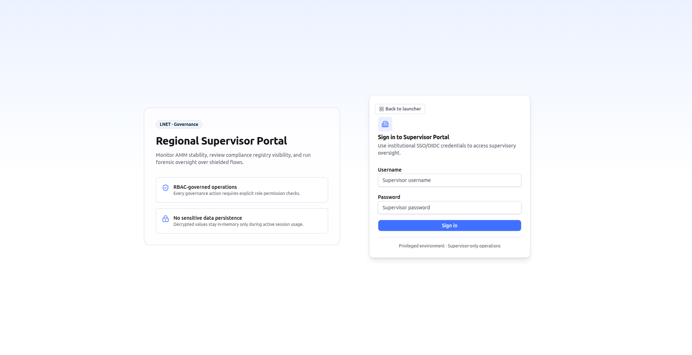
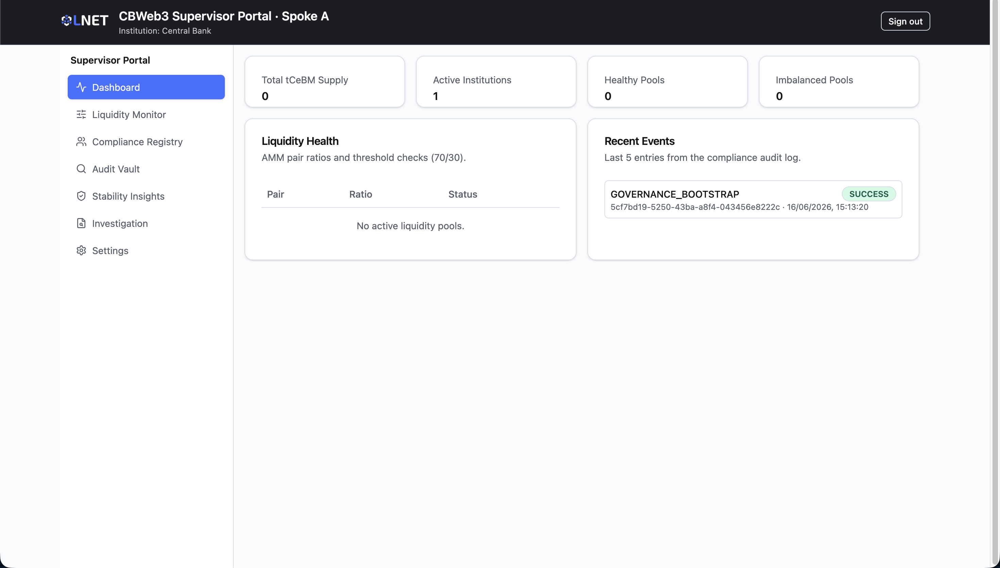
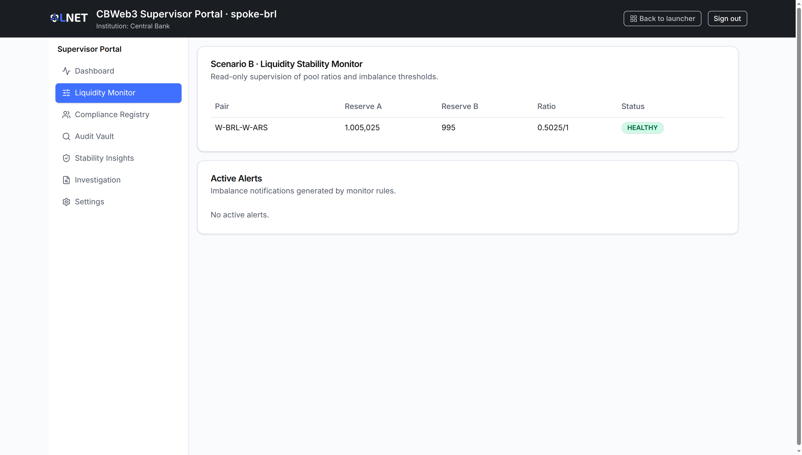
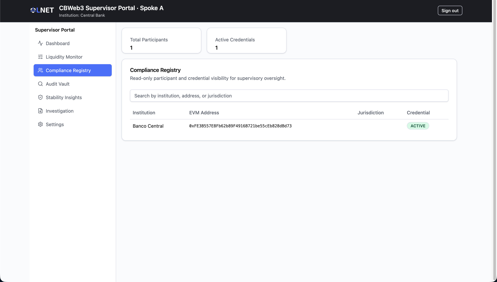
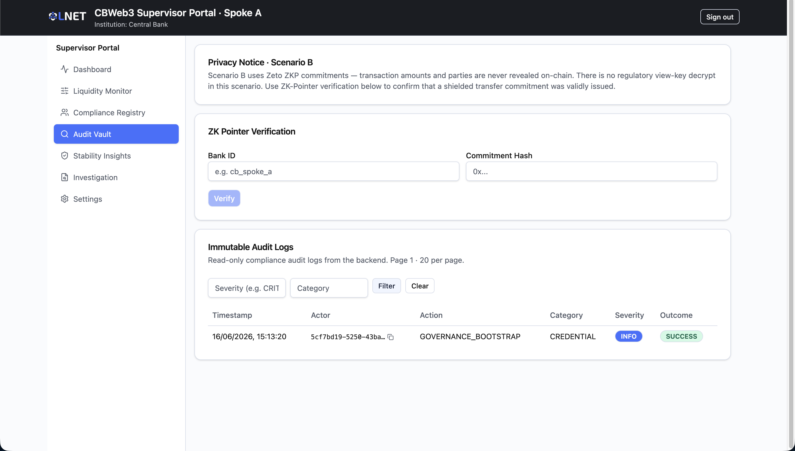
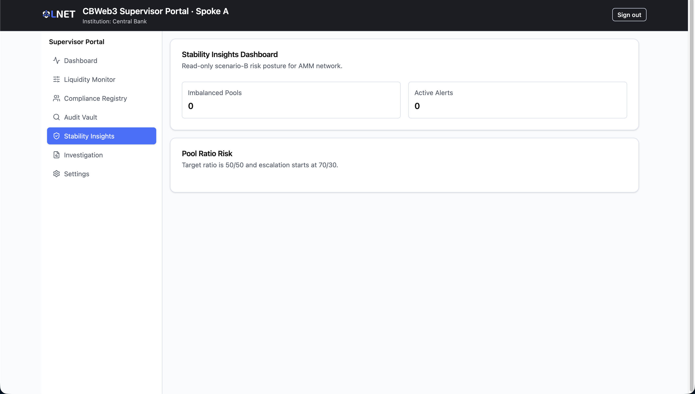
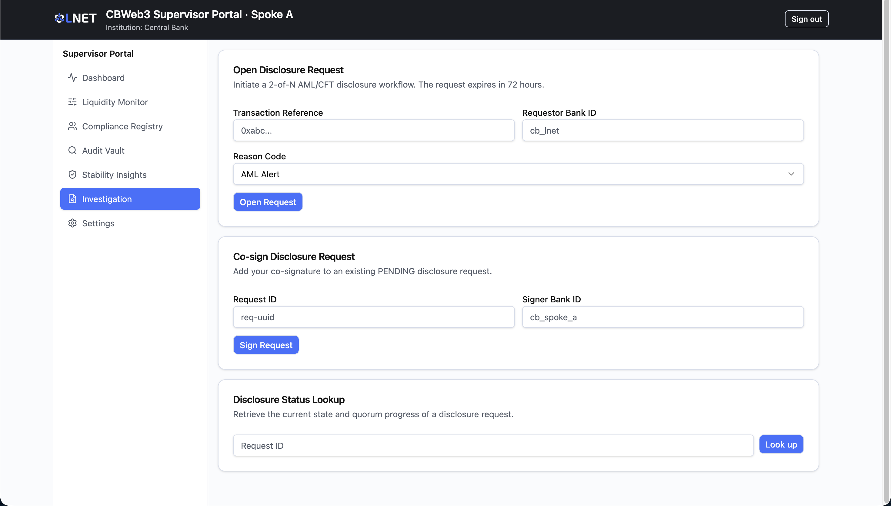
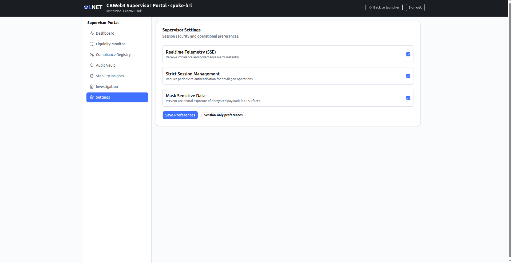

# Supervisor Portal — User Manual (Scenario B: International Hub)

**Audience:** Supervisors and regulators.

---

> ## IMPORTANT — Preview Status
>
> The Supervisor Portal is currently a **UI preview**. The portal's data sources
> depend on the backend services being reachable at the configured API base URL.
> When those services return data, the portal displays it; when they are
> unavailable (as is the case in most local or demo environments), each screen
> will show empty tables or zero counters.
>
> Additionally, the authentication flow uses a username and password form that
> talks to the platform's OIDC provider. In environments where Keycloak is not
> running, sign-in will fail.
>
> - **Do not** rely on any figure, pool status, audit entry, or participant
>   record shown in a demo or offline environment for a real supervisory or
>   regulatory decision.
> - This manual documents the screens as implemented and calls out every area
>   where live backend connectivity is required.

---

## Table of Contents

1. [Overview](#1-overview)
2. [Who uses this portal](#2-who-uses-this-portal)
3. [Access and login](#3-access-and-login)
4. [Navigation](#4-navigation)
5. [Screens](#5-screens)
   - [5.1 Dashboard](#51-dashboard)
   - [5.2 Liquidity Monitor](#52-liquidity-monitor)
   - [5.3 Compliance Registry](#53-compliance-registry)
   - [5.4 Audit Vault](#54-audit-vault)
   - [5.5 Stability Insights](#55-stability-insights)
   - [5.6 Investigation](#56-investigation)
   - [5.7 Settings](#57-settings)
6. [Typical workflows](#6-typical-workflows)
7. [Status reference](#7-status-reference)
8. [Troubleshooting](#8-troubleshooting)

---

## 1. Overview

The Supervisor Portal is the **read-only oversight surface** for supervisors and
regulators in **Scenario B — International Hub**. Scenario B uses an AMM-based
(Automated Market Maker) hub architecture for cross-border settlement, with
privacy-preserving ZKP tokens (Zeto) on the spoke networks. The portal's
surveillance responsibilities therefore differ substantially from Scenario A:

- **AMM liquidity health.** Pool reserves and imbalance thresholds are the
  primary stability signal; there are no HTLC expiry clocks to monitor.
- **Circuit-breaker state.** A governance circuit breaker can pause the entire
  hub. CRITICAL alerts are raised when the circuit breaker is tripped.
- **ZK commitment verification.** Because Zeto ZKP shielding means transaction
  amounts and parties are never revealed on-chain, the portal provides a ZK
  Pointer tool for confirming that a shielded transfer commitment was validly
  issued without decrypting its contents.
- **AML/CFT disclosure workflow.** Multi-party 2-of-N disclosure requests allow
  authorised supervisors to co-sign an investigation into a specific shielded
  transaction reference.

| Actor | Portal | Intended role |
|---|---|---|
| Supervisor / Regulator | Supervisor Portal | Read-only monitoring, compliance oversight, audit review, ZK verification, AML/CFT investigation initiation |

---

## 2. Who uses this portal

Regional supervisors and regulators with institutional SSO credentials issued by
a participating central bank. The portal is a privileged environment: every
route is protected and requires an authenticated session. There is no guest or
read-only anonymous access.

---

## 3. Access and login

**Route:** `/login`

Navigate to the Supervisor Portal URL. The login page presents an
institutional SSO/OIDC sign-in form.

**Fields:**

| Field | Description |
|---|---|
| Username | The supervisor username issued to your institution (minimum 3 characters). |
| Password | The corresponding supervisor password (minimum 6 characters). |

**How authentication works:**

The form submits the username and password to the platform's Keycloak OIDC
provider via the backend auth service (`POST /api/v1/auth/login`). On success,
the portal establishes the session, displays a confirmation toast, and
redirects to the Dashboard. A short-lived access token is renewed automatically
for the duration of the session; closing the tab ends the session.

> **Privileged environment.** This login is connected to the platform's
> production identity provider. Credentials are institution-issued and
> supervised. Do not share your credentials.

**Session security features (configured in Settings):**

- Strict session management requires periodic re-authentication for privileged
  operations.
- Decrypted values are held in memory only during active session usage; they
  are never persisted to local storage or disk.

Unauthenticated requests to any protected route are redirected to `/login`
automatically.

---

## 4. Navigation

After login, the left sidebar provides access to all portal screens. On smaller
viewports the sidebar collapses to a top navigation bar.

| Sidebar label | Route | Description |
|---|---|---|
| Dashboard | `/` | Network-level overview of AMM health and recent audit events |
| Liquidity Monitor | `/liquidity` | Detailed pool-by-pool AMM surveillance |
| Compliance Registry | `/participants` | Searchable registry of participating institutions |
| Audit Vault | `/audit` | Immutable compliance audit log with ZK pointer verification |
| Stability Insights | `/stability` | AMM risk posture summary and circuit-breaker awareness |
| Investigation | `/investigation` | AML/CFT disclosure request workflow |
| Settings | `/settings` | Session security and operational preferences |

All routes require an authenticated session. Visiting an unknown path redirects
to the Dashboard.

---

## 5. Screens

### 5.1 Dashboard

**Route:** `/` · **Sidebar label:** Dashboard

The Dashboard provides a real-time network-level overview by combining data
from the network overview API and the stability (AMM pool) API. It is the
recommended starting point for any supervisory session.

**Summary cards (top row):**

| Card | Source | Description |
|---|---|---|
| Total tCeBM Supply | Network overview API | Aggregate reserve-layer tCeBM token supply across the hub. |
| Active Institutions | Network overview API | Count of institutions with an ACTIVE credential in the compliance registry. |
| Healthy Pools | Network overview API | Number of AMM pools whose reserve ratio is within the acceptable threshold. |
| Imbalanced Pools | Network overview API | Number of AMM pools flagged as imbalanced (ratio outside the 70/30 threshold). |

> **Live data required.** These counters are populated from the backend network
> overview API. In an offline environment they will display as dashes (`-`).

**Liquidity Health table (lower left):**

Displays AMM pair ratios from the stability API, using the same threshold
logic as the Liquidity Monitor page. Each row shows:

- **Pair** — the currency pair label (for example, `W-BRL-ARS`).
- **Ratio** — the current reserve ratio expressed as `ratioA / ratioB`.
- **Status** — `HEALTHY` (green) or `IMBALANCED` (red) based on the pool's
  `imbalance_flag`.

The imbalance threshold is **70/30**: a pool whose dominant reserve exceeds
70% of the total is flagged as imbalanced.

> **Live data required.** Pool ratios come from the AMM pool status API
> (`GET /api/v2/amm/pool/{pair}/status`). Empty tables indicate the backend
> is unreachable.

**Recent Events panel (lower right):**

Shows the five most recent entries from the compliance audit log. Each entry
displays:

- The action name and outcome badge (`SUCCESS` or `FAILURE`).
- Actor identity, optional target subject, and timestamp.

> **Live data required.** Entries come from the audit log API
> (`GET /api/v1/compliance/audit/logs`).

---

### 5.2 Liquidity Monitor

**Route:** `/liquidity` · **Sidebar label:** Liquidity Monitor

This screen is specific to Scenario B and provides detailed, pool-level AMM
surveillance. It is the primary tool for assessing hub liquidity health during
normal operations or a market stress event.

> **Scenario B specific.** This page does not exist in the Scenario A
> Supervisor Portal. It reflects the AMM architecture of the International Hub.

**Pool Status table:**

One row per known AMM pair (currently `W-BRL-ARS`). Columns:

| Column | Description |
|---|---|
| Pair | Currency pair identifier. |
| Reserve A | Raw reserve of token A in the pool (displayed in human-readable units, converted from wei). |
| Reserve B | Raw reserve of token B in the pool (in human-readable units). |
| Ratio | Current ratio expressed as `current_ratio / 1`. |
| Status | `HEALTHY` (green) or `IMBALANCED` (red). |

Pools with `pool_status = EMPTY` are excluded from the table; they indicate
the pool has not yet been funded.

**Active Alerts panel:**

Alert cards are generated in real time from two sources:

1. **Circuit-breaker alerts.** If the governance circuit breaker is in `PAUSED`
   state, a `CRITICAL` severity alert labelled `ALL` is displayed with the
   pause reason.
2. **Pool imbalance alerts.** For each active pool with `imbalance_flag = true`,
   a `HIGH` severity alert is shown.

| Alert severity | Badge colour | Trigger |
|---|---|---|
| CRITICAL | Red | Circuit breaker is PAUSED |
| HIGH | Amber | A specific pool is imbalanced |

When no alerts are active the panel displays "No active alerts."

> **Live data required.** Both pool status and circuit-breaker status are
> fetched from live backend APIs. In an offline environment the table will be
> empty and no alerts will be shown.

---

### 5.3 Compliance Registry

**Route:** `/participants` · **Sidebar label:** Compliance Registry

A searchable, read-only view of all institutions registered in the hub
compliance system. Use this screen to verify participant credentials and
jurisdictional standing.

**Summary cards:**

| Card | Description |
|---|---|
| Total Participants | Count of all records in the registry. |
| Active Credentials | Count of participants whose `credentialStatus` is `ACTIVE`. |

**Registry table:**

| Column | Description |
|---|---|
| Institution | Human-readable name of the institution. |
| EVM Address | On-chain address (displayed in monospace). |
| Jurisdiction | ISO jurisdiction code. |
| Credential | `ACTIVE` (green) or `REVOKED` / `PENDING` (red). |

**Search / filter:**

The search box filters the visible rows in real time against institution name,
EVM address, and jurisdiction code. No server round-trip is required for
filtering; all records are loaded on page entry.

> **Live data required.** The registry is populated from the compliance service
> participant API. In an offline environment the table will be empty.

---

### 5.4 Audit Vault

**Route:** `/audit` · **Sidebar label:** Audit Vault

The Audit Vault has two sections: a ZK Pointer verification tool and the
immutable compliance audit log. This arrangement reflects Scenario B's
privacy model: because Zeto ZKP shielding means that amounts and parties are
never revealed on-chain, classical "decrypt with view key" functionality does
not apply. The ZK Pointer tool provides the appropriate alternative.

**Privacy notice (top card):**

A non-dismissable notice reminding the user that Scenario B uses Zeto ZKP
commitments. Transaction amounts and parties are not accessible even to
supervisors via the portal. The ZK Pointer mechanism is the supported method
for confirming the validity of a shielded transfer.

**ZK Pointer Verification panel:**

Allows a supervisor to confirm that a shielded transfer commitment was
validly issued by a specific bank without revealing its contents.

| Field | Description |
|---|---|
| Bank ID | Identifier of the issuing institution (example: `cb_spoke_a`). |
| Commitment Hash | The 0x-prefixed commitment hash of the shielded transfer. |

Click **Verify** to submit. The panel displays a result card with:

| Result field | Description |
|---|---|
| State | `VALID` (green), `EXPIRED` (amber), or `INVALID` (red). |
| Pointer ID | Internal pointer identifier (displayed if present). |
| Commitment | The commitment hash that was verified (truncated for display). |
| Expires At | Expiry timestamp of the pointer (if applicable). |

> **Live data required.** Verification calls the ZK Pointer API
> (`GET /api/v1/compliance/zk-pointer/verify`). If the backend is unreachable
> or the combination of bank ID and commitment is not found (HTTP 404), the
> state is shown as `INVALID`.

**Immutable Audit Log table:**

Read-only compliance audit log sourced from the compliance backend.

**Filters:**

| Filter | Description |
|---|---|
| Severity | Filter by severity keyword (e.g. `CRITICAL`, `HIGH`, `MEDIUM`, `LOW`, `INFO`). |
| Category | Filter by event category string. |

Click **Filter** to apply. Click **Clear** to reset all filters and reload the
unfiltered log. Filters are applied server-side.

**Table columns:**

| Column | Description |
|---|---|
| Timestamp | ISO 8601 timestamp localised to the browser timezone. |
| Actor | Identity of the actor who triggered the event (truncated with copy button). |
| Action | Event type name. |
| Category | Compliance category of the event. |
| Severity | `CRITICAL` / `HIGH` (red), `MEDIUM` (amber), `LOW` / `INFO` (grey). |
| Outcome | `SUCCESS` (green) or `FAILURE` (red). |

> **Live data required.** Log entries are fetched from the audit log API
> (`GET /api/v1/compliance/audit/logs`). In an offline environment the table
> shows "No audit logs found."

---

### 5.5 Stability Insights

**Route:** `/stability` · **Sidebar label:** Stability Insights

A summary dashboard of the AMM network's current risk posture. This screen is
the Scenario B equivalent of a stability controls page; it is intentionally
read-only and does not expose any intervention buttons.

> **Scenario B specific.** This page focuses entirely on AMM pool risk. It
> does not display HTLC expiry or escrow risk indicators, which are Scenario A
> concerns.

**Summary counters:**

| Counter | Description |
|---|---|
| Imbalanced Pools | Count of AMM pools currently outside the 70/30 ratio threshold. |
| Active Alerts | Count of open imbalance or circuit-breaker alerts. |

**Pool Ratio Risk section:**

For each active pool, a progress bar visualises how far the dominant reserve
has drifted from the 50/50 target. The bar represents `ratioA` as a
percentage (0–100).

- **Target:** 50/50.
- **Escalation threshold:** 70/30. Pools that cross this boundary are flagged
  IMBALANCED on the Liquidity Monitor page and generate a HIGH alert.

Each pool row shows the pair label and the current ratio alongside the bar.

> **Live data required.** Uses the same stability store and AMM pool APIs as
> the Liquidity Monitor. In an offline environment all pools are absent and
> both counters read zero.

---

### 5.6 Investigation

**Route:** `/investigation` · **Sidebar label:** Investigation

The Investigation screen supports the AML/CFT disclosure workflow. It enables
authorised supervisors to open a multi-party disclosure request against a
specific shielded transaction reference and to co-sign requests opened by
other supervisors.

> **Active write operations.** Unlike the other screens, this page makes write
> API calls when opening or signing a disclosure request. Operations require
> a valid authenticated session and appropriate role permissions on the
> backend.

**Workflow overview:**

Disclosure requests use a **2-of-N quorum** model: a minimum number of
supervisors must co-sign before a request reaches `QUORUM_REACHED` status.
Requests expire 72 hours after creation.

**Section 1 — Open Disclosure Request:**

Opens a new disclosure request for a specific transaction.

| Field | Required | Description |
|---|---|---|
| Transaction Reference | Yes | The on-chain transaction reference or hash to be investigated (e.g. `0xabc...`). |
| Requestor Bank ID | Yes | Identifier of the requesting institution (e.g. `cb_lnet`). |
| Reason Code | Yes | Regulatory reason for the request (see table below). |

**Reason codes:**

| Code | Label |
|---|---|
| `AML_ALERT` | AML Alert |
| `CFT_INVESTIGATION` | CFT Investigation |
| `COURT_ORDER` | Court Order |
| `REGULATORY_EXAM` | Regulatory Exam |

On success, the new disclosure request card is displayed inline. Record the
**Request ID** — it is required for co-signing and status lookups.

**Section 2 — Co-sign Disclosure Request:**

Adds a co-signature to an existing `PENDING` request.

| Field | Required | Description |
|---|---|---|
| Request ID | Yes | UUID of the disclosure request to sign. |
| Signer Bank ID | Yes | Identifier of the signing institution (e.g. `cb_spoke_a`). |

Once the quorum threshold is met, the request transitions to `QUORUM_REACHED`.

**Section 3 — Disclosure Status Lookup:**

Retrieves the current state and quorum progress of any disclosure request by
its Request ID.

| Field | Description |
|---|---|
| Request ID | Input the UUID and click **Look up**. |

The result card shows:

| Field | Description |
|---|---|
| Request ID | Unique identifier. |
| State | `PENDING`, `QUORUM_REACHED`, or `EXPIRED` (see Status reference). |
| Target Transaction | Transaction reference under investigation. |
| Reason | Reason code applied. |
| Quorum | `signatures received / signatures required`. |
| Expires | Expiry timestamp. |

> **Live data required.** All three sections call the oversight API
> (`/api/v2/oversight/...`). Backend availability and correct role permissions
> are required for operations to succeed.

---

### 5.7 Settings

**Route:** `/settings` · **Sidebar label:** Settings

The Settings screen holds session security and operational preferences. All
options are toggles that apply to the current browser session only; they are
not persisted to the backend.

**Preferences:**

| Preference | Default | Description |
|---|---|---|
| Realtime Telemetry (SSE) | On | Receive imbalance and governance alerts instantly over server-sent events. |
| Strict Session Management | On | Require periodic re-authentication for privileged operations. |
| Mask Sensitive Data | On | Prevent accidental exposure of decrypted payloads in UI surfaces. |

Click **Save Preferences** to apply the current selections. A confirmation
toast is shown and a **Session-only preferences** badge indicates that the
settings are not stored beyond the active session.

> **Session-only.** Preferences reset when the session ends. Re-apply them at
> the start of each session if required.

---

## 6. Typical workflows

### 6.1 Morning liquidity check

1. Sign in with institutional credentials.
2. Review the **Dashboard** summary cards — note any non-zero Imbalanced Pools
   counter or IMBALANCED rows in the Liquidity Health table.
3. Navigate to **Liquidity Monitor** for pool-level detail. Check Reserve A,
   Reserve B, and the ratio for each active pair.
4. Review Active Alerts. A CRITICAL alert means the circuit breaker is
   currently PAUSED; escalate to the governance team immediately.
5. Navigate to **Stability Insights** to confirm the pool ratio progress bars
   are within acceptable range.

### 6.2 Investigating a suspicious shielded transfer

1. Obtain the transaction reference (on-chain hash or reference ID) and the
   issuing bank's Bank ID from the referring analyst.
2. Navigate to **Audit Vault**. Use the ZK Pointer Verification panel to
   confirm the commitment hash is VALID and has not EXPIRED. Record the
   Pointer ID.
3. If further investigation is warranted, navigate to **Investigation**.
4. In "Open Disclosure Request", enter the transaction reference, your
   institution's Requestor Bank ID, and the appropriate reason code. Click
   **Open Request**.
5. Record the returned Request ID. Share it with co-signing supervisors.
6. Each co-signing supervisor navigates to Investigation, enters the Request
   ID and their Signer Bank ID, and clicks **Sign Request**.
7. Use "Disclosure Status Lookup" to monitor quorum progress. Once
   `QUORUM_REACHED` status is confirmed, proceed with the investigation
   according to your institution's regulatory procedures.

### 6.3 Verifying participant credential status

1. Navigate to **Compliance Registry**.
2. Enter the institution name, EVM address, or jurisdiction code in the search
   box.
3. Confirm the Credential column shows `ACTIVE`. A `REVOKED` status means the
   institution is not cleared to transact.

### 6.4 Reviewing audit events for a specific actor

1. Navigate to **Audit Vault**.
2. In the filter row, enter a severity or category filter and click **Filter**.
3. Scroll the table to locate entries for the actor of interest. The Actor
   column supports copy-to-clipboard for precise matching.

---

## 7. Status reference

### AMM pool status

| Status | Badge colour | Meaning |
|---|---|---|
| HEALTHY | Green | Pool reserves are within the 70/30 threshold. |
| IMBALANCED | Red | Pool reserves have exceeded the 70/30 threshold and may require rebalancing. |

### Alert severity

| Severity | Badge colour | Typical trigger |
|---|---|---|
| CRITICAL | Red | Governance circuit breaker is PAUSED. |
| HIGH | Amber | A specific AMM pool is imbalanced. |
| MEDIUM | Amber | Intermediate severity (reserved for future monitor rules). |
| LOW | Grey | Informational threshold breach. |
| INFO | Grey | Background informational event. |

### Participant credential status

| Status | Badge colour | Meaning |
|---|---|---|
| ACTIVE | Green | Institution is cleared to transact in the hub. |
| PENDING | Red | Onboarding in progress; not yet cleared. Any non-`ACTIVE` status renders red. |
| REVOKED | Red | Credential has been revoked; institution is blocked. |

### Audit log outcome

| Outcome | Badge colour | Meaning |
|---|---|---|
| SUCCESS | Green | The recorded operation completed without error. |
| FAILURE | Red | The recorded operation failed or was rejected. |

### Audit log severity

| Severity | Badge colour | Meaning |
|---|---|---|
| CRITICAL | Red | Highest severity compliance event. |
| HIGH | Red | High-priority compliance event. |
| MEDIUM | Amber | Medium-priority event requiring review. |
| LOW | Grey | Low-priority informational event. |
| INFO | Grey | Routine informational record. |

### Disclosure request state

| State | Badge | Meaning |
|---|---|---|
| PENDING | Grey | Request is open and collecting co-signatures. |
| QUORUM_REACHED | Default (blue) | The required number of co-signatures has been received; investigation may proceed. |
| EXPIRED | Red | The 72-hour window closed before quorum was reached; a new request must be opened if still needed. |

### ZK Pointer verification state

| State | Badge colour | Meaning |
|---|---|---|
| VALID | Green | The commitment hash was found and is within its validity window. |
| EXPIRED | Amber | The pointer was found but the validity window has passed. |
| INVALID | Red | No matching pointer was found for the given bank ID and commitment hash. |

---

## 8. Troubleshooting

### The Dashboard shows dashes or zero counts

The network overview API is unreachable. Verify that the backend services are
running and that the portal is configured with the correct API base URL. This
is expected in fully offline demo environments.

### Pool tables are empty on Liquidity Monitor or Stability Insights

The AMM pool status API (`/api/v2/amm/pool/{pair}/status`) is not returning
data. Check that the backend FX / AMM service is healthy. Also confirm that
at least one pool has been funded (EMPTY pools are intentionally excluded from
the display).

### Sign-in fails with "Unable to login"

Verify that Keycloak is running and reachable from the browser. Confirm your
username and password are correct and have not been rotated. If using a local
development stack, check that the auth service container is up.

### ZK Pointer returns INVALID for a known commitment

Either the bank ID does not match the issuing institution exactly, or the
commitment hash has not been indexed yet. Allow a few seconds for the ZK
Pointer service to index a newly created commitment and retry. If the hash is
confirmed correct but the result remains INVALID, the transfer may not have
been registered via the ZK Pointer API.

### Disclosure request creation fails

Confirm that your session has the required RBAC role for disclosure requests.
Also confirm that the transaction reference is a valid, existing reference
known to the compliance service. Check the backend oversight service logs for
a detailed error.

### Co-sign returns an error

The most common causes are: the request has already expired (`EXPIRED` state),
the request ID is incorrect, or your institution's signer ID is not on the
eligible signers list for this hub. Use "Disclosure Status Lookup" to check
the current state before retrying.

### Audit log shows "No audit logs found"

The compliance audit service is unreachable or has no records matching the
current filters. Click **Clear** to remove all filters and reload the
unfiltered log. If the table remains empty, check backend compliance service
health.

### Preferences reset between sessions

This is expected. Settings are session-only and are not persisted to the
backend. Re-apply your preferred settings at the start of each session.

---

> When the portal is connected to a fully operational stack, this manual will
> be updated to include screenshots, precise API endpoint versions, and
> confirmation of which features are available to which RBAC roles.
