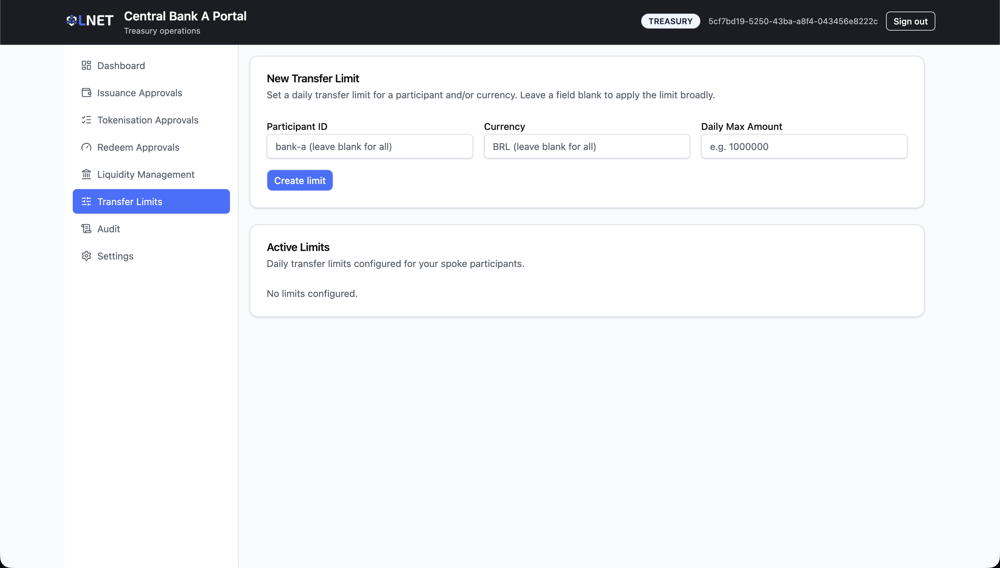

# Treasury Portal — User Manual (Scenario B)

**Audience:** Central bank treasury officers and issuance operators.
**Portal:** Treasury Portal (Scenario B — International Hub)
**Data source:** Live backend. All data shown is real unless an individual section states otherwise.

---

> ## Important — Scope relative to Scenario A
>
> In Scenario B the responsibilities of the treasury team are narrower than in Scenario A.
> Cross-border governance actions — circuit-breaker activation, FX-agreement management,
> multi-party approvals — are handled in the **Governance Portal**. The Treasury Portal
> focuses on the domestic token lifecycle (issuance, tokenisation, redemption), transfer
> policy, liquidity provision, and audit.

---

## Table of Contents

1. [Overview](#1-overview)
2. [Access and Login](#2-access-and-login)
3. [Navigation](#3-navigation)
4. [Screens](#4-screens)
   - [Dashboard](#41-dashboard)
   - [Deposits Approval — Issuance Requests](#42-deposits-approval--issuance-requests)
   - [Escrows Approval — Tokenisation Requests](#43-escrows-approval--tokenisation-requests)
   - [Redeems Approval — Redemption Requests](#44-redeems-approval--redemption-requests)
   - [Liquidity Management](#45-liquidity-management)
   - [Transfer Limits](#46-transfer-limits)
   - [Audit](#47-audit)
   - [Settings](#48-settings)
5. [Typical Workflows](#5-typical-workflows)
6. [Status Reference](#6-status-reference)
7. [Troubleshooting](#7-troubleshooting)

---

## 1. Overview

The Treasury Portal is the central bank's operational workbench for managing the tCeBM
(tokenised Central Bank Money) lifecycle on a spoke network within the International Hub
architecture. It covers three approval queues, AMM liquidity management, daily transfer
limit administration, and a structured audit log.

The Governance Portal handles cross-cutting decisions that affect multiple central banks or
that require multi-party signatures. The table below summarises the division of responsibilities.

| Function | Treasury Portal | Governance Portal |
|---|---|---|
| Approve / reject fiat-backed issuance requests | Yes | No |
| Approve / reject tCeBM tokenisation (lock-to-mint) | Yes | No |
| Approve / reject tCeBM redemption (burn-to-release) | Yes | No |
| Set and remove daily transfer limits | Yes | No |
| Contribute / withdraw AMM liquidity | Yes | No |
| Monitor hub pool and FX state | Yes (read-only summary) | Full controls |
| Circuit-breaker (halt / resume swaps) | No | Yes |
| FX-agreement approval | No | Yes |
| Identity / compliance governance | No | Yes |

---

## 2. Access and Login

Open the Treasury Portal URL provided by your platform administrator and sign in with your
institutional client credentials.

The login form requires two fields:

| Field | Description |
|---|---|
| Client ID | The Keycloak client ID assigned to this treasury institution (e.g. `central-bank-a-treasury`). |
| Client Secret | The corresponding client secret. |

Credentials are validated against Keycloak. A successful authentication redirects to the
Dashboard. Access to every route and every approval action requires the `TREASURY` role
claim; requests without that claim are blocked at the API gateway.

> **Credential policy.** Mint and burn operations additionally require the `authorizedIssuer`
> attribute on the authenticated identity. If your account is an authorised issuer, the
> Dashboard displays a green **Authorised issuer** badge beside your institution name.

> **Session security.** No authentication tokens or sensitive payloads are written to local
> storage or session storage. Closing the browser tab terminates the active session.

---

## 3. Navigation

After login, the application shell presents a sidebar with the following items:

| Sidebar label | Route | Description |
|---|---|---|
| Dashboard | `/` | Overview of balances, pending queues, pool state, and live events |
| Deposits Approval | `/deposits-approval` | Issuance request queue |
| Escrows Approval | `/escrows-approval` | Tokenisation request queue |
| Redeems Approval | `/redeems-approval` | Redemption request queue |
| Liquidity | `/liquidity` | AMM pool status and cooperative liquidity management |
| Transfer Limits | `/transfer-limits` | Daily transfer limit administration |
| Audit | `/audit` | Structured audit log |
| Settings | `/settings` | Security profile reference |

Unauthenticated requests to any protected route are redirected to `/login`. All other
unrecognised paths redirect to the Dashboard.

---

## 4. Screens

### 4.1 Dashboard

**Route:** `/`

The Dashboard provides a real-time overview of the treasury position and pending workload.
It is the first screen seen after login and the primary situational-awareness view.

**Identity card.** The top card shows the authenticated institution name (sourced from
`VITE_INSTITUTION_NAME` or the Keycloak user profile), the wallet address (truncated), the
user role, and an **Authorised issuer** badge when applicable.

**Circuit-breaker banner.** Immediately below the identity card, a banner shows the current
hub circuit-breaker state for the configured pool pair. The banner border turns red when
the pool is halted.

| Banner state | Meaning |
|---|---|
| LIVE | The AMM pool is open; commercial swaps can execute. |
| HALTED | Swaps are suspended. Contact the Governance Portal operator to investigate the pause reason shown. |
| RESUME PENDING | A resume request has been submitted but requires additional signatures. |
| UNKNOWN | Circuit-breaker status could not be retrieved from the backend. |

> Halting or resuming the circuit breaker is performed in the **Governance Portal**, not here.

**KPI row.** Four summary cards show:

- tCeBM balance of the treasury wallet.
- Number of pending Issuance approval requests.
- Number of pending Tokenisation approval requests.
- Number of pending Redemption approval requests.

**Hub Pool and FX panel.** Displays the current pool state for the configured pair:

| Field | Description |
|---|---|
| FX rate (ratio) | Current reserve ratio, used as the indicative exchange rate. |
| Reserve A / Reserve B | Token reserves on each side of the AMM pool. |
| LP providers | Total number of liquidity providers. |
| Your pool share | The treasury institution's percentage ownership of the pool. |
| Your LP shares | The number of CBW3-LP shares held by this institution. |
| Pending commits | Number of liquidity commits awaiting counterpart matching. |

An **Imbalanced** badge appears when the backend reports a reserve imbalance.

**Recent Operations table.** Shows the eight most recent operations across all three queues
(Issuance, Tokenisation, Redemption), sorted by creation time descending. Columns: Type,
Requester, Amount, Status.

**Real-time Event Stream.** Displays the latest events received via WebSocket connection.
Each event shows its type, severity (INFO / CRITICAL), and message. This stream reflects
on-chain and service-layer events as they occur.

---

### 4.2 Deposits Approval — Issuance Requests

**Route:** `/deposits-approval`

This screen manages requests from commercial bank participants to obtain fiat-backed tCeBM
(the "Issuance" or "Deposit" flow). When a participant deposits fiat reserves and requests
a corresponding tCeBM mint, the request appears here for treasury approval.

**Summary cards.** Show the total number of issuance requests and the number currently in
`PENDING` status.

**Filter.** An optional requester ID filter narrows the queue to requests from a specific
participant. Enter a participant identifier (e.g. `bank-a-client`) and click **Apply Filter**.
Click **Clear Filter** to return to the full list.

**Issuance Request Queue.** Each row represents one request:

| Column | Description |
|---|---|
| ID | Internal request identifier. |
| Requester | ID of the participant who submitted the request. |
| Fiat Amount | The fiat value deposited, expressed in the spoke's domestic currency. |
| Status | Current lifecycle status (see Section 6). |
| Issuance Reference | Truncated on-chain mint transaction hash (hover for full hash). |
| Created At | Timestamp of request submission. |
| Action | Approve or Reject buttons, visible only for PENDING requests. |

**Approving a request.**

1. Locate the request in the queue (use the filter if the queue is long).
2. Click **Approve Issuance**. A confirmation card appears at the bottom of the page
   showing the request ID.
3. Click **Confirm Action** to submit. A success notification confirms the approval and
   the on-chain mint transaction is triggered. The row status updates to `APPROVED`.

**Rejecting a request.**

1. Click **Reject** on the target row. A rejection card appears.
2. Enter a reason (minimum three characters — the field will not submit without one).
3. Click **Confirm Reject**. The status updates to `REJECTED` and the reason is recorded.

Only one confirmation card (approve or reject) is visible at a time. Clicking **Cancel**
in either card dismisses it without taking action.

---

### 4.3 Escrows Approval — Tokenisation Requests

**Route:** `/escrows-approval`

This screen handles tokenisation requests — the cross-currency flow where a participant
burns tokens on one spoke network (Redemption leg) and mints tokens on a destination spoke
(Issuance leg) via the hub. Both legs are coordinated atomically; approving an escrow
triggers both the on-chain burn (Redemption tx hash) and the on-chain mint (Issuance ref).

**Summary cards.** Total and pending tokenisation request counts.

**Tokenisation Request Queue.** Columns:

| Column | Description |
|---|---|
| ID | Internal escrow request identifier. |
| Requester | ID of the originating participant. |
| Amount | tCeBM amount, labelled with the spoke's domestic currency code. |
| Status | Current lifecycle status (see Section 6). |
| Redemption ID | Truncated burn transaction hash (hover for full hash). |
| Issuance Ref | Truncated mint transaction hash (hover for full hash). |
| Created At | Timestamp of request submission. |
| Action | Approve or Reject, visible only for PENDING requests. |

**Approving a tokenisation request.**

1. Click **Approve** on the target row.
2. In the confirmation card, click **Confirm Approve**.
3. On success, a notification shows truncated hashes for both the burn and the mint
   transactions. Both legs complete atomically.

**Rejecting a tokenisation request.**

1. Click **Reject** on the target row.
2. Enter a reason (minimum three characters).
3. Click **Confirm Reject**.

Use the **Refresh** button to reload the queue from the backend at any time.

---

### 4.4 Redeems Approval — Redemption Requests

**Route:** `/redeems-approval`

Redemption requests represent a participant returning tCeBM to the central bank in exchange
for fiat reserves. Approving a redeem burns the participant's tCeBM via a Zeto privacy
transfer and releases the corresponding fiat reserve.

**Summary cards.** Total and pending redeem counts.

**Redeem Queue.** Columns:

| Column | Description |
|---|---|
| ID | Internal redeem request identifier. |
| Requester | ID of the originating participant. |
| Amount | tCeBM amount to be burned. |
| Status | Current lifecycle status (see Section 6). |
| Zeto Transfer Tx Hash | Truncated hash of the privacy-preserving burn transaction (hover for full hash). |
| Redemption ID | Truncated fiat mint transaction hash representing the fiat reserve release (hover for full hash). |
| Created At | Timestamp of request submission. |
| Action | Approve or Reject, visible only for PENDING requests. |

**Approving a redemption.**

1. Click **Approve** on the target row.
2. In the confirmation card, click **Confirm Approve**.
3. On success, a notification shows the truncated fiat mint transaction hash.

**Rejecting a redemption.**

1. Click **Reject** on the target row.
2. Enter a reason (minimum three characters).
3. Click **Confirm Reject**.

Use the **Refresh** button to reload the queue at any time.

---

### 4.5 Liquidity Management

**Route:** `/liquidity`

This screen allows the central bank to monitor and manage its position in the hub AMM pool.
It is relevant when the treasury institution acts as a liquidity provider (LP) for cross-border
FX swaps between two spoke currencies.

The screen is organised into the following panels:

**Pool Status.** Shows live reserve levels, current FX ratio, and a balance indicator
for the configured pool pair. An **Imbalanced** badge appears when reserves deviate from
the expected range.

**Central Bank On-Chain Position.** Displays:

| Field | Description |
|---|---|
| LP shares (CBW3-LP) | On-chain LP share tokens held by this institution, the source of truth for pool ownership. |
| Pool ownership | Percentage share of total pool reserves. |
| tCeBM balance | The institution's own tCeBM balance on the spoke chain. |

**Sovereign Phase / Commit Status / Recommended Action.** Three summary cards showing the
current phase of the cooperative liquidity lifecycle, the commit status, and a guidance
message about the next recommended action.

**Liquidity Coordination.** Reflects cross-CB commit state read live from the hub. Three
scenarios are possible:

| Scenario | Display |
|---|---|
| Pool is ACTIVE | Green badge; current reserve levels shown. No action required. |
| A counterpart central bank has committed and is waiting for your matching deposit | Amber panel showing the counterpart's committed amount, the FX-suggested match amount, the signer address, and the expiry countdown. A **Match and Activate Pool** button initiates the cooperative wizard. |
| Your own commit is pending a counterpart | Outline badge with commit ID, side, and expiry. A **Monitor Pending Commit** button opens the wizard at the monitoring step. |
| No open intent | Informational message; no action required until a commit is needed. |

**Cooperative Liquidity Wizard.** Clicking **Add Cooperative Liquidity** opens a guided
multi-step wizard for committing liquidity to the pool. The wizard covers:

- Step 1 — Lock-Mint: lock fiat reserves and mint the corresponding tCeBM.
- Step 2 — Commit: register the liquidity intent on the hub.
- Step 3 — Monitor: track the commit expiry and await a counterpart match.

When acting as the matching party (in response to a counterpart commit), the wizard
pre-fills the suggested match amount derived from the current FX rate. The amount
is editable before submission.

**Remove Liquidity.** A form to withdraw an existing LP position by providing the LP ID,
pool pair, and provider bank ID. Use the LP ID shown in the session positions table or
obtained from the cooperative wizard response.

**LP Positions (Session).** A table listing LP positions established during the current
session. Columns: LP ID, Pool Pair, Provider, National-side tokens contributed,
Foreign-side tokens contributed, LP shares held on-chain, Status, Added At.

> **Session scope.** The LP positions table is populated from responses received during the
> current browser session. It does not retroactively display positions from previous sessions.
> The on-chain LP share balance in the **Central Bank On-Chain Position** card is authoritative
> for the institution's actual pool ownership.

---

### 4.6 Transfer Limits

**Route:** `/transfer-limits`

Transfer limits define the maximum daily transfer volume permitted for a participant and/or
currency on this spoke. Limits are enforced by the payment orchestrator at transfer initiation.

**Creating a new limit.**

Fill in one or more of the following fields and click **Create limit**:

| Field | Required | Description |
|---|---|---|
| Participant ID | No | Restricts the limit to a specific participant (e.g. `bank-a`). Leave blank to apply to all participants. |
| Currency | No | Restricts the limit to a specific currency (e.g. `BRL`). Leave blank to apply to all currencies. |
| Daily Max Amount | Yes | Maximum transfer volume per calendar day, expressed in base units (e.g. `1000000`). |

> At least the Daily Max Amount must be provided. A limit with both Participant ID and Currency
> blank applies broadly to all participants and currencies — use with care.

**Active Limits table.** Lists all currently configured limits:

| Column | Description |
|---|---|
| Participant | The restricted participant ID, or "all" when no participant restriction is set. |
| Currency | The restricted currency code, or "all" when no currency restriction is set. |
| Daily Max (human) | The configured limit in human-readable form. |
| Created | Date the limit was created. |
| (Remove button) | Immediately deletes the limit. There is no confirmation prompt. |

Removing a limit takes effect immediately. The payment orchestrator will no longer enforce
the removed rule from the next transfer attempt onward.

---

### 4.7 Audit

**Route:** `/audit`

The Audit screen provides a filterable log of treasury-relevant events recorded by the
backend. This is the primary tool for regulatory review and incident investigation.

**Filters.** Two dropdown filters can be combined independently:

| Filter | Options |
|---|---|
| Category | ALL, AUTH, FUNDING, TREASURY, KYC, RECONCILIATION |
| Severity | ALL, INFO, WARNING, CRITICAL |

Selecting a filter applies it immediately to the displayed results.

**Log table.** Columns:

| Column | Description |
|---|---|
| Time | Local timestamp of the audit event. |
| Category | Functional area that generated the event. |
| Severity | INFO (routine), WARNING (requires attention), or CRITICAL (immediate action needed). |
| Message | Human-readable description of the event. |

The log is loaded from the backend on page open. A loading indicator appears while the
request is in flight. Any backend error is displayed below the table.

> The audit log is append-only on the backend. Records cannot be edited or deleted from
> this interface.

---

## 5. Typical Workflows

### 5.1 Processing a fiat deposit and issuing tCeBM

1. Navigate to **Deposits Approval**.
2. Review the pending issuance request: verify the requester identity and fiat amount.
3. If the deposit is valid: click **Approve Issuance**, then **Confirm Action**.
   The payment orchestrator triggers the on-chain mint; the status moves to `APPROVED`.
4. If the deposit is invalid or policy-non-compliant: click **Reject**, enter the reason,
   click **Confirm Reject**. The status moves to `REJECTED` and the reason is persisted.

### 5.2 Processing a cross-border tokenisation (escrow)

1. Navigate to **Escrows Approval**.
2. Review the pending tokenisation request: verify the requester, the tCeBM amount,
   and the associated Redemption and Issuance transaction references.
3. If the request is valid: click **Approve**, then **Confirm Approve**.
   Both the burn (on the source spoke) and the mint (on the destination spoke) execute
   atomically. The notification confirms both transaction hashes.
4. If the request should be declined: click **Reject**, enter the reason, click **Confirm Reject**.

### 5.3 Processing a tCeBM redemption

1. Navigate to **Redeems Approval**.
2. Review the pending redeem: verify the requester identity, the tCeBM amount, and the
   Zeto transfer transaction hash.
3. If the redemption is valid: click **Approve**, then **Confirm Approve**.
   The burn is confirmed on-chain and the fiat reserve is released. The fiat mint
   transaction hash appears in the success notification.
4. If the redemption should be declined: click **Reject**, enter the reason, click **Confirm Reject**.

### 5.4 Seeding the AMM pool (cooperative liquidity provision)

1. Coordinate with the counterpart central bank on the planned contribution amounts
   and timing, using off-system communication as needed.
2. Navigate to **Liquidity Management**.
3. If you are initiating: click **Add Cooperative Liquidity** and follow the wizard steps
   — Lock-Mint, then Commit. Once submitted, the Liquidity Coordination panel shows
   "Waiting for counterpart" with the expiry countdown.
4. If a counterpart has already committed: the amber banner appears automatically.
   Click **Match and Activate Pool** and follow the wizard. Review the pre-filled
   suggested match amount (editable) and complete the Lock-Mint then Commit steps.
5. When both sides have committed, the pool status moves to **ACTIVE** and commercial
   swaps can proceed.

### 5.5 Setting a daily transfer limit

1. Navigate to **Transfer Limits**.
2. Enter the participant ID (optional), currency (optional), and daily maximum amount.
3. Click **Create limit**. The new limit appears in the Active Limits table immediately.
4. To remove a limit, click **Remove** on the corresponding row. Removal takes effect immediately.

### 5.6 Investigating a suspicious event

1. Navigate to **Audit**.
2. Set the **Severity** filter to **CRITICAL** or **WARNING** to surface high-priority events.
3. Optionally set the **Category** filter to narrow to a functional area (e.g. `TREASURY`).
4. Review the message column for event descriptions.
5. If further investigation is required, use the event timestamp to correlate with backend
   service logs or the Supervisor Portal's disclosure workflow.

---

## 6. Status Reference

The following status values apply to Issuance (Deposit), Tokenisation (Escrow), and
Redemption (Redeem) records throughout the portal.

| Status | Display colour | Meaning |
|---|---|---|
| PENDING | Amber | The request has been received and is awaiting a treasury decision. Approve or Reject actions are available. |
| APPROVED | Green | The request was approved. The on-chain mint or burn completed successfully. |
| REJECTED | Red | The request was declined by treasury. The rejection reason is stored on the record. |
| MINT FAILED | Red | The request was approved but the on-chain operation failed. Contact the platform operator. |
| UNKNOWN | Outline | The status value returned by the backend could not be recognised. Report to the platform operator. |

---

## 7. Troubleshooting

### The queue shows no requests

Verify that the backend payment-orchestrator service is reachable. Check the browser
developer console for network errors. If a filter is active, click **Clear Filter** and
reload. Confirm with the platform administrator that requests have been submitted by
participants.

### Approve or Reject returns an error

An error notification appears at the top of the page with the backend error message.
Common causes:
- The request is no longer in `PENDING` status (was acted on by another operator in a
  concurrent session).
- The authenticated identity does not have the `authorizedIssuer` attribute (for mint
  operations).
- The backend payment-orchestrator or ledger-gateway is temporarily unavailable.

Refresh the queue and retry. If the error persists, escalate to the platform operator
with the error text and the request ID.

### The circuit-breaker banner shows HALTED

Swaps are suspended by a governance action. This is not a treasury action — contact the
operator responsible for the **Governance Portal** to review the pause reason and initiate
the resume process. The circuit-breaker state is read-only in the Treasury Portal.

### Pool shows "Imbalanced"

The AMM reserves have diverged from the expected ratio. Navigate to **Liquidity Management**
for details on current reserve levels. If your institution is an LP, coordinate with the
counterpart central bank through the cooperative liquidity workflow to rebalance. If the
imbalance is caused by a recent large swap, it may self-correct as subsequent swaps trade
in the opposite direction.

### The LP Positions table is empty after adding liquidity

The LP positions table is session-scoped. If the page was reloaded or the session ended
after the liquidity addition, the table will not repopulate from history. The
**Central Bank On-Chain Position** card shows your actual LP share balance sourced directly
from the AMM contract and is the authoritative view of pool ownership.

### Transfer limit creation fails

Ensure the **Daily Max Amount** field contains a valid numeric value in base units (no
currency symbols, no decimal separators other than a period). The field cannot be blank.

### Login fails

Verify that the Client ID and Client Secret are correct for this institution. Client IDs
must be at least three characters; secrets at least six. If credentials are correct but
login still fails, the Keycloak service may be temporarily unavailable — contact the
platform administrator.

### Audit log does not load

The audit backend may be temporarily unavailable. An error message appears below the log
table when this occurs. Retry after a short interval. If the problem persists, escalate
to the platform operator.
