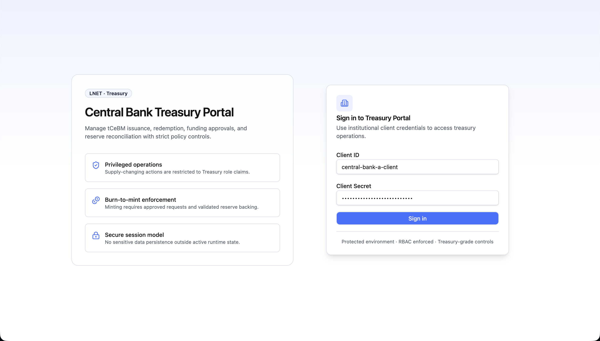
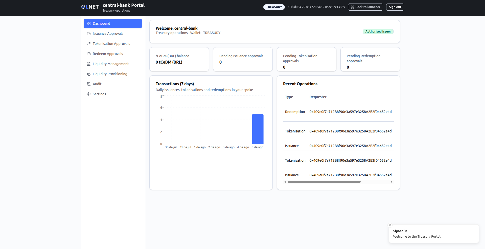
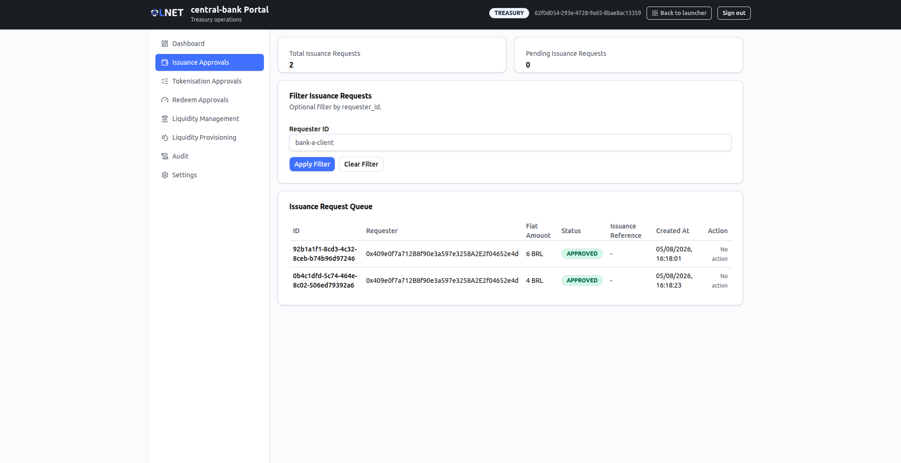
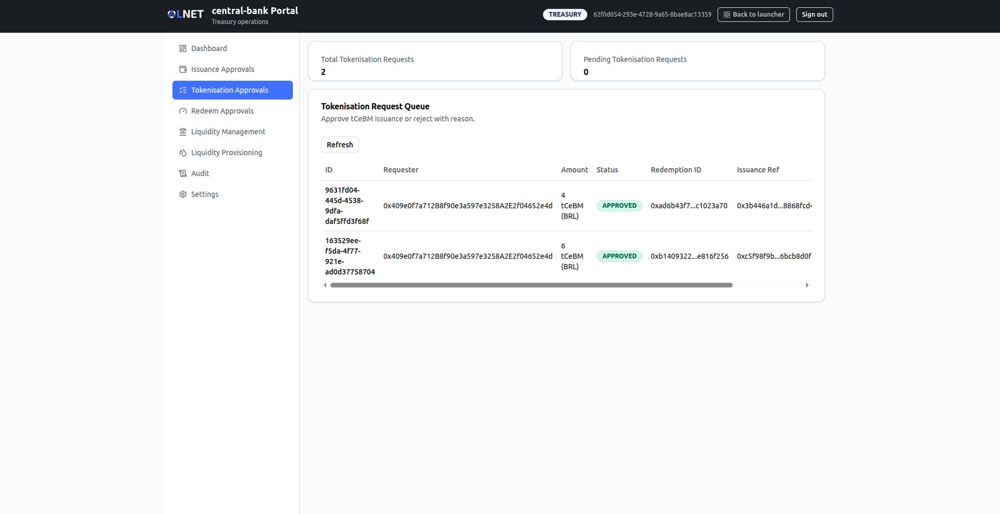
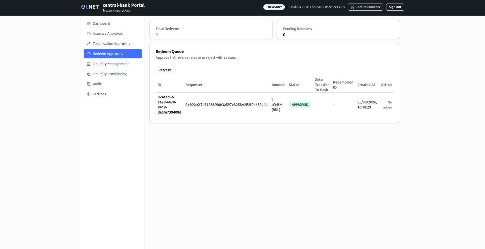
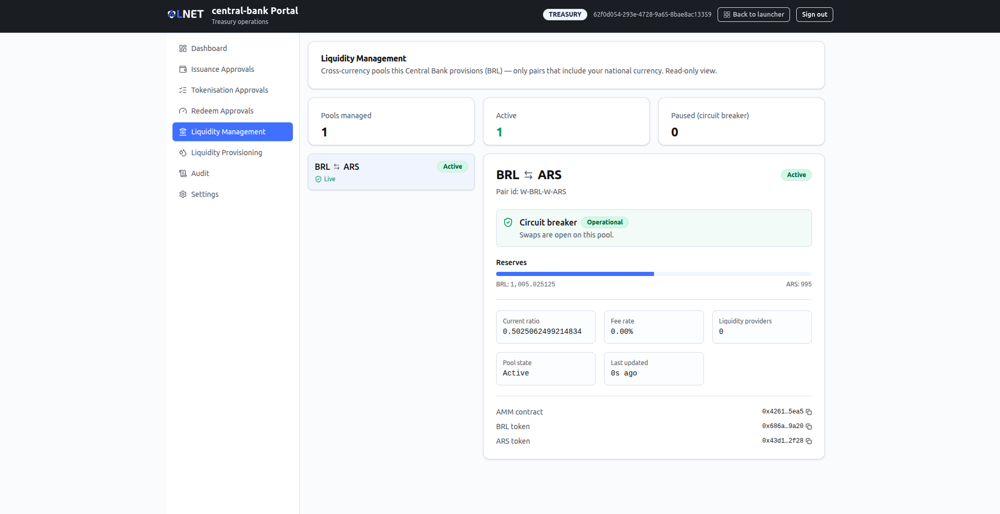
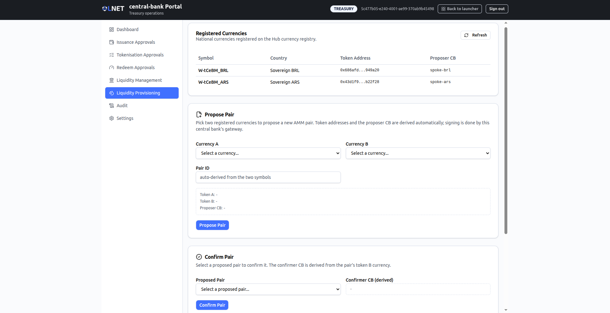
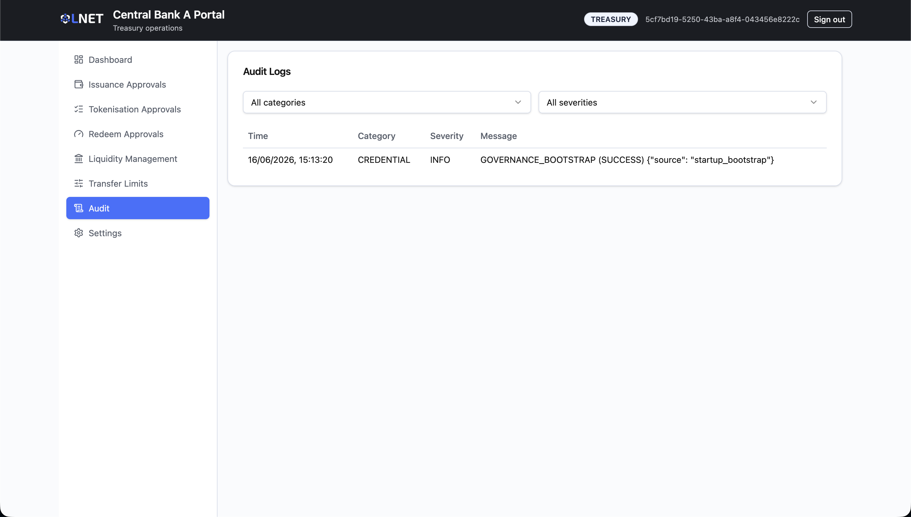

# Treasury Portal — User Manual (Scenario B)

**Audience:** Central bank treasury officers and issuance operators.
**Portal:** Treasury Portal (Scenario B — International Hub)
**Data source:** Live backend. All data shown is real unless an individual section states otherwise.

---

> ## Important — Scope relative to Scenario A
>
> In Scenario B the responsibilities of the treasury team are narrower than in Scenario A.
> Cross-border governance actions — circuit-breaker activation, FX-agreement management,
> multi-party approvals — are handled in the **Governance Portal**. The Treasury Portal
> focuses on the domestic token lifecycle (issuance, tokenisation, redemption), liquidity
> pool monitoring, cooperative liquidity provisioning, and audit.

---

## Table of Contents

1. [Overview](#1-overview)
2. [Access and Login](#2-access-and-login)
3. [Navigation](#3-navigation)
4. [Screens](#4-screens)
   - [Dashboard](#41-dashboard)
   - [Issuance Approvals](#42-issuance-approvals)
   - [Tokenisation Approvals](#43-tokenisation-approvals)
   - [Redeem Approvals](#44-redeem-approvals)
   - [Liquidity Management](#45-liquidity-management)
   - [Liquidity Provisioning](#46-liquidity-provisioning)
   - [Audit](#47-audit)
   - [Settings](#48-settings)
5. [Typical Workflows](#5-typical-workflows)
6. [Status Reference](#6-status-reference)
7. [Troubleshooting](#7-troubleshooting)

---

## 1. Overview

The Treasury Portal is the central bank's operational workbench for managing the tCeBM
(tokenised Central Bank Money) lifecycle on a spoke network within the International Hub
architecture. It covers three approval queues, read-only liquidity pool monitoring,
cooperative liquidity provisioning, and a structured audit log.

The Governance Portal handles cross-cutting decisions that affect multiple central banks or
that require multi-party signatures. The table below summarises the division of responsibilities.

| Function | Treasury Portal | Governance Portal |
|---|---|---|
| Approve / reject fiat-backed issuance requests | Yes | No |
| Approve / reject tCeBM tokenisation (lock-to-mint) | Yes | No |
| Approve / reject tCeBM redemption (burn-to-release) | Yes | No |
| Provision liquidity pools (propose / confirm pairs, seed reserves) | Yes | No |
| Monitor hub pool and circuit-breaker state | Yes (read-only) | Full controls |
| Circuit-breaker (halt / resume swaps) | No | Yes |
| FX-agreement approval | No | Yes |
| Identity / compliance governance | No | Yes |

---

## 2. Access and Login

Open the Treasury Portal URL provided by your platform administrator and sign in with your
institutional client credentials.

The login form requires two fields:

| Field | Description |
|---|---|
| Username | The Keycloak client ID assigned to this treasury institution (e.g. `central-bank-a-treasury`). Minimum three characters. |
| Password | The corresponding client secret. Minimum six characters. |

Credentials are validated against Keycloak. A successful authentication redirects to the
Dashboard. Access to every route and every approval action requires the `TREASURY` role
claim; requests without that claim are blocked at the API gateway.

> **Credential policy.** Mint and burn operations additionally require the `authorizedIssuer`
> attribute on the authenticated identity. If your account is an authorised issuer, the
> Dashboard displays a green **Authorised issuer** badge beside your institution name.

> **Session security.** No authentication tokens or sensitive payloads are written to local
> storage or session storage. Closing the browser tab terminates the active session.

---

## 3. Navigation

After login, the application shell presents a sidebar with the following items:

| Sidebar label | Route | Description |
|---|---|---|
| Dashboard | `/` | Overview of balance, pending queues, recent operations, and a seven-day activity chart |
| Issuance Approvals | `/deposits-approval` | Issuance request queue |
| Tokenisation Approvals | `/escrows-approval` | Tokenisation request queue |
| Redeem Approvals | `/redeems-approval` | Redemption request queue |
| Liquidity Management | `/liquidity` | Read-only monitoring of the pools this central bank provisions |
| Liquidity Provisioning | `/liquidity-provisioning` | Currency registry, pair proposal / confirmation, and sovereign pool seeding |
| Audit | `/audit` | Structured audit log |
| Settings | `/settings` | Security profile reference |

The sidebar links appear in the order shown above.

Unauthenticated requests to any protected route are redirected to `/login`. All other
unrecognised paths redirect to the Dashboard.

---

## 4. Screens

### 4.1 Dashboard

**Route:** `/`

The Dashboard provides a real-time overview of the treasury position and pending workload.
It is the first screen seen after login and the primary situational-awareness view.

**Identity card.** The top card greets the authenticated institution ("Welcome, ...", sourced
from `VITE_INSTITUTION_NAME`, the Keycloak institution ID, or the user name), and shows the
truncated wallet address, the user role, and an **Authorised issuer** badge when applicable.

**KPI row.** Four summary cards show:

- tCeBM balance of the treasury wallet.
- Number of pending Issuance approvals.
- Number of pending Tokenisation approvals.
- Number of pending Redemption approvals.

**Transactions (7 days).** A bar chart of daily activity over the last seven days, counting
this spoke's own operations (issuances, tokenisations, and redemptions) by their creation date.

**Recent Operations table.** Shows the eight most recent operations across all three queues
(Issuance, Tokenisation, Redemption), sorted by creation time descending. Columns: Type,
Requester, Amount, Status. When there is no activity, the table shows "No operations yet."

---

### 4.2 Issuance Approvals

**Sidebar label:** Issuance Approvals
**Route:** `/deposits-approval`

This screen manages requests from commercial bank participants to obtain fiat-backed tCeBM
(the "Issuance" or "Deposit" flow). When a participant deposits fiat reserves and requests
a corresponding tCeBM mint, the request appears here for treasury approval.

**Summary cards.** Show the total number of issuance requests and the number currently in
`PENDING` status.

**Filter.** An optional requester ID filter narrows the queue to requests from a specific
participant. Enter a participant identifier (e.g. `bank-a-client`) and click **Apply Filter**.
Click **Clear Filter** to return to the full list.

**Issuance Request Queue.** Each row represents one request:

| Column | Description |
|---|---|
| ID | Internal request identifier. |
| Requester | ID of the participant who submitted the request. |
| Fiat Amount | The fiat value deposited, expressed in the spoke's domestic currency. |
| Status | Current lifecycle status (see Section 6). |
| Issuance Reference | Truncated on-chain mint transaction hash (hover for full hash). |
| Created At | Timestamp of request submission. |
| Action | Approve or Reject buttons, visible only for PENDING requests. |

**Approving a request.**

1. Locate the request in the queue (use the filter if the queue is long).
2. Click **Approve Issuance**. A confirmation card appears at the bottom of the page
   showing the request ID.
3. Click **Confirm Action** to submit. A success notification confirms the approval and
   the on-chain mint transaction is triggered. The row status updates to `APPROVED`.

**Rejecting a request.**

1. Click **Reject** on the target row. A rejection card appears.
2. Enter a reason (minimum three characters — the field will not submit without one).
3. Click **Confirm Reject**. The status updates to `REJECTED` and the reason is recorded.

Only one confirmation card (approve or reject) is visible at a time. Clicking **Cancel**
in either card dismisses it without taking action.

---

### 4.3 Tokenisation Approvals

**Sidebar label:** Tokenisation Approvals
**Route:** `/escrows-approval`

This screen handles tokenisation requests — the cross-currency flow where a participant
burns tokens on one spoke network (Redemption leg) and mints tokens on a destination spoke
(Issuance leg) via the hub. Both legs are coordinated atomically; approving an escrow
triggers both the on-chain burn (Redemption tx hash) and the on-chain mint (Issuance ref).

**Summary cards.** Total and pending tokenisation request counts.

**Tokenisation Request Queue.** Columns:

| Column | Description |
|---|---|
| ID | Internal escrow request identifier. |
| Requester | ID of the originating participant. |
| Amount | tCeBM amount, labelled with the spoke's domestic currency code. |
| Status | Current lifecycle status (see Section 6). |
| Redemption ID | Truncated burn transaction hash (hover for full hash). |
| Issuance Ref | Truncated mint transaction hash (hover for full hash). |
| Created At | Timestamp of request submission. |
| Action | Approve or Reject, visible only for PENDING requests. |

**Approving a tokenisation request.**

1. Click **Approve** on the target row.
2. In the confirmation card, click **Confirm Approve**.
3. On success, a notification shows truncated hashes for both the burn and the mint
   transactions. Both legs complete atomically.

**Rejecting a tokenisation request.**

1. Click **Reject** on the target row.
2. Enter a reason (minimum three characters).
3. Click **Confirm Reject**.

Use the **Refresh** button to reload the queue from the backend at any time.

---

### 4.4 Redeem Approvals

**Sidebar label:** Redeem Approvals
**Route:** `/redeems-approval`

Redemption requests represent a participant returning tCeBM to the central bank in exchange
for fiat reserves. Approving a redeem burns the participant's tCeBM via a Zeto privacy
transfer and releases the corresponding fiat reserve.

**Summary cards.** Total and pending redeem counts.

**Redeem Queue.** Columns:

| Column | Description |
|---|---|
| ID | Internal redeem request identifier. |
| Requester | ID of the originating participant. |
| Amount | tCeBM amount to be burned. |
| Status | Current lifecycle status (see Section 6). |
| Zeto Transfer Tx Hash | Truncated hash of the privacy-preserving burn transaction (hover for full hash). |
| Redemption ID | Truncated fiat mint transaction hash representing the fiat reserve release (hover for full hash). |
| Created At | Timestamp of request submission. |
| Action | Approve or Reject, visible only for PENDING requests. |

**Approving a redemption.**

1. Click **Approve** on the target row.
2. In the confirmation card, click **Confirm Approve**.
3. On success, a notification shows the truncated fiat mint transaction hash.

**Rejecting a redemption.**

1. Click **Reject** on the target row.
2. Enter a reason (minimum three characters).
3. Click **Confirm Reject**.

Use the **Refresh** button to reload the queue at any time.

---

### 4.5 Liquidity Management

**Sidebar label:** Liquidity Management
**Route:** `/liquidity`

This screen is a read-only monitor of the cross-currency pools that this central bank
provisions. It lists only the pools whose pair includes the institution's own national
currency (the corridors it sovereignly provisions). Provisioning actions — proposing and
confirming pairs and seeding reserves — are performed on the separate **Liquidity
Provisioning** screen (Section 4.6).

Live pool and circuit-breaker data refresh automatically about every 15 seconds. If the
national currency cannot be determined (for example, the balance lookup fails), the screen
falls back to showing all pools rather than hiding everything.

**Summary cards.** Three cards at the top:

| Card | Description |
|---|---|
| Pools managed | Number of pools that include this central bank's national currency. |
| Active | Number of those pools whose status is `ACTIVE`. |
| Paused (circuit breaker) | Number of those pools whose circuit breaker is `HALTED`. |

**Pool list.** A selectable list of the managed pools. Each entry shows the currency pair
(e.g. `BRL ⇄ COP`), a status badge (Active, Awaiting counterpart, Empty, or Unknown), and
the circuit-breaker state (Live or Paused). Selecting a pool opens its detail panel.

**Pool detail panel.** For the selected pool:

- **Circuit breaker banner.** Shows the current breaker state for that pool. This is
  read-only in the Treasury Portal; pausing and resuming are performed in the Governance Portal.

  | Breaker state | Badge | Meaning |
  |---|---|---|
  | LIVE | Operational | Swaps are open on this pool. |
  | HALTED | Paused | A central bank triggered the circuit breaker; swaps are suspended. The pause reason and initiator are shown when available. |
  | RESUME_PENDING | Resume pending | A resume proposal is awaiting the 2-of-N central bank quorum. |
  | (other) | Unknown | Circuit-breaker state is not available. |

- **Reserves.** A balance bar with each side's reserve amount. An **Imbalanced** badge
  appears when the backend flags a reserve imbalance.
- **Metrics grid.** Current ratio, fee rate, liquidity provider count, pool state, and last-updated time.
- **On-chain references.** The AMM contract address, both token addresses (click to copy),
  and the proposer and confirmer central bank identifiers when present.

---

### 4.6 Liquidity Provisioning

**Sidebar label:** Liquidity Provisioning
**Route:** `/liquidity-provisioning`

This screen is where a central bank provisions cross-currency liquidity: it registers pairs
on the hub and seeds pool reserves. Signing is performed by this central bank's own gateway;
each institution acts only on its own side (sovereign provisioning).

**Registered Currencies.** A table of the national currencies registered on the hub currency
registry. Columns: Symbol, Country, Token Address, Proposer CB. A **Refresh** button reloads
the list.

**Propose Pair.** Creates a new AMM pair from two registered currencies.

1. Select **Currency A** and **Currency B** from the registered currencies.
2. The **Pair ID**, both token addresses, and the **Proposer CB** are derived automatically
   (the proposer CB is taken from Currency A). These derived values are shown for reference.
3. Click **Propose Pair**. The gateway deploys a dedicated per-pair AMM bound to the two
   tokens; there is no operator-supplied AMM address. A confirmation shows the resulting pair
   ID, status, and the AMM address when returned.

**Confirm Pair.** Confirms a pair that is still awaiting confirmation.

1. Select a proposed pair from the drop-down. Only pairs in `PROPOSED` or `PENDING` status appear.
2. The **Confirmer CB** is derived from the pair's token B currency and shown for reference.
3. Click **Confirm Pair**. A confirmation shows the pair ID, status, and transaction hash.

**Seed Liquidity (sovereign).** Funds a pool's reserves through an escrow-and-finalize flow.
Each central bank deposits only its own currency; its side is auto-detected from the pair.

1. Select a **Pool Pair** and enter an **Amount** in whole tokens of your currency (converted
   to 18-decimal base units on submit).
2. Click **Deposit My Side** to escrow your side. The escrow status panel shows whether Side A
   and Side B are deposited and whether the pool is finalized.
3. When both sides are escrowed, anyone may click **Finalize Pool** to fund the pool reserves
   atomically (shares for both sides are reported on success).
4. Before finalize, you may click **Reclaim My Side** to withdraw your own pending deposit.

---

### 4.7 Audit

**Sidebar label:** Audit
**Route:** `/audit`

The Audit screen (titled "Audit Logs") provides a filterable log of treasury-relevant events
recorded by the backend. This is the primary tool for regulatory review and incident investigation.

**Filters.** Two dropdown filters can be combined independently:

| Filter | Options |
|---|---|
| Category | ALL, AUTH, FUNDING, TREASURY, KYC, RECONCILIATION |
| Severity | ALL, INFO, WARNING, CRITICAL |

Selecting a filter applies it immediately to the displayed results.

**Log table.** Columns:

| Column | Description |
|---|---|
| Time | Local timestamp of the audit event. |
| Category | Functional area that generated the event. |
| Severity | INFO (routine), WARNING (requires attention), or CRITICAL (immediate action needed). |
| Message | Human-readable description of the event. |

The log is loaded from the backend on page open. A loading indicator appears while the
request is in flight. Any backend error is displayed below the table.

> The audit log is append-only on the backend. Records cannot be edited or deleted from
> this interface.

---

### 4.8 Settings

**Sidebar label:** Settings
**Route:** `/settings`

The Settings screen (titled "Security Settings") is a read-only reference to the portal's
operational security profile. It has no editable fields. Three sections are shown:

| Section | Content |
|---|---|
| RBAC | Route and action guards require the `TREASURY` role claim. |
| Credential Policy | Mint operations require an approved funding request and valid issuer credentials. |
| Session Handling | No local storage or session storage is used for authentication tokens or sensitive payloads. |

---

## 5. Typical Workflows

### 5.1 Processing a fiat deposit and issuing tCeBM

1. Navigate to **Issuance Approvals**.
2. Review the pending issuance request: verify the requester identity and fiat amount.
3. If the deposit is valid: click **Approve Issuance**, then **Confirm Action**.
   The payment orchestrator triggers the on-chain mint; the status moves to `APPROVED`.
4. If the deposit is invalid or policy-non-compliant: click **Reject**, enter the reason,
   click **Confirm Reject**. The status moves to `REJECTED` and the reason is persisted.

### 5.2 Processing a cross-border tokenisation (escrow)

1. Navigate to **Tokenisation Approvals**.
2. Review the pending tokenisation request: verify the requester, the tCeBM amount,
   and the associated Redemption and Issuance transaction references.
3. If the request is valid: click **Approve**, then **Confirm Approve**.
   Both the burn (on the source spoke) and the mint (on the destination spoke) execute
   atomically. The notification confirms both transaction hashes.
4. If the request should be declined: click **Reject**, enter the reason, click **Confirm Reject**.

### 5.3 Processing a tCeBM redemption

1. Navigate to **Redeem Approvals**.
2. Review the pending redeem: verify the requester identity, the tCeBM amount, and the
   Zeto transfer transaction hash.
3. If the redemption is valid: click **Approve**, then **Confirm Approve**.
   The burn is confirmed on-chain and the fiat reserve is released. The fiat mint
   transaction hash appears in the success notification.
4. If the redemption should be declined: click **Reject**, enter the reason, click **Confirm Reject**.

### 5.4 Provisioning and seeding a cross-currency pool

1. Coordinate with the counterpart central bank on the currencies and contribution amounts,
   using off-system communication as needed.
2. Navigate to **Liquidity Provisioning**.
3. Confirm both currencies appear in the **Registered Currencies** table.
4. Under **Propose Pair**, select Currency A and Currency B; the pair ID, token addresses, and
   proposer CB are derived automatically. Click **Propose Pair** to deploy the per-pair AMM.
5. The counterparty central bank selects the proposed pair under **Confirm Pair** and clicks
   **Confirm Pair**.
6. Under **Seed Liquidity (sovereign)**, each central bank selects the pool pair, enters the
   amount in whole tokens of its own currency, and clicks **Deposit My Side**. Your side is
   auto-detected from the pair. Use **Reclaim My Side** to withdraw a pending deposit before finalize.
7. Once both sides show as deposited, click **Finalize Pool** to fund the reserves atomically.
8. Monitor the resulting pool on the **Liquidity Management** screen, where its status moves to
   `ACTIVE` and commercial swaps can proceed.

### 5.5 Investigating a suspicious event

1. Navigate to **Audit**.
2. Set the **Severity** filter to **CRITICAL** or **WARNING** to surface high-priority events.
3. Optionally set the **Category** filter to narrow to a functional area (e.g. `TREASURY`).
4. Review the message column for event descriptions.
5. If further investigation is required, use the event timestamp to correlate with backend
   service logs or the Supervisor Portal's disclosure workflow.

---

## 6. Status Reference

The following status values apply to Issuance (Deposit), Tokenisation (Escrow), and
Redemption (Redeem) records throughout the portal.

| Status | Display colour | Meaning |
|---|---|---|
| PENDING | Amber | The request has been received and is awaiting a treasury decision. Approve or Reject actions are available. |
| APPROVED | Green | The request was approved. The on-chain mint or burn completed successfully. |
| REJECTED | Red | The request was declined by treasury. The rejection reason is stored on the record. |
| MINT FAILED | Red | The request was approved but the on-chain operation failed. Contact the platform operator. |
| UNKNOWN | Outline | The status value returned by the backend could not be recognised. Report to the platform operator. |

---

## 7. Troubleshooting

### The queue shows no requests

Verify that the backend payment-orchestrator service is reachable. Check the browser
developer console for network errors. If a filter is active, click **Clear Filter** and
reload. Confirm with the platform administrator that requests have been submitted by
participants.

### Approve or Reject returns an error

An error notification appears at the top of the page with the backend error message.
Common causes:
- The request is no longer in `PENDING` status (was acted on by another operator in a
  concurrent session).
- The authenticated identity does not have the `authorizedIssuer` attribute (for mint
  operations).
- The backend payment-orchestrator or ledger-gateway is temporarily unavailable.

Refresh the queue and retry. If the error persists, escalate to the platform operator
with the error text and the request ID.

### A pool circuit breaker shows Paused (HALTED)

On the **Liquidity Management** screen, the selected pool's circuit-breaker banner shows
"Paused" when swaps are suspended by a governance action. This is not a treasury action —
contact the operator responsible for the **Governance Portal** to review the pause reason and
initiate the resume process. The circuit-breaker state is read-only in the Treasury Portal.

### Pool shows "Imbalanced"

The AMM reserves have diverged from the expected ratio. Open the pool on the **Liquidity
Management** screen for current reserve levels. If the imbalance is caused by a recent large
swap, it may self-correct as subsequent swaps trade in the opposite direction. Additional
reserves can be seeded on the **Liquidity Provisioning** screen.

### A proposed pair does not appear under Confirm Pair

The **Confirm Pair** drop-down lists only pairs still in `PROPOSED` or `PENDING` status. If a
pair is missing, click **Refresh** on the Registered Currencies card to reload registry data,
and confirm the proposal transaction succeeded on the proposing side.

### Finalize Pool is disabled

The **Finalize Pool** button is enabled only once both sides of the pool have been escrowed.
Confirm the escrow status panel shows Side A and Side B as deposited, and that the pool is not
already finalized.

### Login fails

Verify that the Username and Password are correct for this institution. The username (Keycloak
client ID) must be at least three characters; the password (client secret) at least six. If
credentials are correct but login still fails, the Keycloak service may be temporarily
unavailable — contact the platform administrator.

### Audit log does not load

The audit backend may be temporarily unavailable. An error message appears below the log
table when this occurs. Retry after a short interval. If the problem persists, escalate
to the platform operator.
