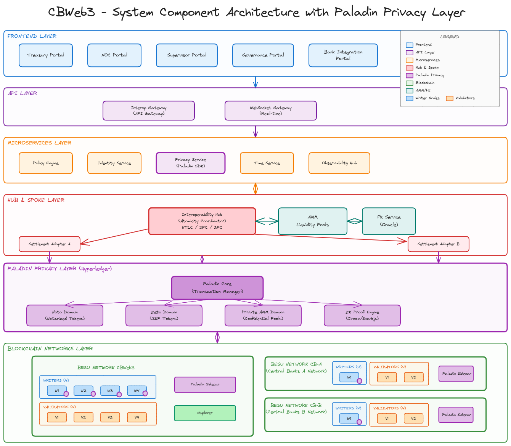

# Scenario A — Enhanced Correspondent Banking

A cross-spoke wholesale CBDC platform implementing atomic settlement between two independent blockchain networks via dual-layer HTLC. Each spoke runs a sovereign Besu QBFT network operated by a central bank and commercial banks, with privacy-preserving transactions via Paladin/Zeto and automatic relay-based cross-network settlement.

---

## Table of Contents

- [Overview](#overview)
- [Component Documentation](#component-documentation)
- [Architecture](#architecture)
- [Prerequisites](#prerequisites)
- [Quick Start](#quick-start)
- [Running the Cross-Spoke HTLC Demo](#running-the-cross-spoke-htlc-demo)
- [Frontend](#frontend)
- [Directory Structure](#directory-structure)
- [Smart Contracts](#smart-contracts)
- [Backend Services](#backend-services)
- [Infrastructure](#infrastructure)
- [Port Reference](#port-reference)
- [Testing](#testing)
- [Teardown](#teardown)
- [Additional Make Targets](#additional-make-targets)

---

## Component Documentation

Each module has its own README with purpose, architecture placement, key details, and cross-links.

| Module | README | Description |
|--------|--------|-------------|
| Backend | [backend/README.md](backend/README.md) | Go microservices overview |
| — api-gateway | [backend/services/api-gateway/README.md](backend/services/api-gateway/README.md) | REST entry point |
| — auth | [backend/services/auth/README.md](backend/services/auth/README.md) | Identity, login, wallet, PKI |
| — compliance | [backend/services/compliance/README.md](backend/services/compliance/README.md) | Onboarding/AML, participant registry |
| — payment-orchestrator | [backend/services/payment-orchestrator/README.md](backend/services/payment-orchestrator/README.md) | HTLC, FX, Zeto, escrow |
| — noc-agent | [backend/services/noc-agent/README.md](backend/services/noc-agent/README.md) | Monitoring daemon |
| — noc-backend | [backend/services/noc-backend/README.md](backend/services/noc-backend/README.md) | NOC dashboard API |
| — fx | [backend/services/fx/README.md](backend/services/fx/README.md) | FX pricing service *(planned)* |
| — ledger-gateway | [backend/services/ledger-gateway/README.md](backend/services/ledger-gateway/README.md) | Blockchain RPC abstraction *(planned)* |
| — payments | [backend/services/payments/README.md](backend/services/payments/README.md) | Payment domain service *(planned)* |
| Contracts | [contracts/README.md](contracts/README.md) | Solidity smart contracts (Foundry) |
| Frontend | [frontend/README.md](frontend/README.md) | React monorepo overview |
| — bank | [frontend/apps/bank/README.md](frontend/apps/bank/README.md) | Commercial bank portal |
| — governance | [frontend/apps/governance/README.md](frontend/apps/governance/README.md) | Central bank governance portal |
| — supervisor | [frontend/apps/supervisor/README.md](frontend/apps/supervisor/README.md) | Regulatory oversight portal — Supervisor Portal (R2-CR-8) In progress |
| — treasury | [frontend/apps/treasury/README.md](frontend/apps/treasury/README.md) | Treasury management portal |
| — noc | [frontend/apps/noc/README.md](frontend/apps/noc/README.md) | Network Operations Center dashboard |
| — dispatcher | [frontend/apps/dispatcher/README.md](frontend/apps/dispatcher/README.md) | Manual event dispatch tool |
| Infrastructure | [deploy/README.md](deploy/README.md) | Docker Compose deployment |
| Interoperability | [interop/README.md](interop/README.md) | Cross-spoke relay and bridge |
| APIs | [apis/README.md](apis/README.md) | OpenAPI specs, proto, SDKs |

---

## Overview

**Scenario A** models a correspondent banking arrangement between two central bank jurisdictions:

- **Spoke-A** (chain 1338) — operated by **Central-Bank-A**, with commercial banks **Bank-A** and **Bank-C**.
- **Spoke-B** (chain 1339) — operated by **Central-Bank-B**, with commercial banks **Bank-B** and **Bank-D**.

Each spoke runs its own Besu QBFT network, Paladin privacy nodes, and a full backend service stack. An **interop relay** bridges HTLC secrets across spokes to enable atomic cross-network settlement.

### How the Cross-Spoke Swap Works

1. An initiating bank (e.g., Bank-A on Spoke-A) creates an HTLC locking funds for a counterparty, generating a secret and a corresponding hashLock.
2. The responding bank (e.g., Bank-B on Spoke-B) creates a mirrored HTLC on Spoke-B using the same hashLock.
3. The initiator reveals the secret on Spoke-A to claim the funds there.
4. The relay detects the reveal, extracts the secret, and submits it on Spoke-B — settling both sides atomically without a shared ledger.

### Key Capabilities

- **Tokenized Central Bank Money (tCeBM)** — ERC-20 CBDC tokens minted exclusively by central banks
- **Privacy-preserving transfers** — Zeto ZKP tokens via Paladin for confidential intra-spoke payments
- **Cross-spoke atomic swaps** — Hash Time-Locked Contracts with automatic relay settlement
- **Identity & compliance** — On-chain IdentityRegistry, PKI certificates, Keycloak OIDC, Onboarding/AML checks

---

## Architecture

| Layer | Components |
|-------|------------|
| **Frontend** | Bank Portal, Governance Portal, Supervisor, Treasury, NOC |
| **API** | REST API Gateway (per entity) |
| **Microservices** | Auth (gRPC), Compliance (gRPC), Payment Orchestrator (gRPC) |
| **Interoperability** | HTLC relay, SpokeBridge |
| **Privacy** | Paladin Core, Zeto Domain (ZKP tokens), Noto Domain |
| **Blockchain** | Besu QBFT — spoke-a (chain 1338), spoke-b (chain 1339) |

Each entity runs its own isolated service stack (api-gateway, auth, compliance, payment-orchestrator) in dedicated Docker networks.

### Diagrams



| Diagram | Description |
|---------|-------------|
| [System Component Diagram](docs/architecture/CBWeb3-ComponentDiagram.png) | Full system topology: frontend, services, Paladin nodes, Besu networks, relay |
| [Architecture Chart](docs/charts/scenario-a/architecture.md) | Mermaid graph of all components and their connections |
| [Transfer Flow](docs/charts/scenario-a/transfer.md) | Sequence diagram for intra-spoke Zeto token transfers |
| [Escrow Flow](docs/charts/scenario-a/escrow.md) | Sequence diagram for the HTLC cross-spoke atomic swap |

---

## Prerequisites

| Tool | Purpose |
|------|---------|
| **Docker & Docker Compose** | Container orchestration for all services |
| **GNU Make** | Build automation (`make` targets) |
| **Go** (1.22+) | Backend services and Paladin tooling |
| **Node.js** (22+) & npm | Frontend applications |
| **Foundry** (forge, cast) | Solidity contract compilation, testing, deployment |
| **jq** | JSON processing in shell scripts |
| **openssl** | PKI certificate generation |

> **Note:** The full platform runs ~30 containers. Allocate at least 8 GB RAM and 4 CPUs to Docker.

---

## Quick Start

Deploy both spokes with all infrastructure, smart contracts, Paladin privacy nodes, and backend services:

```bash
make spoke-all
```

This single command executes the following for each spoke:

1. **PKI generation** — Creates X.509 certificates for all entities (idempotent, skipped if they exist)
2. **Infrastructure** — Starts Keycloak (OIDC), PostgreSQL, and Redis (shared across spokes)
3. **Besu network** — Launches 3 Besu QBFT validator nodes per spoke
4. **Smart contracts** — Compiles and deploys tCeBM, HTLC, AMM, IdentityRegistry, SpokeBridge
5. **Participant registration** — Registers banks on-chain via IdentityRegistry
6. **Paladin setup** — Deploys privacy contracts, generates certs, registers nodes, starts Paladin
7. **Zeto token** — Creates the ZKP-based tCeBM token instance
8. **Backend services** — Starts api-gateway, auth, compliance, and payment-orchestrator per entity
9. **Relay** — Starts the HTLC cross-spoke relay service

Once complete, all 6 entities are running with their full service stacks.

---

## Running the Cross-Spoke HTLC Demo

After `make spoke-all` completes, run the end-to-end cross-spoke atomic swap:

```bash
./tryout-htlc-cross-spoke.sh
```

This script executes a **16-step demo across 6 phases**:

| Phase | Steps | Description |
|-------|-------|-------------|
| **1 — Authentication** | 1–4 | Login all 4 bank operators via Keycloak OIDC |
| **2 — Minting & Balances** | 5–7 | Central banks mint tCeBM for Bank-A and Bank-B; check initial balances |
| **3 — Initiator Lock (Spoke-A)** | 8–9 | Bank-A locks funds for Bank-C with a secret + hashLock |
| **4 — Responder Lock (Spoke-B)** | 10–11 | Bank-B locks funds for Bank-D using the same hashLock |
| **5 — Settlement** | 12–14 | Bank-A reveals the secret on Spoke-A; relay auto-settles on Spoke-B |
| **6 — Verification** | 15–16 | Confirm final balances and search settled HTLCs |

### Environment Variables (optional overrides)

| Variable | Default | Description |
|----------|---------|-------------|
| `BANK_A_URL` | `http://localhost:18080/api/v1` | Bank-A API gateway |
| `BANK_B_URL` | `http://localhost:28080/api/v1` | Bank-B API gateway |
| `BANK_C_URL` | `http://localhost:48080/api/v1` | Bank-C API gateway |
| `BANK_D_URL` | `http://localhost:58080/api/v1` | Bank-D API gateway |
| `CB_A_URL` | `http://localhost:38080/api/v1` | Central-Bank-A API gateway |
| `CB_B_URL` | `http://localhost:60080/api/v1` | Central-Bank-B API gateway |
| `MINT_AMOUNT` | `10000000` | Amount minted per bank |
| `LOCK_AMOUNT` | `1000000` | Amount locked per HTLC |
| `RELAY_SETTLE_TIMEOUT` | `30` | Seconds to wait for relay auto-settlement |

---

## Frontend

Build and start the frontend containers for all entities:

```bash
make frontend-spoke-all
```

| Entity | App | URL |
|--------|-----|-----|
| Bank-A | Bank Portal | http://localhost:5173 |
| Bank-B | Bank Portal | http://localhost:5174 |
| Bank-C | Bank Portal | http://localhost:5175 |
| Bank-D | Bank Portal | http://localhost:5176 |
| Central-Bank-A | Governance Portal | http://localhost:5177 |
| Central-Bank-B | Governance Portal | http://localhost:5178 |

### Frontend Commands

```bash
make frontend-spoke-a          # Start spoke-a frontends only (Bank-A, Bank-C, CB-A)
make frontend-spoke-b          # Start spoke-b frontends only (Bank-B, Bank-D, CB-B)
make frontend-spoke-all        # Start all frontends

make frontend-spoke-a-down     # Stop spoke-a frontends
make frontend-spoke-b-down     # Stop spoke-b frontends
make frontend-spoke-all-down   # Stop all frontends

make frontend-spoke-all-logs   # Tail frontend logs
```

### Frontend Tech Stack

- **React 19** + TypeScript
- **Vite 7** build tool
- **Tailwind CSS v4**
- npm workspaces monorepo (`apps/*` and `packages/*`)

### Frontend Apps

| App | Path | Description |
|-----|------|-------------|
| `bank` | `frontend/apps/bank/` | Commercial bank operator portal |
| `governance` | `frontend/apps/governance/` | Central bank governance console |
| `supervisor` | `frontend/apps/supervisor/` | Operations supervisor dashboard |
| `treasury` | `frontend/apps/treasury/` | Treasury management |
| `noc` | `frontend/apps/noc/` | Network Operations Center |

---

## Directory Structure

```
scenario-a/
├── contracts/              Solidity smart contracts (Foundry)
│   ├── src/                Contract sources
│   ├── test/               Foundry tests
│   └── script/             Deployment scripts
├── backend/
│   ├── services/           Go microservices
│   │   ├── api-gateway/    REST gateway (per entity)
│   │   ├── auth/           gRPC auth service (Keycloak OIDC)
│   │   ├── compliance/     gRPC compliance (Onboarding/AML)
│   │   ├── payment-orchestrator/  gRPC payment & HTLC orchestration
│   │   ├── payments/       Payment domain logic
│   │   ├── fx/             FX pricing & settlement
│   │   └── ledger-gateway/ Blockchain RPC/WS client
│   ├── shared/             Shared Go libraries (blockchain, identity, proto)
│   └── config/             PKI certs and per-entity .env files
├── frontend/
│   ├── apps/               React applications (bank, governance, supervisor, treasury, noc)
│   ├── packages/           Shared UI components and config
│   └── nginx/              Production nginx config
├── apis/
│   ├── openapi/            OpenAPI specs
│   ├── proto/              Protobuf/gRPC definitions
│   └── sdk/                Auto-generated clients (TS, Python, Java)
├── interop/
│   ├── hub-and-spoke/      Cross-spoke connectors (relay, cacti, ccip)
│   └── single-ledger/      Intra-network orchestration
├── deploy/
│   └── local/              Docker Compose infrastructure
│       ├── spoke-besu-a/   Besu nodes for spoke-a
│       ├── spoke-besu-b/   Besu nodes for spoke-b
│       ├── keycloak/       OIDC identity provider
│       ├── postgres/       Multi-database init
│       ├── paladin/        Privacy nodes (Zeto/Noto)
│       └── compose.yml     Shared infrastructure compose
├── tests/                  Test harnesses (unit, integration, e2e, performance)
├── docs/                   Architecture, design, governance, runbooks
├── make/                   Makefile includes (modular targets)
├── tryouts/                Per-entity tryout scripts
└── tryout-htlc-cross-spoke.sh  Cross-spoke HTLC demo
```

---

## Smart Contracts

Built with **Foundry** (Solidity 0.8.20, OpenZeppelin 5.0.2).

| Contract | Description |
|----------|-------------|
| `TokenizedCentralBankMoney.sol` | ERC-20 tCeBM token with role-based minting (central bank only) |
| `HashTimeLockedContract.sol` | HTLC for atomic cross-spoke swaps (LOCKED → SETTLED / REFUNDED) |
| `AutomatedMarketMaker.sol` | Constant-product AMM for FX liquidity pools *(used in Scenario B)* |
| `IdentityRegistry.sol` | On-chain participant registry with governance RBAC |
| `SpokeBridge.sol` | Cross-spoke bridge contract |
| `ManualOracle.sol` | Manual FX price oracle *(used in Scenario B)* |
| `FXAgreement.sol` | FX pricing and settlement agreement *(used in Scenario B)* |

### Contract Commands

```bash
make contracts.setup       # Install Solidity dependencies (forge soldeer)
make contracts.build       # Compile contracts
make contracts.test        # Run Foundry unit tests
make contracts.coverage    # Coverage report
make contracts.fmt         # Format Solidity sources
make contracts.lint        # Lint checks
make contracts.slither     # Static security analysis (Trail of Bits Slither)
make contracts.full-check  # Build + fmt + lint + test + coverage + slither
make contracts.gen-doc     # Generate Forge documentation
```

---

## Backend Services

All services are written in **Go** and communicate via **gRPC** internally, with the REST API Gateway as the external entry point.

| Service | Protocol | Description |
|---------|----------|-------------|
| **api-gateway** | REST | External entry point, routes to gRPC services |
| **auth** | gRPC | OIDC/JWT validation, Keycloak integration, RBAC, nonce management |
| **compliance** | gRPC | Onboarding/AML checks, on-chain IdentityRegistry queries, audit logging |
| **payment-orchestrator** | gRPC | Payment coordination, Paladin integration, HTLC flow management |

Each entity (bank-a, bank-b, bank-c, bank-d, central-bank-a, central-bank-b) runs its own isolated instance of every service with dedicated Docker networks.

---

## Infrastructure

### Besu Networks

| Spoke | Chain ID | Nodes | Docker Network |
|-------|----------|-------|----------------|
| spoke-a | 1338 | central-bank-a, bank-a, bank-c | `spoke_a_besu_network` |
| spoke-b | 1339 | central-bank-b, bank-b, bank-d | `spoke_b_besu_network` |

### Shared Services

| Service | Container | Port | Purpose |
|---------|-----------|------|---------|
| Keycloak | `cbweb3-keycloak` | 8081 | OIDC identity provider (6 realms) |
| PostgreSQL | `cbweb3-postgres` | 5432 | 7 databases (one per entity + keycloak) |
| Redis | `cbweb3-redis` | 6379 | Cache/session store (6 logical DBs) |

### Paladin Privacy Nodes

Each spoke runs 3 Paladin nodes (1:1 mapping with Besu validators), providing Zeto ZKP token support for privacy-preserving tCeBM transfers.

---

## Port Reference

### API Gateways (REST)

| Entity | API Gateway | Auth gRPC | Compliance gRPC | Payment gRPC |
|--------|-------------|-----------|-----------------|--------------|
| bank-a | 18080 | 19091 | 19093 | 19094 |
| bank-b | 28080 | 29091 | 29093 | 29094 |
| central-bank-a | 38080 | 39091 | 39093 | 39094 |
| bank-c | 48080 | 49091 | 49093 | 49094 |
| bank-d | 58080 | 59091 | 59093 | 59094 |
| central-bank-b | 60080 | 60091 | 60093 | 60094 |

### Besu RPC

| Node | Host RPC Port |
|------|---------------|
| central-bank-a (spoke-a) | 8645 |
| bank-a (spoke-a) | 8646 |
| bank-c (spoke-a) | 8647 |
| central-bank-b (spoke-b) | 8745 |
| bank-b (spoke-b) | 8746 |
| bank-d (spoke-b) | 8747 |

### Frontends

| Entity | Port |
|--------|------|
| Bank-A | 5173 |
| Bank-B | 5174 |
| Bank-C | 5175 |
| Bank-D | 5176 |
| Central-Bank-A | 5177 |
| Central-Bank-B | 5178 |

---

## Testing

```bash
make test.api-gateway    # Go tests for api-gateway
make test.auth           # Go tests for auth service
make test.compliance     # Go tests for compliance service
make test.all            # Run all backend tests

make contracts.test      # Foundry unit tests for smart contracts
make contracts.coverage  # Solidity coverage report
```

### Tryout Scripts

Per-entity onboarding and payment demos:

```bash
./tryouts/tryout-spoke-a-bank-a.sh   # Bank-A + Central-Bank-A flow
./tryouts/tryout-spoke-a-bank-c.sh   # Bank-C + Central-Bank-A flow
./tryouts/tryout-spoke-b-bank-b.sh   # Bank-B + Central-Bank-B flow
./tryouts/tryout-spoke-b-bank-d.sh   # Bank-D + Central-Bank-B flow
```

---

## Teardown

```bash
make spoke-all-down            # Stop both spokes + relay (shared infra left running)
make frontend-spoke-all-down   # Stop all frontends
make deploy.down-infra         # Stop Keycloak, PostgreSQL, Redis
```

Stop a single spoke:

```bash
make spoke-a-down              # Stop spoke-a backend, Paladin, and Besu
make spoke-b-down              # Stop spoke-b backend, Paladin, and Besu
```

---

## Additional Make Targets

### PKI

```bash
make pki.gen-all               # Generate all certificates
make pki.check                 # Verify certificate status
make pki.clean                 # Remove generated certificates
```

### Infrastructure

```bash
make deploy.up-infra           # Start Keycloak + PostgreSQL + Redis
make deploy.up-besu            # Start both Besu networks
make deploy.up                 # Infrastructure + Besu
```

### Paladin

```bash
make paladin.start-spoke-a     # Start Paladin nodes for spoke-a
make paladin.start-spoke-b     # Start Paladin nodes for spoke-b
make paladin.stop-spoke-a      # Stop Paladin nodes for spoke-a
make paladin.stop-spoke-b      # Stop Paladin nodes for spoke-b
```

### Relay

```bash
make relay-up                  # Start HTLC cross-spoke relay
make relay-down                # Stop relay
```

### Protobuf

```bash
make proto-gen                 # Generate protobuf code
make proto-lint                # Lint proto files
make proto-breaking            # Check for breaking changes
```
