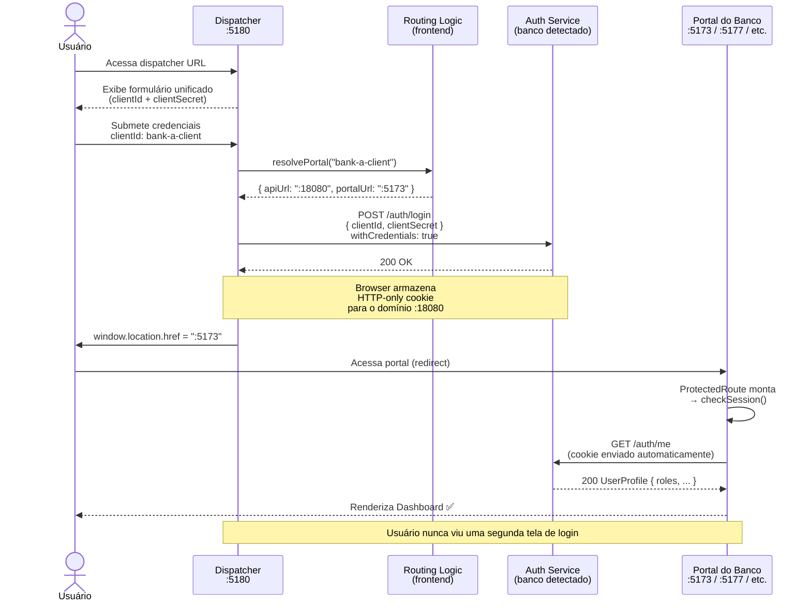
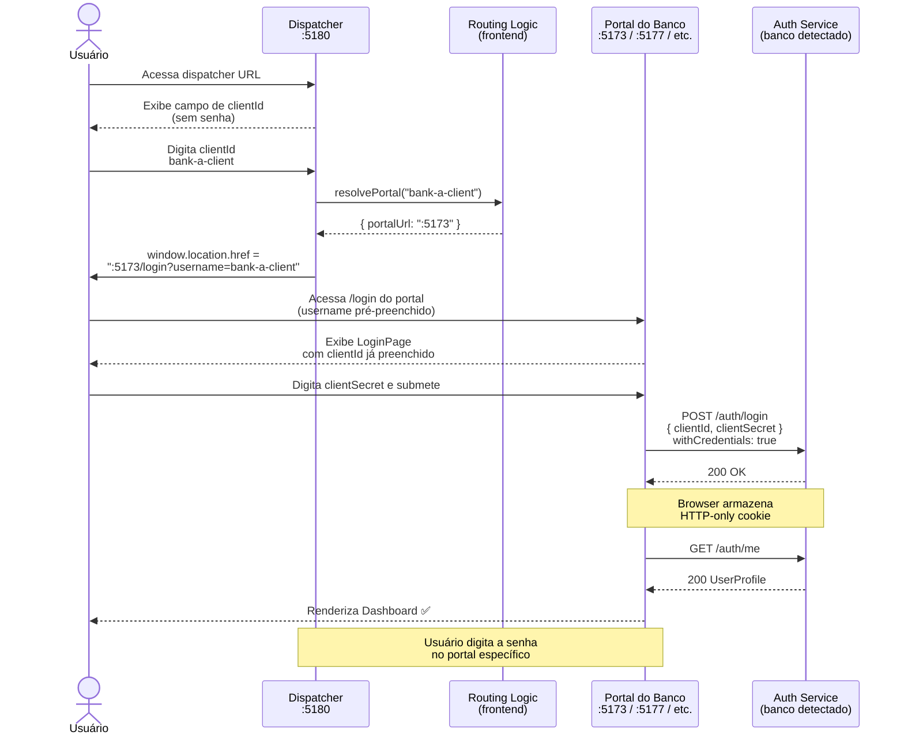
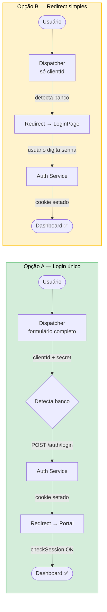

# Plano: Unified Login Dispatcher — CBWeb3

> **Status:** Planejado · Aguardando decisões secundárias antes de implementar  
> **Criado em:** 2026-05-27  
> **Prazo:** Curto (estimativa de implementação: 1–2 dias)

---

## Contexto do Problema

Existem **6 portais** em produção (um por banco), todos rodando como instâncias separadas do mesmo app React (`apps/bank` × 4 e `apps/governance` × 2), cada um apontando para um auth service diferente (`API_BANK_A`, `API_BANK_B`, etc.).

Os usuários precisam saber qual portal acessar. A demanda é uma **única URL de entrada** onde qualquer usuário faça login e seja redirecionado automaticamente para o portal correto — sem precisar conhecer as URLs individuais de cada portal.

**Insight técnico chave**: o auth service usa **HTTP-only cookies** definidos no backend. Se o dispatcher autenticar o usuário chamando a API do banco correto, o navegador armazena o cookie daquele domínio. Quando o usuário é redirecionado ao portal, o `ProtectedRoute` chama `checkSession()` → `/auth/me` — o cookie já existe — e o usuário entra autenticado automaticamente, sem ver nenhuma tela de login novamente.

---

## Diagramas de Fluxo

### Opção A — Dispatcher com login único



### Opção B — Redirect sem login (MVP mínimo)



### Comparação visual



---

## Análise das Opções

### ✅ Opção A — Dispatcher com login único (RECOMENDADA)

**Como funciona:**
1. Novo app `apps/dispatcher` (nova porta, ex: `5180`)
2. Formulário único: `clientId` + `clientSecret`
3. Ao submeter, o dispatcher extrai o prefixo do clientId para determinar qual banco/portal
4. Chama o `/auth/login` da API correta (ex: `API_BANK_A`)
5. Em caso de sucesso → redireciona para o portal correto (ex: `localhost:5173`)
6. O `ProtectedRoute` do portal detecta a sessão ativa e entra diretamente no dashboard

**Esforço estimado:** 1–2 dias

**Mudanças necessárias:**
- `frontend/apps/dispatcher` — novo app React/Vite
- `frontend/docker-compose.spoke-all.yml` — novo serviço `dispatcher-frontend`
- `backend/services/auth` — adicionar a origin do dispatcher nas configurações de CORS
- `frontend/.env` + `.env.example` — variáveis de URL por banco para o dispatcher

**Prós:**
- Usuário entra uma única vez e chega já autenticado no portal correto
- Reusa toda a infraestrutura de auth existente (sem mudar Keycloak)
- Não mexe nos portais existentes
- Viável no prazo curto

**Contras/Riscos:**
- Depende de configuração adequada de `SameSite` cookie no auth service (pode precisar de `SameSite=None; Secure` em produção)
- Lógica de roteamento precisa ser atualizada conforme novos bancos são adicionados
- Em ambiente local com `http://`, pode haver restrições de cookie cross-origin (mitigável com proxy nginx)

---

### Opção B — Redirect sem login (MVP mínimo)

**Como funciona:**
1. Novo app `apps/dispatcher` (micro SPA, sem chamada de API)
2. Usuário digita apenas o clientId
3. Sistema identifica o portal e redireciona para `portal-url/login?username=...`
4. Usuário digita a senha no portal correto (LoginPage com campo pré-preenchido)

**Esforço estimado:** meio dia

**Mudanças necessárias:**
- `apps/dispatcher` — micro SPA sem lógica de auth
- Cada `LoginPage` existente aceita `?username=` como query param

**Prós:**
- Sem risco de CORS ou cookies
- Extremamente simples de implementar

**Contras:**
- Usuário ainda precisa digitar a senha em uma tela separada (portal específico)
- Menos "unificado" — revela a existência de portais separados

---

### Opção C — SSO Keycloak nativo (melhor solução a longo prazo)

Configurar cross-realm identity broker no Keycloak + OIDC code flow em todos os portais. O Keycloak gerencia o SSO nativamente.

**Esforço:** 1–2 semanas. **Inviável para o prazo curto.** Ideal para o roadmap futuro.

---

## Abordagem Recomendada: Opção A

### Fluxo do usuário

```
Acessa dispatcher (:5180)
  → digita clientId (ex: bank-a-client) + clientSecret
  → dispatcher detecta prefixo: bank-a → API :18080, Portal :5173
  → chama POST /auth/login na API correta (withCredentials: true)
  → ✅ redireciona para :5173
  → ProtectedRoute chama checkSession() → /auth/me → sessão ativa → dashboard
```

### Lógica de roteamento

Os clientIds seguem o padrão `{banco}-client` (ex: `bank-a-client`, `central-bank-a-client`). O roteamento é feito por **regex de prefixo**:

```typescript
// Mapeamento estático configurado via variáveis de ambiente em produção
const PORTAL_ROUTING = [
  {
    match: /^bank-a-/i,
    apiUrl: "http://localhost:18080/api/v1",
    portalUrl: "http://localhost:5173",
    label: "Bank A",
  },
  {
    match: /^bank-b-/i,
    apiUrl: "http://localhost:28080/api/v1",
    portalUrl: "http://localhost:5174",
    label: "Bank B",
  },
  {
    match: /^bank-c-/i,
    apiUrl: "http://localhost:48080/api/v1",
    portalUrl: "http://localhost:5175",
    label: "Bank C",
  },
  {
    match: /^bank-d-/i,
    apiUrl: "http://localhost:58080/api/v1",
    portalUrl: "http://localhost:5176",
    label: "Bank D",
  },
  {
    match: /^central-bank-a-/i,
    apiUrl: "http://localhost:38080/api/v1",
    portalUrl: "http://localhost:5177",
    label: "Central Bank A",
  },
  {
    match: /^central-bank-b-/i,
    apiUrl: "http://localhost:60080/api/v1",
    portalUrl: "http://localhost:5178",
    label: "Central Bank B",
  },
];
```

Em produção, as URLs são substituídas por variáveis de ambiente (`VITE_BANK_A_API_URL`, `VITE_BANK_A_PORTAL_URL`, etc.).

**Fallback:** se o clientId não casar com nenhum padrão, exibir: *"Instituição não identificada. Verifique seu Client ID."*

---

## Tarefas de Implementação

### 1. `[frontend]` Criar `apps/dispatcher`

Novo app React/Vite reutilizando `@cbweb3/ui` (mesmo design system dos portais existentes).

**Componentes/lógica necessária:**
- `LoginPage` — formulário com campos `clientId` + `clientSecret`
- `routing.ts` — lógica de matching clientId → `{ apiUrl, portalUrl }`
- `auth.api.ts` — chamada `POST /auth/login` ao apiUrl resolvido, com `withCredentials: true`
- Após sucesso: `window.location.href = portalUrl`
- Após falha de matching: exibir erro antes mesmo de chamar a API
- Branding: CBWeb3 genérico (sem referência a banco específico)

**Estrutura de arquivos sugerida:**
```
apps/dispatcher/
  src/
    pages/LoginPage.tsx
    utils/routing.ts       # lógica de matching clientId → portal
    services/auth.api.ts   # chamada axios com withCredentials
    config/portals.ts      # mapa de portais (lido de env vars)
  .env.example
  vite.config.ts
  Dockerfile
```

### 2. `[frontend]` Adicionar serviço ao `docker-compose.spoke-all.yml`

```yaml
dispatcher-frontend:
  container_name: cbweb3-dispatcher
  build:
    context: .
    dockerfile: apps/dispatcher/Dockerfile
    args:
      VITE_BANK_A_API_URL: ${API_BANK_A}
      VITE_BANK_A_PORTAL_URL: http://localhost:${BANK_A_FRONTEND_PORT}
      VITE_BANK_B_API_URL: ${API_BANK_B}
      VITE_BANK_B_PORTAL_URL: http://localhost:${BANK_B_FRONTEND_PORT}
      # ... demais bancos
  ports:
    - "${DISPATCHER_PORT}:80"
```

### 3. `[backend]` Configurar CORS no auth service

Cada instância do auth service (6 no total) precisa aceitar requests com credentials da origin do dispatcher.

**Mudança:** adicionar `http://localhost:${DISPATCHER_PORT}` (e o domínio de produção do dispatcher) na lista de allowed origins do auth service Go.

Arquivo relevante: `backend/services/auth/` (verificar onde CORS está configurado — provavelmente no `cmd/` ou middleware).

### 4. `[frontend]` Adicionar variáveis ao `.env` e `.env.example`

```bash
# Dispatcher
DISPATCHER_PORT=5180

# URLs dos portais (para uso pelo dispatcher)
VITE_BANK_A_API_URL=http://localhost:18080/api/v1
VITE_BANK_A_PORTAL_URL=http://localhost:5173
VITE_BANK_B_API_URL=http://localhost:28080/api/v1
VITE_BANK_B_PORTAL_URL=http://localhost:5174
VITE_BANK_C_API_URL=http://localhost:48080/api/v1
VITE_BANK_C_PORTAL_URL=http://localhost:5175
VITE_BANK_D_API_URL=http://localhost:58080/api/v1
VITE_BANK_D_PORTAL_URL=http://localhost:5176
VITE_CENTRAL_BANK_A_API_URL=http://localhost:38080/api/v1
VITE_CENTRAL_BANK_A_PORTAL_URL=http://localhost:5177
VITE_CENTRAL_BANK_B_API_URL=http://localhost:60080/api/v1
VITE_CENTRAL_BANK_B_PORTAL_URL=http://localhost:5178
```

### 5. `[docs]` Atualizar README do `frontend/`

Adicionar seção sobre o dispatcher: o que é, como rodar, como acessar.

---

## Riscos e Mitigações

| Risco | Mitigação |
|-------|-----------|
| CORS bloqueando cookies cross-origin em produção | Configurar `SameSite=None; Secure` no auth service em produção; em dev, usar proxy nginx ou `SameSite=Lax` |
| Cookie cross-origin bloqueado em `http://` local | Adicionar proxy nginx no dispatcher que repassa para as APIs dos bancos, evitando cross-origin em dev |
| Novos bancos exigem atualização do mapa | Mapa configurado inteiramente por env vars — basta adicionar novas variáveis |
| ClientId digitado incorretamente | Fallback com mensagem clara antes de chamar qualquer API |
| Auth service rejeita login do dispatcher por CORS | Tarefa 3 (configurar CORS) é pré-requisito para funcionar |

---

## Decisões em Aberto

### 🟡 Domínio de produção

**Pergunta:** Em produção, os portais rodam em subdomínios do mesmo host (ex: `bank-a.cbweb3.lacnet.com`) ou em hosts completamente diferentes?

**Impacto:** Se todos estiverem no mesmo domínio pai (ex: `*.cbweb3.lacnet.com`), o cookie pode ser configurado para o domínio pai e funciona em todos os subdomínios sem configuração adicional de CORS. Se forem hosts diferentes, é necessário `SameSite=None; Secure` e CORS explícito em cada auth service.

### 🟢 Branding do dispatcher

Identidade visual neutra CBWeb3/LNET genérico (recomendado) ou personalizada? O padrão do design system já está em `@cbweb3/ui`.

---

## Contexto para Retomada em Nova Sessão

### Estado atual do código (maio 2026)

- `frontend/apps/` contém: `bank/`, `governance/`, `noc/`, `supervisor/`, `treasury/`
- Os **6 portais em produção** são instâncias dessas apps configuradas via env vars, não apps separadas:
  - `bank-a`, `bank-b`, `bank-c`, `bank-d` → `apps/bank`
  - `central-bank-a`, `central-bank-b` → `apps/governance`
- Toda autenticação usa `POST /auth/login` com `{ clientId, clientSecret }` + HTTP-only cookies
- O `ProtectedRoute` de cada portal chama `checkSession()` → `GET /auth/me` ao carregar
- Mapeamento de portas atual em `frontend/.env`:

| Instância | API | Frontend |
|-----------|-----|----------|
| Bank A | `:18080` | `:5173` |
| Bank B | `:28080` | `:5174` |
| Bank C | `:48080` | `:5175` |
| Bank D | `:58080` | `:5176` |
| Central Bank A | `:38080` | `:5177` |
| Central Bank B | `:60080` | `:5178` |

### Arquivos-chave para referência

| Arquivo | Relevância |
|---------|------------|
| `frontend/docker-compose.spoke-all.yml` | Orquestração dos 6 portais |
| `frontend/.env` + `.env.example` | Variáveis de porta e URL de API |
| `frontend/apps/bank/src/stores/auth.store.ts` | Lógica completa de auth (login, checkSession, logout) |
| `frontend/apps/bank/src/components/auth/ProtectedRoute.tsx` | Guarda de rota com checkSession automático |
| `frontend/apps/bank/src/services/api/auth.api.ts` | Chamadas `/auth/login`, `/auth/me`, `/auth/logout` |
| `frontend/apps/bank/src/auth/authorization.ts` | Mapeamento de roles por portal |
| `backend/services/auth/internal/domain/roles.go` | Definição de roles (ROLE_COMMERCIAL_BANK, ROLE_GOVERNANCE, etc.) |
| `frontend/packages/` | Shared packages (UI, etc.) |
| `frontend/apps/bank/src/pages/LoginPage.tsx` | Referência de LoginPage para o dispatcher |
