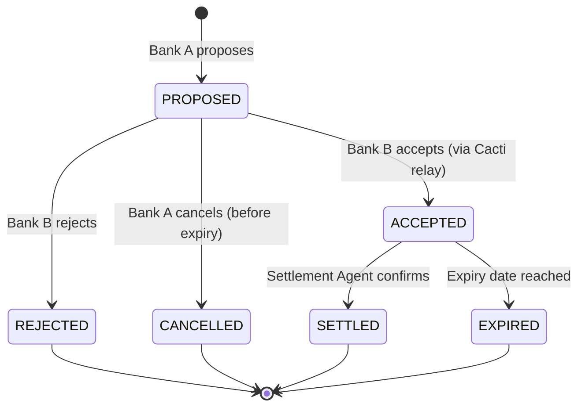
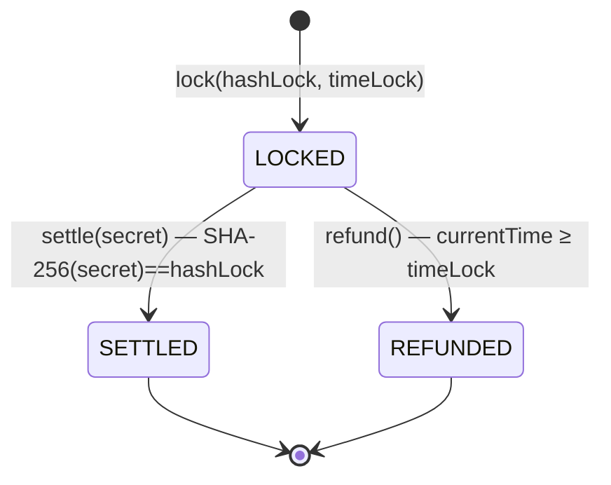

# CBWeb3 Scenario A — Cross-Spoke PvP Transfer (FX Agreement + HTLC Settlement)

> Atomic Payment-vs-Payment (PvP) settlement across two Besu spokes using:
> - **FXAgreement** for bilateral trade negotiation
> - **HTLC** for atomic coordination (hashLock bridges both spokes)
> - **Zeto (Paladin)** for private token transfers (ZKP)
> - **Cacti Relay** for cross-spoke secret propagation
>
> The HTLC contract holds **no token value** — it serves only as a coordination
> anchor. Actual token custody is managed by Zeto locked UTXO states.

---

## Sequence Diagram

```mermaid
sequenceDiagram
    actor BankA as Bank A<br/>(Initiator — Spoke-A)
    actor CentralBank as Central Bank<br/>(Settlement Agent)
    participant GW_A as API Gateway<br/>(Bank A Node)
    participant PayOrch_A as Payment Orchestrator<br/>(Spoke-A)
    participant Paladin_A as Paladin Sidecar<br/>(Bank A)
    participant ZetoA as Zeto Token<br/>(Spoke-A Ledger)
    participant PvPC_A as PvP Settlement Contract<br/>(Spoke-A Ledger)
    participant CactiRelay as Cacti Relay<br/>(Interoperability Layer)
    participant PvPC_B as PvP Settlement Contract<br/>(Spoke-B Ledger)
    participant ZetoB as Zeto Token<br/>(Spoke-B Ledger)
    participant Paladin_B as Paladin Sidecar<br/>(Bank B)
    participant PayOrch_B as Payment Orchestrator<br/>(Spoke-B)
    participant GW_B as API Gateway<br/>(Bank B Node)
    actor BankB as Bank B<br/>(Counterparty — Spoke-B)

    Note over BankA, BankB: PRE-CONDITION: Both institutions hold Tokenized Central Bank Money (tCeBM)<br/>acquired via the Liquidity Injection → Escrow issuance flow

    rect rgb(230, 210, 255)
        Note over BankA, BankB: PHASE 0 — FX Agreement Negotiation (Bilateral Pre-Trade Contract)

        BankA->>GW_A: POST /api/v1/payments/fx/agreements<br/>{ counterparty_b, origin_amount, counter_amount,<br/>  origin_currency, counter_currency, rate,<br/>  expiry_date, source_spoke_id, dest_spoke_id,<br/>  source_receiver, dest_receiver }%
        GW_A->>PayOrch_A: gRPC ProposeFXAgreement(...)%
        Note over PayOrch_A: Assigns trade_id (UUID)<br/>Records FX Agreement in memory<br/>state → PROPOSED%
        PayOrch_A-->>GW_A: { trade_id }%
        GW_A-->>BankA: 201 { trade_id }%

        Note over CactiRelay: Relay polls internal endpoint on Spoke-A<br/>at each cycle interval
        CactiRelay->>PayOrch_A: GET /internal/v1/payments/fx/agreements
        PayOrch_A-->>CactiRelay: [{ trade_id, state: "PROPOSED", full payload }]
        Note over CactiRelay: Detects new agreement in PROPOSED state<br/>Forwards cross-spoke (on_behalf=true)%
        CactiRelay->>PayOrch_B: gRPC ProposeFXAgreement(full payload, on_behalf=true)
        Note over PayOrch_B: Registers mirrored FX Agreement<br/>state → PROPOSED%

        BankB->>GW_B: POST /api/v1/payments/fx/agreements/:tradeId/accept
        GW_B->>PayOrch_B: gRPC AcceptFXAgreement(trade_id)
        Note over PayOrch_B: Validates state == PROPOSED<br/>state → ACCEPTED%
        PayOrch_B-->>GW_B: 200 { tx_hash }%
        GW_B-->>BankB: 200 OK%

        Note over CactiRelay: Relay polls Spoke-B at next cycle
        CactiRelay->>PayOrch_B: GET /internal/v1/payments/fx/agreements
        PayOrch_B-->>CactiRelay: [{ trade_id, state: "ACCEPTED" }]
        Note over CactiRelay: Detects ACCEPTED state — mirrors to Spoke-A
        CactiRelay->>PayOrch_A: gRPC AcceptFXAgreement(trade_id, on_behalf=true)
        Note over PayOrch_A: state → ACCEPTED<br/>Agreement is bilaterally binding on both spokes

        Note over BankA, BankB: FX Agreement ACCEPTED on both spokes<br/>Commercial terms are locked — PvP Settlement legs may proceed
    end

    rect rgb(220, 235, 255)
        Note over BankA, PvPC_A: PHASE 1 — Initiator PvP Lock (Spoke-A)

        BankA->>GW_A: POST /api/v1/payments/pvp/lock<br/>{ receiver: BankC_paladin_identity, amount, agreement_id }%
        GW_A->>PayOrch_A: gRPC LockHTLC(receiver, amount, agreement_id)

        Note over PayOrch_A: FX Agreement gate (service-layer enforcement):<br/>• agreement state must be ACCEPTED<br/>• receiver must match source_receiver (source spoke leg)<br/>• amount must match origin_amount<br/>• agreement must not be expired

        Note over PayOrch_A: Generates cryptographic secret (32 bytes)<br/>hashLock = SHA-256(secret)<br/>contractID = SHA-256(agreement_id + timestamp)

        Note over PayOrch_A, Paladin_A: Step 1.1 — Private tCeBM Lock via Paladin (ZK proof generation)
        PayOrch_A->>Paladin_A: ptx_resolveVerifier(receiver_identity)<br/>→ resolve Paladin identity to ETH address%
        Paladin_A-->>PayOrch_A: receiver_eth_address%

        PayOrch_A->>Paladin_A: ptx_sendTransaction {<br/>  type: "private", domain: "zeto",<br/>  function: "lock",<br/>  data: { amount, delegate: receiver_eth_address }<br/>}
        Note over Paladin_A: Generates ZK proof (Anon circuit)<br/>Spends sender UTXOs<br/>Creates LOCKED UTXO state<br/>(amount + delegate encoded in commitment)%
        Paladin_A->>ZetoA: Submit ZK proof + locked state commitment%
        ZetoA-->>Paladin_A: Confirmed on Spoke-A ledger%
        Paladin_A->>Paladin_A: ptx_getStateReceipt(txID)<br/>(polls for UTXOs where locked == true)%
        Paladin_A-->>PayOrch_A: zeto_tx_hash + locked_state_IDs[]%

        Note over PayOrch_A, PvPC_A: Step 1.2 — Register PvP coordination on-chain (no token custody)
        PayOrch_A->>PvPC_A: lock(contractID, receiver_addr,<br/>hashLock, timeLock=now+3600s, zetoLockRef)%
        Note over PvPC_A: Emits LogHTLCLocked(contractID, hashLock, timeLock)<br/>Coordination metadata only — no token value escrowed%
        PvPC_A-->>PayOrch_A: htlc_tx_hash%

        Note over PayOrch_A: Records PvP entry in memory:<br/>{ contractID, hashLock, secret, zetoLockRef,<br/>  lockedStateIDs, state: LOCKED }%

        PayOrch_A-->>GW_A: { contract_id, hash_lock, zeto_tx_hash, htlc_tx_hash }%
        GW_A-->>BankA: 201 { contract_id, hash_lock }%

        Note right of BankA: Bank A communicates hash_lock (NOT secret)<br/>to Bank B via secure bilateral channel
    end

    rect rgb(220, 255, 220)
        Note over GW_B, PvPC_B: PHASE 2 — Counterparty PvP Lock (Spoke-B)

        BankB->>GW_B: POST /api/v1/payments/pvp/lock-with-hash<br/>{ receiver: BankD_paladin_identity, amount,<br/>  hash_lock, timeLock=now+1800s }%
        Note right of BankB: Counterparty sets a SHORTER time lock than initiator<br/>(1800s < 3600s) — atomicity guarantee
        GW_B->>PayOrch_B: gRPC LockHTLCWithHashLock(receiver, amount, hash_lock)%

        Note over PayOrch_B: FX Agreement gate applied identically<br/>receiver validated against dest_receiver (dest spoke leg)<br/>amount validated against counter_amount%

        PayOrch_B->>Paladin_B: ptx_resolveVerifier(receiver_identity)%
        Paladin_B-->>PayOrch_B: receiver_eth_address%

        PayOrch_B->>Paladin_B: ptx_sendTransaction {<br/>  type: "private", domain: "zeto",<br/>  function: "lock",<br/>  data: { amount, delegate: receiver_eth_address }<br/>}
        Note over Paladin_B: Independent Paladin node on Spoke-B<br/>Paladin_A and Paladin_B do not communicate directly<br/>Each node manages its own private UTXO state%
        Paladin_B->>ZetoB: Submit ZK proof + locked state commitment%
        ZetoB-->>Paladin_B: Confirmed on Spoke-B ledger%
        Paladin_B->>Paladin_B: ptx_getStateReceipt(txID)%
        Paladin_B-->>PayOrch_B: zeto_tx_hash + locked_state_IDs[]%

        PayOrch_B->>PvPC_B: lock(contractID, receiver_addr,<br/>hashLock, timeLock=now+1800s, zetoLockRef)%
        PvPC_B-->>PayOrch_B: htlc_tx_hash%

        PayOrch_B-->>GW_B: { contract_id, hash_lock, zeto_tx_hash, htlc_tx_hash }%
        GW_B-->>BankB: 201 { contract_id, hash_lock }%
    end

    rect rgb(255, 245, 210)
        Note over BankA, BankB: PHASE 3 — Atomic Settlement (Secret Disclosure & Cross-Spoke Relay)

        BankA->>GW_A: POST /api/v1/payments/pvp/settle { contract_id, secret }%
        GW_A->>PayOrch_A: gRPC SettleHTLC(contract_id, secret)
        Note over PayOrch_A: Verifies SHA-256(secret) == hashLock

        Note over PayOrch_A, PvPC_A: Step 3.1 — Publish secret on-chain (bridges both spokes)
        PayOrch_A->>PvPC_A: settle(contractID, secret)
        Note over PvPC_A: Emits LogHTLCClaimed(contractID, secret)<br/>Secret is now publicly observable on Spoke-A ledger%
        PvPC_A-->>PayOrch_A: htlc_tx_hash%

        Note over PayOrch_A, Paladin_A: Step 3.2 — Transfer tCeBM to beneficiary (private ZK transfer)
        PayOrch_A->>Paladin_A: ptx_sendTransaction {<br/>  type: "private", domain: "zeto",<br/>  function: "transferLocked",<br/>  data: { lockedInputs: lockedStateIDs,<br/>           delegate: identity,<br/>           transfers: ["{ to: receiver, amount }"] }<br/>}
        Note over Paladin_A: ZK proof: LOCKED UTXO → new UTXO for beneficiary<br/>Consumes locked state, credits recipient tCeBM holding%
        Paladin_A->>ZetoA: Submit ZK proof%
        ZetoA-->>Paladin_A: Confirmed — Bank C holds tCeBM on Spoke-A%
        Paladin_A-->>PayOrch_A: zeto_tx_hash%
        PayOrch_A-->>GW_A: { htlc_tx_hash, zeto_tx_hash }%
        GW_A-->>BankA: 200 { htlc_tx_hash, zeto_tx_hash }%

        Note over CactiRelay: Cacti monitors LogHTLCClaimed on Spoke-A<br/>Extracts secret from on-chain event
        PvPC_A-->>CactiRelay: LogHTLCClaimed(contractID, secret)%

        Note over CactiRelay, PayOrch_B: Step 3.3 — Relay propagates secret to Spoke-B (symmetric settlement)
        CactiRelay->>PayOrch_B: gRPC SettleHTLC(contract_id_B, secret)%
        Note over PayOrch_B: Resolves counterpart contractID via shared hashLock<br/>(contractIDs differ per spoke&#59; hashLock is the common anchor)%
        PayOrch_B->>PvPC_B: settle(contractID_B, secret)%
        PvPC_B-->>PayOrch_B: htlc_tx_hash%

        PayOrch_B->>Paladin_B: ptx_sendTransaction {<br/>  type: "private", domain: "zeto",<br/>  function: "transferLocked",<br/>  data: { lockedInputs: lockedStateIDs,<br/>           transfers: ["{ to: BankD_identity, amount }"] }<br/>}
        Note over Paladin_B: ZK proof: LOCKED UTXO → new UTXO for Bank D<br/>Settlement is fully private — external observers see<br/>only ZK commitment hashes on-chain%
        Paladin_B->>ZetoB: Submit ZK proof%
        ZetoB-->>Paladin_B: Confirmed — Bank D holds tCeBM on Spoke-B%
        Paladin_B-->>PayOrch_B: zeto_tx_hash%
    end

    rect rgb(210, 240, 230)
        Note over CentralBank, BankB: PHASE 4 — Post-Trade Confirmation (FX Agreement Final Settlement)

        Note over CentralBank: Settlement Agent confirms both PvP legs completed<br/>and marks the bilateral agreement as settled

        CentralBank->>GW_A: POST /api/v1/payments/fx/agreements/:tradeId/settle
        GW_A->>PayOrch_A: gRPC SettleFXAgreement(trade_id)
        Note over PayOrch_A: Validates state == ACCEPTED<br/>state → SETTLED<br/>Note: automated cross-spoke propagation<br/>of SETTLED state is a known roadmap item%
        PayOrch_A-->>GW_A: 200 { tx_hash }%
        GW_A-->>CentralBank: 200 OK%
    end

    rect rgb(255, 220, 220)
        Note over BankA, ZetoA: CONTINGENCY PATH — PvP Settlement Reversal (Time Lock Expiry)

        BankA->>GW_A: POST /api/v1/payments/pvp/refund { contract_id }%
        GW_A->>PayOrch_A: gRPC RefundHTLC(contract_id)
        Note over PayOrch_A: Pre-conditions: state == LOCKED AND current_time ≥ timeLock

        PayOrch_A->>PvPC_A: refund(contractID)
        PvPC_A-->>PayOrch_A: htlc_tx_hash (emits LogHTLCRefunded)%

        PayOrch_A->>Paladin_A: ptx_sendTransaction {<br/>  type: "private", domain: "zeto",<br/>  function: "unlock",<br/>  data: { lockId: zetoLockRef }<br/>}
        Note over Paladin_A: Releases locked UTXO — tCeBM reverts to Bank A's custody%
        Paladin_A->>ZetoA: Submit unlock proof%
        ZetoA-->>Paladin_A: Confirmed — Bank A's tCeBM position fully restored%
        Paladin_A-->>PayOrch_A: zeto_tx_hash%
        PayOrch_A-->>GW_A: { htlc_tx_hash, zeto_tx_hash }%
        GW_A-->>BankA: 200 { htlc_tx_hash, zeto_tx_hash }%
    end
```

---

## Phase Summary

| Phase | Operation | Key Actors | Atomicity Mechanism |
|-------|-----------|------------|--------------------|
| 0 — FX Negotiation | Bilateral agreement proposal + acceptance | Bank A, Bank B, Cacti Relay | State machine (PROPOSED → ACCEPTED) |
| 1 — Initiator Lock | Lock tCeBM on Spoke-A + register HTLC | Bank A, Paladin-A | Zeto locked UTXO + hashLock |
| 2 — Counterparty Lock | Lock tCeBM on Spoke-B (shorter timelock) | Bank B, Paladin-B | Same hashLock, shorter timeLock |
| 3 — Settlement | Secret disclosure + ZK transfer on both spokes | Bank A, Cacti Relay | Secret reveals → Cacti propagates cross-spoke |
| 4 — Post-Trade | FX Agreement marked SETTLED | Central Bank (Settlement Agent) | Manual confirmation |
| Contingency | Refund (timelock expiry) | Original locker | timeLock expired → unlock Zeto UTXO |

## Atomicity Guarantees

| Property | Mechanism |
|----------|----------|
| **Same secret** | Both spokes use identical `hashLock = SHA-256(secret)` |
| **Asymmetric timelocks** | Counterparty (1800s) < Initiator (3600s) — prevents front-running |
| **No token custody in HTLC** | HTLC is coordination-only; tokens locked in Zeto UTXO states |
| **Cross-spoke propagation** | Cacti watches `LogHTLCClaimed` events and relays secret via gRPC |
| **Privacy** | External observers see only ZK commitment hashes, not amounts or parties |

## FX Agreement State Machine

## HTLC Position State Machine

## API Endpoints

| Method | Endpoint | Actor | Phase |
|--------|----------|-------|-------|
| POST | `/api/v1/payments/fx/agreements` | Commercial Bank | 0 |
| POST | `/api/v1/payments/fx/agreements/:id/accept` | Commercial Bank | 0 |
| POST | `/api/v1/payments/fx/agreements/:id/reject` | Commercial Bank | 0 |
| POST | `/api/v1/payments/fx/agreements/:id/settle` | Central Bank | 4 |
| POST | `/api/v1/payments/pvp/lock` | Commercial Bank (initiator) | 1 |
| POST | `/api/v1/payments/pvp/lock-with-hash` | Commercial Bank (counterparty) | 2 |
| POST | `/api/v1/payments/pvp/settle` | Commercial Bank (initiator) | 3 |
| POST | `/api/v1/payments/pvp/refund` | Commercial Bank | Contingency |

## Key Design Decisions

| # | Decision | Rationale |
|---|----------|----------|
| 1 | HTLC holds no token value | Avoids public exposure of amounts; custody stays in Zeto private state |
| 2 | Counterparty timeLock < Initiator timeLock | Prevents the scenario where initiator settles Spoke-B but counterparty refunds Spoke-A |
| 3 | FX Agreement gates PvP lock | Service-layer enforcement ensures amounts/receivers match agreed terms |
| 4 | Cacti relay is polling-based (not push) | Resilient to relay restarts; no missed events since logs are on-chain |
| 5 | ZK proof per transfer | Each lock/unlock/transfer generates an independent ZK proof — no shared trusted setup |
