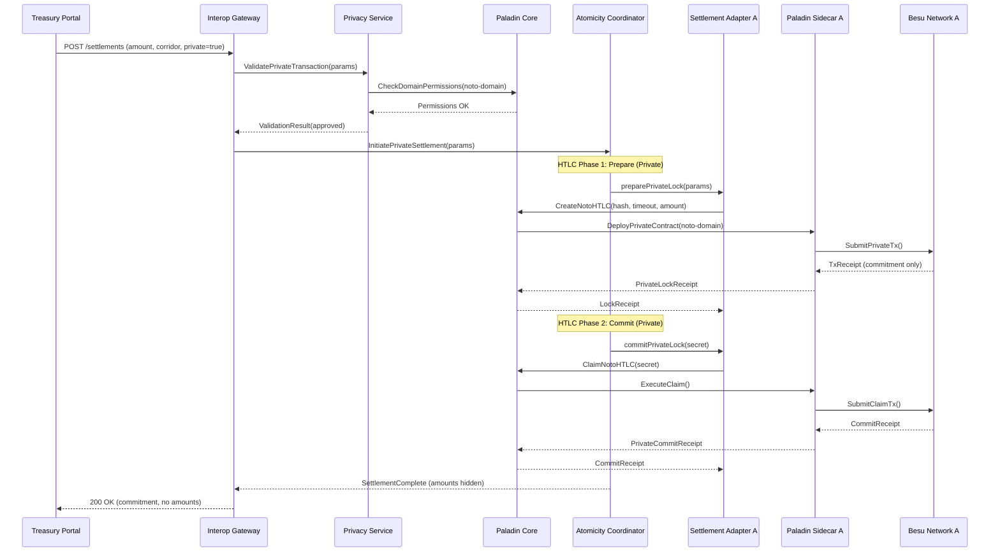
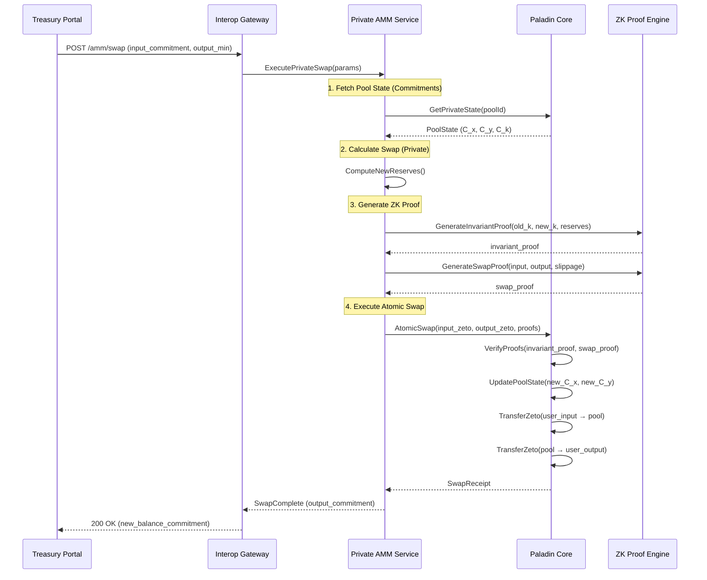
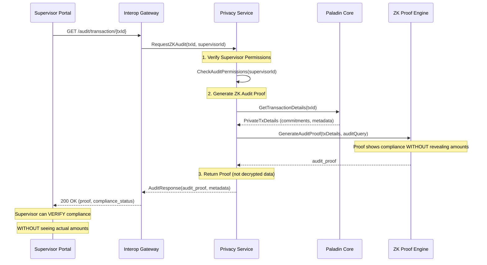

# CBWeb3 - System Components Documentation

Description of the CBWeb3 component diagram and its layers.

> **Scope: conceptual reference architecture, not the implemented system.**
>
> This document describes the target component model behind the CBWeb3 component
> diagram. Several layers below — the Paladin privacy layer (Noto and Zeto domains,
> the private AMM domain, the ZK proof engine) and the WebSocket gateway — have **no
> counterpart in the Scenario B code**: there are no `ZetoToken`/`NotoToken` contracts
> under `scenario-b/contracts/src`, no Paladin privacy-layer integration in the Go
> services (the `noc-agent` health-checks a Paladin node as a monitored component type,
> which is observability, not a privacy path), and no WebSocket transport in the API
> gateway. Read this as the reference model; read
> [`scenario-b/README.md`](../../README.md) for what is actually built and running.
>
> Where a component **does** exist, the technology entries below name the implemented
> stack: Go microservices, gRPC intra-entity, REST through the gateway. Anything
> describing a Node.js or NestJS runtime has been corrected — the platform has never
> been implemented on one.

## System Layers

### 1. Frontend Layer

The frontend layer consists of **5 specialized web portals**, each designed for a specific type of user:

#### 1.1 Treasury Portal

**Purpose:** Central bank treasury operations

**Users:** Treasury operators from each central bank

**Main Features:**
- Cross-border settlement initiation
- CBDC balance monitoring
- Multi-signature transaction approval
- Transaction history visualization
- Operational limits management

**Technical Characteristics:**
- Real-time dashboard with settlement metrics
- Multi-step forms for HTLC configuration
- Push notifications for pending approvals

---

#### 1.2 NOC Portal (Network Operations Center Portal)

**Purpose:** 24/7 operational monitoring and management of the system

**Users:** Network administrators, operations engineers

**Main Features:**
- Real-time system health panel
- Alerts and incident management
- Circuit breaker activation (emergency switches)
- Latency and throughput monitoring
- Blockchain and Paladin node visualization
- Real-time audit logs

**Technical Characteristics:**
- Dashboards with per-second updates via WebSocket
- Integration with alerting system (Prometheus/Grafana)
- Metrics drill-down capability

---

#### 1.3 Supervisor Portal

**Purpose:** Regulatory supervision with read-only access

**Users:** Central bank supervisors, regulators

**Main Features:**
- Transaction visualization (with selective privacy)
- Regulatory compliance reports
- Transaction pattern analysis
- Data export for audits
- **Access to ZK proofs for verification without decryption**

**Technical Characteristics:**
- Implements Zero-Knowledge proofs for selective privacy
- **Integration with Paladin for ZK-audit**
- Only shows information the supervisor is authorized to see
- Complies with WCAG 2.1 AA for accessibility

---

#### 1.4 Governance Portal

**Purpose:** Multi-central bank governance management

**Users:** Governors, governance committees from each CB

**Main Features:**
- Proposal creation and voting
- Corridor policy management
- System parameter configuration
- Multi-signature vote tracking
- Decision history with cryptographic proofs

**Technical Characteristics:**
- On-chain voting with cryptographic signatures
- Real-time multi-sig progress visualization
- Immutable decision log

---

#### 1.5 Bank Integration Portal

**Purpose:** Development and testing tools for integration

**Users:** Central bank developers, technical teams

**Main Features:**
- API testing sandbox
- Interactive documentation (Swagger/OpenAPI)
- Transaction simulator
- Test key and certificate generator
- **Testing tools for Paladin SDK**
- Integration and debugging logs

**Technical Characteristics:**
- Environment isolated from production
- Automatic test data generation
- Real-time debugging console

---

### 2. API Layer

The API layer acts as a single entry point for all communications between frontend and backend.

#### 2.1 Interop Gateway (API Gateway)

**Purpose:** Main entry point for all REST APIs

**Responsibilities:**
- **Authentication:** JWT/OAuth2 token validation
- **Authorization:** Role-based permission verification (RBAC)
- **Rate Limiting:** Request limit control per central bank
- **Routing:** Request distribution to appropriate microservices
- **Validation:** Request-schema validation against the platform's internal data model
- **ISO 20022 boundary mapping:** Payloads crossing the system boundary are constrained
  to map explicitly onto ISO 20022 business concepts. ISO 20022 is a **semantic
  interoperability reference**, not an internal or on-chain message format: internal
  data models and contract states stay optimised for deterministic execution,
  auditability and confidentiality on the permissioned ledger. The gateway does not
  perform runtime ISO 20022 message verification.
- **Logging:** Recording all requests for audit

**Technology:** Go with [Fiber v2](https://github.com/gofiber/fiber) for HTTP and
gRPC (`google.golang.org/grpc`) to the internal services — see
`scenario-b/backend/services/api-gateway/go.mod`.

**Main Endpoints:**
- `/api/v1/settlements` - Settlement operations
- `/api/v1/governance` - Governance operations
- `/api/v1/corridors` - Corridor management
- `/api/v1/privacy/*` - **Paladin operations** (new)
- `/api/docs` - Swagger documentation

---

#### 2.2 WebSocket Gateway *(reference model — not implemented)*

**Purpose:** Real-time bidirectional communication

**Responsibilities:**
- **Settlement events:** State change notifications
- **NOC alerts:** Real-time incidents and metrics
- **Multi-sig progress:** Updates when a CB signs
- **Health metrics:** Node and corridor status
- **Paladin events:** Private transaction states

**Technology:** Not implemented. The API gateway carries no WebSocket transport
today; the portals poll REST endpoints for the events listed above. Should this
component be built, it belongs in the Go gateway alongside the REST routes — not in
a separate Node.js runtime.

**Namespaces (channels):**
- `/treasury` - Treasury events
- `/noc` - Operational alerts
- `/governance` - Voting progress
- `/privacy` - **Paladin domain events** (new)

---

### 3. Microservices Layer

Set of specialized services that implement business logic.

#### 3.1 Policy Engine

**Purpose:** Application of sovereign policies from each central bank

**Responsibilities:**
- Business rule validation per corridor
- Operational limit verification
- Schedule policy application
- Compliance rule evaluation
- Exception and authorized override management

**Policy Examples:**
- "USD-MXN transactions only between 8:00-18:00 local time"
- "Daily limit of $10M per corridor"
- "Requires 3 of 5 signatures for amounts > $1M"

---

#### 3.2 Identity Service

**Purpose:** Authentication and identity management

**Responsibilities:**
- Operator authentication (OAuth2/Keycloak)
- Central bank certificate management
- Identity attestation (cryptographic proofs)
- Role and permission management (RBAC)
- Access auditing

**Supported Roles:**
- `treasury-operator` - Treasury operator
- `ROLE_NOC_ADMIN` - NOC administrator
- `supervisor` - Regulatory supervisor
- `governor` - Governor
- `developer` - Integration developer

---

#### 3.3 Privacy Service - **Integrated with Paladin**

**Purpose:** Privacy management through Paladin SDK

**Responsibilities:**
- **Integration with Paladin SDK** for private transactions
- Management of Noto, Zeto, and Private AMM domains
- ZK proof generation and verification
- Selective disclosure for supervisors
- Coordination with ZK Proof Engine

**Privacy APIs:**
```
POST /api/v1/privacy/noto/mint          # Mint Noto tokens (CB only)
POST /api/v1/privacy/noto/transfer      # Transfer Noto tokens
POST /api/v1/privacy/zeto/mint          # Mint Zeto tokens
POST /api/v1/privacy/zeto/transfer      # Transfer Zeto (with ZK proof)
POST /api/v1/privacy/bridge/noto-to-zeto  # Increase privacy
POST /api/v1/privacy/bridge/zeto-to-noto  # Reduce for audit
POST /api/v1/privacy/audit/request-proof  # Request ZK proof
GET  /api/v1/privacy/audit/verify-proof   # Verify ZK proof
```

---

#### 3.4 Time Service

**Purpose:** Time synchronization for HTLCs

**Responsibilities:**
- Synchronized timestamp provision (NTP)
- HTLC timeout management
- Time window coordination between CBs
- Approaching expiration alerts
- Time zone handling

**Critical Importance:** HTLCs require precise synchronized time to prevent one party from claiming funds after the contract has expired.

---

#### 3.5 Observability Hub

**Purpose:** Centralization of metrics, logs, and traces

**Responsibilities:**
- Metrics aggregation (Prometheus)
- Log centralization (Loki)
- Distributed tracing (Jaeger)
- Operational dashboards (Grafana)
- Automatic alerting
- **Paladin and private domain metrics**

**Key Metrics Monitored:**
- `settlement_latency_seconds` - p99 latency < 5s
- `settlement_success_rate` - Success rate ≥ 99.5%
- `system_uptime` - Availability ≥ 99.9%
- `paladin_transactions_total` - Transactions per domain (new)
- `zk_proof_generation_time` - ZK proof generation time (new)

---

### 4. Hub & Spoke Layer

The heart of the system that enables communication between independent blockchain networks.

#### 4.1 Interoperability Hub

**Purpose:** Central coordination of atomic cross-chain settlements

**Internal Components:**

##### Atomicity Coordinator
Ensures cross-chain transactions are atomic (all or nothing).

**Supported Protocols:**

| Protocol | Description | Use |
|----------|-------------|-----|
| **HTLC** | Hash Time-Locked Contract | Atomic transactions with hash secret and timeout |
| **2PC** | Two-Phase Commit | Prepare → Commit/Abort |
| **3PC** | Three-Phase Commit | Prepare → Pre-commit → Commit |

---

#### 4.2 Settlement Adapters

**Purpose:** Abstraction of interaction with each blockchain network

**Settlement Adapter A:**
- Connects to Besu Network CB-A via Paladin
- Implements `SettlementAdapter` interface
- **Supports Noto and Zeto operations**
- Translates generic commands to Paladin/Besu transactions

**Settlement Adapter B:**
- Connects to Besu Network CB-B via Paladin
- Same interface, different network configuration


---

#### 4.3 AMM - Automated Market Maker

**Purpose:** Automatic liquidity provision for currency exchanges

**Components:**

##### Liquidity Pools
- Reserves for each currency pair (e.g., USD-MXN, USD-BRL)
- **Reserves hidden using Pedersen Commitments** (privacy)
- Automatic price formula (constant product: x * y = k)
- **Invariant k verification via ZK proofs**
- Liquidity provision by participating central banks

**Features:**
- Instant exchange rate quotes
- Atomic swap execution **with hidden amounts**
- Slippage management
- Fee distribution to liquidity providers
- **LP tokens as Zeto tokens** (hidden positions)

---

#### 4.4 FX Service (Foreign Exchange Service)

**Purpose:** Exchange rate oracle

**Responsibilities:**
- Price feed aggregation from multiple sources
- Weighted average price calculation
- Price anomaly detection
- Historical rates for audit
- Volatility alerts

**Data Sources:**
- Reuters, Bloomberg (market data) vía Chainlink?
- Participating central banks (official rates)
- Internal AMM (available liquidity)

---

### 5. Paladin Privacy Layer *(reference model — not implemented in Scenario B)*

> Scenario B has no `ZetoToken`/`NotoToken` contracts and no Paladin privacy-layer
> integration in its Go services — no domain client, no private-state handling, no
> proof generation. (The `noc-agent` can health-check a Paladin node as a monitored
> component type; that is observability only.)
> Privacy in Scenario B today rests on network permissioning and the
> tCeBM/fCeBM token model; the Paladin domains below are the target design, retained
> here for the reference architecture. Scenario A is where Paladin/Zeto is implemented.


**Hyperledger Paladin** is the privacy framework that acts as an intermediate layer between the Hub & Spoke and Besu networks, enabling confidential transactions and zero-knowledge proofs.

#### 5.1 Paladin Core

**Purpose:** Private transaction manager and domain coordinator

**Responsibilities:**
- **Transaction Manager:** Orchestrates atomic private transactions
- **State Store:** Stores encrypted private states
- **Domain Registry:** Registers and manages privacy domains
- **Event Subscription:** Emits masked events (without filtering information)


#### 5.2 Noto Domain (Notarized Token Domain)

**Purpose:** Private tokens with central bank audit capability

**Characteristics:**
- **Privacy:** Amounts hidden from external observers
- **Auditability:** The central bank (notary) can see balances
- **Primary Use Case:** tCeBM (Tokenized Central Bank Money)

**How It Works:**
1. The CB issues Noto tokens acting as **notary**
2. Transfers require endorsement from the notary
3. The notary maintains a record of all balances
4. External observers CANNOT see amounts

**Advantages:**
- Regulatory compliance (CB can always audit)
- Privacy vs. third parties (other CBs, public)
- Lower computational complexity than ZK proofs

**When to Use Noto:**
- Settlements where the issuing CB needs visibility
- Transactions requiring complete audit trail
- Scenarios with strict regulatory requirements

---

#### 5.3 Zeto Domain (ZK Token Domain)

**Purpose:** Fully private tokens with zero-knowledge proofs

**Characteristics:**
- **Total Privacy:** Even the CB cannot see balances directly
- **Verification Without Decryption:** ZK proofs demonstrate validity
- **Use Case:** High confidentiality, supervision via ZK-audit

**How It Works:**
1. Balances are stored as **commitments** (cryptographic commitments)
2. Transfers generate **ZK proofs** that demonstrate:
   - The sender has sufficient funds
   - Tokens are not created from nothing
   - The amount is within valid ranges
3. Verifiers check the proof WITHOUT seeing the amounts

**ZK Circuits:**

| Circuit | Public Inputs | Private Inputs | Purpose |
|---------|---------------|----------------|---------|
| `balance-proof` | commitment | amount, blinding | Prove token ownership |
| `transfer-proof` | input_commitment, output_commitment | amounts, blindings | Prove valid transfer |
| `range-proof` | commitment, min, max | amount, blinding | Prove amount in range |

**When to Use Zeto:**
- High confidentiality transactions
- When even the CB should not see individual amounts
- Supervisors verify via ZK-audit (without decryption)

---

#### 5.4 Private AMM Domain

**Purpose:** Liquidity pools with hidden reserves and positions

**Characteristics:**
- **Hidden Reserves:** Using Pedersen Commitments
- **Verifiable Invariant:** k = x * y proven via ZK
- **Private LP Tokens:** As Zeto tokens

**Difference vs. Traditional AMM:**

| Aspect | Traditional AMM (Uniswap) | Private AMM (CBWeb3/Paladin) |
|--------|---------------------------|------------------------------|
| Reserves | Public (x, y visible) | Hidden (Pedersen commitments) |
| Swap Amounts | Public | Hidden (Zeto tokens) |
| LP Positions | Public | Hidden (commitment only) |
| Invariant k | Calculable | Verified via ZK proof |
| Audit | On-chain | ZK proofs for compliance |

**Specific ZK Circuits:**

| Circuit | Purpose |
|---------|---------|
| `invariant-proof` | Prove that k' = k after the swap |
| `swap-proof` | Prove valid swap without revealing amounts |

---

#### 5.5 ZK Proof Engine

**Purpose:** Generation and verification of zero-knowledge proofs

**Technologies:**
- **Circom:** Language for defining arithmetic circuits
- **Snarkjs:** JavaScript runtime for generating and verifying proofs
- **BabyJubJub:** Elliptic curve for signatures within circuits
- **Poseidon:** Hash function optimized for ZK

**Proof Generation Flow:**
```
1. User provides private inputs (amount, blinding)
2. ZK Engine loads compiled circuit (.wasm)
3. Generates witness with inputs
4. Computes proof using proving key
5. Returns compact proof (~256 bytes)
6. Anyone can verify with verification key
```

**Computational Resources:**
- ZK proofs are computationally intensive
- GPU recommended for fast generation
- Verification is fast (~10ms)

---

#### 5.6 Paladin Sidecars

**Purpose:** Paladin instance that runs alongside each Besu node

**Architecture:**
```
┌─────────────────────────────────────────┐
│           Besu Network CB-A             │
│  ┌─────────────────┐  ┌──────────────┐  │
│  │   Besu Nodes    │  │   Paladin    │  │
│  │  (W1-W4, V1-V4) │←→│   Sidecar    │  │
│  └─────────────────┘  └──────────────┘  │
└─────────────────────────────────────────┘
```

**Sidecar Responsibilities:**
- Execute Paladin transactions on the local Besu network
- Maintain encrypted private state
- Coordinate with central Paladin Core
- Synchronize domains between CBs

---

### 6. Blockchain Networks Layer

Two completely independent Hyperledger Besu networks, each operated by a central bank, **with integrated Paladin Sidecars**.

#### 6.1 Besu Network CB-A (Central Bank A Network)

**Purpose:** CBDC ledger for Central Bank A

**Architecture:**

##### Writer Nodes - 4 nodes
| Node | Function |
|------|----------|
| W1 | Primary write node |
| W2 | Secondary node (failover) |
| W3 | Node for public API |
| W4 | Node for internal services |

**Responsibilities:**
- Receive transactions from users
- Propagate transactions to validators
- Serve read queries
- Maintain mempool of pending transactions
- **Interact with Paladin Sidecar for private transactions**

##### Validator Nodes - 4 nodes
| Node | Function |
|------|----------|
| V1 | Primary validator |
| V2 | Secondary validator |
| V3 | Tertiary validator |
| V4 | Quaternary validator |

**Responsibilities:**
- Participate in BFT consensus (IBFT 2.0 or QBFT)
- Validate and sign blocks
- Maintain ledger integrity
- Vote on network decisions
- **Verify ZK proofs from Paladin transactions**

##### Paladin Sidecar
- Runs alongside Besu nodes
- Manages CB-A private states
- Executes Noto/Zeto transactions on local network
- Synchronizes with central Paladin Core

**Consensus:** With 4 validators, tolerates 1 Byzantine (malicious or failed) node
- BFT Formula: 3f + 1 nodes to tolerate f failures
- 4 nodes → tolerates 1 failure

---

#### 6.2 Besu Network CB-B (Central Bank B Network)

**Identical structure to CB-A:**
- 4 Writer Nodes (W1-W4)
- 4 Validator Nodes (V1-V4)
- 1 Paladin Sidecar

**Independence:**
- Completely separate network
- Its own genesis block
- Its own validator keys
- Its own network governance
- **Its own Noto domain (CB-B as notary)**

---

## Component Relationships

### Data Flow Diagram with Paladin

```
┌─────────────────────────────────────────────────────────────────┐
│                           USERS                                  │
│  (Operators, Supervisors, Governors, NOC, Developers)           │
└─────────────────────────────┬───────────────────────────────────┘
                              │ HTTPS/WSS
                              ▼
┌─────────────────────────────────────────────────────────────────┐
│                      FRONTEND LAYER                              │
│ Treasury │ NOC │ Supervisor │ Governance │ Bank Integration     │
└─────────────────────────────┬───────────────────────────────────┘
                              │ REST/WebSocket
                              ▼
┌─────────────────────────────────────────────────────────────────┐
│                        API LAYER                                 │
│           Interop Gateway  ←→  WebSocket Gateway                │
└─────────────────────────────┬───────────────────────────────────┘
                              │ gRPC/RabbitMQ
                              ▼
┌─────────────────────────────────────────────────────────────────┐
│                   MICROSERVICES LAYER                            │
│ Policy │ Identity │ Privacy (Paladin SDK) │ Time │ Observability│
└─────────────────────────────┬───────────────────────────────────┘
                              │ gRPC
                              ▼
┌─────────────────────────────────────────────────────────────────┐
│                    HUB & SPOKE LAYER                             │
│                   ┌──────────────────┐                          │
│                   │ Interoperability │                          │
│                   │       Hub        │←──────→ AMM ←→ FX        │
│                   └────────┬─────────┘                          │
│           ┌────────────────┼────────────────┐                   │
│           ▼                                 ▼                   │
│    Settlement Adapter A              Settlement Adapter B       │
└───────────┬─────────────────────────────────┬───────────────────┘
            │ Paladin SDK                     │ Paladin SDK
            ▼                                 ▼
┌─────────────────────────────────────────────────────────────────┐
│                  PALADIN PRIVACY LAYER                           │
│                   ┌──────────────────┐                          │
│                   │   Paladin Core   │                          │
│                   │  (Tx Manager)    │                          │
│                   └────────┬─────────┘                          │
│     ┌──────────────────────┼──────────────────────┐             │
│     ▼                      ▼                      ▼             │
│ ┌─────────┐         ┌─────────┐           ┌─────────────┐       │
│ │  Noto   │         │  Zeto   │           │ Private AMM │       │
│ │ Domain  │         │ Domain  │           │   Domain    │       │
│ └────┬────┘         └────┬────┘           └──────┬──────┘       │
│      │                   │   ZK Proof Engine     │              │
│      │                   └───────────────────────┘              │
└──────┼───────────────────────────────────────────┼──────────────┘
       │ JSON-RPC                                  │ JSON-RPC
       ▼                                          ▼
┌─────────────────────────┐    ┌─────────────────────────┐
│    BESU NETWORK CB-A    │    │    BESU NETWORK CB-B    │
│  ┌─────────────────┐    │    │  ┌─────────────────┐    │
│  │ Writers (W1-W4) │    │    │  │ Writers (W1-W4) │    │
│  └────────┬────────┘    │    │  └────────┬────────┘    │
│  ┌────────▼────────┐    │    │  ┌────────▼────────┐    │
│  │Validators(V1-V4)│    │    │  │Validators(V1-V4)│    │
│  └─────────────────┘    │    │  └─────────────────┘    │
│  ┌─────────────────┐    │    │  ┌─────────────────┐    │
│  │ Paladin Sidecar │    │    │  │ Paladin Sidecar │    │
│  └─────────────────┘    │    │  └─────────────────┘    │
└─────────────────────────┘    └─────────────────────────┘
```

### Communication Matrix

| Source | Destination | Protocol | Type | Purpose |
|--------|-------------|----------|------|---------|
| Portals | Interop Gateway | HTTPS | REST | CRUD operations |
| Portals | WebSocket Gateway | WSS | WebSocket | Real-time events |
| Interop Gateway | Policy Engine | gRPC | Sync | Rule validation |
| Interop Gateway | Privacy Service | gRPC | Sync | Paladin operations |
| Privacy Service | Paladin Core | Paladin SDK | Sync | Domain management |
| Interop Gateway | Atomicity Coordinator | gRPC | Sync | Settlement initiation |
| Atomicity Coordinator | Settlement Adapters | gRPC | Sync | 2PC operations |
| Settlement Adapters | Paladin Core | Paladin SDK | Sync | Private transactions |
| Paladin Core | Paladin Sidecars | gRPC | Sync | State synchronization |
| Paladin Sidecars | Besu Networks | JSON-RPC | Sync | Blockchain transactions |
| Atomicity Coordinator | RabbitMQ | AMQP | Async | Lifecycle events |
| Observability Hub | All services | AMQP | Subscribe | Metrics and logs |

---

## Data Flows

### Flow 1: Private Settlement with Paladin/Noto



### Flow 2: Private Swap in AMM with ZK Proof



### Flow 3: ZK-Audit for Supervisor



---

## Component Summary by Layer

| Layer | Components | Count |
|-------|------------|-------|
| **Frontend** | Web portals | 5 |
| **API** | Gateways | 2 |
| **Microservices** | Services | 5 |
| **Hub & Spoke** | Hub + Adapters + AMM + FX | 5 |
| **Paladin Privacy** | Core + Domains + ZK Engine | 5 |
| **Blockchain** | Besu networks | 2 |
| **Nodes per network** | Writers + Validators + Sidecar | 9 (4+4+1) |
| **Total blockchain nodes** | Both networks | 18 |

---

## References

- [Hyperledger Paladin](https://github.com/hyperledger/paladin) - Privacy framework
- [Paladin Noto](https://github.com/hyperledger/paladin/tree/main/domains/noto) - Notarized tokens
- [Paladin Zeto](https://github.com/hyperledger/paladin/tree/main/domains/zeto) - ZK tokens
- [Hyperledger Besu](https://besu.hyperledger.org/) - Enterprise Ethereum client
- [LF Decentralized Trust - Paladin](https://www.lfdecentralizedtrust.org/blog/announcing-paladin-an-lf-decentralized-trust-lab-for-programmable-privacy-on-evm)
- [Kaleido - Paladin](https://www.kaleido.io/blockchain-platform/paladin)

---

