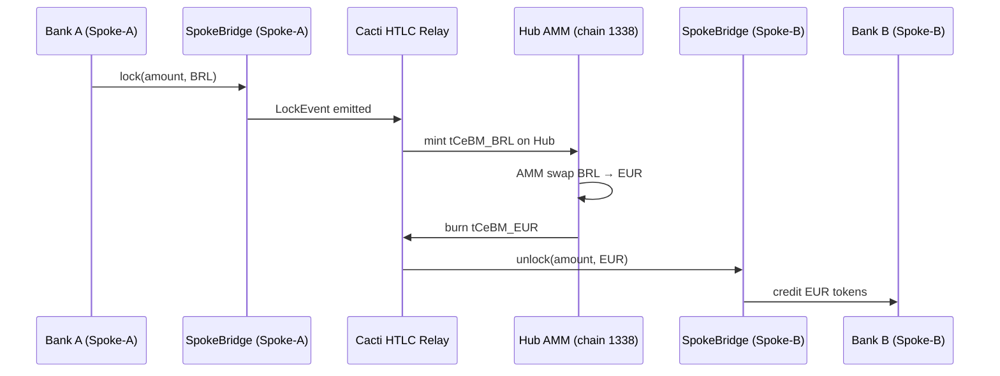
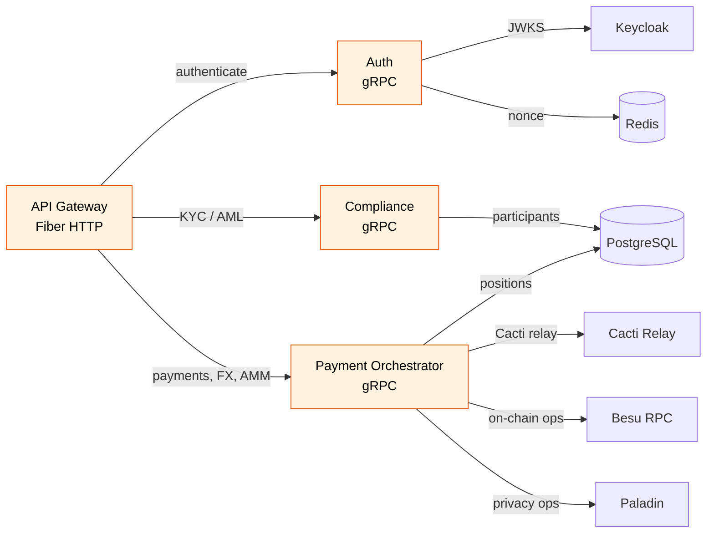

# CBWeb3 Platform — Scenario B Architecture

> Hub-and-Spoke Liquidity Pool with cross-chain settlement via Cacti HTLC relay
> and optional Paladin privacy layer (Zeto/Pente domains).

```mermaid
graph TB
    %% ─── LEGEND ─────────────────────────────────────────────────────────────
    classDef frontend fill:#e3f2fd,stroke:#1565c0,color:#000
    classDef apiLayer fill:#fce4ec,stroke:#c62828,color:#000
    classDef microservice fill:#fff3e0,stroke:#e65100,color:#000
    classDef hubSpoke fill:#ffebee,stroke:#b71c1c,color:#000
    classDef privacy fill:#f3e5f5,stroke:#6a1b9a,color:#000
    classDef blockchain fill:#e8f5e9,stroke:#2e7d32,color:#000
    classDef infra fill:#eceff1,stroke:#37474f,color:#000
    classDef interop fill:#fff9c4,stroke:#f9a825,color:#000

    %% ─── FRONTEND LAYER ─────────────────────────────────────────────────────
    subgraph FRONTEND["FRONTEND LAYER"]
        direction LR
        TREASURY[Treasury Portal]:::frontend
        NOC[NOC Portal]:::frontend
        SUPERVISOR[Supervisor Portal]:::frontend
        GOVERNANCE[Governance Portal]:::frontend
        BANK_PORTAL[Bank Integration Portal]:::frontend
    end

    %% ─── API LAYER ──────────────────────────────────────────────────────────
    subgraph API_LAYER["API LAYER (per entity)"]
        direction LR
        API_GW_CBA[API Gateway<br/>Central-Bank-A<br/>:38080]:::apiLayer
        API_GW_CBB[API Gateway<br/>Central-Bank-B<br/>:48080]:::apiLayer
        API_GW_BA[API Gateway<br/>Bank-A :18080]:::apiLayer
        API_GW_BB[API Gateway<br/>Bank-B :28080]:::apiLayer
    end

    %% ─── MICROSERVICES LAYER ────────────────────────────────────────────────
    subgraph MICROSERVICES["MICROSERVICES LAYER (per entity)"]
        direction LR
        AUTH[Auth Service<br/>gRPC :9091]:::microservice
        COMPLIANCE[Compliance Service<br/>gRPC :9093]:::microservice
        PAYMENT_ORCH[Payment Orchestrator<br/>gRPC :9094]:::microservice
    end

    %% ─── HUB & SPOKE LAYER ─────────────────────────────────────────────────
    subgraph HUB_SPOKE["HUB & SPOKE LAYER (Scenario B)"]
        direction LR

        subgraph HUB["HUB (chain 1337)"]
            direction TB
            IR_HUB[IdentityRegistry<br/>Hub Governance]:::hubSpoke
            AMM[AutomatedMarketMaker<br/>Liquidity Pools]:::hubSpoke
            ORACLE[ManualOracle<br/>FX Rates]:::hubSpoke
            FX_AGR[FXAgreement<br/>Trade Coordination]:::hubSpoke
            tCeBM_BRL[tCeBM_BRL<br/>Hub Token A]:::hubSpoke
            tCeBM_EUR[tCeBM_EUR<br/>Hub Token B]:::hubSpoke
            HTLC_HUB[HTLC<br/>Atomic Swap]:::hubSpoke
        end

        subgraph SPOKE_A["SPOKE-A (chain 1338)"]
            direction TB
            IR_A[IdentityRegistry<br/>Spoke-A]:::blockchain
            TOKEN_A[tCeBM_BRL<br/>Spoke Token]:::blockchain
            FIAT_A[fCeBM_BRL<br/>Fiat Token]:::blockchain
            HTLC_A[HTLC<br/>Spoke-A]:::blockchain
            BRIDGE_A[SpokeBridge<br/>Lock / Unlock]:::blockchain
        end

        subgraph SPOKE_B["SPOKE-B (chain 1339)"]
            direction TB
            IR_B[IdentityRegistry<br/>Spoke-B]:::blockchain
            TOKEN_B[tCeBM_BRL<br/>Spoke Token]:::blockchain
            FIAT_B[fCeBM_BRL<br/>Fiat Token]:::blockchain
            HTLC_B[HTLC<br/>Spoke-B]:::blockchain
            BRIDGE_B[SpokeBridge<br/>Lock / Unlock]:::blockchain
        end
    end

    %% ─── INTEROP LAYER (CACTI) ─────────────────────────────────────────────
    subgraph INTEROP["INTEROPERABILITY LAYER"]
        direction LR
        CACTI[Cacti HTLC Relay<br/>:4000]:::interop
    end

    %% ─── PALADIN PRIVACY LAYER ─────────────────────────────────────────────
    subgraph PALADIN["PALADIN PRIVACY LAYER (optional)"]
        direction LR
        PALADIN_CORE[Paladin Core<br/>Transaction Manager]:::privacy
        ZETO[Zeto Domain<br/>ZKP Tokens]:::privacy
        PENTE[Pente Domain<br/>Private Contracts]:::privacy
    end

    %% ─── BLOCKCHAIN NETWORKS ────────────────────────────────────────────────
    subgraph BESU_NETWORKS["BLOCKCHAIN NETWORKS (Hyperledger Besu QBFT)"]
        direction LR

        subgraph BESU_A["Spoke-A Besu Network"]
            direction TB
            CBA_NODE[central-bank-a<br/>:8645 bootnode]:::blockchain
            BA_NODE[bank-a<br/>:8646]:::blockchain
        end

        subgraph BESU_B["Spoke-B Besu Network"]
            direction TB
            CBB_NODE[central-bank-b<br/>:8745 bootnode]:::blockchain
            BB_NODE[bank-b<br/>:8746]:::blockchain
        end
    end

    %% ─── SHARED INFRASTRUCTURE ──────────────────────────────────────────────
    subgraph INFRA["SHARED INFRASTRUCTURE"]
        direction LR
        KEYCLOAK[Keycloak<br/>IAM :8081]:::infra
        POSTGRES[(PostgreSQL<br/>:5432)]:::infra
        REDIS[(Redis<br/>:6379)]:::infra
    end

    %% ─── PARTICIPANTS ───────────────────────────────────────────────────────
    subgraph PARTICIPANTS["PARTICIPANTS"]
        direction TB
        P_CBA(Central Bank A<br/>Governance + Mint)
        P_CBB(Central Bank B<br/>Governance + Mint)
        P_BA(Bank A<br/>Commercial Bank)
        P_BB(Bank B<br/>Commercial Bank)
    end

    %% ─── CONNECTIONS ────────────────────────────────────────────────────────

    %% Frontend → API Gateway
    FRONTEND --> API_LAYER

    %% API Gateway → Microservices (gRPC)
    API_GW_CBA --> AUTH
    API_GW_CBA --> COMPLIANCE
    API_GW_CBA --> PAYMENT_ORCH

    %% Microservices → Infrastructure
    AUTH --> KEYCLOAK
    AUTH --> REDIS
    COMPLIANCE --> POSTGRES
    PAYMENT_ORCH --> POSTGRES

    %% Payment Orchestrator → Blockchain Adapters
    PAYMENT_ORCH --> CACTI
    PAYMENT_ORCH --> PALADIN_CORE
    PAYMENT_ORCH -->|Besu adapter| HUB

    %% Cacti Relay ↔ Spoke Bridges
    CACTI -->|Lock event| BRIDGE_A
    CACTI -->|Unlock event| BRIDGE_B
    CACTI -->|HTLC coordination| HTLC_HUB

    %% Spoke Bridges → Hub AMM
    BRIDGE_A -->|Deposit liquidity| AMM
    BRIDGE_B -->|Deposit liquidity| AMM

    %% Hub contracts interactions
    AMM --> tCeBM_BRL
    AMM --> tCeBM_EUR
    AMM --> ORACLE
    FX_AGR --> HTLC_HUB
    IR_HUB -->|governance| AMM

    %% Paladin → Besu (privacy transactions)
    PALADIN_CORE --> ZETO
    PALADIN_CORE --> PENTE
    PALADIN_CORE -->|private tx| BESU_A

    %% Besu Nodes in each spoke
    SPOKE_A -.->|deployed on| BESU_A
    SPOKE_B -.->|deployed on| BESU_B
    HUB -.->|deployed on| BESU_A

    %% Participants → API Gateways
    P_CBA --> API_GW_CBA
    P_CBB --> API_GW_CBB
    P_BA --> API_GW_BA
    P_BB --> API_GW_BB
```

## Participants & Roles

| Entity | Role | Spoke | Besu RPC | API Gateway |
|--------|------|-------|----------|-------------|
| Central Bank A | Governance, Mint/Burn tCeBM | Spoke-A | :8645 | :38080 |
| Central Bank B | Governance, Mint/Burn tCeBM | Spoke-B | :8745 | :48080 |
| Bank A | Commercial Bank (BRL) | Spoke-A | :8646 | :18080 |
| Bank B | Commercial Bank (EUR) | Spoke-B | :8746 | :28080 |

## Smart Contracts

### Hub (chain 1338 — shared by Spoke-A Besu)

| Contract | Purpose |
|----------|---------|
| IdentityRegistry | Participant governance & role management |
| AutomatedMarketMaker (AMM) | Cross-currency liquidity pools |
| TokenizedCentralBankMoney (tCeBM_BRL) | Hub token representing BRL |
| TokenizedCentralBankMoney (tCeBM_EUR) | Hub token representing EUR |
| HashTimeLockedContract (HTLC) | Atomic swap coordination |
| FXAgreement | FX trade lifecycle management |
| ManualOracle | FX rate publication |

### Spoke-A (chain 1338) / Spoke-B (chain 1339)

| Contract | Purpose |
|----------|---------|
| IdentityRegistry | Local compliance & participant registry |
| TokenizedCentralBankMoney (tCeBM) | Domestic tokenized central bank money |
| FiatCentralBankMoney (fCeBM) | Fiat-backed token (off-ramp) |
| HashTimeLockedContract (HTLC) | Local atomic swap |
| SpokeBridge | Lock/Unlock for cross-spoke transfers |

## Cross-Chain Flow (Scenario B — Liquidity Pool)

## Backend Microservices (per entity)

## Infrastructure Stack

| Component | Image | Port | Purpose |
|-----------|-------|------|---------|
| PostgreSQL | postgres:17-alpine | 5432 | Persistence (4 entity DBs + Keycloak) |
| Redis | redis:7-alpine | 6379 | Nonce store (4 logical DBs) |
| Keycloak | quay.io/keycloak:26.2.5 | 8081 | IAM, 4 realms |
| Besu (Spoke-A) | hyperledger/besu:latest | 8645-8646 | QBFT consensus (2 validators) |
| Besu (Spoke-B) | hyperledger/besu:latest | 8745-8746 | QBFT consensus (2 validators) |
| Cacti Relay | cbweb3/cacti-htlc-relay:local | 4000 | Cross-chain HTLC event relay |
| Paladin | lfdecentralizedtrust/paladin | 31648+ | Privacy layer (Zeto, Pente) |

## Docker Networks

| Network | Connects |
|---------|----------|
| `spoke_a_besu_network` | Besu Spoke-A nodes + Paladin spoke-a nodes |
| `spoke_b_besu_network` | Besu Spoke-B nodes + Paladin spoke-b nodes |
| `cbweb3_network` | Shared infra (Keycloak, PostgreSQL, Redis) + all backends |
| `cacti_default` | Cacti HTLC relay |
| `cbweb3_backend_<entity>` | Per-entity backend service mesh |
