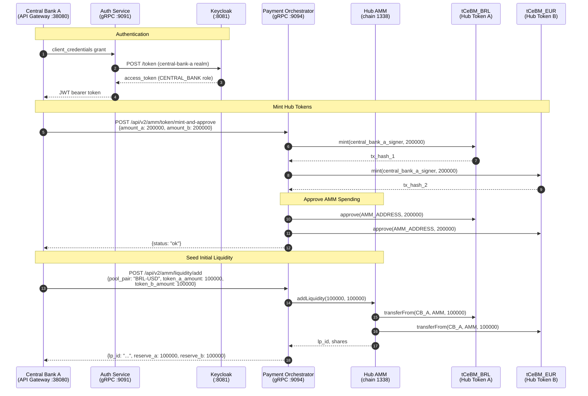
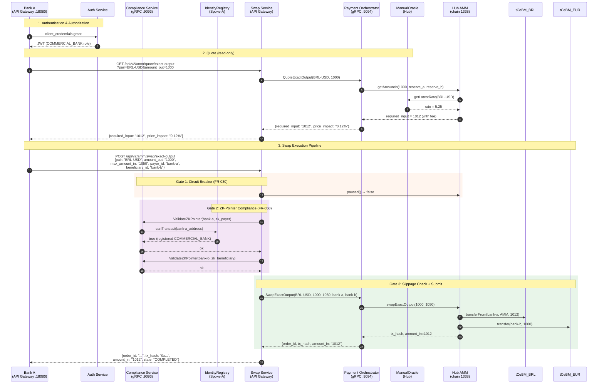
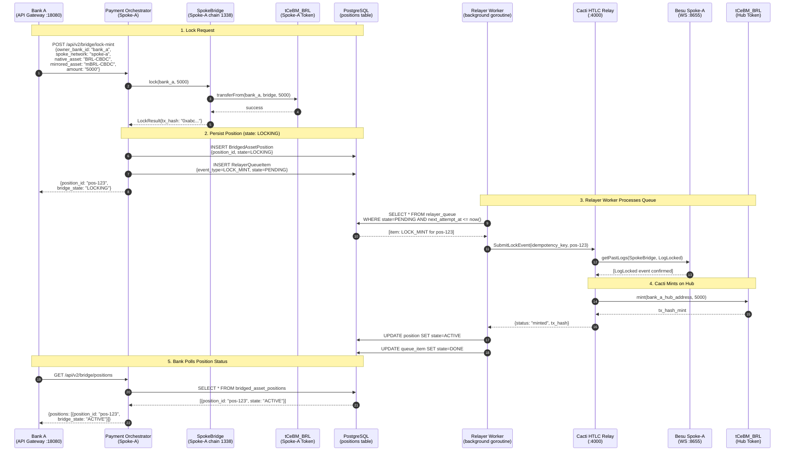
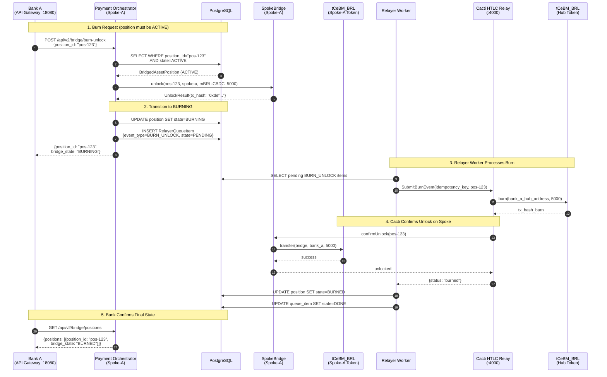
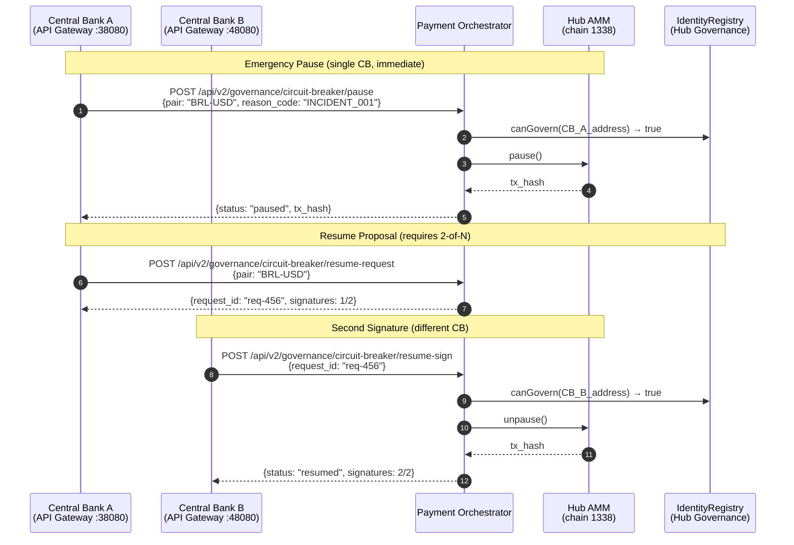
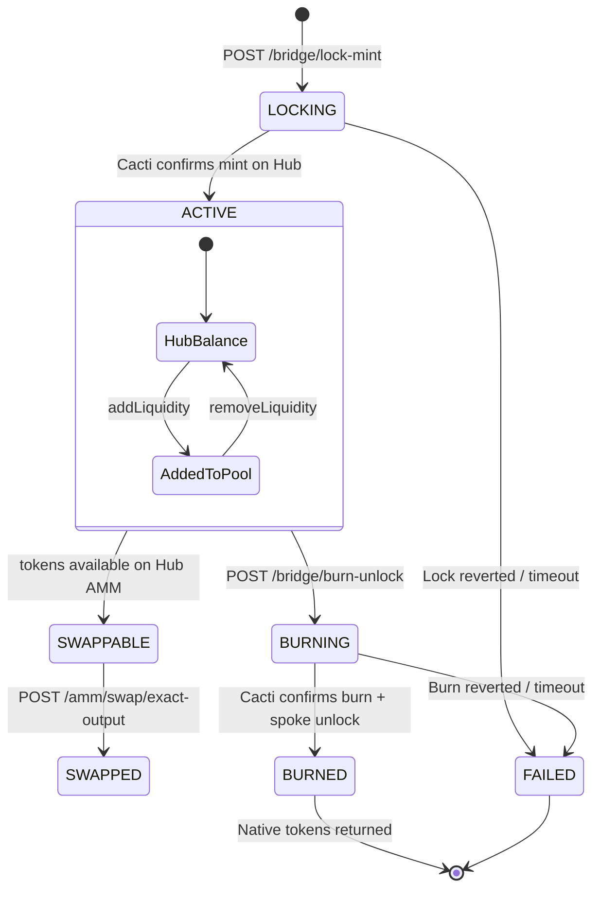

# CBWeb3 Scenario B — Cross-Chain Swap Operation (Detailed)

> End-to-end flow for a Hub-and-Spoke AMM swap with bridge lock/mint and burn/unlock lifecycle,
> including Cacti relay coordination, compliance gates, and circuit breaker governance.

---

## Phase 1: Pool Provisioning (Pre-condition)

Before any swap can execute, Central Banks must provision the AMM pool with initial liquidity.

---

## Phase 2: AMM Swap Execution (US1 — Exact Output)

A commercial bank requests an exact-output swap through the compliance-gated pipeline.

---

## Phase 3: Bridge Lock & Mint (US2 — Cross-Spoke Transfer)

A commercial bank locks native tokens on its spoke; the Cacti relay mints mirrored tokens on the Hub.

---

## Phase 4: Bridge Burn & Unlock (US2 — Return to Native)

After the position is ACTIVE on the Hub, the bank requests a burn which unlocks native tokens back on the spoke.

---

## Phase 5: Circuit Breaker & Governance (US3)

Central Banks can halt/resume the AMM via asymmetric multi-sig circuit breaker.

---

## Complete End-to-End State Machine

---

## API Endpoints Summary

| Method | Endpoint | Actor | Description |
|--------|----------|-------|-------------|
| GET | `/api/v2/amm/quote/exact-output` | Commercial Bank | Get required input for desired output |
| POST | `/api/v2/amm/swap/exact-output` | Commercial Bank | Execute swap with slippage protection |
| POST | `/api/v2/amm/liquidity/add` | Central Bank | Seed/add liquidity to pool |
| POST | `/api/v2/amm/liquidity/remove` | Central Bank | Remove liquidity from pool |
| GET | `/api/v2/amm/pool/:pair/status` | Any | Pool reserves and ratio |
| POST | `/api/v2/amm/token/mint-and-approve` | Central Bank | Mint Hub tokens + approve AMM |
| POST | `/api/v2/amm/token/approve-amm` | Commercial Bank | Approve AMM to spend tokens |
| POST | `/api/v2/bridge/lock-mint` | Commercial Bank | Lock spoke tokens, mint on Hub |
| POST | `/api/v2/bridge/burn-unlock` | Commercial Bank | Burn Hub tokens, unlock on spoke |
| GET | `/api/v2/bridge/positions` | Commercial Bank | List bridge positions and states |
| POST | `/api/v2/governance/circuit-breaker/pause` | Central Bank | Emergency halt (1-of-N) |
| POST | `/api/v2/governance/circuit-breaker/resume-request` | Central Bank | Propose resume (1st sig) |
| POST | `/api/v2/governance/circuit-breaker/resume-sign` | Central Bank | Co-sign resume (2-of-N) |

---

## Position State Transitions

| Current State | Event | Next State | Trigger |
|---------------|-------|------------|---------|
| — | `lock-mint` request | `LOCKING` | API call |
| `LOCKING` | Cacti confirms mint | `ACTIVE` | Relayer worker |
| `ACTIVE` | `burn-unlock` request | `BURNING` | API call |
| `BURNING` | Cacti confirms burn | `BURNED` | Relayer worker |
| `LOCKING` | Timeout / revert | `FAILED` | Relayer retry exhausted |
| `BURNING` | Timeout / revert | `FAILED` | Relayer retry exhausted |

---

## Key Design Decisions

| # | Decision | Rationale |
|---|----------|-----------|
| 19 | Pool must have liquidity before swap | Zero-reserve swap is an env config error, not a runtime edge case |
| 20 | Wait for ACTIVE before Burn&Unlock | Position must be minted on Hub before it can be burned back |
| 21 | `lp_id` returned on add liquidity | Enables targeted removal without race conditions |
| 24 | Relayer worker is idempotent | DB queue + idempotency key prevents double-processing on crash recovery |
| FR-030 | Circuit breaker is asymmetric | Pause = 1 CB (immediate); Resume = 2 CBs (multi-sig) |
| SC-022 | Swap p95 ≤ 6 seconds | Performance SLA for the swap pipeline end-to-end |
