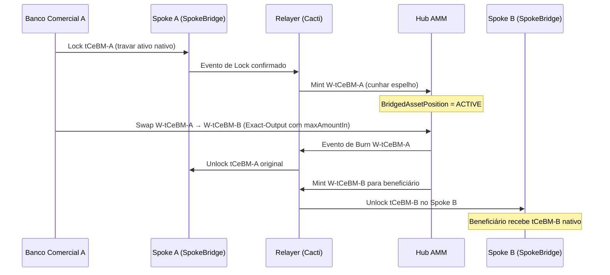

# Scenario B — Hub-and-Spoke Liquidity Pool

**Versão**: 2.0.0 | **Data**: Abril 2026 | **Status**: Rebuild completo — Corte do Cenário A concluído

---

## Resumo Executivo

O Cenário B implementa um modelo de **liquidez Hub-and-Spoke** que permite trocas de ativos financeiros tokenizados entre instituições bancárias de diferentes redes (Spokes) com execução centralizada no Hub Internacional.

### Objetivo

Viabilizar liquidez eficiente entre Bancos Comerciais de diferentes países, utilizando um pool de liquidez automatizado (AMM — Automated Market Maker) com proteção de slippage, validação de conformidade criptográfica (ZK-Pointers) e controles de governança multi-assinatura.

### Atores Principais

| Ator | Papel |
|------|-------|
| **Liquidity Taker** (Banco Comercial) | Solicita cotações e executa trocas de ativos pelo pool AMM |
| **Liquidity Provider / Issuer** (Banco Central) | Provê liquidez ao pool; pode pausar/retomar o Circuit Breaker |
| **Network Operator** (Hub) | Gerencia a infraestrutura do Hub internacional e o registro de identidade |
| **Hub** | Ledger Besu central onde o AMM e os contratos espelhados residem |
| **Relayer** (Cacti) | Serviço de retransmissão cross-chain para eventos de Lock&Mint / Burn&Unlock |

### Valor de Negócio

O modelo de liquidity pool permite que Bancos Comerciais realizem trocas de moedas digitais de banco central (tCeBM) de forma eficiente e auditável, sem necessidade de contrapartes diretas. O modelo Hub-and-Spoke reduz a fragmentação de liquidez, concentrando reservas no Hub onde o AMM calcula preços automaticamente.

---

## Fluxo Operacional do Cenário B

### Topologia Hub-and-Spoke

```
Spoke A (Rede Nacional A)          Hub Internacional           Spoke B (Rede Nacional B)
┌─────────────────────┐          ┌─────────────────┐          ┌─────────────────────┐
│  Banco Central A    │          │  AMM Contract   │          │  Banco Central B    │
│  Banco Comercial A  │◄────────►│  (Besu Hub)     │◄────────►│  Banco Comercial B  │
│  SpokeBridge A      │          │  IdentityReg.   │          │  SpokeBridge B      │
│  tCeBM-A (nativo)   │          │  W-tCeBM-A/B    │          │  tCeBM-B (nativo)   │
└─────────────────────┘          │  CommitmentReg. │          └─────────────────────┘
                                 └─────────────────┘
```

### Ciclo Lock&Mint / Burn&Unlock

O ciclo de bridging conecta a liquidez nativa dos Spokes ao pool AMM no Hub:



### Exact-Output com maxAmountIn

O modelo de troca usa a modalidade **Exact-Output**: o Banco Comercial especifica exatamente quanto o beneficiário deve receber (`amount_out`), e o sistema calcula o débito necessário do pagador (`required_input`). A proteção de slippage é garantida pelo parâmetro `max_amount_in`:

- Se `required_input > max_amount_in` → transação rejeitada com `SLIPPAGE_LIMIT_EXCEEDED`
- Se as reservas do pool forem insuficientes → rejeitada com `INSUFFICIENT_POOL_LIQUIDITY`

### ZK-Pointers e Conformidade

Antes de qualquer swap, o sistema verifica **ZK-Pointers** de conformidade ("fit to transact") para pagador e beneficiário. O ZK-Pointer é uma prova criptográfica que atesta elegibilidade sem revelar dados sensíveis de KYC/AML. Falha de validação resulta em `ZK_VALIDATION_FAILED`.

### Threshold de Desequilíbrio 70/30

O Liquidity Monitor verifica continuamente a proporção de reservas do pool. Quando a razão ultrapassa 70/30 (ex.: 72% de um ativo vs. 28% do outro), um alerta de `BREACHED` é gerado e registrado, sinalizando necessidade de rebalanceamento.

---

## Capacidades Reaproveitáveis

| Capacidade | Status | Fonte |
|-----------|--------|-------|
| Keycloak (autenticação/autorização) | ✅ Disponível — reconfigurado para roles Cenário B | Infra transversal |
| PostgreSQL (persistência) | ✅ Disponível — schemas Cenário A removidos | Infra transversal |
| Redis (cache) | ✅ Disponível — sem conflito com Cenário A | Infra transversal |
| Docker Compose (runtime) | ✅ Disponível — estendido para Hub/Spokes/Paladin | Infra transversal |
| IdentityRegistry (Solidity) | ✅ Disponível — reutilizado sem alteração | contracts/ |
| CommitmentHashRegistry (Solidity) | ✅ Disponível — integrado ao ZK-Pointer gate | contracts/ |
| SpokeBridge (Solidity) | ✅ Disponível — Lock&Mint/Burn&Unlock | contracts/ |
| TokenizedCentralBankMoney (Solidity) | ✅ Disponível — ativo nativo dos Spokes | contracts/ |
| AutomatedMarketMaker (Solidity) | 🔄 Parcial — evoluído com Circuit Breaker assimétrico | contracts/ |
| Cacti Relayer | 🔄 Parcial — adaptado para eventos Lock/Burn | backend/shared |
| Paladin JSON-RPC | 🔄 Parcial — integrado para Master Viewing Key | backend/shared |
| HTLC / FX Agreement | ❌ Não implementado — Cenário A apenas | Removido |

---

## Proposta de Nova Implementação

### Ciclo de Liquidez

O ciclo completo de uma transação no Cenário B envolve:

1. **Bridging (Lock&Mint)**: Banco Comercial A trava tCeBM-A no Spoke A via SpokeBridge
2. **Validação ZK**: Gateway verifica ZK-Pointers de pagador e beneficiário
3. **Cotação**: AMM calcula `required_input` para o `amount_out` solicitado
4. **Swap**: AMM troca W-tCeBM-A por W-tCeBM-B no Hub com proteção de `maxAmountIn`
5. **Unbridging (Burn&Unlock)**: W-tCeBM-A queimado; tCeBM-B desbloqueado no Spoke B

**Pré-condição de negócio**: Ambas as redes Spoke devem estar operacionais; pool deve ter liquidez mínima; participantes devem estar registrados e com ZK-Pointer válido.

**Critério de pronto verificável**: Tryout E2E executa fluxo completo com exit code 0.

### Fluxo Hub-and-Spoke E2E

| Etapa | Ator | Contrato/Endpoint | Resultado esperado |
|-------|------|-------------------|-------------------|
| Lock | Banco Comercial A | SpokeBridge.lockAsset() | `BridgedAssetPosition = ACTIVE` |
| Quote | Banco Comercial A | GET /api/v2/amm/quote/exact-output | `required_input`, `price_impact` |
| Swap | Banco Comercial A | POST /api/v2/amm/swap/exact-output | `order_id`, `tx_hash`, estado `COMPLETED` |
| Unlock A | Relayer (Cacti) | SpokeBridge.unlockAsset() Spoke A | tCeBM-A desbloqueado |
| Unlock B | Relayer (Cacti) | SpokeBridge.unlockAsset() Spoke B | tCeBM-B desbloqueado para beneficiário |

---

## Controles de Risco e Governança

### Circuit Breaker Assimétrico

O Circuit Breaker protege o pool AMM contra situações de emergência:

- **Pausar (1-of-N)**: Qualquer Banco Central autorizado pode pausar o AMM com uma única assinatura (resposta rápida a emergências)
- **Retomar (2-of-N)**: A retomada requer quorum de pelo menos 2 assinaturas de Bancos Centrais distintos (proteção contra ação unilateral indevida)
- **Disputa**: Tentativa de retomada sem quorum gera evento `CircuitBreakerResumeDisputed` no contrato

### Master Viewing Key (Governança Multi-Assinatura)

O Master Viewing Key é o mecanismo de disclosure controlado para investigações regulatórias:

- Quorum: **2 de 3** Bancos Centrais autorizados
- Timeout: **72 horas** — solicitação expira automaticamente se quorum não for atingido
- Nenhum dado sensível de KYC/AML é revelado fora do digest público
- Operado via Paladin JSON-RPC

---

## Governança Multi-Assinatura

### Circuit Breaker (Pause/Resume)

O design assimétrico do Circuit Breaker reflete diferentes perfis de risco:

- **Pause (emergencial)**: 1-of-N — prioriza velocidade de resposta; qualquer BC autorizado pode agir
- **Resume (deliberado)**: 2-of-N — exige coordenação; evita retomada prematura ou acidental

Em linguagem de negócio: pausar é um ato defensivo rápido; retomar é um compromisso coletivo que requer consenso mínimo entre Bancos Centrais.

### Master Viewing Key 2-of-3

A divulgação de informações de transações privadas (Paladin) segue o princípio de dupla aprovação:

- 1 BC solicitante: abre a `DisclosureRequest` com motivo (`AML_INVESTIGATION`, `CFT_INVESTIGATION`, `COURT_ORDER`)
- 2 BCs distintos: assinam digitalmente dentro de 72 horas
- Após quorum: Paladin libera os dados da transação ao pool investigativo

Nenhum BC individual pode acessar dados privados unilateralmente.
